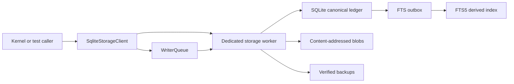

# M1A Technical Design

## Package boundary

`packages/storage-sqlite` is the only package allowed to import
`better-sqlite3`. It exports an asynchronous `SqliteStorageClient`; callers
never receive a connection, statement, transaction, or filesystem path.

All worker requests and responses are runtime-decoded. The worker returns
typed metadata or contract-owned artifacts; it never returns driver objects.

## Data-root contract

The configured root must be an absolute filesystem path, must not be `/`, a
URL, a UNC path, or a symlink, and must not traverse a symlinked ancestor below
the nearest existing parent. The adapter creates private directories with mode
`0700`, the database with `0600`, and blob/backup files with `0600`.

Known network filesystem types are rejected. Platform filesystem detection is
recorded as evidence; an unrecognized platform remains unsupported until its
recovery suite passes.

## Database lifecycle

On open, the worker:

1. validates the root again;
2. opens `ledger/memory.db`;
3. sets `journal_mode=WAL`, `foreign_keys=ON`, `busy_timeout`,
   `synchronous=FULL`, `trusted_schema=OFF`, defensive size limits, and a
   bounded WAL autocheckpoint;
4. applies forward-only migrations inside immediate transactions;
5. verifies stored migration hashes and refuses missing, reordered, or changed
   migrations;
6. reports schema version, ledger epoch, FTS state, WAL state, and platform.

The client queues mutation-class requests in issue order. The worker also
serializes all operations, including asynchronous backup, so reads cannot race
an in-progress restore or migration.

## Canonical transaction

`commitEpisode` runtime-validates `Episode` and each `EvidenceRecord`, then
verifies:

- every episode event ID exists exactly once in the command;
- event scope equals episode scope;
- event sequences are unique and strictly ordered;
- inline content hash matches canonical payload content;
- blob references have matching verified bytes already present or included;
- the episode seal equals canonical SHA-256 with `sealed_hash` omitted.

The request hash covers the episode, evidence records, and blob descriptors,
not transport ordering or raw blob duplication. The transaction:

1. checks the idempotency key;
2. inserts any new artifact metadata and canonical events;
3. inserts the episode and ordered membership rows;
4. increments the ledger epoch;
5. appends one FTS outbox job per searchable event;
6. seals and stores a `MutationReceipt`;
7. stores the idempotency mapping;
8. commits before returning.

Same-key/same-hash retries return the stored receipt. Same-key/different-hash
requests fail with `CONFLICT` before mutation.

## Append-only enforcement

Triggers reject UPDATE and DELETE on canonical events, episodes, episode
membership, mutation receipts, and idempotency rows. M2 will add governed
tombstones and correction evidence rather than weakening these triggers.

## FTS projection

FTS rows contain governed searchable text plus unindexed evidence and scope
columns. Search requires exact `scope_kind` and `scope_id` predicates.

Outbox processing re-reads canonical evidence and derives FTS rows
idempotently. Projection state is one of `ready`, `pending`, `rebuilding`, or
`unavailable`. Search returns a typed degraded result unless state is `ready`.
Rebuild drops only derived rows, repopulates them from canonical evidence, and
does not change the ledger epoch.

## Blob protocol

Blob names are the lowercase SHA-256 digest without the `sha256:` prefix.
Writes verify bytes before using an exclusive temporary file, `fsync`, atomic
rename, directory `fsync`, and a final size/hash check. Existing matching
content is reused. Existing mismatched content is a corruption error.

## Backup and recovery

Backup runs inside the storage worker to a uniquely named file under
`backups/`. After the driver backup completes, the worker opens the copy
read-only, runs `integrity_check`, verifies migration hashes, and compares the
ledger epoch plus latest receipt frontier. Only then is a backup manifest
inserted.

The restart test enables a one-shot worker fault after the canonical commit and
before the response. The client observes `WORKER_CRASHED`, starts a fresh
worker, retries the same command, and receives the original durable receipt.

## Error and diagnostic boundary

Errors use stable codes:

- `INVALID_DATA_ROOT`
- `INVALID_INPUT`
- `CONFLICT`
- `CORRUPTION`
- `MIGRATION_DRIFT`
- `FTS_UNAVAILABLE`
- `WORKER_CRASHED`
- `STORAGE_UNAVAILABLE`

Diagnostics contain request ID, operation, duration, queue depth, SQLite code,
schema version, epoch, and projection state. They never contain request
payloads, inline text, blob bytes, or search queries.
