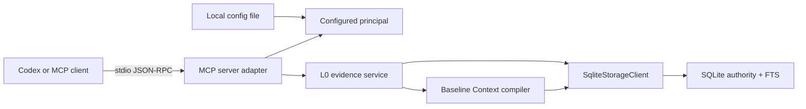

# M1B Technical Design

## Runtime boundaries



The adapter owns MCP schemas, annotations, text/structured results, and
transport startup. The kernel owns authorization and governed status mapping.
The compiler owns deterministic selection and budgeting. Storage remains the
only SQLite driver owner.

## Principal binding

Server configuration is decoded before stdio starts:

```text
data_root
principal_id
allowed_scopes[]
allowed_authorities[]
destructive_tools_enabled=false
default_token_budget=1800
```

Every tool input carries an M0 read/proposal request envelope. The kernel calls
`authorizeRequestClaims` before any storage method. Context request scopes must
equal the authorized envelope scopes. Configuration is never merged with
payload identity or scope fields.

## Tool contract

| Tool | Safety | Effect |
| --- | --- | --- |
| `memory_search` | read-only | Exact-scope FTS plus governed status/receipt |
| `memory_get` | read-only | Fetch one L0 evidence record in an allowed scope |
| `memory_explain` | read-only | Evidence, episode membership, source, hash, and scope |
| `memory_receipt_get` | read-only | Fetch one durable mutation/retrieval receipt |
| `memory_context_compile` | read-only | Freeze a budgeted L0 Context slice and retrieval receipt |
| `memory_episode_commit` | proposal | Commit an inline/blob episode with idempotency, then drain FTS |

Tool callbacks return both MCP text content and identical structured content.
Expected governed statuses are successful protocol calls. Invalid MCP shape is
an SDK input error; authorization/storage failures become a governed FAILED
result with a stable code and no raw payload.

## Storage additions

Migration `0003-recall-context.sql` adds:

- `recall_requests`;
- `retrieval_receipts`;
- `context_slices`;
- `context_slice_items`;
- `context_slice_item_evidence`;
- `receipt_access_scopes`.

These tables are append-only. Recording a read audit does not advance
`ledger_state.ledger_epoch`. A transaction stores the RecallRequest,
ContextSlice, RetrievalReceipt, items, lineage, and principal/scope access rows
atomically. Search/get/explain may store retrieval receipts without a Context
slice. Receipt lookup fails closed unless the configured principal and all
receipt scopes match.

Storage adds runtime-decoded operations to:

- get evidence in one exact scope;
- explain episode membership;
- get mutation/retrieval receipts;
- atomically record and replay recall/context artifacts;
- report operational recall counts separately from canonical counts.

## Baseline Context compiler

M1B compiles only governed L0 inline evidence. It cannot promote evidence into
L1 or infer stable facts.

1. Search every authorized requested scope.
2. Convert storage rows into ContextSlice candidates with evidence identity,
   authority, sensitivity, time, and content.
3. Exclude `sensitive` unless the request explicitly enables it; `secret`
   cannot exist.
4. Deduplicate by evidence ID and sort by rank, occurrence time, then ID.
5. Estimate tokens conservatively: ASCII bytes/4 rounded up, non-ASCII
   codepoints at two tokens, plus fixed provenance overhead.
6. Add whole items while the cumulative estimate fits the caller budget.
7. Record included/excluded reason codes.
8. Seal ContextSlice and RetrievalReceipt with canonical SHA-256.

An empty ready search returns NO_MATCH. Policy-only exclusion returns
POLICY_EXCLUDED. Any unavailable scope lane returns DEGRADED with partial
content only when present.

## Resources

Static resources expose:

- `memory://runtime/health`;
- `memory://runtime/contracts`;
- `memory://runtime/usage`.

Resources are inspection endpoints. Their descriptions and usage document
state that MCP clients do not automatically add resources to model Context.
Reads call no mutation or recall-audit operation.

## stdio lifecycle

The CLI reads one configuration file, opens storage, then calls `serveStdio`
with a factory that registers the tools/resources once. stdout is reserved for
protocol frames. SIGINT, SIGTERM, and stdin end close the MCP handle and storage
worker.

The integration test uses the official v2 client/stdio transport against a
spawned CLI process. It does not substitute an in-memory handler for G1 host
evidence.
