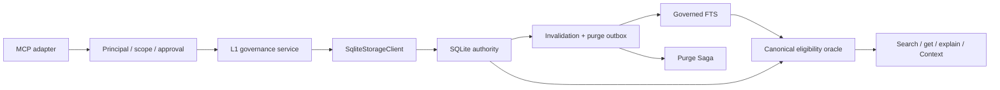

# M2 Technical Design

## Runtime boundaries



The adapter owns tool registration and untrusted input decoding. The kernel
owns admission policy, identity, authorization decisions, lifecycle intent,
and governed result mapping. Storage owns transactions, current-pointer CAS,
idempotency, reference counts, tombstone epoch, receipts, and projection/purge
job state. The Context compiler consumes only candidates that can be
revalidated against canonical state.

## Canonical model

M2 adds strict canonical tables for:

- L1 candidate payload and normalized logical key;
- logical memory object and current revision pointer;
- immutable revision metadata/content and evidence lineage;
- admission decisions and conflict memberships;
- append-only status/suppression, pin, and usage-rule events;
- trusted approvals consumed;
- tombstones and monotonic tombstone state;
- purge jobs, store outcomes, residual hashes, and immutable purge receipts;
- projection/purge invalidation outbox.

Normal history is append-only. A forward migration replaces unconditional
payload-row triggers with a narrow purge-job guard. Authorized purge may only
redact/null exclusive L0/L1/Context content and blob references while retaining
identity, original hashes, lineage identifiers, tombstone, and receipt audit.
Ordinary updates remain rejected.

## Admission and identity

Admission calculates the maximum allowed state from persisted evidence:

| Condition | Result |
| --- | --- |
| Live user-stated, allowed scope, non-secret, no injection signal | active |
| Verified inferred/derived or confirmation pending | candidate |
| Sensitive, low-authority, injection-like procedure, conflict | quarantined |
| Missing/deleted evidence, forbidden scope, invalid or replay mismatch | rejected |

Candidate payload authority is ignored. A deterministic normalized logical key
locates an existing memory. Exact content hash reuses its revision; divergent
content opens a conflict group without advancing the pointer.

## Revision transaction

```text
BEGIN IMMEDIATE
  verify idempotency key + request hash
  verify principal/scope/evidence/admission
  verify expected_revision_id == current_revision_id
  append successor revision and status/admission events
  append predecessor suppression
  CAS current pointer; require exactly one changed row
  append invalidation jobs
  advance canonical epoch and seal receipt
COMMIT
```

SQLite's single writer prevents physical writer overlap. The explicit expected
revision prevents a semantically stale caller from overwriting a newer result.

## Eligibility oracle

All model-visible paths apply the same ordered checks:

1. configured principal and exact scope;
2. current logical object and revision;
3. live evidence and activation decision;
4. validity window at request `as_of`;
5. lifecycle, suppression, unresolved conflict, revoke, and tombstone;
6. sensitivity and Context usage rule;
7. ranking/budget;
8. post-projection canonical revalidation.

FTS is extended with governed L1 upsert/delete jobs. Rebuild reads only eligible
canonical revisions. A stale FTS hit is discarded by the oracle.

## User controls

- Pin is a retention overlay only.
- Demote appends a lifecycle/status event.
- Usage block appends either a scoped or global Context exclusion rule.
- Revoke appends an immediate online hard-filter event.
- Delete appends a tombstone and purge job.

Important/destructive inputs identify a trusted approval but do not carry
authority themselves. The configured approval registry verifies principal,
scope set, tool, canonical request hash, expiry, and one-time consumption.
The local manifest adapter rejects unsafe paths, symlinks, ownership/mode
mismatches, and digest changes. Principal/scope/request validation and existing
idempotency replay precede new-approval verification; new effects consume the
approval in the same transaction. Dry-run records a content-free audit outcome
without canonical mutation or approval consumption. Destructive tools stay
disabled by default; a delete effect requires both explicit local enablement
and valid approval.

## Purge Saga

The delete transaction increments the tombstone epoch and makes the target
ineligible before returning. A retryable purge worker checks:

1. revision/candidate plaintext and conflict materialization;
2. governed FTS and rebuild sources;
3. Context redaction/eligibility overlay;
4. export/cache inventory;
5. blob reference counts;
6. backup/frontier inventory;
7. registered projection invalidation consumers.

Each store writes a terminal verified, residual, or failed outcome. A purge
receipt is complete only when all registered stores are verified and no
residual hash remains. Shared live references are residual debt, never a
reason to re-enable the tombstoned memory.

Exclusive payload cleanup uses guarded content-only redaction, SQLite secure
deletion, governed FTS secure-delete/rebuild, and isolated-data-root
compaction. Historical Context retrieval returns redaction evidence rather
than deleted plaintext.

## Backup and restore

Backup evidence includes the snapshot tombstone epoch. Restore requires
`minimum_tombstone_epoch` from outside the snapshot. A stale snapshot fails
before it can rename staging into the requested target. A current snapshot
still passes migration, SQLite integrity, blob hash, canonical eligibility,
and purge residual verification.

M6 later owns durable operational distribution of this frontier; M2 owns the
fail-closed API and fixtures.

## Compatibility and fallback

- Existing migrations and hashes are immutable.
- Existing L0 MCP requests and Context behavior remain available.
- New tool names/safety classes use the frozen M0 contract.
- Storage worker responses remain runtime-decoded.
- If G2 holds, new admission is frozen and L0/read-only verified L1 remains
  available.
