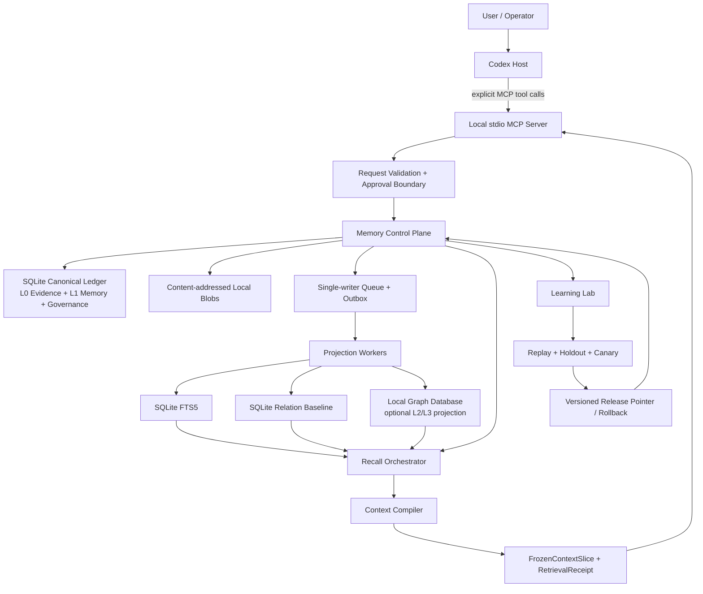
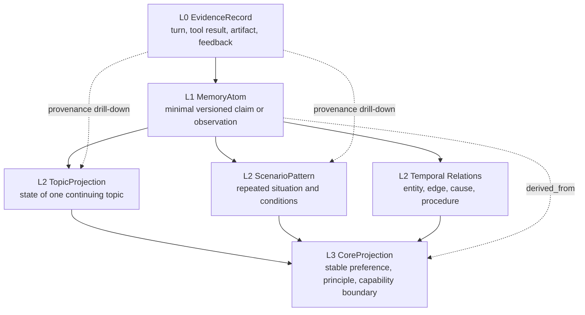
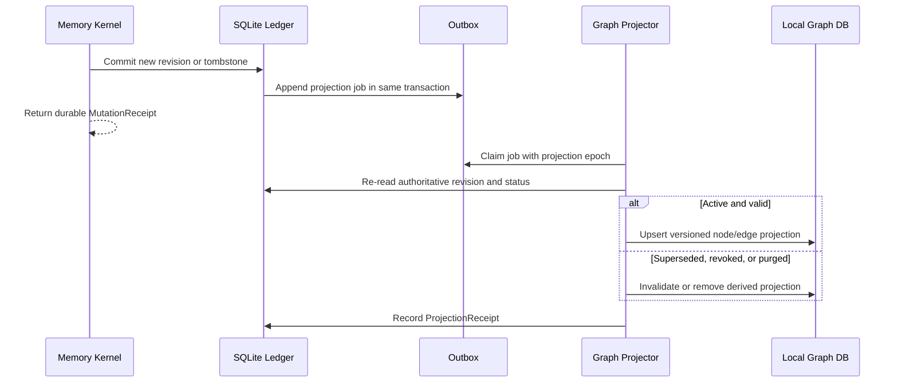
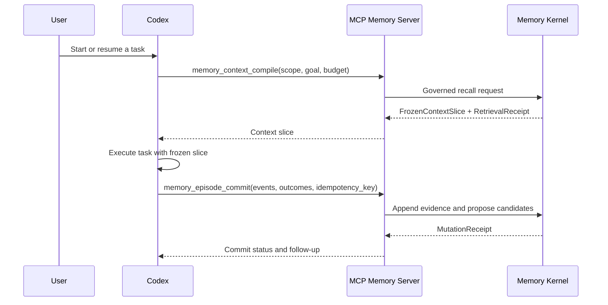
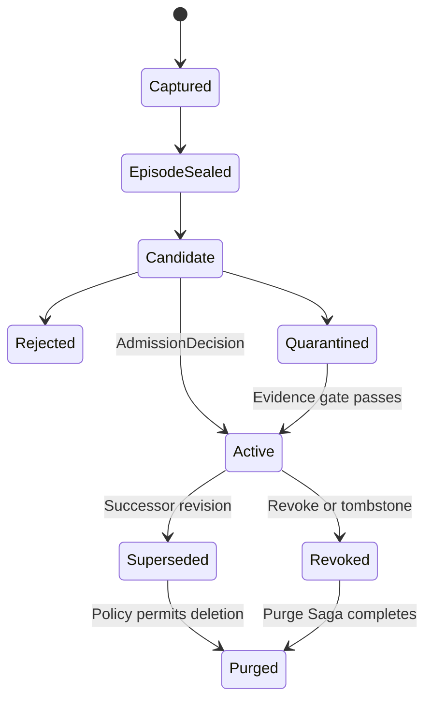
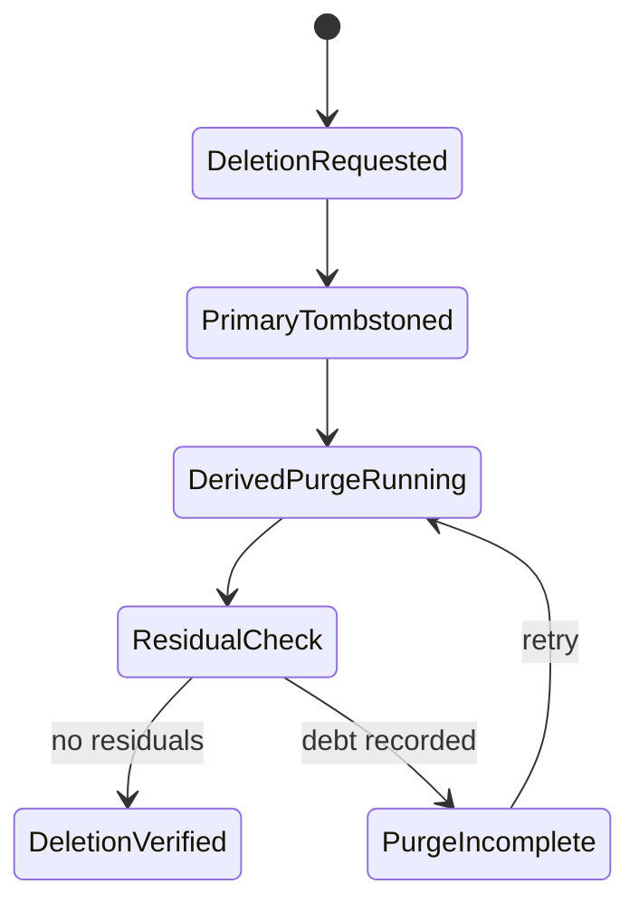
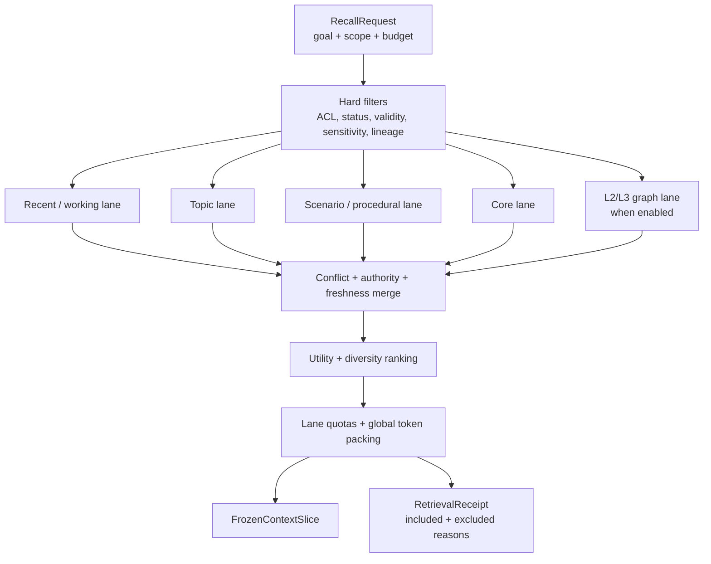
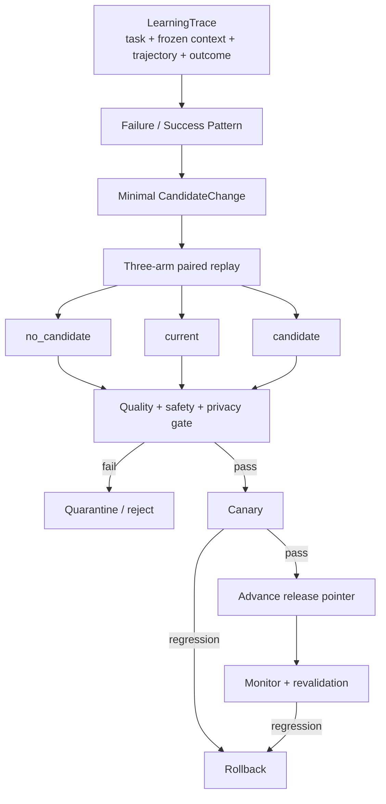

# Codex MCP Agent Memory Runtime — Technical Design

## 1. Design objective

Build a local-first Memory Runtime that lets Codex recall governed memory through MCP, preserve immutable evidence, derive higher-level topic/scenario/core projections, and propose self-learning changes without allowing the online Agent to publish unverified behavior.

This document defined the target architecture and did not itself authorize
implementation or contain production schemas/handler code. Implementation was
later authorized and delivered through independently gated milestone children.

### Recorded execution closure

The architecture was exercised through M0-M6. SQLite remained authoritative;
G3R accepted the bounded layered Context path; G4A/G4B rejected graph/vector
enablement; G5 accepted one exact local synthetic governed release/rollback
mechanism while automatic publication remained disabled; and G6 completed
`NO-GO` with `integrity` as the first non-pass. Secret admission remains
disabled. The final state is a local experimental fallback, not a production,
fleet, HA, multi-platform, traffic, or SLO claim.

## 2. Authority and scope

### Source authority

1. `docs/brainstorms/2026-07-28-agent-memory-runtime-requirements.md` owns Product Contract R1–R20, F1–F4, and AE1–AE8.
2. Research run `RUN20260728-185646-codex-mcp-roadmap-aeebad` and follow-up run `RUN20260728-195300-session-70a1e8`, with answers `RQ032`–`RQ041`, own the research claims.
3. `prd.md` projects the Product Contract without adding a second requirement numbering scheme.
4. `research/research-handoff.md` transfers research constraints and Claim/Evidence anchors.
5. This document owns technical boundaries and contracts.
6. `implement.md` owns ordering, execution checklists, validation gates, and rollback points.

### In scope

- Local stdio MCP integration with Codex.
- SQLite WAL, FTS5, and content-addressed local blobs.
- L0/L1 canonical evidence and versioned memory.
- L2/L3 topic, scenario, entity, relation, procedural, and core projections.
- An optional local graph database for L2/L3 only.
- An independently optional vector candidate-generation lane only after an FTS5 semantic-gap benchmark.
- Context compilation, receipts, correction, revocation, purge, recovery, and gated self-learning.

### Out of scope for the first implementation

- Cloud memory service, synchronization, multi-tenant SaaS, or shared organizational memory.
- Silent capture of conversations that Codex never sends to MCP.
- Automatic publication of Skill, Prompt, Core Memory, or policy changes.
- A vector database as a mandatory dependency.
- Treating prompt/provider cache, transcript, working state, context, and long-term memory as interchangeable.

## 3. Architecture

### Component topology



### Authority rule

The SQLite ledger is authoritative for identity, scope, status, versions, evidence lineage, approval, tombstones, release pointers, and receipts.

FTS, SQLite adjacency, graph storage, summaries, caches, exports, and context slices are derived consumers. They may accelerate recall or improve abstraction, but they cannot authorize a fact, revive a revoked revision, or certify deletion.

### Control plane and data plane

| Plane | Owns | Must not own |
| --- | --- | --- |
| Codex Host | Current task/thread, user interaction, tool approval, when MCP is called | Hidden persistence rules |
| MCP Adapter | Protocol mapping, input validation, tool classification, idempotency envelope | Memory truth or learning policy |
| Memory Control Plane | Admission, version changes, correction, revocation, purge, release and rollback decisions | Model prompt construction |
| Memory Data Plane | Evidence, revisions, relations, projections, receipts, traces, evaluations | Unreviewed policy decisions |
| Context Compiler | Governed candidate selection and token-budgeted context projection | Long-term memory mutation |
| Learning Lab | Candidate generation, paired evaluation, quarantine, canary, release evidence | Direct online self-modification |

## 4. Orthogonal memory model

No record is classified by one overloaded “memory type.” Each record carries independent coordinates.

| Dimension | Values | Meaning |
| --- | --- | --- |
| Abstraction level | L0 Evidence, L1 MemoryAtom, L2 Topic/Scenario/Relation, L3 CoreProjection | Distance from primary evidence |
| Lifecycle | working, candidate, active, superseded, revoked, quarantined, purged | Whether and how the record may be used |
| Kind | episodic, semantic, procedural | Experience, knowledge, or reusable action pattern |
| Scope | thread, topic, scenario, user, workspace, agent | Where the record is applicable |
| Validity | valid time, system time, expiry, verification epoch | When the claim applies and when the system knew it |
| Authority | user-stated, observed, tool-result, inferred, derived, imported | How much trust the record may receive |

### Abstraction layers



Rules:

- L0 is append-only evidence. Corrections add evidence; they do not rewrite history.
- L1 is the smallest governed, versioned memory unit.
- L2 and L3 are derived projections with lower or equal authority than their strongest valid evidence roots.
- Topic answers “what is known and unfinished in this subject.”
- Scenario answers “what tends to happen under these conditions and what procedure applies.”
- L3 affects the widest scope and therefore has the strictest admission, correction, and release gates.
- Working Context is a disposable view compiled from governed records; it is not an additional source of truth.

## 5. Local persistence design

### Filesystem layout

The eventual implementation should keep runtime state under one configurable local data root:

```text
data/
├── ledger/
│   ├── memory.db
│   ├── memory.db-wal
│   └── memory.db-shm
├── blobs/
│   └── <content-hash>
├── graph/
│   └── <selected-local-graph-store>
├── backups/
├── exports/
└── quarantine/
```

The SQLite database must live on a local filesystem. Backups, exports, and graph files inherit the same local-data and purge policies.

### SQLite logical domains

| Domain | Planned records | Purpose |
| --- | --- | --- |
| Evidence | `events`, `episodes`, `artifacts` | Immutable turns, tool results, feedback, and blob references |
| Memory | `memory_objects`, `memory_revisions`, `memory_evidence` | Stable logical identity, immutable revisions, and provenance |
| Governance | `admission_decisions`, `conflict_groups`, `scope_grants`, `tombstones` | Admission, conflict, ACL, revocation, and deletion frontier |
| Relations | `relation_revisions`, `projection_membership` | SQLite relation baseline and graph-ready lineage |
| Mutation | `idempotency_keys`, `mutation_receipts`, `outbox_jobs` | Exactly-once effects and retryable projection propagation |
| Recall | `recall_requests`, `recall_receipts`, `context_slices`, `context_slice_items` | Explainable candidate handling and frozen model views |
| Learning | `learning_traces`, `change_candidates`, `eval_cases`, `eval_runs`, `eval_results`, `releases` | Evidence-backed learning and reversible release |
| Operations | `schema_migrations`, `backup_manifests`, `purge_jobs`, `health_samples` | Recovery, compatibility, deletion proof, and health |

Governance fields such as scope, status, authority, sensitivity, valid time, system time, revision, and transform version use typed columns and ordinary indexes. JSON is limited to extensible metadata and evaluation payloads.

### Concurrency

- WAL supports concurrent readers, but all writes pass through one serialized writer.
- Every mutation is a short transaction that persists the decision, canonical revision, outbox events, and mutation receipt atomically.
- Projection workers consume outbox entries idempotently.
- WAL checkpoint policy is observable and bounded; long-lived readers must not starve checkpoints.
- Database access is hidden behind a storage port so the SQLite driver can be pinned after an M0 compatibility probe.
- If the selected driver is synchronous, all SQLite access runs in a dedicated storage worker so large queries or checkpoints cannot block the MCP protocol loop.

### Driver decision

The planning default is a TypeScript runtime with a stable SQLite driver that supports WAL, prepared statements, transactions, FTS5, backups, and the selected Node LTS line.

The M0 compatibility probe decides the concrete driver. `better-sqlite3` is the first baseline candidate; built-in `node:sqlite` is accepted only if its stability, FTS5 build, backup behavior, and event-loop posture satisfy the same contract.

## 6. L2/L3 graph projection

### Purpose

The graph database is used where relationship structure is the payload:

- topic membership and topic evolution;
- scenario trigger, condition, procedure, outcome, and exception;
- entity and temporal fact relations;
- causal or dependency paths;
- supporting and contradicting evidence;
- core projections and the lower-level records that justify them.

It is not used as the canonical event ledger or as the only copy of memory content.

### Graph contract

Every graph node or edge must include:

- a stable projection identifier;
- the owning SQLite revision identifier;
- abstraction level and projection type;
- scope and lifecycle status;
- valid-time and system-time boundaries;
- transform version and projection epoch;
- evidence or lower-level lineage pointers;
- deletion/tombstone epoch;
- content hash or payload hash.

### Propagation flow



### Graph adoption gate

The graph adapter may serve production recall only after it proves:

1. better multi-hop, temporal, conflict, or structural retrieval on the frozen replay subset;
2. zero scope/ACL/tombstone leakage;
3. complete drill-down from every returned node/edge to live SQLite evidence;
4. deterministic rebuild from the SQLite ledger;
5. correct correction, revocation, purge, backup, and restore behavior;
6. acceptable local operational cost and latency.

If no candidate passes, L2/L3 remains on the SQLite relation baseline. This is a valid release outcome.

The adapter candidate is deliberately not selected in this planning artifact. M0 freezes a maintained-candidate scorecard and M4A evaluates candidates that are current at implementation time. Kùzu is explicitly excluded as the default new-project backend because its upstream repository is archived and Graphiti has deprecated that integration path.

## 7. MCP contract

### Integration posture

The first release uses a local stdio MCP server. It does not assume the MCP server can observe Codex lifecycle events that were never sent to it.

### Tool classes

| Class | Planned tools | Default policy |
| --- | --- | --- |
| Read-only | `memory_search`, `memory_get`, `memory_explain`, `memory_context_compile`, `memory_receipt_get` | No state mutation |
| Proposal | `memory_episode_commit`, `memory_propose`, `memory_feedback` | May create evidence/candidates; cannot publish memory or learning changes |
| Important mutation | `memory_correct`, `memory_pin`, `memory_demote`, `memory_usage_set`, `memory_revoke`, `learning_pause`, `learning_resume`, `learning_release`, `learning_rollback` | Requires explicit authority and durable receipt |
| Destructive | `memory_delete` | Tombstone first, purge Saga, residual verification, `PurgeReceipt` |

### Shared request envelope

Mutating requests carry:

- `idempotency_key`;
- actor and authority;
- thread/workspace/user/agent scope;
- purpose and reason;
- expected revision or release pointer where concurrency matters;
- source references and sensitivity classification;
- dry-run flag only where the tool contract explicitly supports it.

The server binds the process to one configured local principal and permitted scope set. Tool-supplied `actor` or `scope` values are claims to validate against that binding, not trusted authentication data.

Shared mutation results carry:

- receipt identifier and durable status;
- affected logical objects and revisions;
- projection/outbox state;
- warnings, conflicts, and required follow-up;
- request hash and resulting epoch.

Recall results use typed status rather than one ambiguous empty list:

- `OK` — governed candidates or an intentionally empty compiled slice;
- `NO_MATCH` — no relevant live memory exists;
- `POLICY_EXCLUDED` — relevant candidates existed but were not eligible;
- `DEGRADED` — a derived lane is unavailable and an explicit fallback was used;
- `FAILED` — the request could not be served safely.

### Read-only resources

Resource templates expose stable inspection views such as:

- `memory://topic/{topic_id}`;
- `memory://scenario/{scenario_id}`;
- `memory://profile/current`;
- `memory://receipt/{receipt_id}`;
- `memory://release/{release_id}`.

Resources never imply prompt injection. Codex must explicitly read or compile them.

### Explicit Codex lifecycle



Automatic start/end hooks are a later Codex Host Adapter and must preserve the same MCP and receipt contracts.

## 8. Write, correction, and deletion lifecycles

### Admission lifecycle



### Mutation protocol

1. Capture evidence without silently rewriting the prior record.
2. Create a candidate with source lineage and extraction version.
3. Apply sensitivity, injection, authority, scope, duplication, and conflict checks.
4. Persist an admission decision.
5. Create an immutable revision and atomically advance its logical pointer with compare-and-swap.
6. Append projection invalidation/update jobs.
7. Return a durable mutation receipt.

### Correction

Correction first writes a session-level suppression overlay so the known-bad value cannot be recalled while asynchronous work is pending. It then commits a successor revision, marks the old revision superseded, invalidates dependent projections, and recompiles context on the next turn.

### Forgetting semantics

| Operation | Effect |
| --- | --- |
| Pin | Protect a selected live revision from normal decay/eviction; does not increase factual authority |
| Demote | Lower a revision's retrieval/lifecycle status without rewriting its evidence |
| Usage block | Keep required local evidence while excluding it from selected Context scopes or all model Context |
| Evict | Exclude from one context compilation; canonical data unchanged |
| Decay | Reduce candidate weight; record remains active |
| Supersede/stale | Preserve history but exclude old revision from default recall |
| Revoke/tombstone | Hard-filter online use and begin dependent invalidation |
| Purge | Remove allowed payloads and all known derivatives; prove residual state |

### Purge Saga



A database row deletion is never sufficient proof. The `PurgeReceipt` names every known store, projection epoch, export, cache, and backup policy result.

## 9. Recall and Context Compiler

### Recall pipeline



### Hard-filter order

1. Actor, user, workspace, agent, thread, topic, and scenario scope.
2. ACL and declared purpose.
3. Lifecycle state and tombstone frontier.
4. Valid time, system time, expiry, schema, transform, and projection epoch.
5. Sensitivity and prompt-injection classification.
6. Evidence lineage and dependent invalidation state.

Similarity and graph traversal never bypass these filters.

### Context packing

- Reserve a minimum budget for active task state and binding constraints.
- Allocate independent budgets for recent, topic, scenario/procedural, and core lanes.
- Include conflicts as a set with authority and provenance rather than silently selecting one claim.
- Prefer distinct evidence over repeated abstractions.
- Drop redundant summaries before failure boundaries, procedure preconditions, or governing constraints.
- Persist the exact item order, token estimates, compiler version, and slice hash.
- Never mutate a slice after delivery; a new memory epoch produces a new slice on the next turn.

## 10. Self-learning design

### Separation of online and offline authority

The online Agent may:

- record a `LearningTrace`;
- classify an observed failure or success;
- propose a minimal reversible `CandidateChange`;
- request evaluation.

The online Agent may not:

- directly advance a Core Memory or release pointer;
- modify a published Skill or policy in place;
- choose its own evaluation cases as the sole evidence;
- suppress negative or conflicting traces.

`learning_pause` prevents new candidate generation, evaluation-triggered publication, and release-pointer changes while leaving ordinary governed memory reads and explicitly authorized memory writes available. `learning_resume` restores candidate processing from a recorded frontier; it does not retroactively publish queued candidates.

### Learning release flow



Candidate priority is:

1. MemoryAtom correction or addition.
2. Recall/Context Compiler policy adjustment.
3. ScenarioPattern or Prompt patch.
4. Skill candidate.
5. Code or model change only after the lower-cost hypotheses fail.

All releases store candidate hash, case-set hashes, evaluator versions, metrics, approval, release pointer before/after, canary window, and rollback target.

## 11. Security and privacy

### Threats

- Cross-user or cross-workspace recall leakage.
- Prompt injection persisted as trusted memory.
- Sensitive data copied into derived stores or exports.
- Stale or revoked memory resurrected from graph, FTS, backup, or cache.
- Tool-call replay causing duplicate or conflicting mutation.
- Self-learning optimizing to its own training traces.
- Local file permissions exposing the database, blobs, or backups.

### Required controls

- Scope and ACL checks before candidate generation.
- Local-principal and allowed-scope binding at the MCP process boundary; request fields cannot self-assert authority.
- Sensitivity labels on canonical and derived records.
- Injection classification and quarantine for untrusted instructions.
- Idempotency keys and compare-and-swap for mutation.
- An M0 data-at-rest decision based on the declared local threat model, followed by file-permission and encryption controls before production use.
- Redacted structured logs; memory content is excluded by default.
- Tombstone frontier included in backup/restore and graph rebuild.
- Holdout and transfer cases controlled outside the online Agent.

## 12. Failure and recovery matrix

| Failure | Online behavior | Recovery proof |
| --- | --- | --- |
| MCP process exits | Codex continues without memory and reports degraded mode | Restart does not duplicate committed mutation |
| SQLite transaction fails | No partial revision or pointer change | Transaction rollback and failed receipt |
| Projection worker crashes | Canonical mutation remains committed; projection marked pending | Outbox replay reaches same projection hash |
| FTS or graph index corrupts | Disable affected lane; use canonical/remaining lanes | Deterministic rebuild and epoch change |
| Correction propagation is partial | Overlay blocks old value immediately | All dependents reach invalid/superseded state |
| Purge is partial | Tombstone continues to hard-filter | `PurgeReceipt` lists debt until residual check passes |
| WAL grows without bound | Throttle writes or reject noncritical background work | Checkpoint succeeds without lost commits |
| Old backup is restored | Tombstone frontier and release epoch are reapplied | Revoked content remains unavailable |
| Learning candidate regresses | Canary is stopped | Release pointer returns to exact prior version |
| Graph store unavailable | Recall falls back to SQLite adjacency/FTS | Same scope and tombstone filters remain enforced |

## 13. Technology decisions

| Area | Planning decision | Decision gate |
| --- | --- | --- |
| Runtime | TypeScript on the active Node LTS line | Pin exact versions during M0 |
| MCP | Official TypeScript MCP SDK with local stdio transport | Pin a stable SDK line; never target an alpha/main contract |
| Canonical store | SQLite WAL + FTS5 + local blobs | Driver compatibility and crash-recovery probe |
| Write concurrency | One serialized writer plus transactional outbox | Concurrency and idempotency tests |
| Graph | Replaceable maintained L2/L3 graph adapter; SQLite relation baseline is complete | M4A value, governance, rebuild, fallback, and operations gate; Kùzu is not a default candidate |
| Vector | Independently optional candidate lane | M4B paired semantic-gap replay must justify it |
| Learning | External candidate/release pipeline | No automatic publication |
| Packaging | Workspace packages with explicit ports between protocol, kernel, storage, compiler, graph, and learning | Directory structure finalized in M0 |

## 14. Compatibility and evolution

- Schema changes use forward migrations and tested backup restore; destructive migrations require an export/rollback plan.
- Tool contracts are versioned independently from storage schema.
- ContextSlice and receipt formats include compiler/schema versions.
- Graph projections carry a projection epoch and can be rebuilt without changing canonical revision identity.
- Embedding model changes, if vectors are adopted, create a new embedding epoch rather than rewriting provenance.
- A later Codex Host Adapter calls the same MCP or kernel contracts; it does not add an undocumented mutation path.

## 15. Product Contract mapping

| Product Contract | Design responsibility |
| --- | --- |
| R1–R3 | Host/MCP/Kernel boundary, local principal binding, local data root |
| R4–R9 | Orthogonal L0–L3 model, SQLite authority, graph/vector projection boundaries |
| R10–R13 | hard-filtered multi-lane recall, Context Compiler, typed result status |
| R14–R15 | immutable revisions, suppression, tombstone and Purge Saga |
| R16–R20 | LearningTrace, three-arm evaluation, quarantine, release, rollback and replay |
| F1 | admission and mutation protocol |
| F2 | explicit Codex lifecycle and recall pipeline |
| F3 | correction, invalidation and purge propagation |
| F4 | external learning release flow |
| AE1–AE8 | implemented as G1–G6 replay and failure scenarios in `implement.md` |

## 16. Design acceptance

The design is ready for implementation planning when reviewers can answer “yes” to all of the following:

- Can every model-visible item be traced to a live canonical revision and evidence root?
- Can a correction suppress the old value before all projections finish rebuilding?
- Can a deletion prove what was purged and what remains subject to backup policy?
- Can the system operate without graph or vector services?
- Can graph storage be rebuilt entirely from SQLite and blobs?
- Can the same recall request be replayed with an explainable result hash?
- Can a learning candidate fail without affecting production behavior?
- Can a released candidate roll back to an exact prior version?
- Can Codex complete a task-start recall and task-end commit through explicit MCP calls?
- Does every later automatic integration preserve the same authority and receipt boundaries?
