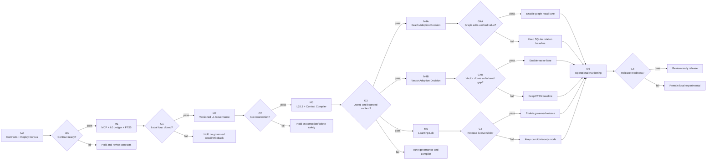

# Codex MCP Agent Memory Runtime — Execution Roadmap

## 1. How to use this roadmap

This is a future execution checklist, not a record of work already completed. Do not mark implementation items complete until code, tests, runtime artifacts, and the named phase gate all exist.

The Trellis parent remains in `planning`. The user approved implementation on 2026-07-28, and execution proceeds through independently activated milestone children beginning with M0.

### Authority order

1. `docs/brainstorms/2026-07-28-agent-memory-runtime-requirements.md` defines Product Contract R1–R20, F1–F4, and AE1–AE8.
2. `prd.md` projects product scope without renumbering it.
3. `research/research-handoff.md` owns the research constraints transferred into execution.
4. `design.md` defines architecture and protocol boundaries.
5. This file defines execution order and gate evidence.
6. `docs/plans/2026-07-28-001-feat-agent-memory-runtime-plan.md` provides requirement and implementation-unit traceability.

### Delivery principles

- Ship a complete governed loop before adding retrieval sophistication.
- SQLite is the canonical source of truth at every phase.
- L2/L3 graph storage is a rebuildable derived plane.
- Every phase must pass correctness, retrieval, governance, recovery, cost/latency, and privacy gates.
- A later phase may not compensate for a failed earlier gate.
- A degraded mode is a valid outcome when it preserves authority and safety.
- Graph and vector are separate optional decisions; a No-Go result is a completed, releasable outcome.
- Learning may build candidate-only mechanics after G3, but its release evidence must name the accepted graph/vector configuration.

### Unified-plan mapping

| Milestone | Implementation unit |
| --- | --- |
| M0 | U1 contracts, threat model and frozen replay |
| M1 | U2 canonical storage + U3 explicit MCP loop |
| M2 | U4 versioned L1 governance |
| M3 | U5 L2/L3 projections and Context Compiler |
| M4A | U6 graph adoption decision |
| M4B | U7 optional vector decision |
| M5 | U8 Learning Lab |
| M6 | U9 operational hardening |

## 2. Roadmap



## 3. Planned output structure

The exact names may change during M0, but ownership boundaries must remain visible.

```text
.
├── apps/
│   └── memo-graph-cli/
│       └── src/
├── packages/
│   ├── contracts/
│   │   └── src/
│   ├── mcp-server/
│   │   └── src/
│   ├── memory-kernel/
│   │   └── src/
│   ├── storage-sqlite/
│   │   └── src/
│   ├── context-compiler/
│   │   └── src/
│   ├── graph-projection/
│   │   └── src/
│   ├── vector-retrieval/
│   │   └── src/                  # only created after G4B opens
│   ├── learning-lab/
│   │   └── src/
│   └── observability/
│       └── src/
├── migrations/
├── fixtures/
│   └── replay/
├── tests/
│   ├── contract/
│   ├── storage/
│   ├── integration/
│   ├── replay/
│   ├── governance/
│   ├── recovery/
│   └── security/
├── docs/
│   ├── adr/
│   ├── contracts/
│   ├── evaluations/
│   ├── plans/
│   └── runbooks/
└── data/
    └── .gitkeep
```

`data/` contains runtime-local state and must be gitignored except for an empty placeholder or documented test fixtures.

## 4. Gate model

| Gate axis | Required evidence |
| --- | --- |
| Correctness | Deterministic contract tests, state-machine invariants, and replayable receipts |
| Retrieval quality | Frozen corpus metrics separated by recent, topic, scenario, core, temporal, and multi-hop subsets |
| Governance | Scope/ACL/status/time/sensitivity/lineage filtering and conflict handling |
| Recovery | Crash, retry, rebuild, backup/restore, and partial-Saga tests |
| Cost and latency | Workload envelope, p50/p95 measurements, token budget adherence, disk/WAL growth |
| Privacy | Zero cross-scope leakage, redacted logs, local data controls, purge residual checks |

Every gate report must include:

- tested commit and dependency lock hash;
- schema, projection, compiler, and evaluation versions;
- fixture/case hashes;
- passed, failed, and quarantined cases;
- unresolved debt and the decision to advance, hold, or fall back.

## 5. M0 — Contract, threat model, and replay corpus

### Objective

Freeze the product contracts and measurement system before implementing memory behavior.

### Planned files

- `package.json`
- `pnpm-workspace.yaml`
- `tsconfig.base.json`
- `packages/contracts/src/memory.ts`
- `packages/contracts/src/mcp.ts`
- `packages/contracts/src/receipts.ts`
- `packages/contracts/src/learning.ts`
- `tests/contract/*.contract.test.ts`
- `fixtures/replay/manifest.json`
- `docs/contracts/memory-artifacts.md`
- `docs/contracts/mcp-tools.md`
- `docs/contracts/receipts.md`
- `docs/evaluations/replay-corpus.md`
- `docs/evaluations/performance-envelope.md`
- `docs/adr/0001-runtime-and-sqlite-driver.md`
- `docs/adr/0002-mcp-sdk-line.md`
- `docs/adr/0003-local-graph-selection-gate.md`
- `docs/threat-model.md`

### Checklist

- [x] Confirm TypeScript, package manager, Node LTS, module format, lint, test, and build conventions.
- [x] Pin a stable official MCP TypeScript SDK line; reject alpha or `main`-only APIs.
- [x] Probe SQLite driver support for WAL, FTS5, transactions, backups, prepared statements, and supported operating systems.
- [x] Define `EvidenceRecord`, `Episode`, `MemoryObject`, `MemoryRevision`, `AdmissionDecision`, `RelationRevision`, `ContextSlice`, `RetrievalReceipt`, `MutationReceipt`, `LearningTrace`, `CandidateChange`, `EvalReceipt`, `ReleaseReceipt`, and `PurgeReceipt`.
- [x] Define abstraction, lifecycle, kind, scope, validity, authority, sensitivity, and transform-version enums independently.
- [x] Define MCP request/response envelopes and tool safety classes.
- [x] Define stable error taxonomy for invalid input, permission denial, conflict, stale revision, unavailable projection, incomplete purge, and degraded recall.
- [x] Define the configured local principal, allowed scopes, and rule that request payloads cannot self-assert authority.
- [x] Define receipt hashing and canonical serialization rules.
- [x] Build a frozen replay corpus containing normal, conflict, correction, deletion, privacy, prompt-injection, temporal, multi-hop, failure, and negative-transfer cases.
- [x] Separate training/calibration cases from holdout and transfer cases.
- [x] Freeze a performance envelope with record cardinality, event size, artifact size, query concurrency, and token budgets.
- [x] Write a threat model covering local file access, scope leakage, persisted injection, projection resurrection, tool replay, and learning overfit.
- [x] Decide the data-at-rest posture for the declared threat model, including when file permissions are sufficient and when encryption is mandatory.
- [x] Define graph selection criteria without choosing a vendor before evidence exists.

### Validation contract

- Planned command: `pnpm test:contract`
- Planned command: `pnpm test:fixtures`
- Planned command: `pnpm lint`
- Planned command: `pnpm typecheck`

Assertions:

- Contract examples serialize deterministically.
- Invalid enum combinations fail before storage.
- Every mutation result shape includes receipt identity and status.
- Replay fixtures have immutable hashes and declared expected outcomes.
- Holdout cases are not visible to candidate generation.

### G0 exit gate

- All contract tests pass.
- The replay corpus and performance envelope are reviewed.
- No unresolved question changes the SQLite authority model, MCP lifecycle, graph boundary, or learning release boundary.
- The implementation task receives separate user approval before activation.

### Hold/rollback

No production behavior exists yet. If G0 fails, revise contracts and fixtures; do not create migrations or MCP handlers.

## 6. M1 — Local MCP, L0 ledger, and FTS5 baseline

### Objective

Close the first explicit Codex loop: compile context, use it, commit an episode, and recall it in a later session.

### Planned files

- `packages/storage-sqlite/src/database.ts`
- `packages/storage-sqlite/src/storage-worker.ts`
- `packages/storage-sqlite/src/writer-queue.ts`
- `packages/storage-sqlite/src/evidence-repository.ts`
- `packages/storage-sqlite/src/fts-index.ts`
- `packages/memory-kernel/src/evidence-service.ts`
- `packages/context-compiler/src/baseline-compiler.ts`
- `packages/mcp-server/src/server.ts`
- `packages/mcp-server/src/tools/read.ts`
- `packages/mcp-server/src/tools/episode.ts`
- `packages/mcp-server/src/resources.ts`
- `migrations/0001-evidence-ledger.sql`
- `migrations/0002-fts-baseline.sql`
- `tests/storage/evidence-ledger.integration.test.ts`
- `tests/contract/mcp-read-tools.contract.test.ts`
- `tests/contract/mcp-episode-tools.contract.test.ts`
- `tests/integration/codex-explicit-loop.test.ts`
- `tests/recovery/writer-restart.test.ts`

### Checklist

- [x] Create the local data-root contract and refuse unsafe or unsupported paths.
- [x] Open SQLite in WAL mode with foreign keys, defensive limits, and explicit busy handling.
- [x] Implement one serialized writer and read connections that never bypass it for mutation.
- [x] If the selected SQLite driver is synchronous, isolate reads, writes, checkpoints, and backups in a dedicated storage worker so the MCP loop remains responsive.
- [x] Add forward-only migrations for events, episodes, artifacts, idempotency, receipts, outbox, recall requests, and context slices.
- [x] Store large tool/artifact payloads by content hash in local blobs.
- [x] Implement append-only event and episode sealing.
- [x] Implement FTS5 indexing for governed searchable text.
- [x] Implement read-only `memory_search`, `memory_get`, `memory_explain`, `memory_receipt_get`, and baseline `memory_context_compile`.
- [x] Implement proposal-only `memory_episode_commit` with idempotency.
- [x] Bind MCP requests to the configured local principal and reject actor or scope claims outside its allowed set.
- [x] Expose inspection resources without assuming automatic prompt inclusion.
- [x] Return degraded-mode results when FTS is rebuilding or unavailable.
- [x] Record structured logs without raw memory content.
- [x] Add an explicit Codex usage guide for task-start compile and task-end commit.

### Validation contract

- Planned command: `pnpm test:storage`
- Planned command: `pnpm test:mcp`
- Planned command: `pnpm test:integration -- codex-explicit-loop`
- Planned command: `pnpm test:recovery -- writer-restart`
- Planned command: `pnpm benchmark:baseline`

Assertions:

- Repeating a commit with the same idempotency key creates one episode and returns the same receipt.
- An actor or scope claim outside the configured local binding is rejected before recall or mutation.
- A slow synchronous storage operation cannot block the MCP protocol loop.
- A crash after canonical commit but before response returns the durable receipt on retry.
- A new Codex session recalls the committed episode through FTS5.
- Resource reads and search tools do not mutate the ledger.
- Context output always respects the declared token limit.
- FTS failure falls back or degrades explicitly without fabricating results.

### G1 exit gate

- The task-start recall and task-end commit loop passes end to end.
- Receipt and context hashes are replayable.
- Zero cross-scope results occur in the privacy fixture set.
- Writer restart and outbox retry do not duplicate effects.
- The baseline benchmark report is stored for later paired comparisons.

### Hold/rollback

Disable writes and retain read-only/degraded operation if receipt durability or idempotency fails. Do not enter L1 admission while L0 evidence is unreliable.

## 7. M2 — Versioned L1 memory governance

### Objective

Turn evidence into governed MemoryAtoms with admission, immutable revisions, conflict, correction, revocation, forgetting, and purge.

### Planned files

- `packages/memory-kernel/src/candidate-service.ts`
- `packages/memory-kernel/src/admission-service.ts`
- `packages/memory-kernel/src/revision-service.ts`
- `packages/memory-kernel/src/conflict-service.ts`
- `packages/memory-kernel/src/correction-service.ts`
- `packages/memory-kernel/src/purge-service.ts`
- `packages/storage-sqlite/src/memory-repository.ts`
- `packages/storage-sqlite/src/outbox-repository.ts`
- `packages/mcp-server/src/tools/mutations.ts`
- `migrations/0003-versioned-memory.sql`
- `migrations/0004-governance-and-outbox.sql`
- `tests/governance/admission.test.ts`
- `tests/governance/revision-cas.test.ts`
- `tests/governance/correction-propagation.test.ts`
- `tests/governance/purge-saga.test.ts`
- `tests/security/prompt-injection-admission.test.ts`

### Checklist

- [ ] Extract candidate facts, preferences, constraints, failures, and procedure observations with evidence references.
- [ ] Quarantine sensitive, low-authority, injected, or unverified candidates.
- [ ] Implement exact hash, normalized logical-key, and conflict-group detection without destructive upsert.
- [ ] Persist admission decisions and rejected reasons.
- [ ] Create stable logical memory identifiers and immutable revisions.
- [ ] Advance active revision pointers with compare-and-swap.
- [ ] Add `supersedes`, `conflicts_with`, and `derived_from` relations.
- [ ] Implement a synchronous correction overlay before asynchronous propagation.
- [ ] Implement pin, demote, scoped/global Context usage block, and revoke as explicit user controls with receipts.
- [ ] Ensure pin affects retention/selection but never upgrades authority or overrides conflict/validity checks.
- [ ] Implement evict, decay, supersede, revoke, and purge as different operations.
- [ ] Implement tombstone-first deletion and a retryable purge Saga.
- [ ] Propagate invalidation to FTS, context slices, exports, blobs, and future graph/vector consumers through outbox jobs.
- [ ] Return `MutationReceipt` and `PurgeReceipt` with residual debt.
- [ ] Add approvals for important and destructive MCP tools.

### Validation contract

- Planned command: `pnpm test:governance`
- Planned command: `pnpm test:security`
- Planned command: `pnpm test:recovery -- purge`
- Planned command: `pnpm test:replay -- correction-deletion`

Assertions:

- Concurrent updates cannot silently lose a revision.
- A correction immediately suppresses the prior value.
- A pinned but revoked/expired record remains excluded, and a usage-blocked record never enters a prohibited Context.
- Superseded, revoked, and quarantined revisions never pass default recall.
- Duplicate correction/delete calls return the same effect and receipt.
- Partial purge stays tombstoned and reports remaining debt.
- Restoring an old backup cannot move behind the tombstone frontier.

### G2 exit gate

- Zero stale-value resurrection occurs across canonical queries, FTS, context slices, exports, blobs, and restored fixtures.
- Every active L1 record has valid evidence lineage and an admission decision.
- Purge residual checks are complete or explicitly fail the gate.
- Prompt-injection fixtures cannot promote untrusted instructions to active procedural or core memory.

### Hold/rollback

Freeze admission and operate from L0 evidence/read-only MemoryAtoms if version or deletion invariants fail.

## 8. M3 — L2/L3 consolidation and Context Compiler

### Objective

Build topic, scenario, relation, procedural, and core projections on the SQLite baseline, then compile bounded and explainable Codex context.

### Planned files

- `packages/memory-kernel/src/consolidation-service.ts`
- `packages/memory-kernel/src/projection-policy.ts`
- `packages/storage-sqlite/src/relation-repository.ts`
- `packages/context-compiler/src/recall-orchestrator.ts`
- `packages/context-compiler/src/hard-filters.ts`
- `packages/context-compiler/src/lane-retrievers.ts`
- `packages/context-compiler/src/conflict-resolver.ts`
- `packages/context-compiler/src/token-packer.ts`
- `packages/context-compiler/src/receipt-builder.ts`
- `migrations/0005-projections-and-relations.sql`
- `migrations/0006-recall-and-context.sql`
- `tests/replay/topic-recall.test.ts`
- `tests/replay/scenario-transfer.test.ts`
- `tests/replay/context-pollution.test.ts`
- `tests/governance/derived-invalidation.test.ts`
- `tests/integration/frozen-context-slice.test.ts`

### Checklist

- [ ] Implement versioned TopicProjection, ScenarioPattern, temporal relation, and CoreProjection records.
- [ ] Require lineage, transform version, validity, authority, and projection epoch on every L2/L3 record.
- [ ] Keep Topic and Scenario as separate abstractions.
- [ ] Implement SQLite adjacency as the graph-free reference behavior.
- [ ] Invalidate and rebuild all descendants when a source revision changes status.
- [ ] Implement hard filters before candidate generation.
- [ ] Implement recent, topic, scenario/procedural, core, and optional relation lanes.
- [ ] Rank by relevance, authority, freshness, evidence diversity, conflict penalty, and token utility.
- [ ] Allocate per-lane minimums and a global token budget.
- [ ] Present conflict sets with provenance rather than silently merging them.
- [ ] Persist included and excluded reasons in a RetrievalReceipt.
- [ ] Freeze ordered context items, compiler version, token estimates, and slice hash.
- [ ] Ensure a memory-epoch change produces a new slice only on the next compile.

### Validation contract

- Planned command: `pnpm test:compiler`
- Planned command: `pnpm test:replay -- topic-scenario-core`
- Planned command: `pnpm test:replay -- pollution`
- Planned command: `pnpm benchmark:context`

Assertions:

- Scope, ACL, status, time, sensitivity, and lineage filters run before relevance ranking.
- Context packing never exceeds the caller budget.
- High-level projections can drill down to live L1/L0 evidence.
- Removing a source invalidates dependent L2/L3 records and future context slices.
- Repeated abstractions are dropped before governing constraints or failure boundaries.
- Cross-topic scenario transfer improves the designated replay subset without leaking unrelated user data.

### G3 exit gate

- The compiler beats or matches the M1 baseline on task usefulness while meeting every governance invariant.
- Token budget violations and cross-scope leakage are zero.
- Conflict and exclusion explanations are present for every designated fixture.
- L2/L3 rebuilds are deterministic from L0/L1.

### Hold/rollback

Disable the failing projection or lane and fall back to the last passing compiler version. M3 can ship with SQLite adjacency and no graph/vector lane.

## 9. M4A — Local graph projection adoption decision

### Objective

Use a local graph database for L2/L3 temporal and structural retrieval only when it adds measurable value and preserves SQLite authority.

### Planned files

- `packages/graph-projection/src/graph-store.ts`
- `packages/graph-projection/src/sqlite-baseline.ts`
- `packages/graph-projection/src/local-graph-adapter.ts`
- `packages/graph-projection/src/projector.ts`
- `packages/graph-projection/src/rebuilder.ts`
- `packages/graph-projection/src/graph-retriever.ts`
- `packages/context-compiler/src/graph-lane.ts`
- `docs/evaluations/graph-scorecard.md`
- `docs/runbooks/graph-rebuild.md`
- `tests/contract/graph-store.contract.test.ts`
- `tests/integration/graph-projection.test.ts`
- `tests/recovery/graph-rebuild.test.ts`
- `tests/governance/graph-purge-propagation.test.ts`
- `tests/replay/graph-multihop.test.ts`

### Graph checklist

- [ ] Recheck maintained graph candidates at implementation time; do not use Kùzu as the default because its upstream repository is archived and Graphiti has deprecated that path.
- [ ] Compare maintained local candidates on data locality, license, temporal property support, transaction behavior, backup/restore, deterministic export, deletion, Node support, and operating cost.
- [ ] Select one adapter without changing the `GraphStore` contract.
- [ ] Map Topic, Scenario, Entity, Relation, Procedure, Core, and EvidenceLink projections.
- [ ] Store only canonical revision pointers and derived payloads that can be rebuilt.
- [ ] Consume SQLite outbox jobs using projection epochs and idempotent checkpoints.
- [ ] Re-read canonical status before every graph upsert.
- [ ] Hard-filter scope and tombstones in SQLite before graph traversal, then revalidate graph results after traversal.
- [ ] Implement full graph rebuild from SQLite and local blobs.
- [ ] Implement correction, revocation, purge, backup, and restore tests.
- [ ] Benchmark multi-hop, temporal, conflict, provenance, and scenario-transfer subsets against SQLite adjacency.
- [ ] Keep graph recall behind a runtime feature flag until G4A passes.

### Validation contract

- Planned command: `pnpm test:graph`
- Planned command: `pnpm test:recovery -- graph-rebuild`
- Planned command: `pnpm test:governance -- graph-purge`
- Planned command: `pnpm benchmark:graph`

Assertions:

- Every graph result maps to a live canonical revision and evidence path.
- Rebuilding the graph produces the expected projection hash.
- Graph outage falls back to SQLite without changing governance outcomes.
- Tombstoned or invalidated content never returns through graph traversal.
- The graph improves its declared structural subset instead of only increasing top-k volume.

### G4A exit gate

Enable graph-backed production recall only if:

- the frozen structural subset shows a predeclared material gain over SQLite adjacency;
- zero critical governance, privacy, correction, or purge regressions occur;
- rebuild, backup, restore, and degraded fallback pass;
- p95 latency, disk growth, and operational complexity remain within the M0 envelope.

Vector adoption has an independent G4B gate and is not required for G4A.

### Hold/rollback

Disable the graph feature flag and keep SQLite adjacency. The graph store may remain available for inspection while excluded from Context Compiler candidates. A documented No-Go is a completed M4A outcome.

## 10. M4B — Optional vector retrieval decision

### Objective

Determine whether semantic vector retrieval closes a predeclared gap that FTS5, recency, Topic/Scenario projections, and SQLite relations cannot solve adequately.

This milestone must not create a vector dependency merely because an implementation is available.

### Planned files

- `packages/vector-retrieval/src/vector-index.ts`
- `packages/vector-retrieval/src/local-vector-adapter.ts`
- `packages/vector-retrieval/src/embedder.ts`
- `packages/vector-retrieval/src/rebuilder.ts`
- `packages/context-compiler/src/vector-lane.ts`
- `docs/evaluations/vector-scorecard.md`
- `docs/runbooks/vector-rebuild.md`
- `tests/contract/vector-index.contract.test.ts`
- `tests/replay/vector-semantic-gap.test.ts`
- `tests/governance/vector-purge-propagation.test.ts`
- `tests/recovery/vector-rebuild.test.ts`

These files are created only after the semantic-gap subset and privacy posture are approved.

### Checklist

- [ ] Declare the semantic-gap subset before selecting an embedding model or index.
- [ ] Preserve the same scope, status, validity, sensitivity, lineage and tombstone filters used by all other lanes.
- [ ] Pin the model, dimensions, normalization, local/remote execution boundary and embedding epoch.
- [ ] Compare `fts_recency`, `layered`, `vector`, and `hybrid` on identical frozen cases, reader and Context budget.
- [ ] Measure evidence utility, task outcome, Context pollution, p50/p95/p99 latency, disk growth and rebuild time separately.
- [ ] Prove a source correction, revocation or purge invalidates all affected embeddings.
- [ ] Prove a new embedding epoch rebuilds without changing canonical revision identity.
- [ ] Prove the Context Compiler remains correct when the vector lane is unavailable or disabled.
- [ ] Reject adoption when gains do not justify privacy, invalidation, latency, disk or recovery cost.

### Validation contract

- Planned command: `pnpm test:vector`
- Planned command: `pnpm test:governance -- vector-purge`
- Planned command: `pnpm test:recovery -- vector-rebuild`
- Planned command: `pnpm benchmark:vector`

Assertions:

- Every vector result maps to a live canonical revision.
- Graph or vector similarity cannot bypass hard filters.
- Tombstoned or invalidated content is absent after mutation and after rebuild.
- Disabling the lane preserves the accepted FTS5/relations behavior.
- The declared semantic-gap subset shows paired net value, not only more top-k candidates.

### G4B exit gate

Enable vector-backed candidate generation only if:

- the declared semantic-gap subset shows a predeclared material gain over FTS5/relations;
- no critical governance, privacy, correction or purge regression occurs;
- embedding rebuild, epoch migration and degraded fallback pass;
- latency, disk and local/remote data handling stay inside the M0 envelope.

### Hold/rollback

Do not create or enable the vector lane; retain FTS5, recency and SQLite relations. A documented No-Go is a completed M4B outcome.

## 11. M5 — Learning Lab

### Objective

Generate minimal reversible changes from traces and release only candidates that outperform no-candidate and current baselines without critical regression.

Candidate-only mechanics may begin after G3 in parallel with M4A/M4B. Any G5 release report must name the accepted graph and vector decision receipts so retrieval-configuration drift cannot be mistaken for learning gain.

### Planned files

- `packages/learning-lab/src/trace-recorder.ts`
- `packages/learning-lab/src/pattern-miner.ts`
- `packages/learning-lab/src/candidate-builder.ts`
- `packages/learning-lab/src/eval-runner.ts`
- `packages/learning-lab/src/quarantine.ts`
- `packages/learning-lab/src/canary.ts`
- `packages/learning-lab/src/release-manager.ts`
- `packages/learning-lab/src/rollback.ts`
- `packages/mcp-server/src/tools/learning.ts`
- `migrations/0007-learning-and-releases.sql`
- `tests/contract/learning-tools.contract.test.ts`
- `tests/replay/three-arm-evaluation.test.ts`
- `tests/replay/negative-transfer.test.ts`
- `tests/integration/learning-release.test.ts`
- `tests/recovery/learning-rollback.test.ts`

### Checklist

- [ ] Record task spec, frozen ContextSlice, trajectory, tool outcomes, user feedback, failure class, versions, latency, and cost.
- [ ] Preserve positive, negative, and conflicting traces.
- [ ] Generate the smallest reversible candidate type before escalating to Skill or code changes.
- [ ] Require stronger evidence for inferred profile, ScenarioPattern, CoreProjection, and Skill candidates.
- [ ] Run `no_candidate`, `current`, and `candidate` against the same frozen case set.
- [ ] Protect holdout and transfer cases from candidate generation.
- [ ] Measure success, error, negative transfer, token use, latency, side effects, scope leakage, and privacy.
- [ ] Block average gains from offsetting critical safety regressions.
- [ ] Quarantine every candidate before canary.
- [ ] Require explicit authority for release.
- [ ] Advance a versioned release pointer instead of editing a published asset in place.
- [ ] Persist evaluation, canary, release, and rollback receipts.
- [ ] Implement `learning_pause` and `learning_resume` with a recorded processing frontier.
- [ ] Prove pause blocks new learning publication while ordinary governed memory reads and explicitly authorized writes continue.
- [ ] Trigger rollback on critical regression or threshold breach.
- [ ] Stop candidate generation on no-gain, repeated-gap, overfit, or missing-evidence conditions.

### Validation contract

- Planned command: `pnpm test:learning`
- Planned command: `pnpm test:replay -- three-arm`
- Planned command: `pnpm test:replay -- holdout-transfer`
- Planned command: `pnpm test:recovery -- learning-rollback`

Assertions:

- Candidate generation cannot mutate production release pointers.
- Evaluation uses identical case inputs and records all three arms.
- A holdout-only regression blocks release.
- Rollback restores the exact previous version and compiler/retrieval dependencies.
- Learning pause prevents candidate publication without disabling ordinary memory access.
- Rejected or quarantined candidates never enter normal ContextSlice compilation.

### G5 exit gate

- At least one nontrivial candidate passes the full release pipeline in a test environment.
- No critical safety, privacy, authority, or negative-transfer regression occurs.
- Rollback restores exact prior behavior and release identity.
- Automatic publication remains disabled.

### Hold/rollback

Retain trace collection and candidate-only mode. A failed G5 does not block the memory runtime itself.

## 12. M6 — Operational hardening

### Objective

Prove that the local runtime remains governed through crashes, upgrades, backups, disk pressure, partial deletion, and stale restores.

### Planned files

- `packages/observability/src/metrics.ts`
- `packages/observability/src/health.ts`
- `apps/memo-graph-cli/src/commands/doctor.ts`
- `apps/memo-graph-cli/src/commands/backup.ts`
- `apps/memo-graph-cli/src/commands/restore.ts`
- `apps/memo-graph-cli/src/commands/rebuild.ts`
- `apps/memo-graph-cli/src/commands/purge-audit.ts`
- `docs/runbooks/backup-restore.md`
- `docs/runbooks/corruption-recovery.md`
- `docs/runbooks/purge-audit.md`
- `docs/runbooks/degraded-mode.md`
- `tests/recovery/crash-matrix.test.ts`
- `tests/recovery/backup-restore.test.ts`
- `tests/recovery/stale-backup.test.ts`
- `tests/security/local-data-permissions.test.ts`
- `tests/security/log-redaction.test.ts`

### Checklist

- [ ] Define backup manifests that include schema, tombstone frontier, release epoch, projection epochs, and blob inventory.
- [ ] Test forward migration, interrupted migration, and restore to a clean data root.
- [ ] Add WAL monitoring and checkpoint controls.
- [ ] Add disk quota, blob garbage collection, and backpressure.
- [ ] Add integrity checks and deterministic FTS/graph rebuild.
- [ ] Implement the M0-approved data-at-rest controls and verify local file permissions and encryption behavior where required.
- [ ] Add redacted metrics for latency, candidate counts, filter reasons, projection lag, receipt failures, and release state.
- [ ] Add health and doctor commands that never dump secret memory content.
- [ ] Exercise crashes before/after canonical commit, outbox claim, graph update, purge step, and release-pointer advance.
- [ ] Exercise stale backup restore and prove tombstones/releases cannot move backward.
- [ ] Document degraded operation for missing graph, broken FTS, unavailable learner, and read-only storage.
- [ ] Produce a release evidence bundle containing every phase gate report.

### Validation contract

- Planned command: `pnpm test`
- Planned command: `pnpm lint`
- Planned command: `pnpm typecheck`
- Planned command: `pnpm test:recovery`
- Planned command: `pnpm test:security`
- Planned command: `pnpm benchmark:release`
- Planned command: `pnpm release:validate`

Assertions:

- Restore reproduces canonical identities, active pointers, tombstones, and release pointers.
- Corrupted derived indexes rebuild without changing canonical history.
- Disk pressure cannot silently drop committed evidence.
- Local logs and diagnostics exclude raw sensitive content by default.
- Purge audit reports every known derivative and backup-policy result.

### G6 exit gate

- G0, G1, G2, G3, G4A, G4B, and G5 evidence or explicit No-Go decision receipts remain valid on the final dependency lock and schema.
- Release validation passes all six gate axes.
- Runbooks have been exercised, not only written.
- No unresolved P0/P1 data-integrity, privacy, deletion, or rollback issue remains.
- Human review approves the system for the declared local-only scope.

### Hold/rollback

Keep the runtime in experimental/local mode. Disable learning release and graph/vector lanes independently when their operational evidence is weaker than the canonical SQLite path.

## 13. Cross-phase dependency checklist

- [ ] M0 contracts remain backward-compatible or receive an explicit version migration.
- [ ] Every new mutation path uses the shared idempotency and receipt protocol.
- [ ] Every new projection consumer subscribes to correction, revocation, purge, and rebuild events.
- [ ] Every retrieval lane applies the same hard-filter policy before results reach the compiler.
- [ ] Every model-visible artifact records exact source revisions and compiler/projection versions.
- [ ] Every high-level projection can be rebuilt from lower-level canonical data.
- [ ] Every release candidate has a rollback target.
- [ ] Every benchmark compares against the last accepted baseline on the same frozen cases.
- [ ] Every learning release report names the graph/vector decision receipts and retrieval configuration used by all three arms.
- [ ] Every local store participates in backup, restore, purge, and permission audits.
- [ ] Every phase documents its degraded mode and stop condition.

## 14. Execution batch plan

The future implementation should land in reviewable batches:

| Batch | Contents | Must pass before merge |
| --- | --- | --- |
| B0 | Repository/toolchain, contracts, replay fixtures, ADRs | G0 contract suite |
| B1 | SQLite evidence ledger, blobs, writer queue, receipts | Storage and crash tests |
| B2 | stdio MCP read/commit loop and baseline compiler | G1 end-to-end loop |
| B3 | L1 candidates, admission, versions, conflicts | Governance tests |
| B4 | Correction, revocation, purge, outbox propagation | G2 no-resurrection gate |
| B5 | L2/L3 SQLite projections and Context Compiler | G3 context gate |
| B6 | Maintained local graph adapter spike and projection/rebuild | G4A graph decision |
| B7 | Optional vector semantic-gap lane | G4B vector decision |
| B8 | Learning trace, evaluation, quarantine, release/rollback | G5 learning gate |
| B9 | Backup, restore, migrations, security, runbooks | G6 release gate |

No batch should mix a new canonical mutation path with an unrelated retrieval optimization. Governance changes and retrieval changes need separate failure attribution.

## 15. Review checklist before implementation approval

### Architecture

- [ ] SQLite authority and graph projection boundaries are unambiguous.
- [ ] MCP does not claim automatic access to unsent Codex conversation data.
- [ ] L0/L1/L2/L3, lifecycle, kind, and scope remain independent.
- [ ] ContextSlice is treated as a frozen projection.
- [ ] Self-learning cannot bypass evaluation and release.

### Contracts

- [ ] Tool safety classes and approval boundaries are accepted.
- [ ] Idempotency, compare-and-swap, and receipt contracts are complete.
- [ ] Correction, forgetting, deletion, and purge have different semantics.
- [ ] Graph and vector adoption gates use the frozen replay corpus.
- [ ] Backup/restore carries tombstone and release frontiers.

### Execution readiness

- [x] M0 decisions are sufficient to create the repository scaffold.
- [ ] Every feature-bearing package has planned contract, integration, failure, and recovery tests.
- [ ] Planned commands have clear owners and expected outputs.
- [ ] Phase gates name the evidence required to proceed.
- [ ] Rollback and degraded modes exist for every optional subsystem.
- [x] A separate user approval is recorded before activating the M0 implementation child.

## 16. Stop conditions

Stop implementation and return to planning when:

- a requested change makes graph storage authoritative for evidence or governance;
- Codex automation would require an undocumented capture path;
- an SDK or SQLite driver cannot satisfy the frozen contract;
- deletion cannot enumerate all derived stores;
- graph/vector gains require weakening scope or tombstone filters;
- learning evaluation cannot isolate candidate effects;
- a migration or restore can move behind the tombstone or release frontier;
- the requested scope expands to cloud synchronization or multi-user tenancy.
