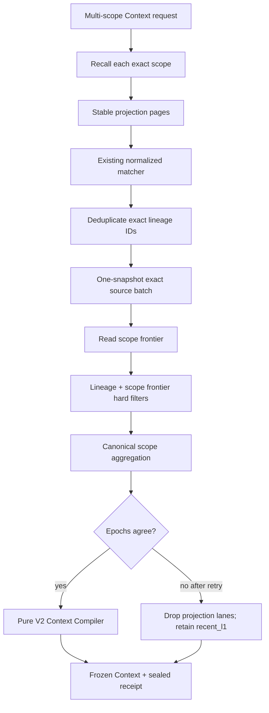

# Agent Memory Runtime H3 — Technical Design

## 1. Objective

Close the four correctness defects that forced G3 to `HOLD` without widening
M3 into a new retrieval system:

1. projection relevance is currently evaluated after a limited storage
   prefix;
2. online lineage revalidation derives a source frontier from only the first
   1,000 eligible L1 rows;
3. persisted and compiled projection frontiers are scalar even when a request
   contains multiple exact scopes; and
4. relation starts are silently sliced before traversal.

H3 preserves SQLite as the canonical ledger, the existing lexical relevance
semantics, exact source lineage, the accepted M2 fallback, and all historical
Context bytes. It creates a new G3R candidate; it does not rewrite the failed
G3/U7 evidence.

## 2. Authority and traceability

1. Product Contract R10, R11, R13–R15, R19–R20 remains the only requirement
   number authority.
2. `prd.md` projects those inherited requirements into H3 acceptance
   criteria.
3. `research/research-handoff.md` owns the fixed-commit Claim/Evidence
   transfer and Failure Oracles.
4. This document owns H3 component boundaries, state transitions,
   compatibility, and failure behavior.
5. `implement.md` owns unit order, tests, commits, rollback points, and G3R
   closure.
6. `docs/plans/2026-07-29-002-fix-g3-bounded-recall-remediation-plan.md`
   provides the unified execution view.

## 3. Design decisions

### 3.1 Projection relevance: stable cursor exhaustion

H3 will not add FTS or a persisted normalized search column. The current
matching contract is JavaScript NFKC normalization, locale-independent
lower-casing, whitespace tokenization, and all-token substring matching.
Changing tokenizer or index semantics while repairing a gate would create a
second correctness question.

`queryProjections` becomes a stable paged query ordered by:

```text
projection_type ASC, projection_id ASC
```

The optional cursor is the last `(projection_type, projection_id)` pair.
Every page returns:

- the exact scope frontier observed by the query;
- `items`;
- `examined_count`;
- `total_count`;
- `next_cursor`; and
- `exhausted`.

The first page freezes the expected scope-frontier identity. Every later page
must match it. A concurrent scope projection update fails the page with a
named frontier-change error; the lane degrades rather than combining pages
from different projection states.

The recall lane applies the existing matcher page by page until:

1. it has `max_candidates_per_lane + 1` relevant matches;
2. storage reports `exhausted=true`; or
3. `max_projection_scan_per_lane` is reached.

Case 1 proves return-limit truncation. Case 2 permits clean `NO_MATCH`. Case 3
is `DEGRADED` with `PROJECTION_SCAN_LIMIT`; unexamined rows are never silently
classified as irrelevant.

Relation projection lookup is not a lexical scan. It supplies the exact
relation revision IDs produced by SQLite traversal so membership is applied
before the return limit.

### 3.2 Exact lineage: one snapshot, exact IDs

The storage worker adds an exact source validation operation. Its input is the
deduplicated source revision IDs named by the retrieved projection candidates,
plus configured principal, exact scope, `as_of`, and sensitivity policy.

One synchronous SQLite read transaction returns:

- ledger and tombstone epochs;
- requested/result counts and `complete=true`;
- one ordered result per requested ID;
- the canonical source envelope when eligible; or
- a stable exclusion reason when missing, superseded, inactive,
  usage-blocked, revoked, tombstoned, purged, invalidated, outside validity,
  scope-mismatched, principal-mismatched, or sensitivity-excluded.

The repository may chunk SQL placeholders internally, but every chunk runs
inside the same read transaction. The public command has an operator-owned
maximum. If candidate lineage exceeds that maximum, recall does not issue a
partial request: every affected projection lane is degraded with
`SOURCE_LINEAGE_BATCH_LIMIT`, and `recent_l1` remains available.

Recall compares the canonical result with every persisted lineage field. It
does not recompute scope freshness from the returned exact subset. Candidate
lineage validity and scope projection freshness are separate hard filters.

### 3.3 Scope-keyed projection state

Migration `0011-scope-projection-frontiers.sql` adds:

```text
layered_projection_scope_state
  principal_id
  scope_kind
  scope_id
  status
  ledger_epoch
  tombstone_epoch
  projection_epoch
  source_frontier_hash
  projection_frontier_hash
  transform_versions_json
  updated_at
  error_code
  PRIMARY KEY (principal_id, scope_kind, scope_id)
```

The existing `layered_projection_state` singleton remains the global
projection-plane health and global compare-and-swap epoch. H3 does not delete
or reinterpret it. The new table owns online scope freshness.

`ApplyProjectionBatchCommand` gains explicit `principal_id` and `scope`.
Inside the existing immediate write transaction it:

1. compares the global expected projection epoch;
2. validates that every inserted/retired projection belongs to that exact
   scope;
3. writes projection revisions and lineage;
4. advances the global singleton; and
5. upserts only the matching scope-state row.

Scope projection epochs are values from the global monotonic epoch and may
skip values. A write to scope B cannot update scope A.

The migration does not fabricate a trustworthy scope frontier from the old
singleton. Existing scopes without a verified row are `pending` and fail
closed to L1 until deterministic consolidation/rebuild writes their exact
row. Existing projection revisions and frozen Contexts remain intact.

Governance effects set the affected scope row to `pending` in the same
canonical mutation transaction. Global restore/rebuild failures mark all
scope rows rebuilding/unavailable as appropriate.

### 3.4 Versioned Context frontier

The current scalar `ContextFrontier` remains V1 and keeps parsing existing
slices and receipts. New layered compilations use V2:

```text
ContextFrontierV2
  schema_version = "2.0.0"
  ledger_epoch
  tombstone_epoch
  scope_frontiers[]  // canonical scopeKey order, unique
    scope
    projection_epoch
    source_frontier_hash
    projection_frontier_hash
    transform_versions[]
  aggregate_frontier_hash
```

`aggregate_frontier_hash` is the canonical hash of the ordered scope entries,
excluding the aggregate field itself. Every scope entry must have non-null
source/projection hashes and the common ledger/tombstone epochs.

The runtime recalls every exact scope, canonically sorts by `scopeKey`, and
requires one ready scope frontier per scope. If scope calls observe different
ledger or tombstone epochs, the runtime retries the complete scope set once.
If the second read is still inconsistent, all projection candidates are
removed, projection lane telemetry records
`SCOPE_FRONTIER_EPOCH_MISMATCH`, and L1 compiles normally.

The pure compiler maps every projection candidate's exact scope to exactly one
V2 entry before comparing the candidate's lineage frontier. Missing,
duplicate, or mismatched entries fail closed. L1 candidates do not require a
projection frontier.

New slices use a new compiler version and V2 frontier. V1 Context/receipt
schemas, canonical hashes, and replay behavior remain unchanged. No migration
rewrites stored historical JSON.

### 3.5 Typed bounded-work telemetry

`LaneTelemetry` keeps its existing fields and gains an optional bounded-work
array for new artifacts:

```text
BoundedWorkTelemetry
  boundary
  configured_limit
  observed_count
  retained_count
  truncated_count
  complete
  reason_code?
```

Allowed initial boundaries are:

- `projection_scan`;
- `projection_return`;
- `source_lineage_batch`;
- `relation_starts`; and
- `relation_fanout`.

Invariants:

- `retained_count + truncated_count <= observed_count`;
- `complete=false` requires a stable reason;
- a lane with any incomplete boundary is `degraded`;
- old telemetry without `bounded_work` parses unchanged;
- new telemetry is copied into the Context and sealed retrieval receipt.

Relation start IDs are deduplicated and sorted before the configured cap.
Caller-side `RELATION_START_LIMIT` is distinct from repository-side
`RELATION_FANOUT_LIMIT`. Both may appear in one lane receipt.

## 4. End-to-end data flow



## 5. Contract changes

### 5.1 Contracts package

- Add the V1/V2 Context frontier union and canonical V2 builder.
- Add `ProjectionPageCursor` and bounded-work telemetry.
- Add `max_projection_scan_per_lane` and
  `max_source_revisions_per_batch` plus `relation_max_starts` to operator
  policy/overrides. Requests may only lower them.
- Preserve legacy optional fields so V1 fixture bytes do not gain defaults.
- Bump only the layered compiler version for new artifacts; do not globally
  rename Product Contract or replay schema versions.

### 5.2 Storage protocol

- Extend projection query with page cursor, expected scope frontier, and
  optional exact revision membership.
- Return scope frontier plus page completeness and counts.
- Add exact source validation request/result discriminated schemas.
- Extend apply-batch input with explicit principal/scope.
- Runtime-decode request and response on both client and worker boundaries.

### 5.3 Kernel/compiler

- Lane retrievers return bounded-work details, not only one boolean.
- Recall orchestrator batches only exact lineage IDs and reads exact
  scope-state freshness.
- Exact batch ledger/tombstone epochs must equal the selected ready scope
  frontier epochs; otherwise the projection lane is stale/degraded.
- Multi-scope runtime builds V2 frontiers in canonical order and performs one
  bounded retry for epoch drift.
- Hard filters select frontier by candidate scope.
- Receipt builder seals V2 frontier and telemetry without touching V1 replay.

## 6. Failure behavior

| Failure | Typed outcome | Projection action | L1 action |
|---|---|---|---|
| Projection scan ceiling | `PROJECTION_SCAN_LIMIT` | Keep proven matches but mark lane degraded | Continue |
| Projection page frontier changes | `PROJECTION_CURSOR_FRONTIER_CHANGED` | Drop affected lane result | Continue |
| Scope frontier missing/pending | `SCOPE_FRONTIER_NOT_READY` | Drop affected scope projections | Continue |
| Exact batch over configured limit | `SOURCE_LINEAGE_BATCH_LIMIT` | Drop all affected projections | Continue |
| Exact source missing/ineligible | Candidate exclusion reason | Drop descendant candidate | Continue |
| Exact batch/storage failure | `SOURCE_LINEAGE_UNAVAILABLE` | Drop affected projection lanes | Continue |
| Cross-scope epoch drift after retry | `SCOPE_FRONTIER_EPOCH_MISMATCH` | Drop all projections for compile | Continue |
| Relation starts exceed cap | `RELATION_START_LIMIT` | Traverse retained deterministic prefix, mark degraded | Continue |
| Relation fanout exceeds cap | `RELATION_FANOUT_LIMIT` | Keep bounded hits, mark degraded | Continue |

No row, lane, or compile path converts these incomplete states into clean
`NO_MATCH`.

## 7. Migration, rollout, and rollback

### Forward

1. Apply migration `0011`.
2. Existing canonical L0/L1 data and projection revisions remain readable.
3. Scope frontier rows start pending unless re-established by a deterministic
   projection batch.
4. Consolidation/rebuild writes verified rows scope by scope.
5. Projection lanes stay disabled by default until G3R explicitly passes.

### Rollback

- Code rollback can ignore the new table while retaining it.
- No old migration or stored Context JSON is rewritten.
- M2 remains operational because L0/L1 tables and legacy compiler are
  unchanged.
- A failed G3R records `HOLD`; it does not delete H3 evidence or enable
  downstream tasks.

## 8. Verification design

Focused failing-before/passing-after Oracles:

1. relevant projection appears after the first unfiltered page;
2. scan ceiling is degraded and cannot be `NO_MATCH`;
3. exact lineage remains valid beyond 1,000 scope rows;
4. missing/revoked/tombstoned exact IDs exclude only descendants;
5. scope B consolidation cannot overwrite scope A frontier;
6. two-scope request order permutations produce the same V2 aggregate and
   Context identity;
7. epoch drift retries once, then degrades safely;
8. more than 100 relation starts exposes exact truncation counts;
9. V1 Context and receipt fixtures parse, hash, and replay unchanged; and
10. M2-disabled-lane parity remains green.

G3R then reruns the original three-arm corpus, ablations, resource reports,
full repository checks, frozen install, audit, and evidence hash validation.

## 9. Explicit non-goals

- No FTS/search-index migration.
- No graph or vector backend.
- No learning candidate release.
- No ranking-weight or token-packing retune unless a corrected-candidate
  regression proves it necessary.
- No background multi-user orchestration or M6 hardening.
- No rewriting old G3 reports, frozen replay inputs, Contexts, or receipts.
