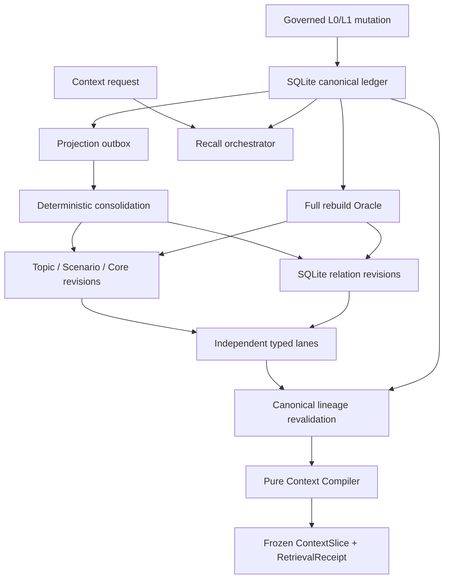
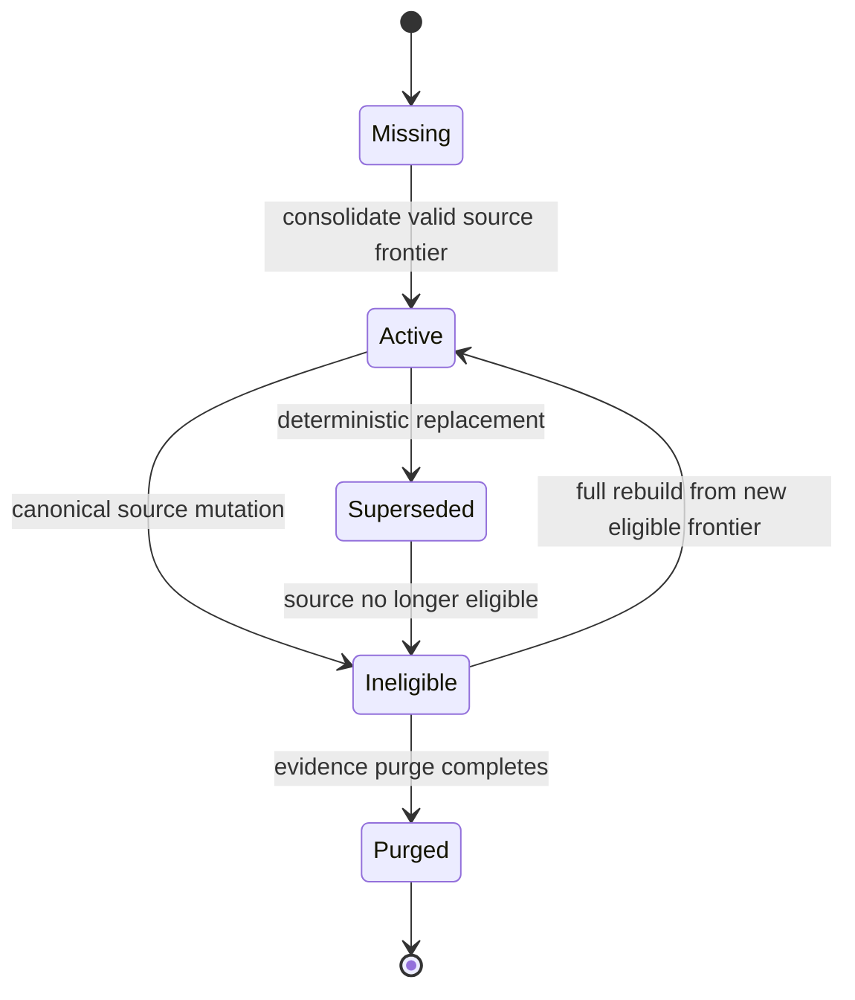

# Agent Memory Runtime M3 — Technical Design

## 1. Design objective

Extend the accepted M2 SQLite-authoritative runtime with deterministic,
rebuildable L2/L3 projections and an explainable multi-lane Context Compiler.
The implementation must improve useful Context without allowing a projection,
relation, ranking score, or stale derived row to overrule canonical L0/L1
governance.

This task covers M3 and G3 only. Graph, vector retrieval, learning release, and
M6 operational hardening remain separate milestones.

## 2. Authority

1. `docs/brainstorms/2026-07-28-agent-memory-runtime-requirements.md` owns
   Product Contract R1–R20, F1–F4, and AE1–AE8.
2. `docs/brainstorms/2026-07-29-layered-context-compiler-requirements.md` owns
   the M3 problem framing and narrowed choices.
3. `research/research-handoff.md` owns the M3 Claim/Evidence transfer.
4. `prd.md` projects the approved M3 requirements without renumbering them.
5. This document owns M3 component boundaries and invariants.
6. `implement.md` owns execution order, tests, commits, and the G3 exit gate.
7. `docs/plans/2026-07-29-001-feat-layered-context-compiler-plan.md` is the
   unified implementation plan.

## 3. Architecture



The runtime remains split into four ownership boundaries:

| Boundary | Owns | Must not own |
| --- | --- | --- |
| `contracts` | Projection, frontier, lane, Context, receipt, and G3 overlay schemas | Persistence or ranking implementation |
| `storage-sqlite` | Immutable rows, transactions, outbox claims, adjacency queries, canonical revalidation inputs | Projection meaning or compiler policy |
| `memory-kernel` | Consolidation policy, lifecycle orchestration, lane coordination, purge/rebuild effects | SQLite driver or token packing |
| `context-compiler` | Pure filters, conflict/dedupe, score, pack, and receipt construction | I/O, mutation, or authority decisions |

## 4. Projection model

### 4.1 Shared revision envelope

Every projection revision records:

- stable logical projection identity and immutable revision identity;
- projection type and payload schema version;
- principal and exact scope;
- lifecycle, authority, sensitivity, and valid-time intersection;
- transform identity, transform version, normalized input hash, and output hash;
- sorted required source revision identities;
- schema, canonical ledger, tombstone, projection, and compiler frontiers;
- created system time and optional invalidation reason/time.

A projection cannot:

- widen any required source scope;
- raise authority above its strongest valid source;
- reduce sensitivity below any required source;
- extend validity outside the intersection of required sources;
- omit required evidence or replace exact revision lineage with logical IDs.

### 4.2 Typed views

| View | Answers | Required structure |
| --- | --- | --- |
| Topic | What is known, conflicted, and unfinished for one subject? | subject key, state, open items, evidence groups |
| Scenario/Procedure | Under which conditions does a reusable action apply? | trigger, preconditions, steps, exceptions, failures, recovery |
| Core | Which stable preference, principle, or capability boundary is justified? | statement, applicability, confidence, promotion basis |
| Relation | How are governed revisions connected? | typed source/target revisions, direction, validity, evidence |

Scenario and Procedure share an envelope but remain semantically explicit.
Relations use immutable revisions so corrections append rather than rewrite
history.

### 4.3 Stable identity

Projection identity is a canonical hash over:

1. projection type;
2. principal and exact scope;
3. sorted required source revision IDs;
4. transform ID and version;
5. normalized output.

Incremental maintenance and a full rebuild at the same frozen frontier and
configuration must produce identical live identities, payload hashes, lineage,
relations, and ordering.

## 5. SQLite persistence

Migration `0008-layered-projections.sql` adds typed projection and relation
tables, lineage membership, projection-frontier state, and outbox state. It
does not modify historical migrations.

Forward migration `0009-projection-purge-redaction.sql` narrows the existing
append-only guards only while a matching purge job and redaction guard are
active. This permits physical redaction of derived projection and relation
plaintext without opening a general mutation path.

The intended logical records are:

- projection objects and immutable projection revisions;
- projection-to-source-revision membership;
- relation objects and immutable relation revisions;
- projection frontier and rebuild receipts;
- projection refresh/invalidation outbox jobs.

All writes use the existing serialized storage worker. Worker protocol payloads
must be runtime-decoded. Repository methods own prepared SQL and short
transactions; callers never import the SQLite driver.

Indexes must serve:

- exact principal/scope/type/status lookup;
- source-revision descendant lookup;
- live projection frontier lookup;
- bounded directional relation traversal;
- outbox claim ordering and retry state.

## 6. Projection lifecycle



Canonical correction, demotion, usage block, revoke, evidence purge, or
tombstone must synchronously make affected descendants ineligible by advancing
canonical/tombstone state and enqueueing invalidation work in the same
transaction. Physical cleanup may lag, but recall always revalidates every
ancestor before using a projection.

The projector:

1. claims one idempotent outbox job;
2. reloads authoritative L0/L1 revisions and governance;
3. computes deterministic typed outputs;
4. commits revisions, lineage, relations, frontier, and receipt atomically;
5. marks failure without hiding partial/degraded state;
6. supports a full canonical rebuild into an empty projection plane.

Purge removes derived plaintext and blocks recreation from tombstoned or
purged sources. Rebuild can never resurrect ineligible content.

## 7. Recall lanes

M3 defines these observable lanes:

- `recent_l1`;
- `topic`;
- `scenario_procedure`;
- `core`;
- `relation_sqlite`.

Each lane receipt records enabled state, duration, candidate count, eligible
count, selected count, exclusion counts, and any named degradation.

The operator-owned `MemoryRuntimePolicy` defines allowed lanes and hard
candidate, traversal-depth, fan-out, and concurrency ceilings. A request may
disable a permitted lane or lower a ceiling, but it cannot enable or enlarge
what policy denies. Receipts freeze both requested and effective values.

Retrieval order is:

1. authorize principal and exact scope;
2. query bounded lane candidates;
3. batch-load every canonical ancestor;
4. reject lifecycle, validity, sensitivity, scope, tombstone, lineage, and
   frontier violations;
5. pass only revalidated candidates to the compiler.

One projection lane may fail or be disabled while `recent_l1` continues.
Disabling all projection lanes must reproduce the accepted M2 semantic
baseline.

## 8. Context Compiler

The compiler is a deterministic, no-I/O function with explicit stages:

```text
hard filter
  -> lane merge
  -> canonical revalidation result check
  -> conflict grouping
  -> lineage-aware deduplication
  -> deterministic utility score
  -> constraint-first budget packing
  -> immutable receipt and slice sealing
```

### 8.1 Conflict and deduplication

- Contradictory claims remain a provenance-bearing `ConflictSet`.
- Current status and source authority are retained for every competing member.
- A summary never silently erases a lower-layer conflict.
- Repeated abstraction backed by the same lineage is removed before budgeting.
- Governing constraints, preconditions, exceptions, failures, recovery, and
  policy boundaries are retained before redundant narrative.

### 8.2 Ranking

The score is deterministic and decomposable into:

- query/task relevance;
- authority;
- freshness and validity fit;
- evidence diversity;
- conflict cost;
- token utility;
- lane contribution.

A score cannot override a failed hard filter.

### 8.3 Packing

The packer:

- enforces the requested global budget from 1 through 32,000 tokens;
- supports bounded lane minimums without exceeding the global limit;
- uses a stable tie break;
- records why every candidate was included, excluded, or displaced;
- returns a valid empty Context when nothing is eligible.

### 8.4 Frozen artifacts

`ContextSlice` and `RetrievalReceipt` freeze:

- request/canonical/tombstone/projection frontiers;
- compiler, policy, schema, and transform versions;
- lane configuration and telemetry;
- ordered included and excluded identities;
- score components and token estimates;
- conflict and dedupe decisions;
- canonical source hashes and final artifact hashes.

Already issued slices remain immutable after later mutations.
Ordinary source changes never rewrite their bytes. The existing guarded purge
path is the sole exception: it canonically redacts prohibited payload fields,
retains tombstone/hash/audit evidence, and makes exact replay report a
purged/unavailable result.

## 9. Runtime and MCP integration

The memory kernel orchestrates storage, lane reads, canonical revalidation, and
the pure compiler. The MCP surface preserves existing safe behavior and extends
`memory_context_compile`, `memory_search`, `memory_explain`, and receipt reads
with typed M3 detail.

No request may self-assert principal, scope authority, or sensitivity access.
Diagnostics remain content-free. Named lane degradation is returned in the
normal typed response rather than emitted as unstructured logs.

Delete, purge, backup/restore, and rebuild integration must cover projection
tables and derived plaintext without weakening M2 receipts or recovery.

## 10. G3 evaluation

G3 uses a separate `fixtures/g3` overlay. Every overlay case references an
immutable M0 replay case ID and hash and adds only:

- deterministic projection seeds or transform inputs;
- required evidence units and task rubric;
- pollution rubric;
- lane configuration;
- token budgets.

The three arms are:

| Arm | Meaning |
| --- | --- |
| A | Accepted tested M2 implementation |
| B | M3 binary with all projection lanes disabled |
| C | M3 layered compiler |

Arm A runs the exact G2-tested commit in an isolated checkout through the same
versioned JSON evaluation protocol used by the M3 candidate. Arm B must remain
semantically compatible with A. Arm C must have zero
governance, privacy, budget, or rebuild violations; no aggregate or partition
regression; and at least one strict designated utility/pollution improvement.
Leave-one-lane-out diagnostics attribute value but do not create a fourth
adoption arm.

The Small profile remains:

- 10,000 evidence records;
- 1,000 active L1 revisions;
- 250 live projections;
- 1,000 live relation revisions;

The Expected profile remains:

- 250,000 evidence records;
- 25,000 active L1 revisions;
- 6,000 live projections;
- 50,000 live relation revisions;
- compiler p50 at most 100 ms;
- compiler p95 at most 400 ms.

If valid Expected-profile evidence cannot be produced, G3 is `HOLD`.

## 11. Failure and recovery

| Failure | Required behavior |
| --- | --- |
| Projection worker crash | Durable idempotent job remains retryable |
| Partial projection attempt | No half-visible revision, lineage, or relation set |
| Projection lane failure | Named degradation; lower-layer Context still works |
| Stale derived row | Canonical revalidation excludes it |
| Correction/revoke/tombstone | Next Context excludes all affected descendants |
| Purge | Derived plaintext removed; rebuild cannot restore it |
| Incremental drift | Full rebuild Oracle detects structural/hash mismatch |
| Restore | Canonical and projection frontiers remain coherent or projection plane rebuilds |
| Token estimate edge | Packer stays within budget or returns empty Context |

## 12. Security and privacy invariants

- Exact principal and scope checks precede ranking and traversal.
- Relation traversal cannot cross a scope boundary through an intermediate
  node.
- Sensitivity is monotone across derivation.
- Persisted prompt injection is data and never acquires instruction authority.
- Logs and errors include IDs, counts, versions, and reasons but not memory
  payloads.
- Purge residual scans cover projection rows, relation payloads, receipts,
  Context, blobs, backups, exports, and rebuilt state.

## 13. Verification layers

| Layer | Evidence |
| --- | --- |
| Contract | strict schemas, canonical hashes, backward compatibility |
| Storage | migrations, immutability, indexes, transactions, traversal |
| Governance | scope/status/time/sensitivity/lineage/tombstone/frontier filters |
| Recovery | crash, retry, rebuild equality, backup/restore, purge |
| Compiler | conflict, dedupe, score, budgets, immutability |
| Integration | storage worker, kernel, MCP, lane degradation |
| Replay | three arms, partitions, holdout/transfer isolation |
| Performance | frozen Small/Expected profiles and percentile evidence |

The final report names the tested implementation commit, lockfile hash, schema,
transform, projection and compiler versions, fixture hashes, failures,
quarantines, debt, and explicit `GO` or `HOLD`.
