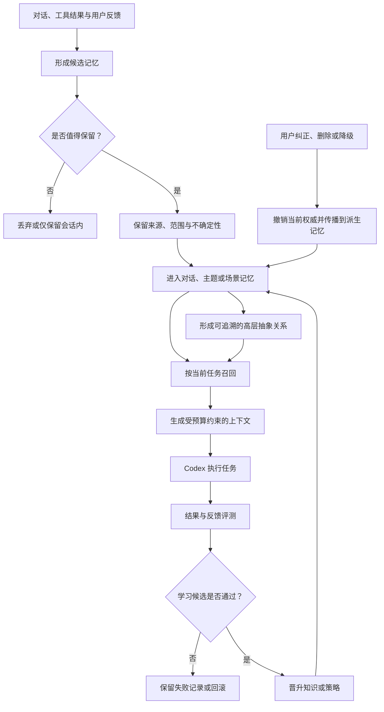

# Agent Memory Runtime Product Contract

## Summary

构建一个通过 MCP 接入 Codex、以本地持久化为主的个人 Agent Memory Runtime：它将对话逐步组织为主题、场景与高层抽象记忆，在有限上下文中提供可解释、可纠正的跨会话连续性，并通过受控学习闭环持续改进记忆与行为策略。

---

## Problem Frame

Codex 的单次上下文能够支持当前任务，却不能天然承担跨会话的长期连续性。直接回放历史对话会快速消耗上下文预算，并把过时信息、偶然表达、错误推断和当前事实混在一起；只依赖相似度检索，又可能返回语义接近但在当前场景中无效的内容。

当系统进一步形成摘要、用户画像、场景模型或关系图谱时，错误会从一次回答扩散成长期认知。如果没有来源、有效期、冲突、修订和删除传播机制，用户即使纠正了底层事实，错误也可能从派生摘要或图关系中重新出现。

“自我学习”还会放大这一风险。未经评测便把一次成功或失败固化为长期策略，可能让 Agent 越学越偏。这个产品需要先建立可信记忆的权威边界、生命周期和用户控制，再允许学习结果进入长期行为。

图中流程只表达产品行为；具体存储结构、检索算法和执行组件由后续调研与计划确定。正文要求优先于图示。

---

## Actors

- A1. 用户 / 记忆所有者：决定哪些信息可以保留，检查记忆依据，并拥有纠正、删除、固定、降级和关闭学习的最终权力。
- A2. Codex Agent：通过 MCP 请求与当前任务有关的记忆，使用受约束的上下文完成任务，并提交结果与反馈供记忆系统评估。
- A3. Memory Runtime：在本地维护记忆、来源、层级、有效性和审计历史，向 Codex 返回可解释的上下文，并管理受控学习生命周期。
- A4. 评测者：由确定性规则、离线回放、独立 Judge 或用户反馈承担，负责判断召回和学习候选是否真正改善结果；同一次生成不能只靠自身判断获得晋升。

---

## Key Flows

- F1. 捕获并形成记忆候选
  - **Trigger:** A1 明确要求记住，或 A2/A3 从对话、工具结果、任务结果中识别出可能值得保留的信息。
  - **Actors:** A1, A2, A3
  - **Steps:** 识别候选；区分原始事件、事实、偏好、任务状态、关系、总结或策略；记录来源、适用范围和不确定性；判断仅在当前会话使用、等待确认、进入长期记忆或拒绝保存。
  - **Escape path:** 信息敏感、低价值、缺少来源、与现有记忆冲突或用户不允许保存时，不得静默晋升为稳定长期记忆。
  - **Outcome:** 候选拥有明确的类型、权威状态和生命周期位置，而不是直接成为“事实”。
  - **Covered by:** R1, R2, R3, R6, R7, R8

- F2. 跨会话召回并投影上下文
  - **Trigger:** A2 开始新任务，或任务过程进入需要历史信息的阶段。
  - **Actors:** A2, A3
  - **Steps:** 理解当前任务和场景；从不同记忆层寻找候选；检查时间、范围、冲突、删除和权威状态；在上下文预算内选择互补信息；返回内容、来源、召回原因和不确定性。
  - **Escape path:** 没有相关记忆时明确返回“无相关记忆”；运行故障、权限拒绝和无命中不得混为同一种结果。
  - **Outcome:** Codex 获得与当前任务相关、数量受控且可追溯的记忆包。
  - **Covered by:** R9, R10, R11, R12, R13

- F3. 纠正、遗忘与派生传播
  - **Trigger:** A1 发现记忆错误、过时、不再适用，或要求删除。
  - **Actors:** A1, A3
  - **Steps:** 定位当前记忆及其来源；记录纠正、替代、失效或删除意图；撤销旧记忆的当前权威；使相关摘要、主题、场景和抽象关系失效或重新评估；保留必要的审计证明。
  - **Escape path:** 不能安全确定派生影响范围时，相关派生记忆先进入隔离或待复核状态，不得继续作为稳定事实召回。
  - **Outcome:** 被纠正或删除的内容不会从旧摘要、缓存或图关系中重新成为有效记忆。
  - **Covered by:** R7, R8, R14, R18, R19

- F4. 从结果中学习并受控晋升
  - **Trigger:** A2 完成任务，A1 给出反馈，或离线回放发现稳定的成功、失败或知识缺口模式。
  - **Actors:** A1, A2, A3, A4
  - **Steps:** 保存结果与反馈；提出知识、召回规则或行为策略候选；绑定支持证据和预期改进；与基线进行评测；根据风险要求用户确认；发布、拒绝或回滚；持续监测回归。
  - **Escape path:** 没有信息增量、评测失败、只获得同一模型自评、风险过高或用户关闭学习时，候选不得进入稳定长期行为。
  - **Outcome:** 学习表现为可审计、可评测、可撤销的版本变化，而不是不可解释的自动自我修改。
  - **Covered by:** R15, R16, R17, R18, R19, R20

---

## Requirements

**产品边界与本地所有权**

- R1. Memory Runtime 必须通过 MCP 向 Codex 提供记忆能力，并将 Codex 与记忆持久化、召回和学习生命周期解耦。
- R2. 主要持久化内容必须保存在用户本地；系统必须明确区分“本地保存”与“为完成当前推理而被发送给模型的上下文”，不能把两者描述成同一种隐私边界。
- R3. 第一目标用户是单个本地开发者；用户是记忆内容与学习策略的最终权威。

**分层记忆与权威模型**

- R4. 系统必须支持从具体到抽象的记忆层次：当前对话 / 工作记忆、跨会话主题记忆、可复用场景记忆，以及表达稳定概念和关系的高层抽象记忆。
- R5. 短期与长期必须是可观察的生命周期差异，而不只是两个存储位置；记忆可经过候选、有效、冲突、失效、替代、删除或归档等阶段。
- R6. 原始对话和工具结果、被确认的事实或偏好、系统派生的摘要或关系、为一次调用生成的上下文投影，以及学习候选必须保持可区分，不能共享同一事实权威。
- R7. 每条可长期使用的记忆必须能够回答：来自哪里、何时产生、适用于谁和什么场景、当前是否有效、是否存在冲突、为何被保留，以及它是否为推断。
- R8. 跨层抽象必须能够回溯到底层依据；高度抽象层可以使用图结构表达实体、主题、场景、时间与因果或依赖关系，但图关系本身不得自动获得高于底层证据的权威。
- R9. 向量相似度可以作为召回信号，但不是必需依赖，也不能单独决定记忆的真实性、适用性或晋升。

**召回与上下文控制**

- R10. 每次召回必须以当前任务、用户、场景和时间范围为边界，并在明确的上下文预算内返回数量受控的记忆。
- R11. 召回结果必须包含足够的来源、层级、当前状态、选择原因和不确定性，使 A1 或 A2 能判断它为何出现。
- R12. 上下文选择必须处理重复、过时、冲突、被替代、已删除和低权威候选，并兼顾相关性、时效性、信息互补性与来源多样性，避免单一相似度造成上下文污染。
- R13. 系统必须区分“确实没有相关记忆”“相关记忆被权限或策略排除”“记忆服务发生故障”，使 Codex 能采取不同的安全行为。

**纠正、遗忘与可逆性**

- R14. A1 必须能够检查、纠正、替代、删除、固定、降级或禁止使用记忆；这些动作必须影响后续召回，并传播到依赖它的主题、场景、高层关系和上下文派生物。
- R15. 历史修订不得通过无痕覆盖完成。系统必须保留足够的版本、失效和审计信息，以解释当前状态，同时确保被删除或无权使用的正文不会因审计需要继续泄露。

**自我学习**

- R16. 自我学习必须以任务结果、用户反馈、明确错误、知识缺口或离线评测为输入，形成独立的知识候选、召回策略候选或行为策略候选；它不等同于模型参数训练。
- R17. 学习候选必须经过“提出—绑定依据—与基线评测—发布或拒绝—持续监测—可回滚”的生命周期；重复信息、来源数量增加或同一模型的自我认可不能单独证明已经学习。
- R18. 高影响、低置信度、涉及敏感信息或会改变用户长期偏好的学习候选，在启用前必须由 A1 明确确认；A1 可以整体暂停学习而不影响基本记忆读取。
- R19. 系统必须保存可回放的召回、上下文投影、记忆变更和学习发布记录，使失败能够被复现、比较和归因。
- R20. 必须建立离线评测和回归门禁，验证跨会话连续性、相关召回、上下文污染、冲突处理、删除不复活、学习收益和回滚安全；学习改进不得以这些基本能力退化为代价。

---

## Acceptance Examples

- AE1. **Covers R4, R7, R10, R11.** Given 用户在早期会话中确认了稳定的技术偏好，when 数日后 Codex 开始一个适用该偏好的新任务，then 返回的记忆说明该偏好的来源、适用范围和召回原因，而不是回放整段旧对话。
- AE2. **Covers R5, R7, R12, R14.** Given 用户先后给出相互冲突的项目状态，when Codex 请求当前项目上下文，then 系统优先返回仍有效的状态并显式标明替代关系，不把两个版本无差别并列为事实。
- AE3. **Covers R9, R10, R12.** Given 语义相似的旧会话很多但只有少数与当前场景匹配，when 系统构建有限上下文，then 场景、时间和权威约束能够排除大部分噪声；没有向量能力时仍能完成受控召回。
- AE4. **Covers R8, R14, R15.** Given 某条用户事实已经被主题摘要和高层关系引用，when 用户纠正或删除该事实，then 后续召回不再把旧事实或其派生关系作为有效内容，且系统能解释纠正如何传播。
- AE5. **Covers R13.** Given 一次召回没有命中、一次召回被隐私策略拒绝、另一次召回发生运行故障，when Codex 接收结果，then 三种情况具有不同且可操作的状态，Codex 不会把故障误认为“用户从未说过”。
- AE6. **Covers R16, R17, R18, R20.** Given Agent 从一次成功任务中提出新的长期执行策略，when 离线回放显示它只对单一场景有效或损害其他任务，then 候选不会发布为全局策略；已试运行的版本可以回滚。
- AE7. **Covers R18, R19.** Given 用户关闭自我学习，when Codex 继续读取和写入明确授权的普通记忆，then基本记忆能力继续工作，但任务结果不会自动生成或发布新的长期策略。
- AE8. **Covers R2, R3, R14.** Given 用户检查自己的本地记忆，when 发现敏感内容，then 用户可以删除或禁止其进入后续模型上下文，并能区分本地持久化记录与已经发生的模型调用。

---

## Success Criteria

- 在代表性的多会话任务中，Codex 能延续稳定偏好、项目事实和场景约束，同时不需要回放完整历史。
- 任一被召回或晋升的长期记忆都能追溯到底层来源，并说明当前有效性、适用范围、召回或晋升理由。
- 过时、冲突、被替代和被删除的内容不会以摘要、缓存、高层关系或学习策略的形式重新成为有效事实。
- 与“仅搜索历史对话”的基线相比，分层召回在相关性、上下文利用率和任务完成质量上产生可重复的改善，并且上下文污染率不恶化。
- 自我学习的每次发布都有独立于候选生成过程的评测依据；失败、无增量和回归能够阻止发布或触发回滚。
- 用户可以在不破坏基本读取能力的前提下关闭自动捕获、特定记忆使用或自我学习。
- 下游调研能够为每个关键技术判断提供 Claim—Evidence 映射；下游计划能够把每个实施单元追溯到 R/F/AE，而无需自行发明产品行为。

---

## Scope Boundaries

### Deferred for later

- 自动监听全部 Codex 生命周期并在后台无提示地捕获、整理和学习；第一阶段优先验证显式、可观察的 MCP 闭环。
- 在基线召回不足时再引入专用向量索引；不得为了使用向量数据库而扩大第一阶段范围。
- 多设备同步、远程备份和跨主机合并。
- 主动式长期陪伴行为，例如未经任务触发便主动提醒、规划或建立人格关系。
- 模型微调、强化学习和参数级持续训练；若未来需要，使用独立训练与安全评测管线。
- 大规模自动抽象和无人审批的高影响策略发布，直到离线评测和回滚机制证明安全。

### Outside this product's identity

- 面向团队或企业的共享知识库、权限平台和组织级知识图谱。
- 把全部历史对话永久保存并提供全文检索的聊天归档产品。
- 通用文档 RAG、搜索引擎或向量数据库管理平台。
- 以云服务为中心、要求用户把完整个人记忆托管到远端的 SaaS。
- 不可解释、不可纠正、以“Agent 自己判断”为最终权威的自治人格系统。
- 将图遍历、向量相似度、模型总结或单次任务成功直接视为真实记忆。

---

## Key Decisions

- 可信连续性优先于最大召回量：产品成功取决于在正确场景提供少量正确记忆，而不是保存或返回最多内容。
- 记忆真相与上下文投影分离：持久记忆、派生认知、召回候选和某次调用使用的上下文分别承担不同责任。
- 分层是语义与生命周期契约：对话、主题、场景和高层抽象代表不同稳定性与适用范围，不预先绑定到某一种数据库。
- 图结构服务于高层关系推理：它适合表达抽象实体与关系，但必须保留来源和可逆传播，不能成为孤立真相。
- 向量检索是可替换能力：系统首先建立不依赖向量数据库的正确闭环，再用评测决定是否引入。
- 自我学习采用候选发布模型：学习只有在获得证据增量、独立评测和可回滚版本后才成为长期行为。
- 用户拥有最终控制权：系统可以提出、解释和推荐，但不能绕过用户的纠正、遗忘、敏感信息和学习策略决定。
- 本阶段只交付研究与实施计划：不实现数据库、MCP 服务、Codex 集成或学习执行器。

---

## Dependencies / Assumptions

- 当前产品假设为单用户、单机优先；多用户隔离和分布式一致性不进入第一版。
- Codex 可以主动调用配置好的 MCP 工具；是否存在满足自动捕获需求的稳定生命周期入口，需要在调研阶段依据当前官方能力验证。
- “本地优先”约束持久化位置，不意味着被选入当前提示词的内容永远不离开设备；计划必须明确模型提供方的数据边界和用户控制。
- 记忆层级是产品语义，存储技术可以混合或替换；具体数据库数量和边界必须由证据、复杂度和评测收益决定。
- 自我学习首先覆盖运行时知识、召回和行为策略，不承诺更新基础模型参数。
- 召回预算、晋升阈值、删除传播时限和评测通过线需要经研究与原型基线确定，不能在无证据时宣称为通用最优值。

---

## Outstanding Questions

### Resolve During Research

- [Affects R1, R13][Needs research] 当前 Codex MCP 支持哪些显式调用、资源暴露和生命周期集成方式？哪些自动捕获能力不能由 MCP 单独可靠完成？
- [Affects R4-R9][Needs research] Mem0、Graphiti、TencentDB Agent Memory、Hermes Agent 和现有 context-management 研究分别如何处理层级、时态、来源、冲突和图关系？哪些能力可以复用，哪些假设不适合本地单用户场景？
- [Affects R8, R9, R14][Needs research] 高层抽象使用嵌入式图、独立图数据库或关系表投影时，在本地部署、时态查询、删除传播和可运维性上的真实取舍是什么？
- [Affects R10-R13][Needs research] 不依赖向量数据库的基线召回能够达到什么效果？在哪些可复现失败案例下，向量检索才产生足以抵消复杂度的增益？
- [Affects R16-R20][Needs research] 第 8 章的自学习理论和参考项目能否转化为“候选—评测—发布—回滚”的工程状态机？独立 Oracle 和证据增量应怎样定义？
- [Affects Success Criteria][Needs research] 应使用哪些公开或自建场景评测跨会话连续性、上下文污染、冲突、删除不复活和学习收益，并如何建立 transcript-only 基线？

### Deferred to Planning

- [Affects R4-R9][Technical] 在研究结论约束下，第一阶段的权威存储、派生图和可选检索索引如何划分责任。
- [Affects R1, R10-R13][Technical] MCP 能力如何组织成对 Codex 可发现、可解释且能表达无命中、拒绝和故障差异的交互契约。
- [Affects R14-R20][Technical] 版本、传播、评测、发布和回滚如何拆成可独立交付与验证的实施阶段。
- [Affects all][Technical] 如何把最小闭环、图谱增强和受控学习拆成连续里程碑，并为每一阶段设置 Go/No-Go 门禁。
