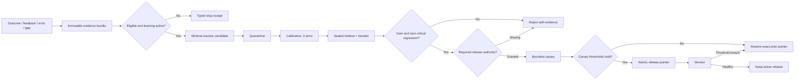

# M5 Governed Learning Lab Requirements

## Summary

M5 will add a local, candidate-only Learning Lab that can turn task outcomes,
explicit feedback, errors, and capability gaps into the smallest reversible
change worth testing. Nothing learned becomes active because it was repeated,
generated, or self-reviewed: every candidate must survive a frozen three-arm
comparison, protected holdout and transfer cases, quarantine, explicit release
authority, a bounded canary, and exact rollback.

This milestone treats learning as governed change control over versioned
runtime artifacts, not as unconstrained model self-improvement. G5 is complete
when the system can either release an evidence-backed candidate safely or
reject it without changing the accepted runtime. A supported `NO-GO` is a
valid result.

---

## Problem Frame

M0-M4B established a local runtime whose authority, retrieval configuration,
and Context behavior are explicit:

- SQLite is the canonical authority plane.
- The governed Context Compiler uses FTS5, recency, layered projections, and
  SQLite relations.
- G4A rejected a graph backend and G4B rejected a vector lane at their tested
  implementations.
- Memory mutations already require lifecycle, provenance, authorization,
  conflict, tombstone, and receipt controls.

The remaining risk is that “self-learning” silently bypasses those controls.
A system can appear to improve while overfitting one episode, learning from
ambiguous feedback, amplifying sensitive data, degrading baseline behavior, or
publishing a strategy that cannot be traced or undone. Average gains are not
enough if one critical scenario regresses.

M5 therefore needs a separate laboratory boundary. It records learning inputs,
proposes versioned candidates, evaluates them without contaminating protected
cases, and publishes only through explicit authority. Normal governed memory
reads and writes must remain available when learning is paused or when every
candidate is rejected.

---

## Assumptions

*This requirements document is part of the user-authorized continuous roadmap.
The following are explicit design bets for research and planning, not silently
adopted behavior.*

- The first supported release units should be declarative and exactly
  reversible: a memory revision, bounded procedure, or retrieval-policy
  configuration. Prompt, CoreProjection, ScenarioPattern, and Skill candidates
  require stronger evidence and explicit A1 confirmation because their blast
  radius is broader.
- M5 does not train model parameters, perform online reinforcement learning,
  edit product code automatically, or merge generated Skills.
- A frozen synthetic corpus can prove gate mechanics and deterministic
  behavior, but it is not evidence of production improvement.
- The immediate runtime remains local and single-user. Multi-user or fleet
  learning would need a separate authority, privacy, and rollout contract.
- G4A and G4B decisions, the accepted retrieval configuration, and all
  evaluation case identities are immutable inputs to an M5 evaluation run.
- Learning pause/resume controls proposal, evaluation, canary, and publication
  frontiers; it does not disable ordinary governed recall or authorized memory
  mutation.

---

## Actors

- A1. Local user/operator: controls learning pause/resume, grants high-impact
  release authority, sees candidate evidence and risk, and can demand exact
  rollback.
- A2. Codex memory client/agent: submits task outcomes and feedback, proposes
  bounded candidates, consumes only the active release pointer, and cannot
  approve its own proposal.
- A3. Learning Lab: records immutable learning inputs, creates candidate
  versions, enforces partition isolation, runs evaluations, manages quarantine
  and canary state, and emits receipts.
- A4. Independent evaluator/oracles: score frozen outputs and invariants across
  identical arms without granting release authority.
- A5. Memory Runtime: continues canonical recall and mutation, resolves active
  release pointers, enforces scope and lifecycle, and performs rollback without
  changing canonical history.

---

## Key Flows

These flows refine Product Contract F4. They do not create a second product
flow namespace.

### Capture and qualify learning evidence

- **Trigger:** a task outcome, explicit user feedback, typed error, observed
  capability gap, or offline evaluation result is available.
- **Actors:** A1, A2, A3
- **Steps:** record the frozen ContextSlice, trajectory, tools, outcome,
  feedback provenance, error/failure class, relevant scopes, model/runtime
  versions, active release pointer, retrieval configuration, latency, token
  cost, and side effects; preserve positive, negative, and conflicting traces;
  classify whether the evidence is eligible to propose a change.
- **Escape path:** missing provenance, ambiguous authority, learning pause,
  sensitive-data risk, or insufficient evidence records a typed stop reason and
  creates no candidate.
- **Outcome:** a replayable evidence bundle exists, independent of any proposed
  solution.
- **Covered by:** R16, R18, R19

### Propose the smallest reversible candidate

- **Trigger:** an eligible evidence bundle identifies a bounded gap.
- **Actors:** A2, A3
- **Steps:** identify the smallest candidate type and exact scope; bind its base
  release, evidence set, expected improvement, affected invariants, risk,
  reversibility, and evaluation contract; start in `candidate_only` or
  quarantine without changing the active release pointer.
- **Escape path:** a candidate whose scope cannot be bounded, rollback cannot
  be proven, or evidence only supports one anecdotal scenario is rejected.
- **Outcome:** the candidate is immutable, attributable, independently
  evaluable, and inactive.
- **Covered by:** R16, R17, R18, R19

### Evaluate three arms with protected partitions

- **Trigger:** an inactive candidate and its evaluation contract are frozen.
- **Actors:** A3, A4
- **Steps:** run `no_candidate`, `current`, and `candidate` on identical
  calibration, sealed holdout, and transfer cases; enforce the same inputs,
  readers, budgets, tools, retrieval configuration, scoring version, and
  environment; separately measure success, typed errors, negative transfer,
  Context/token cost, latency, side effects, scope/privacy violations, and
  critical regressions.
- **Escape path:** partition leakage, case mutation, missing arm, configuration
  drift, non-replayable output, or any critical regression invalidates the run
  instead of counting as a gain.
- **Outcome:** a signed comparison shows the candidate's incremental value over
  both absence and the current release.
- **Covered by:** R17, R19, R20

### Authorize, canary, release, monitor, and roll back

- **Trigger:** all offline gates pass and the candidate remains inside its
  declared risk boundary.
- **Actors:** A1, A3, A4, A5
- **Steps:** obtain the required independent or explicit authority; advance the
  candidate from quarantine to a bounded canary; monitor the predeclared
  success and regression signals; atomically move a versioned release pointer
  only after canary success; emit evaluation, authority, canary, release, and
  monitor receipts.
- **Escape path:** missing authority, threshold breach, critical regression,
  scope/privacy violation, configuration drift, or pause prevents publication
  or atomically restores the exact prior release pointer.
- **Outcome:** the active release is explicit and reversible, while rejected
  history remains inspectable but inactive.
- **Covered by:** R17, R18, R19, R20

### Pause and resume at an explicit frontier

- **Trigger:** A1 pauses learning, or a safety condition auto-pauses further
  learning transitions.
- **Actors:** A1, A3, A5
- **Steps:** freeze proposal/evaluation/canary/publication at a recorded
  frontier, leave ordinary governed reads and authorized writes operational,
  and record in-flight state without silently completing it; resume only from
  the same or an explicitly abandoned frontier.
- **Escape path:** stale evidence, changed runtime identity, expired authority,
  or invalidated cases require re-evaluation rather than continuation.
- **Outcome:** pause is observable, non-destructive, and does not become a
  memory-runtime outage.
- **Covered by:** R18, R19, R20

---

## Inherited Requirements

The Product Contract in
`docs/brainstorms/2026-07-28-agent-memory-runtime-requirements.md` remains the
only requirements-number authority. M5 does not introduce new product
requirement identifiers.

### Learning evidence and candidate boundary

- R16. Learning input comes from task outcome, user feedback, typed error,
  observed gap, or offline evaluation. Knowledge, retrieval, and behavior
  candidates remain independent and do not imply model training.

### Release lifecycle and authority

- R17. Every candidate follows propose, evidence, baseline evaluation,
  release/reject, monitor, and rollback. Repetition, self-review, or internal
  approval is not proof.
- R18. High-impact, low-confidence, sensitive, or long-term preference changes
  require explicit A1 confirmation. Learning pause cannot break basic governed
  reads.

### Replayability and non-regression

- R19. Learning traces, candidate versions, exclusions, evaluations, authority,
  canaries, release pointers, monitoring, pauses, resumes, and rollbacks must
  be replayable and hash-bound to their inputs, executable, dependencies,
  configuration, corpus, and environment.
- R20. Offline and regression gates separately prove continuity, relevance,
  Context pollution, conflict handling, no-resurrection, learning gain, and
  rollback. Aggregate improvement cannot compensate for a critical baseline
  regression.

---

## Product Acceptance Examples

### AE6 refinement — harmful or narrow candidate

Given a candidate improves one calibration scenario but harms a sealed holdout
or fails to transfer beyond its source scenario, when G5 evaluates it, then the
candidate is not globally released and any canary or trial state can be rolled
back to the exact prior release pointer.

### AE7 refinement — learning disabled

Given learning is paused before or during proposal, evaluation, canary, or
publication, when normal memory operations continue, then governed reads and
authorized writes still work while no automatic long-term strategy is
generated or published.

### Additional M5 acceptance cases

- **Evidence before candidate:** a task failure with no frozen ContextSlice,
  outcome provenance, or typed failure class creates a stop receipt, not a
  candidate.
- **Candidate-only default:** proposing or evaluating a candidate never changes
  active runtime behavior or its release pointer.
- **Smallest change:** when a bounded memory or retrieval-policy revision can
  address the evidence, M5 cannot escalate directly to automatic Skill or code
  modification.
- **Three complete arms:** an evaluation missing `no_candidate`, `current`, or
  `candidate` is invalid even if the observed candidate score is high.
- **Partition isolation:** holdout and transfer expected results are sealed
  from proposal generation and calibration; contamination invalidates the
  evaluation receipt.
- **Configuration binding:** changing G4A/G4B decisions, retrieval policy,
  corpus, scoring version, or runtime identity after freezing a run prevents
  reuse of its approval.
- **Zero critical regression:** any authority, scope, privacy, lifecycle,
  conflict, tombstone, Context-pollution, or rollback regression blocks
  release regardless of average gain.
- **Explicit authority:** a high-impact, sensitive, low-confidence, or
  long-term preference candidate cannot self-approve or infer A1 consent from
  repeated use.
- **Exact rollback:** a canary or release threshold breach restores the named
  prior pointer and verifies that the failed candidate no longer affects
  behavior.
- **No-gain stop:** no measurable gain, repeated gap without new evidence,
  overfit, or missing evidence ends the attempt with a supported rejection
  rather than widening scope.

---

## Success Criteria

- Learning traces preserve enough state to replay why a candidate was proposed
  without reusing mutable conversation state.
- Positive, negative, and conflicting evidence remain distinct and
  attributable.
- Every candidate is immutable, inactive by default, minimally scoped, and
  bound to an exact base release and rollback target.
- All three arms run over identical frozen inputs and separately report
  calibration, holdout, and transfer behavior.
- G5 requires measurable candidate gain over `current`, meaningful value over
  `no_candidate`, and zero critical regression.
- Quarantine, authority, canary, release, pause/resume, monitoring, and rollback
  are explicit state transitions with receipts.
- Learning pause blocks new learning publication while ordinary governed recall
  and authorized mutation remain available.
- A rejected or rolled-back candidate cannot remain active through cache,
  pointer drift, stale Context, or restored state.
- The G5 receipt binds the tested implementation, dependency lock, accepted
  G4A/G4B configuration, case corpus, partitions, thresholds, reports,
  authorities, canary, limitations, and rollback target.

---

## Scope Boundaries

- No model-parameter training, reinforcement learning, fine-tuning, or remote
  training service.
- No automatic product-code edits, merges, deploys, or generated Skill
  publication.
- No reopening the G4A graph or G4B vector decisions.
- No implicit global behavior change from one task, user correction, repeated
  suggestion, or self-evaluation.
- No use of holdout or transfer answers during proposal generation or
  calibration.
- No weakening of SQLite authority, canonical memory identity, lifecycle,
  scope, provenance, sensitivity, conflict, tombstone, or receipt rules.
- No production-readiness claim, fleet rollout, multi-user learning, remote
  control plane, backup operations, disk-pressure policy, or M6 hardening.
- No article or HTML publication as part of the research phase unless the user
  explicitly authorizes it.

---

## Approach Exploration

### 1. Governance-first offline Learning Lab — selected

Record immutable evidence, propose an inactive minimal candidate, compare three
arms on protected partitions, then require quarantine, authority, canary,
release-pointer movement, monitoring, and rollback.

This approach makes learning inspectable and falsifiable. It preserves normal
runtime behavior when no candidate passes and matches R16-R20.

### 2. Opportunistic online self-modification — rejected

Allow the runtime to modify prompts, retrieval, or behavior immediately and
evaluate after the fact.

This shortens feedback latency but cannot reliably separate evidence from
contamination, allows the proposer to influence its own test, and conflicts
with R17 and R18 authority boundaries.

### 3. Observability-only trace recorder — insufficient

Capture outcomes and feedback without generating or publishing candidates.

This is safe and useful as a first component, but alone it does not fulfill the
required evaluation, release, pause/resume, and exact rollback lifecycle.

---

## Conceptual Lifecycle

The prose requirements are authoritative if this diagram is incomplete.

---

## Key Decisions

- Treat learning as versioned change control rather than autonomous
  self-modification.
- Separate immutable evidence from candidate generation so the proposed
  solution cannot rewrite its justification.
- Keep every candidate inactive until an external release boundary is crossed.
- Require both `no_candidate` and `current` baselines because “better than
  nothing” and “better than the accepted release” answer different questions.
- Protect holdout and transfer partitions from proposal and calibration to make
  overfit observable.
- Measure negative transfer, pollution, side effects, scope, and privacy
  independently from task success and aggregate gain.
- Use an atomic, versioned release pointer as the publication and rollback
  boundary.
- Make pause/resume a persisted frontier, not a process-local switch.
- Bind all evaluation evidence to the accepted graph/vector decisions and
  retrieval configuration so stale approval cannot authorize a changed system.
- Accept evidence-backed rejection or `NO-GO` as complete G5 delivery.

---

## Dependencies / Assumptions

- G3R `GO` at tested implementation
  `6224f782c86712488d416d8101ef7c9fa477c0ae` is the accepted Context Compiler
  baseline.
- G4A `NO-GO` at tested implementation
  `36421f5cd75007a1421d3e0594e7881dd4b864b2` keeps SQLite relations as the
  structural projection.
- G4B `NO-GO` at tested implementation
  `3eec7119b1e441d76523d0a57c328d4d811a4af3` keeps the runtime vector-free.
- M0 frozen cases, canonical serialization, governance oracles, dependency
  lock, and gate evidence remain available as reusable foundations, not as
  automatically sufficient learning evidence.
- Existing learning contracts are provisional inputs. Research and planning
  must resolve any mismatch between their current arm/status vocabulary and
  the Product Contract before implementation.

---

## Outstanding Questions

### Deferred to Research and Planning

- [Affects R16/R19][Needs research] What is the minimal immutable trace that
  preserves outcome, feedback, failure, Context, active release, and
  configuration without retaining unnecessary sensitive trajectory data?
- [Affects R16/R18][Technical] Which candidate types can be released
  declaratively in M5, and which must remain unsupported or require explicit
  A1 authority because exact rollback cannot yet be proven?
- [Affects R17/R20][Needs research] Which three-arm delta and partition
  protocol best distinguishes incremental gain, baseline behavior, overfit,
  and negative transfer?
- [Affects R17/R19][Technical] Which state machine prevents a proposer,
  evaluator, or stale authority receipt from self-publishing a candidate?
- [Affects R18/R19][Technical] How should pause/resume frontier identity cover
  in-flight evaluation and canary work while keeping normal memory operations
  available?
- [Affects R19/R20][Technical] Which hashes and environment identities make
  evaluation, canary, release, rollback, and configuration drift
  deterministically verifiable?
- [Affects R20][Needs research] Which predeclared thresholds prove gain and
  zero critical regression on a small local frozen corpus without overstating
  production value?

## Decision

Proceed with a governance-first, offline Learning Lab. M5 will record
replayable evidence, propose only the smallest inactive and reversible
candidate, require protected three-arm evaluation, and publish solely through
explicit authority, bounded canary, a versioned release pointer, monitoring,
and exact rollback. It will stop with a supported rejection whenever evidence,
gain, transfer, authority, privacy, or reversibility is insufficient.
