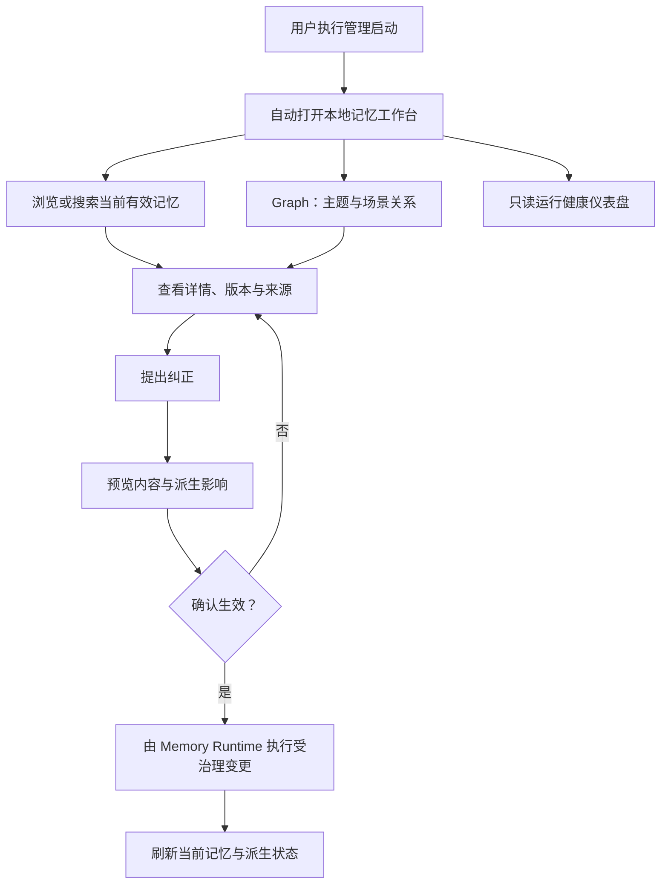

# Memo Graph 记忆工作台需求

## Summary

为 memo-graph 增加一个随管理启动流程打开的本地前端：以当前有效记忆的查看和安全纠正为核心，同时提供可展开完整来源链的 Graph 视图，以及只读的运行健康仪表盘。

---

## Problem Frame

memo-graph 已经具备通过 MCP 使用记忆、执行受治理变更和通过 operator CLI 观察运行状态的能力，但当前没有面向记忆所有者的前端界面。用户要了解系统“记住了什么”时，需要跨工具、标识符和底层输出自行拼接当前记忆、版本、来源与派生关系；发现错误后，也难以在一个连续流程里判断纠正会影响哪些主题、场景和关系。

Graph 与运行状态还缺少适合日常使用的可视表达。关系存在于派生能力中，并不等于用户能够从主题或场景一路检查到底层来源；运行时已经区分权威存储、派生投影和后台工作，但用户也缺少一个快速判断“系统健康、数据滞后，还是任务失败”的统一入口。这使记忆虽然可被 Agent 使用，却仍难以由记忆所有者直接检查和控制。

正文需求是产品行为的权威描述；图仅用于说明主要入口与纠正闭环。

---

## Actors

- A1. 本地用户 / 记忆所有者：浏览自己的记忆、检查来源、确认纠正，并判断系统是否健康。
- A2. 记忆工作台：提供记忆、Graph 和运行健康三个用户界面，并把状态与风险转换为可理解的交互。
- A3. Memory Runtime：保持记忆权威、版本、治理、来源与派生一致性，执行或拒绝工作台请求的操作。

---

## Key Flows

- F1. 启动并进入工作台
  - **Trigger:** A1 通过面向管理的启动入口启动 memo-graph。
  - **Actors:** A1, A2, A3
  - **Steps:** 启动本地管理界面；确认 Runtime 可用性；自动打开浏览器；进入以当前有效记忆为默认内容的工作台。
  - **Escape path:** 前端、Runtime 或浏览器打开失败时，必须显示或输出可区分的状态与恢复入口，不能把故障表现为空记忆库。
  - **Outcome:** A1 通过一次明确启动动作进入可用的本地记忆工作台。
  - **Covered by:** R1, R2, R3

- F2. 查找并解释一条记忆
  - **Trigger:** A1 想确认系统当前保存或使用的某项信息。
  - **Actors:** A1, A2, A3
  - **Steps:** 按项目或主题浏览；搜索或筛选；打开记忆详情；检查层级、状态、适用范围、当前版本和来源链；按需展开原始证据。
  - **Escape path:** 无匹配、因治理不可见和服务故障必须呈现为不同状态。
  - **Outcome:** A1 能判断一条记忆是什么、为何有效、来自哪里以及适用于什么范围。
  - **Covered by:** R4, R5, R6, R7, R8

- F3. 安全纠正权威记忆
  - **Trigger:** A1 发现当前权威记忆错误、过时或表达不准确。
  - **Actors:** A1, A2, A3
  - **Steps:** 从详情页发起纠正；编辑新内容；查看旧版本与新版本差异；检查可能受影响的主题、场景和 Graph 关系；确认或取消；确认后查看新的当前版本与派生处理状态。
  - **Escape path:** 取消不得产生变更；版本已变化、权限不足或影响无法安全确定时，系统必须阻止静默覆盖并解释下一步。
  - **Outcome:** 纠正以可追溯的新版本生效，依赖旧版本的派生内容不会继续无提示地充当当前事实。
  - **Covered by:** R9, R10, R11, R12, R13

- F4. 从关系图追溯来源
  - **Trigger:** A1 想理解一条记忆如何关联到主题、场景或更高层概念。
  - **Actors:** A1, A2, A3
  - **Steps:** 打开 Graph；从主题、场景或稳定记忆节点开始；探索关系；打开节点详情；继续展开版本、证据和原始对话。
  - **Escape path:** 派生关系不可用、滞后或降级时，Graph 必须明确说明状态，不得用空图暗示不存在关系。
  - **Outcome:** A1 能从高层关系回溯到权威记忆和来源，但不能从 Graph 绕过记忆治理直接修改事实。
  - **Covered by:** R14, R15, R16, R17

- F5. 检查运行健康
  - **Trigger:** A1 想确认记忆服务是否正常，或需要判断异常来自哪个运行环节。
  - **Actors:** A1, A2, A3
  - **Steps:** 打开运行仪表盘；查看 Runtime、权威存储、派生投影与后台任务状态；识别健康、滞后、降级或失败；查看问题摘要和处理建议。
  - **Escape path:** 仪表盘本身无法取得某类状态时，必须显示“状态不可得”，不能推断为健康。
  - **Outcome:** A1 能进行只读诊断，但不能从第一版网页执行运维变更。
  - **Covered by:** R18, R19, R20

---

## Requirements

**启动与导航**

- R1. 产品必须提供一个面向管理的本地启动体验，使 A1 通过一次明确动作启动记忆工作台，并自动在默认浏览器中打开可访问页面。
- R2. 工作台必须以“当前有效记忆”为默认首页，并把“记忆”“Graph”“运行健康”作为清晰可达的一级能力；Graph 与仪表盘不得取代记忆管理主入口。
- R3. 启动与连接状态必须区分工作台未启动、Memory Runtime 不可用、浏览器未成功打开和系统已可用；失败不得伪装成空数据。

**记忆浏览与解释**

- R4. 首页必须按项目和主题组织当前有效记忆，并允许 A1 在不先输入查询的情况下浏览系统当前认可的内容。
- R5. 工作台必须支持搜索，并支持按记忆层级、生命周期状态、来源和时间进行筛选；非当前记忆可以通过筛选进入，但不得与当前有效记忆无差别混排。
- R6. 记忆详情必须说明当前内容、记忆类型或层级、生命周期状态、适用范围、权威与有效性、当前版本、来源以及是否存在冲突或替代关系。
- R7. 原始对话、工具结果和其他底层证据可以从来源链中查看，但必须保持只读，且界面应明确区分证据与当前权威记忆。
- R8. 搜索或浏览结果必须区分确实无匹配、内容因范围或治理被排除、派生视图暂不可用和 Runtime 故障。

**受治理的记忆纠正**

- R9. 第一版只允许从当前权威记忆发起纠正；不得直接编辑原始证据、派生主题、派生场景或 Graph 关系。
- R10. 纠正必须形成可追溯的新版本，旧版本不得被无痕覆盖；界面必须保留查看当前版本与历史版本关系的能力。
- R11. 生效前必须提供影响预览，至少展示旧内容与新内容的差异，以及可能失效、重算或待复核的主题、场景和 Graph 关系。
- R12. 只有 A1 明确确认后纠正才能生效；取消、关闭预览或预览失败不得产生部分变更。
- R13. 纠正生效后，工作台必须刷新当前版本和派生处理状态；受影响的派生内容不得继续无提示地显示为与新版本一致，无法立即完成的处理必须可见。

**Graph 浏览与来源追溯**

- R14. Graph 默认必须呈现稳定记忆、主题、场景和高层概念之间的关系，而不是把全部原始对话一次性铺开。
- R15. A1 必须能够从 Graph 节点进入记忆详情，并按需继续展开到记忆版本、来源证据和原始对话；展开的底层内容保持只读。
- R16. Graph 必须显示足够的关系含义、来源和派生状态，使 A1 能理解关系为何存在；Graph 关系不得被表现为高于底层权威记忆的独立事实。
- R17. Graph 数据滞后、不可用或处于降级状态时，界面必须明确显示对应状态，并保留返回权威记忆详情的路径；不得用空白或空图混淆“没有关系”和“关系视图不可用”。

**只读运行健康仪表盘**

- R18. 运行仪表盘必须分别展示 Memory Runtime、权威存储、派生投影和后台任务的健康状态，并区分健康、滞后、降级、失败与状态不可得。
- R19. 每类异常必须提供发生范围、最近状态时间、简要原因和可执行的处理建议，同时避免在运行诊断中暴露不必要的记忆正文或敏感内容。
- R20. 第一版运行仪表盘必须只读，不得从网页触发重试、重建、备份、恢复、清理、回滚、密钥或其他运维变更。

---

## Acceptance Examples

- AE1. **Covers R1, R2, R3.** Given 本地 Runtime 与工作台可以正常启动，when A1 执行管理启动动作，then 默认浏览器自动打开记忆工作台并展示当前有效记忆；若 Runtime 启动失败，页面或启动输出明确说明故障，而不是显示“暂无记忆”。
- AE2. **Covers R4, R5, R6, R8.** Given 记忆库中同时存在不同项目、层级和状态的记忆，when A1 打开首页并按项目与状态筛选，then 当前有效记忆保持默认主集合，命中项能够打开完整详情，无匹配与服务故障呈现为不同结果。
- AE3. **Covers R7, R9.** Given 一条当前记忆来自多段对话和工具证据，when A1 展开来源链，then 可以查看证据内容与其角色，但界面不提供编辑或覆盖证据的入口。
- AE4. **Covers R10, R11, R12.** Given 一条记忆已被主题和场景引用，when A1 编辑纠正但在影响预览中取消，then 权威记忆、当前版本和所有派生关系均保持不变。
- AE5. **Covers R10, R11, R12, R13.** Given A1 完成同一纠正并确认影响预览，when Runtime 接受变更，then 新版本成为当前版本，旧版本保留为历史，受影响主题、场景与关系显示已更新、失效或待处理状态，不继续无提示地沿用旧事实。
- AE6. **Covers R14, R15, R16.** Given Graph 中存在一个场景节点和多条相关记忆，when A1 从场景展开到某条记忆及其来源，then 能看见关系含义、当前版本和底层证据，并且不能直接在 Graph 中改写关系或事实。
- AE7. **Covers R17.** Given 权威记忆可用但 Graph 派生视图滞后或不可用，when A1 打开 Graph，then 页面明确显示滞后或降级状态并允许返回记忆详情，不把空图解释为“没有关系”。
- AE8. **Covers R18, R19, R20.** Given 某个后台任务失败而权威存储仍健康，when A1 打开运行仪表盘，then 两者显示为不同状态并提供只读处理建议，页面不提供执行重试或其他运维变更的按钮。

---

## Success Criteria

- A1 能通过一次管理启动动作进入浏览器中的工作台，无需先理解 MCP 工具、数据库或 operator CLI。
- A1 能在一个连续流程中找到一条当前记忆、理解其适用范围与来源，并完成一次带影响预览的安全纠正。
- 任一 Graph 节点都不会成为脱离权威记忆的事实孤岛；A1 能从主题或场景关系回溯到当前版本和底层依据。
- A1 能通过只读仪表盘判断异常来自 Runtime、权威存储、派生投影还是后台任务，并且状态不可得不会被误报为健康。
- 通过工作台发起的纠正不允许无痕覆盖证据、绕过版本治理或让受影响派生关系静默保留旧事实。
- 下游 `ce-plan` 可以从本文直接确定第一版用户流程、状态边界、验收行为和明确非目标，无需自行发明产品行为。

---

## Scope Boundaries

- 不允许修改、覆盖或删除原始对话与证据正文；后续若增加遗忘或删除入口，必须作为独立受治理流程定义。
- 不提供直接新增、删除或编辑 Graph 关系的能力。
- 不从运行仪表盘执行重试、重建、备份、恢复、清理、回滚、密钥或其他运维动作。
- 不交付独立桌面客户端、远程访问、多用户协作、云端管理或移动端界面。
- 第一版不以治理队列、召回质量分析或单次任务上下文观测为主产品形态。
- 不因为提供 Graph 视图就改变 SQLite 权威边界、把派生关系提升为事实，或默认要求采用新的图数据库。
- 不包含详细趋势分析、学习候选管理、发布审批或完整运维控制台。
- 不重构现有记忆层级、生命周期、来源、版本、纠正或派生失效语义；本功能消费并呈现这些既有产品契约。

---

## Key Decisions

- 记忆工作台优先：日常价值首先来自看清和纠正当前记忆，Graph 与运行健康作为相邻入口提供解释和诊断。
- 修改采用影响预览：记忆可能被主题、场景和关系引用，确认前必须让用户看见潜在传播范围。
- 证据只读、权威记忆可纠正：界面延续现有来源与权威分离，避免把历史证据重写成符合当前认知的记录。
- Graph 先抽象后展开：默认关系图保持可读，需要时再向下展开版本与原始来源。
- 仪表盘第一版只读：先建立可观察性与故障辨识，避免前端同时承担高风险运维控制面。
- 浏览器本地工作台优先：自动打开本地网页满足启动即用，同时避免第一版承担独立桌面应用的维护成本。

---

## Dependencies / Assumptions

- `docs/brainstorms/2026-07-28-agent-memory-runtime-requirements.md` 仍是记忆层级、权威、来源、生命周期、纠正、删除传播和用户控制的上位产品契约；本文不重新定义或削弱其中的 R1–R20。
- Memory Runtime 必须能够向工作台提供受治理的当前记忆、版本与来源、纠正影响、派生关系状态和运行健康；缺少的只读能力由规划阶段识别，但工作台不得通过直接修改权威存储来绕过它们。
- Graph 是产品视图，不预设或要求某种图存储；它可以建立在满足现有治理与来源契约的关系能力之上。
- 第一版假设为单机、单用户和本地访问；规划阶段仍需定义本地访问保护，不能把“只监听本机”视为全部安全边界。
- 自动打开浏览器依赖本机存在可用的默认浏览器；浏览器打开失败不能阻止用户通过明确地址进入已启动的工作台。

---

## Outstanding Questions

### Deferred to Planning

- [Affects R1, R3][Technical] 如何区分面向管理的启动生命周期与 Codex 自动拉起的 MCP Runtime 生命周期，避免后台重启反复打开浏览器，并定义停止、重复启动和端口冲突行为？
- [Affects R4-R19][Technical] 现有 Runtime 的哪些只读能力可直接支撑列表、详情、来源链、影响预览、Graph 和健康状态，哪些需要新增受治理的读取契约？
- [Affects R11-R13][Technical] 影响预览如何在不产生真实变更的前提下给出稳定、可确认且可检测并发失效的结果？
- [Affects R14-R17][Needs research] 大规模关系图在本地浏览器中的默认裁剪、展开上限、可访问性和性能门槛应如何设定？
- [Affects R18-R20][Technical] 如何把现有运行状态归一为稳定的健康、滞后、降级、失败和状态不可得语义，并确保诊断输出不泄露记忆正文？
- [Affects R1-R20][Security] 本地工作台需要怎样的会话、来源校验和跨站请求防护，才能保持单用户本地体验而不暴露受治理操作面？
