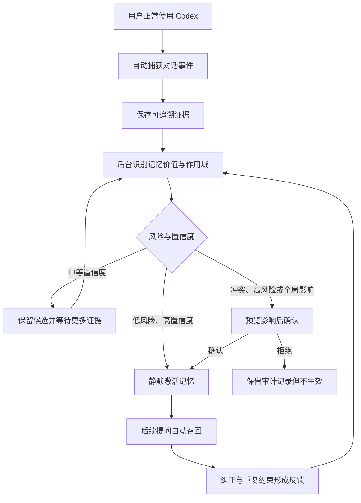

# Codex 无感自动记忆需求

## Summary

为 Codex 建立事件驱动的无感记忆闭环：所有对话自动进入受治理的捕获流程，低风险且高置信度的偏好、纠正、仓库规范和项目决策静默生效，并在后续任务中自动召回。

---

## Problem Frame

当前记忆写入与召回依赖 Codex 主动选择记忆工具。用户需要明确说“请记住”才能提高触发概率，即使触发，也可能只保存原始对话而没有形成后续可用的长期记忆。结果是用户必须承担判断何时保存、如何表达以及何时提醒 Codex 检索的心智负担。

这也让记忆质量受单次模型工具选择影响：同样的偏好或项目决策可能在一次对话中被保存，在另一次对话中被遗漏；已保存的证据若未形成可召回记忆，也无法稳定支持跨对话连续性。

以上流程图用于说明产品行为；正文需求是最终依据。

---

## Actors

- A1. 用户：正常使用 Codex，不需要学习或执行专门的记忆指令。
- A2. Codex：完成用户任务，并消费系统自动提供的相关记忆上下文。
- A3. 记忆运行时：捕获事件、保存证据、形成候选、执行治理并编译召回上下文。
- A4. 记忆操作员：通常也是用户，通过 Workbench 审核高风险变化、查看来源并撤销错误记忆。

---

## Key Flows

- F1. 自动捕获与形成
  - **Trigger:** A1 提交新问题或 A2 完成一轮回答。
  - **Actors:** A1、A2、A3
  - **Steps:** A3 自动接收本轮事件；先保存可追溯证据；后台判断内容类型、未来复用价值、权威性、稳定性、敏感度、冲突风险和作用域；再把合格内容路由到自动激活、候选或审核。
  - **Outcome:** 用户无需说“请记住”，本轮有价值的信息仍进入正确的记忆生命周期。
  - **Covered by:** R1-R9

- F2. 静默自动记忆
  - **Trigger:** 候选属于首版允许的类型，且置信度高、风险低、作用域明确。
  - **Actors:** A3
  - **Steps:** A3 绑定来源证据和作用域；创建受治理的记忆版本；使其进入后续召回范围；在 Workbench 最近记录中提供可审计入口，但不打断当前对话。
  - **Outcome:** 低风险记忆自动生效，同时保留来源和撤销能力。
  - **Covered by:** R5、R8-R11、R16

- F3. 冲突或高风险审核
  - **Trigger:** 新候选与有效记忆冲突，涉及敏感内容，或会改变全局行为规则。
  - **Actors:** A3、A4
  - **Steps:** A3 不直接激活候选；A4 查看变化前后、影响范围和来源；A4 确认后产生新版本，拒绝则候选不进入召回。
  - **Outcome:** 自动化不会绕过权威修订和高影响变更的人工确认。
  - **Covered by:** R6、R9-R11、R16

- F4. 自动召回与反馈
  - **Trigger:** A1 在任意 Codex 对话中提交新问题。
  - **Actors:** A1、A2、A3
  - **Steps:** A3 根据用户、当前工作目录、问题和活跃任务筛选相关记忆；在预算内提供给 A2；A2 正常完成任务；若 A1 重复约束或纠正结果，A3 将其记录为漏记、错记或召回失败信号。
  - **Outcome:** 相关记忆在需要时自然生效，不相关记忆不会污染当前任务。
  - **Covered by:** R12-R16

---

## Requirements

**自动捕获**

- R1. 系统必须覆盖所有 Codex 主对话，并在用户输入和本轮最终结果产生时自动捕获事件；用户不需要使用“请记住”或其他专门句式。
- R2. 自动捕获不得依赖 Codex 是否选择调用记忆 MCP；模型主动调用仍可作为显式控制入口，但不是正常记忆链路的前置条件。
- R3. 捕获阶段只执行快速、可恢复的本地接收，不得等待后台记忆分析完成后才向用户展示 Codex 回答。
- R4. 每份捕获证据必须保留会话、轮次、工作目录、时间、说话者、权威性和来源关联，以支持去重、审计与后续纠正。

**记忆形成与分类**

- R5. 首版允许自动形成的长期记忆仅包括：稳定用户偏好、用户纠正或否定约束、仓库级规范，以及用户已确认的项目决策。
- R6. 临时指令、普通任务进度、完整工具日志、助手推测、未经确认的结论、密钥和敏感内容不得自动成为有效长期记忆；明显秘密在持久化前必须拒绝或脱敏。
- R7. 记忆判断必须同时考虑明确程度、跨会话复用价值、用户权威性、稳定性、重复证据、未来行为影响、敏感风险、冲突风险和临时性，不能只依赖关键词或语义相似度。
- R8. 系统必须区分全局用户作用域与仓库作用域：明确跨项目成立的个人偏好可以进入全局作用域；仓库规范、项目决策和项目限定偏好默认只在对应工作目录生效。

**治理与用户体验**

- R9. 系统必须使用三级处理策略：低风险且高置信度的记忆静默激活；中等置信度内容保留为不参与普通召回的候选；冲突、高风险、敏感或全局行为变化必须在影响预览后由操作员确认。
- R10. 纠正有效记忆时必须创建可追溯的新版本，不得无记录覆盖原内容；被取代的版本必须保留历史关系但退出普通召回。
- R11. 普通自动记忆不得在每轮对话中要求确认或展示冗长提示。Workbench 必须提供“最近自动记住”、来源、作用域、当前状态、影响预览和撤销入口。

**自动召回**

- R12. 每次用户提交新问题时，系统必须自动尝试编译相关记忆上下文，不依赖 Codex 主动搜索记忆。
- R13. 召回必须先执行作用域、权限、状态、有效期、敏感度、来源和撤销状态过滤，再进行相关性排序。
- R14. 注入 Codex 的上下文必须有严格数量与 Token 预算，优先顺序为当前任务、当前仓库、当前主题或场景、全局用户偏好，并能解释每条记忆入选或被排除的原因。

**反馈与审计**

- R15. 用户重复已经表达过的约束必须成为漏记或漏召回信号；用户明确否定或纠正 Codex 时必须成为冲突或错误记忆信号，但这些信号本身不能直接发布高影响记忆。
- R16. 捕获、候选形成、自动激活、人工确认、召回、纠正和撤销都必须产生可追溯记录，使操作员能够回答“记住了什么、为什么记住、在哪里生效、何时被使用”。

---

## Acceptance Examples

- AE1. **Covers R1、R2、R5、R9.** 给定用户从未说“请记住”，当用户说“以后总结本地文章时不要修改文件，先讲核心思路”时，该偏好被识别为高置信度低风险记忆并静默生效。
- AE2. **Covers R5、R8、R12-R14.** 给定用户在仓库 A 确认“本项目统一使用 pnpm”，当用户在仓库 A 开始新对话时，该规范可自动召回；当用户在无关仓库 B 工作时，该规范不进入上下文。
- AE3. **Covers R5、R8-R10.** 给定有效全局偏好是“回答保持简洁”，当用户在单个仓库要求某份教程详细展开时，系统形成仓库或场景限定记忆，而不是无记录覆盖全局偏好。
- AE4. **Covers R6、R9、R13.** 给定对话中出现访问令牌，捕获流程不得将令牌形成或召回为长期记忆，也不得因为其在多轮中重复出现而提高晋升资格。
- AE5. **Covers R6、R7、R9.** 给定助手声称“测试已经通过”但没有用户确认或可信结果证据，该助手表述最多保留为观察证据，不得自动成为项目决策或权威事实。
- AE6. **Covers R9-R11、R16.** 给定新候选会修改全局行为规则，当系统检测到影响范围后，候选保持不生效；只有操作员查看影响预览并确认后才进入召回。
- AE7. **Covers R12-R15.** 给定某条有效仓库规范本应被召回但 Codex 再次违反，用户重复同一约束时，系统记录召回失败反馈，并提高后续诊断和候选修正优先级，而不是静默复制一条相同记忆。
- AE8. **Covers R3.** 给定后台记忆分析暂时不可用，当用户完成一次正常对话时，Codex 回答仍按正常路径返回；捕获任务进入可观察的重试或隔离状态，不阻塞用户。

---

## Success Criteria

- 用户在正常 Codex 使用中无需学习或重复“请记住”句式，即可在后续对话中获得稳定的偏好、纠正、仓库规范和已确认决策召回。
- 在覆盖首版四类记忆的回放集上，所有高置信度、低风险样例都能进入正确作用域；秘密、助手推测和临时指令不能成为有效长期记忆；冲突和高风险样例必须进入审核而非自动激活。
- 同一仓库的跨对话回放能够召回已确认规范和决策；无关仓库回放不会收到这些仓库限定记忆。
- 自动捕获路径的本地接收延迟达到 p95 不高于 100 ms；自动召回准备的本地处理延迟达到 p95 不高于 200 ms，均不包含 Codex 模型生成时间。
- 所有有效记忆和召回结果都能追溯到来源证据、作用域和当前版本；撤销后不再出现在普通召回中。
- 下游规划不需要重新决定记忆类型、自动化边界、作用域规则、三级治理策略、静默交互方式或首版非目标。

---

## Scope Boundaries

- 首版不自动长期保存普通任务进度、完整工具日志和未经确认的失败经验。
- 首版不允许助手推测、临时要求、密钥或敏感内容自动晋升。
- 首版不允许自动发布 Core Memory、系统提示词、技能或全局行为策略。
- 首版不以引入图数据库、向量检索或分布式消息队列为前置条件；这些能力只有在回放评估证明必要时才进入后续范围。
- 首版不要求用户逐条审核低风险记忆，也不在每次回复末尾展示记忆清单。
- 本需求不改变现有权威边界：原始证据、有效记忆、派生投影和任务上下文仍是不同生命周期对象。

---

## Key Decisions

- 事件驱动而非工具驱动：稳定捕获责任属于记忆运行时，不属于 Codex 单次工具选择。
- 平衡模式：通过低风险自动激活、中等置信度候选、高风险人工确认，兼顾漏记与错记成本。
- 首版类型收敛：先解决偏好、纠正、仓库规范和项目决策，不把完整工作日志等同于长期记忆。
- 默认静默：自动记忆应减少用户心智负担，审计和撤销集中在 Workbench。
- 全局捕获、分域生效：覆盖所有 Codex 对话，但仓库内容默认不跨工作目录传播。
- 证据先行：任何长期记忆必须能回到用户原话或可信来源，助手生成内容不能自行获得用户权威性。

---

## Dependencies / Assumptions

- Codex 使用环境能够提供受信任的会话生命周期事件，并允许在用户输入阶段补充相关上下文。
- 记忆运行时能够随 Codex 使用自动就绪；运行时暂时不可用时，Codex 的正常任务路径仍然可用。
- 当前会话转录文件只作为补充证据来源，不能成为唯一稳定集成契约。
- 现有 SQLite 权威存储、不可变修订、作用域治理、审计记录和 Workbench 能力继续作为产品边界。
- 进入规划前必须确认权威源码分支和工作区状态；当前检出的主分支与本地运行产物不能未经核对就被视为同一发布状态。

---

## Outstanding Questions

### Deferred to Planning

- [Affects R1-R4][Needs research] 不同 Codex 使用界面的事件覆盖和恢复语义是否一致，哪些场景需要受控的转录补偿路径？
- [Affects R7、R9][Technical] 如何构造可版本化的记忆判断策略与回放集，使阈值调整可评估、可回滚？
- [Affects R3、R12][Technical] 后台形成、实时召回和运行时故障隔离如何划分资源预算，才能满足延迟目标？
- [Affects R6][Needs research] 本地秘密检测与脱敏需要覆盖哪些凭据类型，同时如何避免把普通代码片段误判为秘密？
