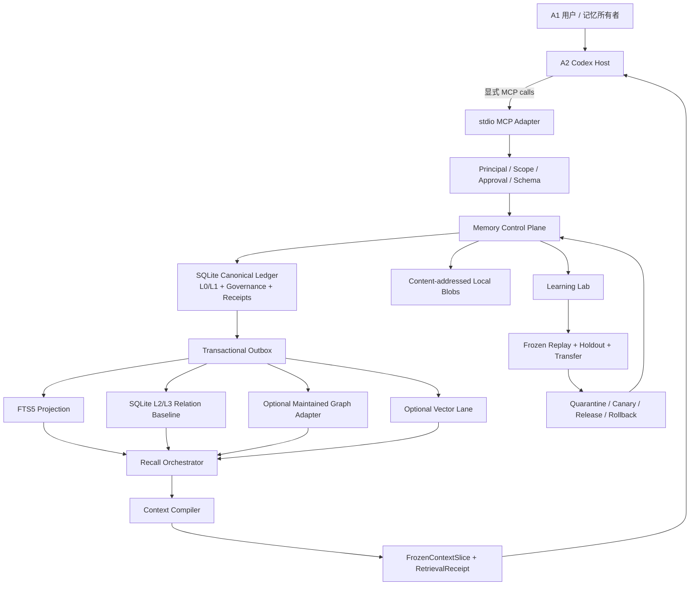
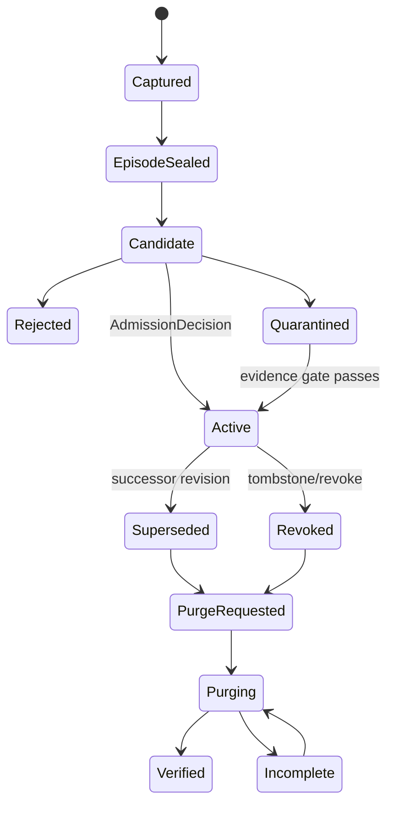
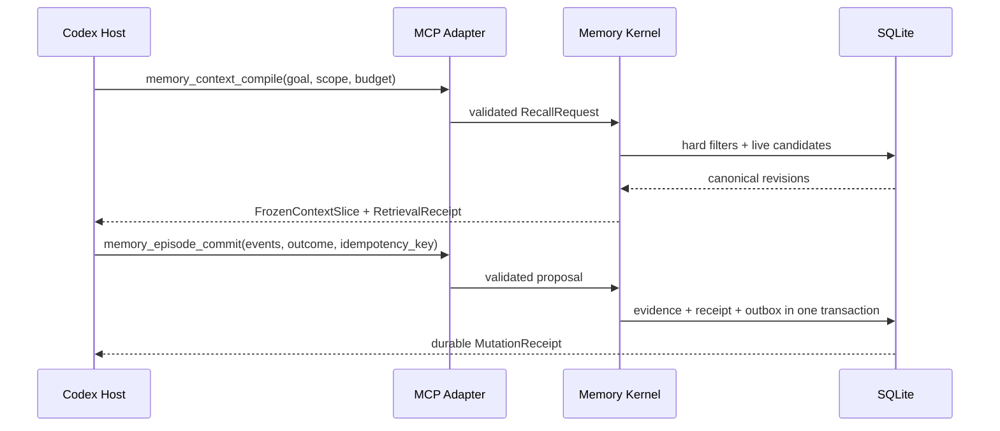
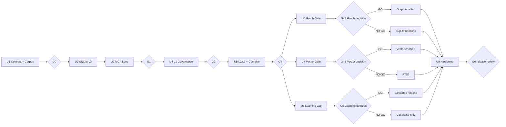

# Agent Memory Runtime - Implementation Plan

## 1. Goal Capsule

- **目标：**为 Codex 规划一个通过本地 MCP 接入、以 SQLite 为权威账本、从 L0 对话证据演进到 L3 高层抽象，并支持可验证自我学习的 Agent Memory Runtime。
- **核心价值：**在不回放全部历史的情况下，让 Codex 获得少量、正确、适用、可追溯的跨会话记忆；用户纠正或删除后，错误不能从摘要、图、索引、缓存或备份中复活。
- **第一交付边界：**单用户、单机、本地 `stdio` MCP、显式 task-start recall 与 task-end commit。
- **权威来源：**
  - Product Contract：`docs/brainstorms/2026-07-28-agent-memory-runtime-requirements.md`
  - 研究：`agent-context-management` 的 `RQ032`–`RQ041`
  - Trellis：`.trellis/tasks/07-28-agent-memory-runtime/`
- **实施状态：**用户已于 2026-07-28 授权实施；Trellis 父任务保持 `planning`，通过里程碑子任务执行，首个子任务为 M0 / G0。
- **停止条件：**任何设计如果让派生图/向量成为事实权威、绕过 MCP/用户授权、削弱作用域或墓碑过滤、允许在线 Agent 直接发布学习结果，必须返回规划阶段。

---

## 2. Product Contract Preservation

本计划不重新定义产品需求。下列 R/F/AE 编号与已确认 Product Contract 保持一致；技术细化使用 `D…` 决策、`U…` 实施单元和 `G…` Gate，避免产生第二套需求编号。

### 2.1 Actors

- **A1 用户 / 记忆所有者：**拥有保存、纠正、删除、固定、降级和学习开关的最终权力。
- **A2 Codex Agent：**请求记忆、消费冻结 Context、提交结果和反馈。
- **A3 Memory Runtime：**维护本地记忆、来源、层级、有效性、版本和回执。
- **A4 评测者：**通过确定性规则、冻结回放、独立 Judge 或用户反馈决定学习候选是否有效。

### 2.2 Product Requirements

#### 本地边界

- **R1：**通过 MCP 向 Codex 提供记忆能力，解耦 Codex 与记忆持久化、召回和学习生命周期。
- **R2：**主要内容保存在本地，并区分本地持久化与送入模型的 Context 数据边界。
- **R3：**第一目标为单个本地开发者，用户是记忆和学习策略的最终权威。

#### 分层与权威

- **R4：**支持对话/工作记忆、主题记忆、场景记忆和高层抽象记忆。
- **R5：**短期与长期体现为可观察生命周期，而不是两个存储位置。
- **R6：**原始证据、确认事实、派生摘要/关系、本轮 Context 和学习候选保持不同事实权威。
- **R7：**长期记忆必须说明来源、时间、适用范围、有效性、冲突、保留原因和推断属性。
- **R8：**上层抽象可追溯到底层证据；图关系不得自动获得更高权威。
- **R9：**向量相似度可作为信号，但不是必需依赖，也不能决定真实性或晋升。

#### 召回与 Context

- **R10：**按当前任务、用户、场景、时间和 Context 预算召回。
- **R11：**召回结果包含来源、层级、状态、选择原因和不确定性。
- **R12：**处理重复、过时、冲突、替代、删除和低权威候选，避免 Context 污染。
- **R13：**明确区分无命中、策略排除和运行故障。

#### 纠正与遗忘

- **R14：**用户能够检查、纠正、替代、删除、固定、降级或禁止使用记忆，并传播到派生物。
- **R15：**修订不得无痕覆盖；保留可解释审计，同时不因审计继续泄露已删除正文。

#### 自我学习

- **R16：**学习从结果、反馈、错误、知识缺口或离线评测产生知识、召回或行为候选，不等于参数训练。
- **R17：**候选经过提出、证据、基线评测、发布/拒绝、监测和回滚。
- **R18：**高影响、低置信、敏感或长期偏好候选发布前需要用户确认；学习可整体暂停。
- **R19：**保存可回放的召回、Context、记忆变更和学习发布记录。
- **R20：**离线评测覆盖连续性、召回、污染、冲突、删除不复活、学习收益和回滚安全。

### 2.3 Product Flows

| Flow | 目标行为 | 主要实施单元 |
| --- | --- | --- |
| F1 捕获并形成候选 | 证据先持久化，候选经过类型、范围、敏感性、冲突和准入判断 | U2、U4 |
| F2 跨会话召回 | 治理过滤后多路召回，编译受预算约束的冻结 Context | U3、U5–U7 |
| F3 纠正、遗忘与传播 | 立即撤销旧权威，传播到所有派生物并验证残留 | U4、U6、U7、U9 |
| F4 学习与晋升 | 形成最小候选，与基线配对评测，隔离、灰度、发布或回滚 | U8、U9 |

### 2.4 Acceptance Examples

| AE | 验收重点 | Gate |
| --- | --- | --- |
| AE1 | 稳定偏好跨会话召回，附来源、范围和原因 | G1、G3 |
| AE2 | 冲突状态按当前有效版本召回，并显式保留替代关系 | G2、G3 |
| AE3 | 没有向量库也能按场景、时间和权威受控召回 | G3、G4B |
| AE4 | 底层纠正/删除后，摘要和图关系不能复活旧事实 | G2、G4A、G6 |
| AE5 | 无命中、策略拒绝和运行故障具有不同状态 | G1 |
| AE6 | 单场景获益但跨场景回归的学习候选不得发布 | G5 |
| AE7 | 关闭学习不影响普通记忆读取和授权写入 | G5、G6 |
| AE8 | 用户能删除本地敏感内容并禁止其进入未来 Context | G2、G6 |

### 2.5 Scope Boundaries

#### Deferred

- 自动监听 Codex 生命周期的 Host Adapter。
- 通过数据证明必要后再引入专用向量索引。
- 多设备同步、远程备份和跨主机合并。
- 主动式长期陪伴行为。
- 模型微调、强化学习和参数级持续训练。
- 无人审批的高影响长期策略发布。

#### Outside product identity

- 团队/企业共享知识库、权限平台和组织级知识图谱。
- 永久保存全部历史并全文检索的聊天归档。
- 通用文档 RAG、搜索引擎或向量数据库平台。
- 云服务为中心的个人记忆 SaaS。
- 不可解释、不可纠正、由 Agent 自己担任最终权威的自治人格。

---

## 3. Research-to-Plan Decisions

### 3.1 Technical Decisions

- **D1 — TypeScript workspace：**规划采用 TypeScript monorepo；U1 冻结 Node LTS、包管理器、module format 和稳定 MCP SDK，禁止基于 alpha/main-only API 开工。
- **D2 — SQLite authority：**SQLite 保存 L0/L1、逻辑身份、不可变 revision、scope、validity、authority、tombstone、release pointer、idempotency 和 receipts。
- **D3 — Local blobs：**大工具结果和文件正文进入 content-addressed blobs；SQLite 保存 hash、来源、大小、敏感性、状态和 purge inventory。
- **D4 — Explicit MCP lifecycle：**第一版只承诺显式 `memory_context_compile` 与 `memory_episode_commit`，不宣称自动观察未发送的对话。
- **D5 — Single writer + outbox：**权威 mutation、指针变更、outbox job 和 durable receipt 在同一事务提交；同步 SQLite driver 隔离到 storage worker。
- **D6 — Governance before relevance：**scope、ACL、status、valid time、sensitivity、lineage 和 tombstone 在 lexical/graph/vector 排序前后都要验证。
- **D7 — Immutable correction：**纠正产生 successor revision 和即时 suppression；删除先 tombstone，再通过可重试 Purge Saga 清理派生物。
- **D8 — Frozen Context：**每次编译固定 item 顺序、来源、排除原因、token 估算、compiler/projection version 和 hash，发出后不可变。
- **D9 — SQLite graph baseline：**L2/L3 先落 relation revision 与 recursive CTE，作为图引擎对照组和降级路径。
- **D10 — Graph is optional projection：**独立图后端只承载 L2/L3 结构投影；所有结果回查 SQLite；Kùzu 因上游归档和 Graphiti 弃用不得作为默认候选。
- **D11 — Independent vector gate：**向量只解决预先声明的 semantic gap，与图 Gate 分离；不采用也是完成状态。
- **D12 — External learning release：**在线 Agent 只记录 trace 和产生 candidate；评测、quarantine、canary、release 和 rollback 在独立控制面完成。
- **D13 — Safe degradation：**图、向量、学习或派生索引故障不得改变权威状态；回退到 SQLite/FTS 或 read-only。
- **D14 — Version every persistent contract：**MCP schema、SQLite migration、projection epoch、compiler version、embedding epoch 和 learning release 分别版本化。
- **D15 — Principal binding：**MCP 进程绑定配置中的本地 principal 和 allowed scopes；payload 的 actor/scope 只是待验证声明。
- **D16 — User-control overlays：**pin、demote、Context usage block、revoke、delete 和 learning pause 是不同操作；pin 不提高事实权威，暂停学习不停止普通记忆读取。

### 3.2 Reference Project Mechanism Map

| 项目 | 采用/适配 | 不照搬 |
| --- | --- | --- |
| Mem0 | L1 候选抽取、hash 去重、history、semantic/BM25/entity 多路候选 | 不把抽取结果或向量搜索直接当权威；补齐 L0→L3、版本、准入和学习 Gate |
| Graphiti | episode provenance、双时间事实、冲突失效、node/edge/episode/community 多范围召回 | 不把图作为第一阶段事实源；不采用已弃用的 Kùzu 路径 |
| TencentDB Agent Memory | L0/L1 本地持久化、append-only JSONL、L2 scene、L3 persona、FTS5/vector RRF、备份恢复 | LLM 不得直接写最终 persona；补上 authority、lineage、revision、撤销传播和 receipts |
| Hermes Agent | provider/MCP 边界、next-turn prefetch、context fencing、单写队列、pending approval | 小型常驻 `MEMORY.md` 不作为主存；审批不能代替效果评测 |
| Mastra | resource/thread scope、working memory、Context Processor、durable snapshot、eval runner | 不把应用 snapshot 或 provider cache混同为长期记忆权威 |

### 3.3 Evaluation Arms

同一 case 固定目标、历史、工具/模型版本、随机配置、Context budget、reader 和 expected evidence，运行：

1. `no_memory`
2. `transcript/current`
3. `fts_recency`
4. `layered`
5. `layered_graph`
6. `candidate_learning`

图只比较 `layered` 与 `layered_graph`；学习同时比较 `no_candidate/current/candidate`。指标保持分维 Pareto frontier，不压缩成可掩盖安全失败的总分。

---

## 4. Target Architecture

### 4.1 Authority and Component Topology



### 4.2 Memory Coordinates

| Dimension | Planned values |
| --- | --- |
| Abstraction | L0 Evidence → L1 MemoryAtom → L2 Topic/Scenario/Relation → L3 CoreProjection |
| Lifecycle | working, candidate, active, superseded, revoked, quarantined, purged |
| Kind | episodic, semantic, procedural |
| Scope | thread, topic, scenario, user, workspace, agent |
| Time | valid time + system/transaction time |
| Authority | user-stated, observed, tool-result, inferred, derived, imported |
| Sensitivity | public/local-sensitive/restricted plus Context eligibility |

### 4.3 Mutation and Projection Lifecycle



### 4.4 Explicit Codex Protocol



### 4.5 Planned Workspace Boundaries

```text
apps/memo-graph-cli/
packages/contracts/
packages/mcp-server/
packages/memory-kernel/
packages/storage-sqlite/
packages/context-compiler/
packages/graph-projection/
packages/vector-retrieval/       # only if G4B opens
packages/learning-lab/
packages/observability/
migrations/
fixtures/replay/
tests/{contract,storage,integration,replay,governance,recovery,security}/
docs/{adr,contracts,evaluations,plans,runbooks}/
```

---

## 5. Detailed Roadmap



### U1. Contracts, threat model and frozen replay

- **Covers:** R1–R20; F1–F4; prepares AE1–AE8.
- **Dependencies:** none.
- **Outputs:** workspace decision ADRs, versioned artifact/MCP/receipt contracts, threat model, corpus manifest, workload envelope, graph/vector scorecards, local-principal contract.
- **Approach:**
  1. Pin supported runtime, SDK, SQLite driver and serialization rules.
  2. Define Evidence, Episode, MemoryObject/Revision, AdmissionDecision, RelationRevision, ContextSlice and all receipt types.
  3. Freeze public benchmark mappings and local correction/deletion/privacy/failure/learning fixtures.
  4. Separate calibration, holdout and transfer ownership.
  5. Freeze numeric Gate thresholds only after repeat-run baseline measurement.
- **First failing tests:** canonical serialization, invalid-state rejection, idempotency envelope, holdout isolation, fixture hash stability.
- **Exit:** G0.
- **Hold:** do not create production migrations or handlers while contract or corpus authority is unresolved.

### U2. Canonical SQLite ledger, blobs and outbox

- **Covers:** R2–R7, R14–R15, R19; F1/F3; AE8.
- **Dependencies:** U1.
- **Outputs:** L0 evidence ledger, episode sealing, content-addressed blob inventory, FTS5 projection, idempotency records, durable receipts, transactional outbox.
- **Approach:** WAL on a local filesystem, foreign keys, bounded busy handling, single serialized writer, dedicated storage worker when the driver is synchronous.
- **First failing tests:** crash after commit/before response, duplicate idempotency key, writer concurrency, unsafe data root, FTS rebuild, redacted logs.
- **Exit contribution:** G1 storage half.
- **Rollback:** read-only mode; never continue to governed L1 if evidence durability is uncertain.

### U3. Local stdio MCP and explicit Codex loop

- **Covers:** R1–R3, R10–R13, R19; F2; AE1/AE5.
- **Dependencies:** U1–U2.
- **Outputs:** read-only resources/tools, proposal tools, important/destructive mutation classes, context compile, episode commit, receipt lookup, degraded status.
- **Approach:** versioned schemas; configured principal binding; no hidden write side effects; distinct `NO_MATCH`, `POLICY_EXCLUDED`, `DEGRADED` and `FAILED` outcomes.
- **First failing tests:** task-start → use → commit → later-session recall; read-only tools cause zero mutation; unauthorized scope rejected before search; retry returns same receipt.
- **Exit:** G1.
- **Rollback:** disable writes and return explicit degraded/read-only status.

### U4. Versioned L1 admission, correction and purge

- **Covers:** R4–R8, R12, R14–R15; F1/F3; AE2/AE4/AE8.
- **Dependencies:** U2–U3.
- **Outputs:** candidate extraction, admission/quarantine, logical identity, immutable revisions, compare-and-swap pointer, conflict groups, suppression overlay, pin/demote/usage-block/revoke controls, tombstones, Purge Saga.
- **Approach:** evidence first; inferred profiles/procedures require higher admission thresholds; no destructive upsert; all projection consumers receive invalidation events.
- **First failing tests:** concurrent successor conflict, persisted prompt injection quarantine, immediate correction suppression, pin does not override authority/expiry, usage block excludes Context, partial purge debt, stale backup cannot serve tombstoned content.
- **Exit:** G2.
- **Rollback:** freeze admission and serve only L0 or last verified L1 revisions.

### U5. L2/L3 projections and governed Context Compiler

- **Covers:** R4–R13, R14, R19–R20; F2/F3; AE1–AE5.
- **Dependencies:** U4.
- **Outputs:** TopicProjection, ScenarioPattern, temporal/causal/procedural RelationRevision, CoreProjection, SQLite adjacency, multi-lane recall, conflict presentation, token packer, frozen Context.
- **Approach:** derive with lineage/transform version; hard-filter first; retrieve recent/topic/scenario/core/relation lanes; rank by utility and diversity; preserve governing constraints before redundant summaries.
- **First failing tests:** exact token boundary, cross-scope pollution, contradictory facts, descendant invalidation, deterministic relation rebuild, scenario transfer.
- **Exit:** G3.
- **Rollback:** disable the failing lane or projection and retain the last passing compiler.

### U6. Graph projection adoption decision

- **Covers:** R8, R12, R14, R19–R20; F2/F3; AE4.
- **Dependencies:** U5.
- **Outputs:** `GraphStore` port, maintained-candidate scorecard, read-only adapter spike, projector/rebuilder, graph lane, adoption or rejection receipt.
- **Approach:** prefilter in SQLite; project versioned L2/L3 nodes/edges through outbox; revalidate traversal results; compare only declared structural cases against SQLite adjacency.
- **First failing tests:** projection hash rebuild, graph outage fallback, temporal/multi-hop gain, correction and purge propagation, no cross-scope/tombstone result.
- **Exit:** G4A.
- **Rollback:** feature flag off; SQLite relation baseline remains complete. A No-Go decision completes U6.

### U7. Optional vector retrieval decision

- **Covers:** R9–R13, R19–R20; F2; AE3.
- **Dependencies:** U5.
- **Outputs:** declared semantic-gap subset, optional vector port, embedding epoch, FTS/vector/hybrid comparison, adoption or rejection receipt.
- **Approach:** choose model/index only after the gap is frozen; use identical governance filters and Context budget; prove invalidation, purge, rebuild, disk and privacy behavior.
- **First failing tests:** semantic-gap paired replay, epoch rebuild, tombstone removal, disabled-lane equivalence.
- **Exit:** G4B.
- **Rollback:** FTS5 + recency + relations. A No-Go decision completes U7.

### U8. Learning trace, evaluation, release and rollback

- **Covers:** R16–R20; F4; AE6/AE7.
- **Dependencies:** U5; consumes U6/U7 decision receipts for final release configuration but may build candidate-only mechanics in parallel.
- **Outputs:** LearningTrace, failure/success pattern, minimal CandidateChange, three-arm evaluator, learning pause/resume frontier, quarantine, canary, release pointer, monitor and rollback.
- **Approach:** prefer Memory correction/addition, then compiler/scenario/prompt, then Skill; protect holdout; block critical regressions; stop on repeated no-gain/overfit/missing evidence.
- **First failing tests:** candidate cannot mutate release pointer, holdout regression blocks release, exact rollback, learning-off leaves ordinary memory intact.
- **Exit:** G5.
- **Rollback:** retain trace collection and candidate-only mode; failed learning does not block the core memory runtime.

### U9. Operational hardening and release evidence

- **Covers:** all R/F/AE.
- **Dependencies:** U2–U8 decisions complete; optional lanes may be rejected.
- **Outputs:** backup manifests, restore/migration, WAL/disk controls, doctor/rebuild/purge-audit, redacted metrics, fault-injection suite, runbooks and release evidence bundle.
- **Approach:** carry schema/tombstone/release/projection frontiers through backup and restore; inject failures at every canonical/outbox/projection/purge/release boundary.
- **First failing tests:** stale backup, interrupted migration, projection corruption, disk pressure, partial purge, graph/vector outage, sensitive-log inspection.
- **Exit:** G6.
- **Rollback:** remain local experimental; independently disable graph, vector and learning release.

---

## 6. Gate Contract

### 6.1 Shared Gate Axes

Every Gate reports six independent axes:

1. correctness;
2. retrieval/task quality;
3. governance;
4. recovery;
5. cost/latency;
6. privacy.

Gate evidence records tested commit, dependency lock hash, schema version, compiler/projection/embedding/release epochs, corpus hashes, pass/fail/quarantine cases and remaining debt.

### 6.2 Stage Gates

| Gate | Go condition | Hard No-Go / fallback |
| --- | --- | --- |
| G0 Contract | Contracts, threat model, corpus, workload and thresholds reviewed | unresolved authority, lifecycle or corpus leakage → remain planning |
| G1 Local loop | task-start recall → commit → later-session recall; idempotent receipts; distinct result states | duplicate effects, cross-scope recall or unverifiable receipt → read-only |
| G2 Governance | correct/forget/purge and stale-backup fixtures show zero resurrection | any unauthorized/tombstoned recall → freeze admission |
| G3 Layered Context | layered arm improves evidence utility/task success within budget and SLO | pollution, token overflow or non-rebuildable projection → last passing compiler |
| G4A Graph | paired structural gain plus provenance/rebuild/purge/fallback/operations | no gain or any governance/recovery regression → SQLite relations |
| G4B Vector | declared semantic-gap gain with invalidation/privacy/rebuild/cost proof | no justified gain → FTS5 |
| G5 Learning | candidate beats current on calibration, holdout and transfer with exact rollback | critical regression or overfit → quarantine/candidate-only |
| G6 Release | final dependency lock passes recovery, security and exercised runbooks | unresolved P0/P1 integrity/privacy/deletion/rollback issue → experimental |

### 6.3 Zero-Tolerance Invariants

- One idempotency key produces one canonical effect.
- Every model-visible item resolves to a live canonical revision and evidence root.
- Unauthorized, revoked, quarantined, superseded or tombstoned content never enters default Context.
- No Context exceeds its budget or changes after issuance.
- No purge is complete until every known derivative has an explicit verified outcome.
- No optional lane can weaken hard filters or become a startup/correction dependency.
- No learning candidate changes production without evaluation, authority, canary and rollback evidence.
- Restore cannot move behind tombstone, schema, projection or release frontiers.

### 6.4 Recorded Gate Status

This table is append-only status evidence; it does not rewrite the historical
gate decisions.

| Gate | Current status | Tested implementation | Decision |
| --- | --- | --- | --- |
| G3 Layered Context | `GO` after H3 remediation on 2026-07-29 | `6224f782c86712488d416d8101ef7c9fa477c0ae` | `docs/evaluations/g3r-h3-decision.md` |
| G4A Graph | `NO-GO` on 2026-07-29; SQLite adjacency retained | `36421f5cd75007a1421d3e0594e7881dd4b864b2` | `docs/evaluations/g4a-decision.md` |
| G4B Vector | `NO-GO` on 2026-07-29; FTS5/layered/SQLite relations retained | `3eec7119b1e441d76523d0a57c328d4d811a4af3` | `docs/evaluations/g4b-decision.md` |
| G5 Learning | `GO` on 2026-07-30 for the exact local synthetic release path; automatic publication remains disabled | `91d810efe17632e64f5e9a3ddae81f8e9f0b9985` | `docs/evaluations/g5-decision.md` |

G3R GO made M4A, M4B, and M5 eligible for separate Trellis workflows. G4A
completed with `NO-GO`; it retains SQLite adjacency and does not enable the
graph lane. M4B independently completed with `NO-GO`; it retains
FTS5/recency/layered projections and SQLite relations and does not enable the
vector lane. M5 completed with a verifier-backed `GO` for one exact-scope,
narrow-only retrieval-policy release and its exact rollback to the base
pointer. Learning remains candidate-only by default, every publication still
requires exact authority, and the decision binds both prior optional-lane
receipts. G5 is local synthetic evidence only and does not establish M6
production readiness.

---

## 7. Requirement Traceability

| Requirement | Units | Primary evidence |
| --- | --- | --- |
| R1 | U1, U3 | G0/G1 MCP contracts |
| R2 | U1, U2, U9 | threat model, local data and privacy evidence |
| R3 | U1, U3, U4, U8 | principal, approval and release receipts |
| R4 | U4, U5 | layer/coordinate contracts and projection tests |
| R5 | U4, U5 | lifecycle state transitions |
| R6 | U1, U2, U5, U8 | distinct artifact schemas and authority |
| R7 | U4, U5 | lineage, validity, scope and admission |
| R8 | U5, U6 | drill-down and graph projection rebuild |
| R9 | U5, U7 | vector-independent baseline and G4B |
| R10 | U3, U5 | RecallRequest and token budgets |
| R11 | U3, U5 | RetrievalReceipt and ContextSlice |
| R12 | U4–U7 | hard filters, conflict and pollution tests |
| R13 | U3 | typed no-match/excluded/degraded/failed results |
| R14 | U4, U6, U7, U9 | correction/purge propagation |
| R15 | U2, U4, U9 | immutable revision and protected audit |
| R16 | U8 | LearningTrace and CandidateChange |
| R17 | U8 | evaluation/release state machine |
| R18 | U3, U8 | authority and learning-off behavior |
| R19 | U2–U9 | receipts, hashes and replay |
| R20 | U1, U5–U9 | frozen replay and G0–G6 |

---

## 8. Future Execution Checklist

### Before task activation

- [ ] Review Product Contract and this R/F/AE → U/G mapping.
- [x] Confirm Trellis parent remains `planning` after the fresh implementation request.
- [x] Create the M0 child task after implementation approval.
- [ ] Ensure each child task has one owner, explicit files, dependencies, first failing tests, Gate and rollback.
- [x] Revalidate current MCP SDK, Node, SQLite and maintained graph candidates at M4A implementation time.

### Before each implementation batch

- [ ] Read the Product Contract, relevant design section and research handoff.
- [ ] Confirm the previous Gate evidence is current for the same dependency lock.
- [ ] Write or freeze the failing contract/replay case before feature behavior.
- [ ] Keep canonical mutation changes separate from unrelated retrieval optimization.
- [ ] Define degraded behavior before enabling an optional subsystem.

### Before each Gate

- [ ] Run correctness, quality, governance, recovery, efficiency and privacy suites independently.
- [ ] Record included/excluded cases, versions, hashes and unresolved debt.
- [ ] Verify correction, deletion and scope outcomes across every new store.
- [ ] Compare against the last accepted baseline on identical frozen cases.
- [x] Produce an explicit `GO`, `NO-GO`, `HOLD` or `FALLBACK` decision for G4A.
- [x] Produce an explicit `GO`, `NO-GO`, `HOLD` or `FALLBACK` decision for G4B.

### Before release review

- [ ] Exercise, not merely write, backup/restore, corruption, purge and degraded-mode runbooks.
- [ ] Prove graph/vector/learning can each be disabled independently.
- [ ] Verify sensitive content is absent from logs and default diagnostics.
- [ ] Re-run all accepted Gate evidence on the final lock/schema/epochs.
- [ ] Remove abandoned adapters, temporary fixtures and dead experimental paths.

---

## 9. Testing Scope

### In scope

- schema/serialization/MCP contracts;
- SQLite transaction, concurrency, idempotency and crash recovery;
- admission, revision, conflict, correction, revocation and purge;
- recall hard filters, lane ranking, token packing and receipt explanations;
- graph/vector paired replay, rebuild, invalidation and fallback;
- learning holdout, negative transfer, canary and exact rollback;
- backup, restore, migrations, disk/WAL pressure, permissions and log redaction.

### Out of scope

- automatic Codex Host Adapter behavior;
- cloud synchronization and multi-user isolation;
- production graph/vector vendor selection before G4A/G4B;
- model fine-tuning or reinforcement learning;
- unrelated UI, dashboard and enterprise administration.

---

## 10. Trellis Delivery Strategy

The current Trellis task is the planning parent. It must not be started as one giant coding task. After separate implementation approval, create reviewable child tasks:

| Future child | Scope | Parent Gate |
| --- | --- | --- |
| M0 | U1 contracts/corpus | G0 |
| M1A | U2 storage | G1 |
| M1B | U3 MCP loop | G1 |
| M2 | U4 governance | G2 |
| M3 | U5 layered compiler | G3 |
| M4A | U6 graph decision | G4A |
| M4B | U7 vector decision | G4B |
| M5 | U8 learning | G5 |
| M6 | U9 operations/release | G6 |

No child is created or activated by this planning deliverable.

---

## 11. Definition of Done

### Planning Done

- Product Contract R1–R20, F1–F4 and AE1–AE8 map to implementation units and gates.
- Research conclusions RQ032–RQ041 are transferred into explicit decisions and open U1 choices.
- Roadmap, dependencies, files/modules, first failing tests, gates, fallback and stop conditions are documented.
- Graph and vector are independent, optional, evidence-gated lanes.
- Self-learning remains candidate-only until independent evaluation and reversible release pass.
- Trellis artifacts agree with this plan and the task remains `planning`.
- Markdown structure, Mermaid syntax, numbering, internal links, scope and dependency consistency are reviewed.

### Future Implementation Done

- G0–G6 pass on the final dependency lock and schema.
- AE1–AE8 pass with evidence.
- SQLite remains authoritative; every projection is traceable and rebuildable.
- Explicit Codex MCP lifecycle, correction, purge and learning rollback are exercised end to end.
- No unresolved P0/P1 integrity, privacy, deletion, authorization or rollback issue remains.
- Final status is derived from runtime and Gate evidence, never from checked boxes in this plan.

---

## 12. Planning Review Record

### Coherence review

- Passed after restoring Product Contract R1–R20 as the only requirement numbering.
- Passed after making U1–U9 sequential and splitting G4A graph from G4B vector.
- Passed after adding the missing G5 branch to the dependency graph.
- Passed after adding user pin/demote/usage-block/revoke and learning pause/resume controls required by R14/R18.

### Feasibility review

- The first vertical slice needs only local TypeScript, SQLite/FTS5, blobs and stdio MCP.
- Graph, vector and learning release cannot block the canonical memory loop.
- Volatile implementation choices—SDK, driver, graph vendor, embedding and numeric SLO—remain explicit U1/G4 decisions.
- Every asynchronous projection has a canonical outbox, rebuild and degraded fallback.

### Scope review

- No product source, tests, migration, package manifest or runtime database was created.
- Host automation, cloud sync, multi-user tenancy, parameter training and enterprise knowledge graph remain outside this plan.
- Trellis status remains `planning`; no task activation or implementation child task was created.

### Artifact validation

- Markdown heading/fence structure and sequential section numbering passed.
- R1–R20, F1–F4, AE1–AE8, U1–U9 and all Gate identifiers passed structural checks.
- Trellis `implement.jsonl` and `check.jsonl` passed native validation without truncation warnings.
- `task.json` parsed successfully and related planning files exist.
- These checks establish planning consistency only; they provide no runtime correctness or production-readiness evidence.
