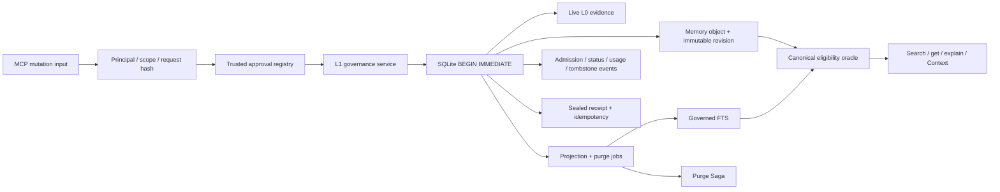
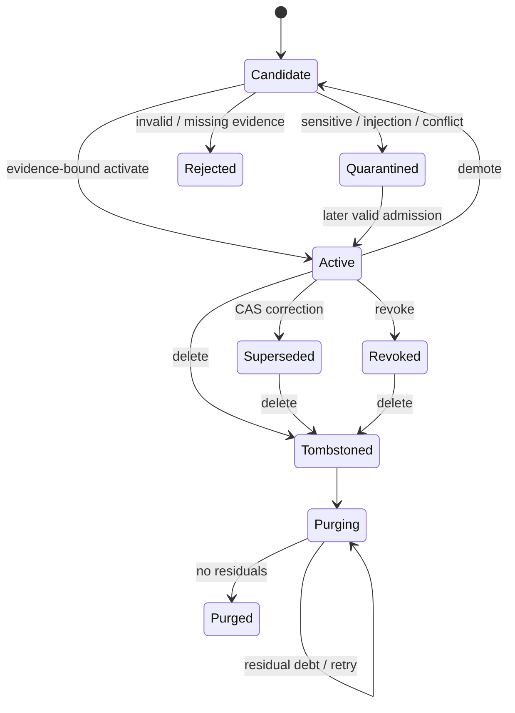
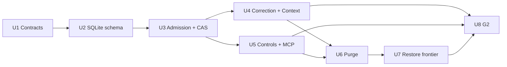

# Versioned L1 Governance and No-Resurrection

## 1. Goal Capsule

M2 turns the durable L0/MCP baseline into a governed L1 memory system. It adds
evidence-bound admission, stable logical identity, immutable revisions,
compare-and-swap correction, explicit user controls, tombstone-first deletion,
and a verifiable Purge Saga while preserving SQLite as the sole authority.

The milestone closes only when G2 proves that an unauthorized, expired,
superseded, revoked, usage-blocked, or tombstoned revision cannot enter default
recall or a new Context slice, including after projection lag, retry, purge
failure, process restart, and stale-backup restore.

### Success definition

- Every active L1 revision resolves to live L0 evidence and a persisted
  `AdmissionDecision`.
- Concurrent corrections cannot silently overwrite one another.
- Correction and revocation suppress the prior value synchronously.
- Pin, demote, usage block, revoke, and delete retain distinct semantics.
- Important/destructive mutations require server-verified, request-bound,
  single-use approval; MCP annotations and payload claims are never authority.
- Delete makes content unavailable immediately, then reports complete purge or
  explicit residual debt.
- A backup behind the trusted tombstone frontier cannot restore service.

### Scope boundary

This plan implements M2 only. L2/L3 projections, graph and vector adoption,
learning evaluation/release, and the M6 operational distribution of frontiers
remain outside scope. M2 may add projection-neutral invalidation jobs and the
trusted-frontier API that those later milestones consume.

## 2. Requirements

The Product Contract remains the only requirements authority. This milestone
directly realizes R2, R3, R5-R8, R11-R15, R19-R20; it exercises F1 and F3 and
enforces AE2, AE4, and AE8.

### Functional requirements

- **R2/R3:** Keep all governance state local, bind every operation to the
  configured principal and allowed scopes, and preserve the user's authority
  over important/destructive changes.
- **R5-R8:** Model L1 as observable lifecycle plus immutable lineage, not a
  second store or an untraceable summary.
- **R11-R13:** Explain inclusion/exclusion with revision, status, lineage, and
  stable reason codes; preserve the existing no-match/excluded/degraded/failed
  distinctions.
- **R14/R15:** Implement correction, pin, demote, Context usage block, revoke,
  and delete without history rewrite or deleted-plaintext leakage.
- **R19/R20:** Seal mutation/purge receipts, bind idempotency to canonical
  request hashes, and close G2 with frozen replay, recovery, security, and
  residual-audit evidence.

### G2 acceptance contract

G2 is `GO` only if the tested commit proves all of the following:

1. active L1 requires live evidence and an activation decision;
2. two successors from the same expected revision produce one success and one
   `STALE_REVISION`, never a lost update;
3. correction removes the predecessor from recall/Context before async
   projection cleanup;
4. pin does not override validity, revoke, authority, conflict, or usage rules;
5. scoped and global usage blocks prevent prohibited Context inclusion;
6. prompt-injection-like procedural candidates cannot become active/core;
7. exclusive deletion has no stale resurrection in canonical rows, FTS,
   Context, blobs, export/cache inventory, or restore fixtures;
8. shared lineage remains tombstoned while reporting incomplete purge debt;
9. duplicate correction/delete requests return the same effect and receipt;
10. backup tombstone epoch below the required frontier fails closed.

Any failure produces `HOLD`: freeze new L1 admission and continue with L0 or
the last verified read-only L1 state.

## 3. Context and Research

### Existing repository mechanisms to extend

- `StorageDatabase.commitEpisode` already demonstrates request-hash
  idempotency, `BEGIN IMMEDIATE`, epoch advance, receipt persistence, and
  outbox insertion in one transaction.
- `SqliteStorageClient` already serializes writes through a dedicated worker
  and validates every worker response at the protocol boundary.
- `FtsIndex` is a rebuildable projection and therefore must consume delete and
  correction invalidations rather than become a governance authority.
- `recordRecall` already freezes append-only Context and retrieval evidence;
  M2 must stop new invalid items and record invalidation/redaction overlays
  without pretending old immutable receipts never existed.
- Backup/restore already verifies SQLite and blob hashes but lacks a
  tombstone frontier outside the restored snapshot.

### Research decisions carried forward

- Candidate admission is deterministic and evidence-bound.
- Stable `memory_id` and immutable `revision_id` are separate identities.
- Pointer advancement uses semantic CAS even with a single writer.
- Online suppression is synchronous; projection cleanup is asynchronous.
- Deletion is tombstone first and purge second.
- Shared evidence/blob references create honest residual debt.
- Restore compares the backup frontier with a trusted minimum supplied outside
  the snapshot.
- MCP annotations describe tools but never authorize them.

Primary claim/evidence mappings and archived source text live in
`.trellis/tasks/07-28-agent-memory-runtime-m2/research/`.

## 4. Key Technical Decisions

### D1. One authority, two artifact levels

L0 evidence remains append-only source evidence. L1 adds governed logical
objects and revisions inside the same SQLite authority. Admission never copies
trust from the candidate payload; it derives the maximum allowed decision from
persisted evidence, principal/scope, sensitivity, inference, conflict, and
injection classification.

Rejected alternative: a separate candidate database or graph authority. It
would split transaction boundaries and make correction/deletion verification
depend on cross-store consensus.

### D2. Deterministic admission matrix

| Evidence condition | Maximum outcome |
| --- | --- |
| Live user-stated, allowed scope, non-secret, no injection signal | `activate` |
| Verified but inferred/derived or confirmation pending | `candidate_only` |
| Sensitive, low-authority, injection-like procedure, unresolved conflict | `quarantine` |
| Missing/deleted evidence, forbidden scope, invalid payload, replay hash mismatch | `reject` |

Exact normalized duplicates reuse the current logical object/revision. The same
logical key with different content opens a conflict group and cannot
destructively upsert the active pointer.

### D3. Immutable revisions plus explicit CAS

`memory_id` is stable across correction; `revision_id` is immutable. A
successor names its exact predecessor. The canonical transaction:

1. rechecks idempotency and request hash;
2. validates the expected current revision;
3. appends the successor and its admission/status events;
4. synchronously suppresses the predecessor;
5. conditionally advances the pointer and requires one changed row;
6. appends invalidation jobs and a sealed receipt.

A stale expected revision returns `STALE_REVISION`. Retrying an identical
idempotency key replays the original receipt; changing the request under that
key returns `CONFLICT`.

### D4. Append-only audit with purge redaction overlays

Normal lifecycle changes are append-only events. Authorized purge is the
explicit exception for plaintext/blob-reference removal: revision identity,
hash, lineage identifiers, receipt, tombstone, and purge audit remain, while
governed plaintext and unshared blob references are scrubbed. A forward
migration replaces the unconditional no-update triggers on payload-bearing L0
evidence and Context rows with a narrow purge guard: the same transaction must
name a live purge job for the tombstoned target, may only null/redact content
fields, and must append the before-hash/after-redaction receipt. Lifecycle,
identity, original content hash, lineage, and sealed receipt fields remain
immutable. Current reads materialize canonical state from the active pointer
plus latest status, suppression, usage, and purge overlays.

This preserves R15 auditability without retaining deleted model-visible
content. A historical Context hash remains the identity of the originally
issued slice, but after an authorized purge the API returns its redaction
receipt rather than replaying deleted plaintext. The plan does not claim that
immutable historical backups predating a delete are physically rewritten;
instead, trusted frontier checks prevent them from serving.

### D5. A projection-neutral eligibility oracle

Every read lane, including FTS and future graph/vector adapters, must resolve a
candidate through one canonical eligibility oracle immediately before
selection. The oracle checks principal, exact scope, live evidence, current
revision, validity window, lifecycle, suppression, conflict, sensitivity,
usage rule, and tombstone epoch.

Projection cleanup may lag without allowing stale use. FTS gains governed L1
upsert/delete jobs and rebuilds only from eligible canonical revisions.

### D6. Separate user controls

- **Pin:** protects an otherwise eligible memory from normal decay/eviction.
- **Demote:** lowers lifecycle/selection while preserving evidence and history.
- **Usage block:** excludes one memory from one Context scope or all
  model-visible Context while retaining local inspection.
- **Revoke:** immediate default-recall/Context hard filter; no claim of
  physical deletion.
- **Delete:** commits tombstone and purge work; never waits for cleanup before
  suppressing online use.

No control silently upgrades authority, extends validity, resolves a conflict,
or rewrites evidence.

### D7. Trusted, single-use approval registry

Important/destructive MCP inputs carry only an `approval_id`. The runtime
resolves that identifier through a trusted approval registry configured
outside model-controlled tool input. The approval artifact is bound to
principal, exact scope set, tool, canonical request hash, expiry, and one-time
consumption. The same approval cannot authorize a changed request or a second
effect.

The local stdio server reads approval artifacts from a user-controlled local
manifest/registry; it rejects relative paths, symlinks, unexpected ownership,
group/world-writable permissions, schema/hash mismatch, and changes between
verification and consumption. The manifest digest and approval consumption
are recorded with the mutation transaction. The existing
`destructive_tools_enabled=false` posture remains the default; M2 widens the
configuration contract from a literal `false` to an explicit boolean so a
local operator can enable delete, but enablement never replaces approval.
Tests inject the same verifier port deterministically.

Authorization order is deliberate:

1. validate principal, scope, tool, and canonical request hash;
2. if the idempotency key already committed that same hash, replay its receipt
   without requiring an unused approval;
3. if the key exists with another hash, return `CONFLICT`;
4. for a new effect, verify and atomically consume the approval with the
   canonical mutation.

A dry run does not consume approval or change canonical memory state, but
records a content-free audit receipt with a `DRY_RUN` warning. Therefore
effect-bearing important/destructive mutations require approval, while their
non-effecting previews do not.

Rejected alternative: accepting `approved=true` or an unsigned approval
object in the MCP payload. An LLM could fabricate either.

### D8. Tombstone-first Purge Saga

Delete first increments a monotonic `tombstone_epoch`, marks the logical
memory unavailable, and appends invalidation/purge jobs in the canonical
transaction. The retryable Saga audits:

1. L1 revision and candidate plaintext;
2. conflict materializations;
3. governed FTS rows and stale segments;
4. Context item visibility/redaction overlays;
5. export/cache inventory;
6. content-addressed blobs and live reference counts;
7. backup/frontier inventory;
8. projection outbox consumers.

Each attempt appends a `PurgeReceipt`. `completed=true` requires no residual
content hash and every registered store to report a verified outcome. Shared
live references remain explicit residual debt; the target memory remains
tombstoned regardless.

The local purge profile enables SQLite secure deletion for canonical tables,
uses the FTS5 secure-delete/rebuild path for governed L1 FTS, and runs
compaction only inside the isolated local data root after the Saga has
verified no active references. Logical deletion alone never satisfies the
residual audit.

### D9. Trusted tombstone frontier at restore

Backup evidence includes the snapshot's `tombstone_epoch`. Restore requires a
trusted minimum from outside the snapshot. If the backup is behind, restore
fails before publishing the target data root with
`STALE_TOMBSTONE_FRONTIER`. A passing restore still runs migrations,
integrity verification, blob verification, eligibility audit, and purge
residual checks before rename.

M2 proves this API and fixture. M6 will distribute and operate frontiers across
real backup lifecycles.

## 5. High-Level Technical Design



### Lifecycle



`Pin` and Context usage rules are overlays, not lifecycle transitions.
`Tombstoned` is an internal online state represented by tombstone events;
external artifact lifecycle remains compatible with the existing `purged`
contract.

### Read path

```text
projection candidates
  -> exact principal/scope join
  -> current revision lookup
  -> live evidence + admission check
  -> lifecycle/validity/suppression/tombstone check
  -> Context usage policy
  -> rank and budget
  -> revalidate canonical revision
  -> freeze Context + receipt
```

No ranking score or pin flag can bypass a failed earlier step.

## 6. Implementation Units

### U1. Governance contracts and failing contract tests

- **Covers:** R3, R5-R8, R11-R15, R19; F1/F3; AE2/AE4/AE8.
- **Files:** `packages/contracts/src/{common,memory,mcp,tool-inputs,receipts,index}.ts`;
  `tests/contract/governance.contract.test.ts`;
  `tests/helpers/governance-examples.ts`.
- **Approach:** Extend existing schemas with candidate proposal/admission,
  correction/control/delete inputs, trusted approval references, lifecycle
  events, purge attempts, governed L0/L1 lookup/search unions, and typed
  error/status outcomes. Keep current M1B inputs backward compatible.
- **Test scenarios:**
  - valid active revision requires non-empty live evidence and admission;
  - purged revision contains no content reference;
  - expected revision, dry-run, approval ID, and safety class are enforced;
  - invalid pin/expiry authority combinations cannot be represented;
  - complete purge rejects residual hashes;
  - canonical serialization and receipt hash replay stay stable.
- **Observable exit:** contracts reject every impossible G2 state before
  storage or MCP handlers receive it.

### U2. SQLite governance schema and repository boundary

- **Covers:** R2, R5-R8, R14-R15, R19; F1/F3.
- **Files:** `migrations/0004-l1-governance.sql`,
  `migrations/0005-tombstone-purge.sql`;
  `packages/storage-sqlite/src/{protocol,database,client,storage-worker,index}.ts`;
  new `governance-repository.ts` and `purge-repository.ts`;
  `tests/storage/governance-schema.integration.test.ts`.
- **Approach:** Add strict tables for candidates, logical objects, immutable
  revisions, evidence lineage, admissions, conflicts, status/suppression,
  pin/usage overlays, approvals consumed, tombstones, purge attempts, store
  inventory, purge receipt access scopes, purge-redaction guards, and
  invalidation jobs. Keep SQL ownership in storage and expose runtime-decoded
  worker operations.
- **Test scenarios:**
  - migrations are forward-only and hash-verified;
  - revision rows and admission/status events reject update/delete;
  - current pointer can change only through the governed transaction;
  - tombstone epoch is monotonic;
  - shared evidence/blob reference counts are deterministic;
  - schema/count health remains valid after restart.
- **Observable exit:** the database can represent every required state without
  a second authority or mutable-history shortcut.

### U3. Admission, identity, conflict, and CAS orchestration

- **Covers:** R5-R8, R12, R14-R15, R19; F1; AE2/AE4.
- **Files:** new `packages/memory-kernel/src/governance.ts`;
  `packages/memory-kernel/src/index.ts`;
  storage governance modules from U2;
  `tests/governance/admission.integration.test.ts`;
  `tests/governance/revision-cas.integration.test.ts`.
- **Approach:** Normalize a logical key deterministically, evaluate the frozen
  admission matrix from persisted evidence, reuse exact duplicates, create
  conflict groups for divergent content, and perform revision CAS in one
  transaction.
- **Test scenarios:**
  - live user-stated non-sensitive evidence activates;
  - inferred or derived evidence remains candidate-only;
  - injection-like procedural content quarantines;
  - missing/deleted/foreign-scope evidence rejects;
  - exact replay returns the same revision/receipt;
  - same-hash replay succeeds after approval consumption, while a changed
    request under the key conflicts;
  - two concurrent successors yield one success and one stale revision;
  - divergent normalized-key content creates conflict without pointer change.
- **Observable exit:** every active revision has live lineage and a persisted
  activation decision; no lost update is possible.

### U4. Correction, eligibility oracle, and governed Context

- **Covers:** R7, R10-R15, R19-R20; F1/F3; AE2/AE4.
- **Files:** `packages/memory-kernel/src/{governance,index}.ts`;
  `packages/context-compiler/src/index.ts`;
  `packages/storage-sqlite/src/{fts-index,protocol,database}.ts`;
  `tests/governance/correction.integration.test.ts`;
  `tests/mcp/context-compiler.test.ts`.
- **Approach:** Extend Context candidates to carry governed L1 revisions,
  centralize eligibility before and after projection ranking, and make
  correction synchronously suppress the predecessor while projection cleanup
  travels through outbox.
- **Test scenarios:**
  - predecessor is absent from search and new Context immediately after
    correction but before outbox drain;
  - an FTS stale hit fails canonical revalidation;
  - expired, superseded, quarantined, revoked, tombstoned, and conflicted
    revisions are excluded with stable reasons;
  - a valid active L1 item preserves evidence lineage and budget accounting;
  - frozen old Context remains auditable but cannot be reissued as current.
- **Observable exit:** canonical eligibility dominates every model-visible
  path and correction has no projection-lag resurrection window.

### U5. User controls, approval, and MCP mutation parity

- **Covers:** R3, R11-R15, R18-R19; F3; AE2/AE4/AE8.
- **Files:** `packages/contracts/src/tool-inputs.ts`;
  `packages/memory-kernel/src/governance.ts`;
  new `packages/mcp-server/src/mutations.ts`;
  `packages/mcp-server/src/{index,cli}.ts`;
  `tests/mcp/governance-mutations.integration.test.ts`;
  `tests/security/mutation-authorization.test.ts`.
- **Approach:** Register propose/correct/pin/demote/usage-set/revoke/delete
  tools using the frozen safety map. Verify all authority server-side against
  a trusted approval registry. Keep dry-run and replay behavior explicit and
  enforce manifest path/owner/mode/digest checks. Preserve destructive tools
  disabled by default and require both explicit local enablement and approval
  for a new delete effect.
- **Test scenarios:**
  - MCP annotations match contract safety classes but cannot grant authority;
  - missing, expired, reused, wrong-scope, wrong-tool, or wrong-request-hash
    approval fails before mutation;
  - delete remains unavailable under the default local server configuration;
  - symlinked, group/world-writable, owner-mismatched, or changed approval
    manifests fail closed;
  - a committed same-hash idempotent retry replays after the approval is
    consumed;
  - dry-run preserves canonical epoch/current pointer and approval usability;
  - pin cannot bypass expiry/revoke/usage block;
  - scoped/global usage block excludes only the intended Context surfaces;
  - demote, revoke, and delete remain semantically distinct;
  - direct runtime and MCP paths return equivalent governed receipts.
- **Observable exit:** every user-visible mutation has agent-native MCP parity
  without an LLM-controlled approval shortcut.

### U6. Tombstone, Purge Saga, and residual audit

- **Covers:** R2, R12, R14-R15, R19-R20; F3; AE2/AE8.
- **Files:** new `packages/memory-kernel/src/purge.ts`;
  `packages/storage-sqlite/src/{purge-repository,fts-index,blob-store,database,protocol}.ts`;
  `tests/governance/purge.integration.test.ts`;
  `tests/recovery/purge-retry.recovery.test.ts`;
  `tests/security/deleted-content-residual.test.ts`.
- **Approach:** Tombstone synchronously, then retry per-store purge steps with
  immutable attempt receipts. Scrub unshared L1 plaintext, remove governed FTS
  rows, use the guarded content-only scrub for exclusive L0/Context payloads,
  audit export/cache inventory, delete unreferenced blobs, and preserve
  shared-reference debt.
- **Test scenarios:**
  - exclusive delete produces no canonical/FTS/Context/blob/export residual;
  - shared lineage stays unavailable and reports named residual hashes/stores;
  - crash between tombstone and purge resumes the same job;
  - duplicate delete returns the same mutation effect/receipt;
  - completed purge cannot be forged while any store is unchecked;
  - FTS rebuild after delete cannot resurrect content;
  - unauthorized updates still trip append-only triggers;
  - SQLite and FTS secure-delete plus compaction policy is exercised in the
    isolated test data root.
- **Observable exit:** deletion is immediately safe and physically honest,
  whether purge completes or remains debt.

### U7. Backup/restore tombstone frontier

- **Covers:** R14-R15, R19-R20; F3; AE8.
- **Files:** `packages/storage-sqlite/src/{database,protocol,restore,index}.ts`;
  `tests/recovery/stale-tombstone-restore.recovery.test.ts`;
  `tests/storage/fts-and-backup.integration.test.ts`.
- **Approach:** Put tombstone epoch in backup evidence and require restore to
  receive an external trusted minimum. Keep staging unpublished until all
  integrity, migration, blob, eligibility, and purge-residual checks pass.
- **Test scenarios:**
  - backup at/above the minimum restores;
  - backup below the minimum returns
    `STALE_TOMBSTONE_FRONTIER` and publishes no target;
  - a pre-delete backup cannot reintroduce deleted content;
  - corrupted frontier or manifest fails closed;
  - failed restore cleans staging and leaves the destination absent.
- **Observable exit:** rollback to a pre-tombstone service state is
  mechanically impossible through the public restore path.

### U8. End-to-end G2 evidence and operational handoff

- **Covers:** all M2 requirements; F1/F3; AE2/AE4/AE8.
- **Files:** `tests/integration/l1-governance-loop.integration.test.ts`;
  `tests/replay/governance-replay.test.ts`;
  `docs/contracts/mcp-tools.md`;
  `docs/operations/memory-governance.md`;
  `docs/evaluations/g2-decision.md`;
  root/package scripts as needed.
- **Approach:** Run the frozen G2 matrix on the same commit and lock, capture
  schema/migration/fixture hashes, test counts, residual audits, stale-restore
  evidence, performance envelope, and explicit `GO`/`HOLD`.
- **Test scenarios:**
  - propose → activate/quarantine → recall → correct → block/revoke/delete →
    restart → replay;
  - fault injection across transaction response loss, outbox lag, purge crash,
    FTS rebuild, and restore;
  - security corpus for prompt injection, scope escalation, approval forgery,
    and sensitive log leakage;
  - full M0/M1/G1 regression plus lint, typecheck, build, frozen install, and
    dependency audit.
- **Observable exit:** `docs/evaluations/g2-decision.md` contains complete,
  current evidence and the milestone has one defensible decision.

## 7. Dependency Order



Contracts and failing tests lead each unit. U4 and U5 may proceed as separate
code batches only after U3's storage transaction semantics are stable. G2
evidence is generated only from the final integrated commit.

## 8. System-Wide Impact

### Interfaces

- Existing M1B read/proposal tools remain valid.
- New important/destructive MCP tools use the already frozen tool names and
  safety classes.
- `memory_get` and `memory_explain` gain a backward-compatible, mutually
  exclusive L0 `evidence_id` or L1 `memory_id` selector. `memory_search`
  returns a versioned governed-item union that identifies abstraction,
  memory/revision identity, lineage, and exclusion reasons.
- Receipt lookup adds purge receipts and their exact principal/scope access
  bindings without weakening existing mutation/retrieval lookup.
- Storage worker protocol expands but remains runtime-decoded and single
  writer.
- Context compiler accepts governed L1 candidates while preserving L0
  fallback behavior and hard token budgets.
- Backup result becomes versioned with tombstone frontier evidence; restore
  callers must supply a trusted minimum.

### Data lifecycle

- L0 evidence remains append-only unless an authorized purge can remove an
  exclusive payload while retaining hash/audit metadata.
- L1 revisions are immutable in normal operation; purge may null content under
  explicit tombstone authority.
- Context artifacts remain audit records. A redaction/eligibility overlay
  prevents deleted body reuse without silently rewriting receipt history.
- FTS and future projections are rebuildable and never decide eligibility.

### Failure propagation

- Storage/CAS/idempotency failures map to typed governed errors.
- Projection lag maps to degraded or filtered results, never stale inclusion.
- Purge failure leaves the memory tombstoned and returns residual debt.
- Approval failure has no side effect.
- Stale restore leaves the target unpublished.

### Compatibility

- No migration is edited in place.
- Current evidence/episode/receipt hashes stay valid.
- Existing explicit L0 loop remains the safe fallback and regression baseline.
- Optional graph/vector/learning packages are not introduced.

## 9. Risks and Mitigations

| Risk | Mitigation and evidence |
| --- | --- |
| L1 state spread across ad hoc SQL | Dedicated storage repositories, strict schemas, worker protocol decoding, transaction tests |
| Single writer mistaken for semantic concurrency control | Explicit expected-revision CAS and two-writer fixture |
| Projection lag resurrects corrected/deleted content | Canonical eligibility before selection and post-hit revalidation |
| Approval fabricated by model | Trusted external registry, request-hash binding, expiry, one-time consumption |
| Valid retry rejected after approval consumption | Replay matching idempotency before verifying a new approval; changed hash still conflicts |
| Approval manifest swapped or weakened locally | Absolute non-symlink path, owner/mode checks, digest binding, transaction-recorded consumption |
| “Immutable” audit leaks deleted plaintext | Purge redaction overlay removes content but retains identity/hash/receipt |
| Append-only triggers block required redaction | Forward migration installs a narrow purge-job guard permitting content-only scrub with audit receipt |
| Shared content deleted unsafely | Reference counts plus incomplete purge debt |
| FTS remnants survive logical delete | Governed delete jobs, rebuild-from-live, secure-delete residual test |
| Old backup restores forgotten content | External minimum tombstone frontier and unpublished staging |
| Scope expands into M3/M6 | Projection-neutral outbox/frontier API only; no L2/L3 or operational distributor |
| G2 evidence becomes incomparable | Freeze fixtures and record tested commit, lock, schema, migration, and fixture hashes |

## 10. Assumptions

- The trusted minimum tombstone frontier is supplied by the local operator or
  host outside the restored snapshot. Durable fleet-wide distribution belongs
  to M6.
- Shared L0 evidence or blobs may prevent physical removal; this is reported
  as residual debt while the target L1 memory remains unavailable.
- The trusted approval registry is writable only through an out-of-band local
  user action, not through MCP model tools. M2 provides the verifier boundary
  and local manifest adapter; richer UI belongs to later integration work.
- Existing `MemoryRevisionSchema` already permits `content=null` only for
  purged revisions, so purge redaction can preserve contract compatibility.
- A same-hash idempotent retry is authenticated by the original committed
  principal/scope/request binding and does not require a second approval.

## 11. Open Questions

### Resolved during planning

- **Separate ledger?** No; extend the SQLite authority.
- **Blind upsert on conflict?** No; create a conflict group.
- **Can pin override policy?** No.
- **Can purge wait before hiding content?** No; tombstone is synchronous.
- **Can an old backup restore if internally consistent?** Not when it is behind
  the trusted tombstone frontier.

### Deferred without blocking M2

- Durable replication/rotation of tombstone frontiers across backup media:
  M6.
- L2/L3 descendant invalidation implementations: M3; M2 emits
  projection-neutral invalidation jobs.
- Graph/vector-specific residual auditors: M4A/M4B, if their gates are `GO`.
- Human approval UI integration beyond the local manifest/verifier boundary:
  future host integration; it cannot weaken M2 server-side verification.

## 12. Documentation and Gate Evidence

M2 updates the MCP contract and writes a user/operator guide covering
admission decisions, controls, approval artifacts, purge debt, retries, and
restore frontiers. `docs/evaluations/g2-decision.md` records:

- tested implementation commit and dependency lock hash; the evidence-only
  commit may follow but must not change executable code or frozen fixtures;
- contract/schema/migration/fixture hashes;
- per-suite test counts and performance envelope;
- concurrency/idempotency outcomes;
- injection/authorization/privacy outcomes;
- complete and incomplete purge receipts;
- stale-backup rejection evidence;
- remaining debt;
- explicit `GO`, `HOLD`, or `FALLBACK`.

## 13. Sources and References

- Product Contract:
  `docs/brainstorms/2026-07-28-agent-memory-runtime-requirements.md`
- Parent roadmap:
  `docs/plans/2026-07-28-001-feat-agent-memory-runtime-plan.md`
- M2 research handoff:
  `.trellis/tasks/07-28-agent-memory-runtime-m2/research/research-handoff.md`
- Existing architecture:
  `.trellis/tasks/07-28-agent-memory-runtime/design.md`
- SQLite transaction, PRAGMA, FTS5, and backup primary evidence:
  archived under
  `.trellis/tasks/07-28-agent-memory-runtime-m2/research-workspace/research/m2-versioned-l1-governance/evidence/web/`
- MCP trust/safety and OWASP prompt-injection evidence:
  archived in the same research run.
