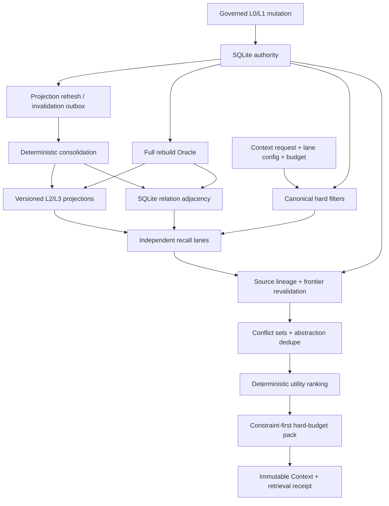
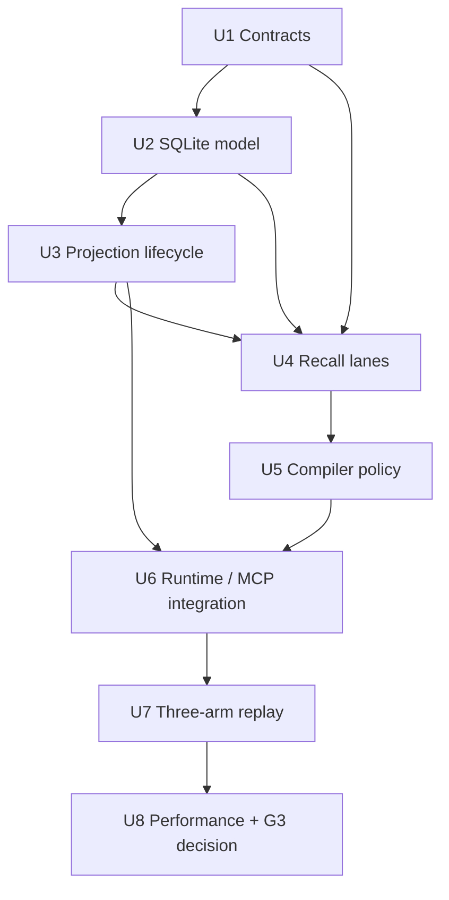
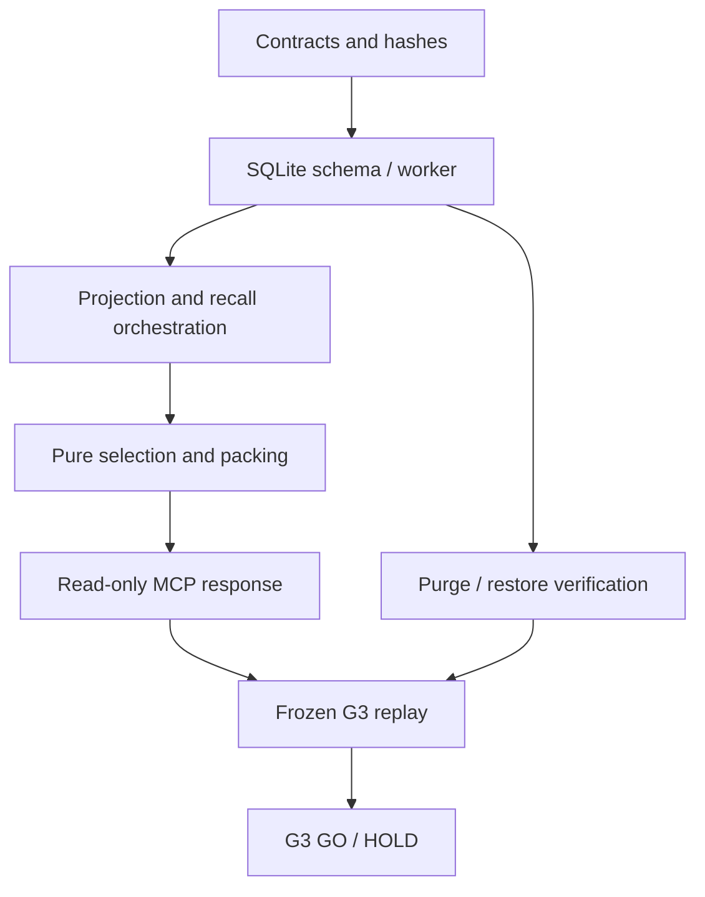

# Layered Projections and Governed Context Compiler

## Summary

M3 extends the accepted SQLite-authoritative L0/L1 runtime with deterministic,
lineage-bound topic, scenario/procedural, core, and relation projections. A
multi-lane compiler will revalidate every candidate against canonical state,
preserve conflicts and governing constraints, and seal an explainable Context
within a hard token budget before G3 compares it with two lower-layer controls.

---

## Problem Frame

The G2 runtime safely recalls individual L0 evidence and governed L1 revisions,
but flat retrieval spends tokens on repeated details and cannot explicitly
represent cross-session topics, reusable scenarios, procedures, or bounded
relations. Adding those abstractions creates a new integrity risk: a stale or
deleted source can survive through a summary or edge unless every derived
candidate is traceable, invalidatable, and rechecked before Context issuance.

The origin requirements define the product behavior. This plan defines how to
implement it without making projections, ranking scores, or future graph/vector
stores authoritative.

---

## Assumptions

*This plan was authored under the user's continuous-execution instruction
without synchronous M3 plan confirmation. These are reviewable implementation
bets, not new Product Contract requirements.*

- M3 uses immutable forward migrations `0008` through `0010`: layered storage,
  derived-payload purge redaction, and projection-lineage Context redaction.
  Existing migrations remain untouched.
- Projection transforms are deterministic and fixture-driven for G3. Model
  generation quality and autonomous projection publication are not required.
- Projection semantics and orchestration belong in `memory-kernel`; SQLite
  transactions and queries belong in `storage-sqlite`; `context-compiler`
  remains a pure, no-I/O policy and packing package.
- G3 adds a projection/evaluation overlay that references the frozen replay
  corpus and its hashes. It will not edit the M0 corpus bodies or manifest.
- Each implementation unit is an atomic delivery task and receives its own
  commit after focused verification.
- The frozen Expected-profile compiler targets remain authoritative. If the
  environment cannot produce valid Expected-profile evidence, G3 records
  `HOLD` instead of weakening the target.

---

## Requirements

The parent Product Contract remains the sole R-number authority. This plan
directly implements R4, R7–R15, and R19–R20.

- **R4/R7:** Add typed, immutable Topic, Scenario/Procedure, Relation, and Core
  projection revisions with exact source lineage, transform identity, scope,
  authority, sensitivity, validity, and projection frontier.
- **R8/R14/R15:** Keep relation and higher-layer state rebuildable from SQLite;
  synchronously suppress descendants after any canonical lifecycle or deletion
  change; prevent deleted plaintext from surviving through projections,
  receipts, Context, backups, or rebuild.
- **R10/R11:** Apply principal, exact scope, lifecycle, validity, sensitivity,
  lineage, tombstone, and frontier filters before relevance ranking; expose
  recent/L1, topic, scenario/procedure, core, and SQLite-relation lanes as
  independently observable and disableable.
- **R12/R13:** Preserve conflicts with provenance, rank deterministically by
  utility and diversity, prioritize governing constraints before redundant
  abstractions, and distinguish no match, policy exclusion, and named lane
  degradation.
- **R19:** Freeze request and projection frontiers, lane configuration,
  ordered inclusions/exclusions, scores, token estimates, versions, and hashes
  in immutable Context and retrieval artifacts.
- **R20:** Run the accepted-M2, M3-no-projection, and M3-layered arms over
  identical frozen cases and budgets. Any safety, budget, rebuild, holdout,
  transfer, latency, or disk regression produces `HOLD`.

**Origin actors:** A1 local user/operator, A2 Codex memory client, A3 projection
and compiler runtime.

**Origin flows:** F1 derived projection lifecycle, F2 layered Context
compilation, F3 failure/disablement/rebuild.

**Origin acceptance examples:** AE1 stable repetition compression, AE2
conflict plus correction invalidation, AE3 scenario pollution rejection, AE4
delete without descendant resurrection, AE5 named lane degradation.

---

## Scope Boundaries

- No graph database, graph adapter, or G4A product selection.
- No embedding model, vector index, semantic-gap claim, or G4B selection.
- No LearningTrace, candidate evaluation, canary, release, or rollback.
- No automatic episode-to-L1 extraction or model-generated authority.
- No remote transport, cloud synchronization, multi-user identity, or M6
  operational distribution of frontiers.
- No ordinary lifecycle change rewrites historical L0/L1 evidence or already
  issued Context slices. The existing guarded purge path remains the sole
  exception: it may replace prohibited plaintext with canonical redaction
  markers while retaining tombstone/hash/audit evidence.
- No unrelated package cleanup or broad rewrite of the accepted M2 runtime.

### Deferred to Follow-Up Work

- **M4A:** compare maintained graph products with SQLite adjacency and allow an
  explicit No-Go.
- **M4B:** compare vector retrieval with FTS on declared semantic-gap cases and
  allow an explicit No-Go.
- **M5:** add candidate-only learning, three-arm evaluation, canary, release,
  and rollback.
- **M6:** harden durable cross-process frontiers, recovery runbooks, and
  production operations.

---

## Context & Research

### Relevant Code and Patterns

- `packages/contracts/src/memory.ts` already reserves L2/L3 abstraction levels,
  lower-revision lineage, transforms, and versioned relations.
- `packages/contracts/src/mcp.ts`, `receipts.ts`, and `tool-inputs.ts` own the
  public Context, receipt, request, status, and hash contracts.
- `packages/storage-sqlite/src/fts-index.ts` demonstrates a derived outbox
  consumer and canonical-source rebuild.
- `packages/storage-sqlite/src/governed-memory-reader.ts` is the canonical L1
  eligibility oracle that every projection result must reuse.
- `packages/storage-sqlite/src/database.ts`, `client.ts`, `protocol.ts`, and
  `storage-worker.ts` form the only allowed SQLite boundary.
- `packages/memory-kernel/src/index.ts` already orchestrates L0/L1 retrieval,
  authorization, degraded lanes, audit, and Context persistence.
- `packages/context-compiler/src/index.ts` already implements deterministic
  candidate ordering, L0-under-L1 dedupe, hard budgets, immutable slice hashes,
  and retrieval receipts.
- `tests/helpers/replay-corpus.ts` enforces frozen partition isolation and
  content hashes.
- `docs/evaluations/performance-envelope.md` freezes Small and Expected
  projection, relation, token, and latency profiles.

### Institutional Learnings

- No repository-local `docs/solutions/` entries exist for this scope.
- Trellis backend specs require contracts first, one storage-driver owner,
  runtime-decoded worker operations, canonical revalidation after every
  derived lookup, content-free diagnostics, and full contract/integration/
  recovery/security evidence.
- Cross-layer guidance requires one typed payload owner and exact source
  revision pointers rather than a second cursor or local payload casts.

### External References

- [MemGPT](https://research.memgpt.ai/) supports tiered durable memory plus a
  bounded model context.
- [Generative Agents](https://arxiv.org/abs/2304.03442) supports higher-level
  synthesis and component ablation while leaving governance to this design.
- [DBSP](https://link.springer.com/article/10.1007/s00778-025-00922-y) grounds
  incremental view maintenance and full-rebuild equivalence.
- [Mem0](https://arxiv.org/html/2504.19413v1) supplies comparison patterns for
  extraction/update/retrieval and full-context baselines.
- [LongMemEval](https://arxiv.org/html/2410.10813v1) supplies extraction,
  cross-session, temporal, update, and abstention capability axes.
- [Lost in the Middle](https://aclanthology.org/2024.tacl-1.9/) establishes
  that more or longer Context does not guarantee better use.

---

## Key Technical Decisions

### D1. Four typed views over one canonical ledger

Topic, Scenario/Procedure, Relation, and Core receive distinct schemas because
they answer different retrieval questions. They share one projection revision
envelope and exact lower-layer source links. No derived payload can raise the
authority, widen the scope, relax sensitivity, or extend validity of its
required ancestors. A single untyped summary payload was rejected because it
would make type-specific validation, retrieval intent, purge inspection, and
ablation attribution ambiguous. Separate canonical stores were also rejected:
all four views must remain disposable products of the L0/L1 ledger.

### D2. Multi-dimensional frontiers

Projection and Context evidence freeze schema version, canonical ledger epoch,
tombstone epoch, projection epoch, transform version, and compiler version.
Projection lag is observable but never treated as eligibility. A request can
use only candidates whose source lineage revalidates at its canonical frontier.
A single projection cursor was rejected because it cannot distinguish a fresh
derived write from a concurrent canonical revoke or tombstone. The additional
frontier fields cost receipt bytes but make replay and stale-state exclusion
falsifiable.

### D3. Kernel-owned projection policy, storage-owned effects

`memory-kernel` defines deterministic consolidation and lane orchestration.
`storage-sqlite` exposes decoded claim/apply/fail/rebuild/query operations and
owns short transactions. The kernel never imports the SQLite driver, and the
compiler never performs I/O. Putting policy in SQL was rejected because it
would duplicate Product Contract semantics across queries; allowing the
compiler to fetch its own candidates was rejected because purity, deterministic
replay, and the M3-no-projection control would become harder to prove.

### D4. Synchronous suppression, asynchronous rebuild

Admission, correction, demotion, usage rules, revoke, and tombstone effects
enqueue projection refresh/invalidation work in their canonical transactions.
Even before that work drains, every lane candidate passes canonical ancestor
revalidation. Cleanup or rebuild may lag; safety may not.

Blocking each canonical mutation on full projection rebuild was rejected
because projection cost and worker failure would expand the mutation failure
surface. Purely asynchronous invalidation was also rejected because stale
derived rows could remain model-visible. The chosen split makes eligibility
synchronous through the canonical frontier while leaving physical convergence
retryable.

### D5. Incremental state is accepted only when equal to full rebuild

Projection identity derives from type, principal, exact scope, sorted source
revision identities, transform identity/version, and normalized output. The
same source frontier and transform configuration must produce identical live
projection revisions, lineage, relations, hashes, and compiler order whether
processed incrementally or rebuilt.

Database row equality alone is insufficient because insertion order and
surrogate keys may legitimately differ. The Oracle therefore compares the
canonical structural export: logical identities, immutable content hashes,
exact lineage, typed adjacency, live status, and deterministic compiler order.

### D6. Compiler stages remain explicit

The compiler executes hard filters, lane retrieval, canonical revalidation,
conflict grouping, lineage-aware dedupe, deterministic scoring, hard-budget
packing, and receipt sealing in that order. Scores never override an exclusion.
Conflict, precondition, exception, failure, recovery, and policy boundaries
are retained before redundant summaries.

One blended relevance score and unconstrained top-k packing were rejected.
They make a high-scoring abstraction capable of displacing a low-frequency
governing boundary and make pollution regressions difficult to attribute.

### D7. Lane disablement is a first-class compatibility contract

`recent_l1`, `topic`, `scenario_procedure`, `core`, and `relation_sqlite`
record enabled state, duration, candidate/eligible/selected counts, and
degradation. Disabling all projection lanes in the M3 binary must reproduce the
safe M2 behavior. Failure in one optional lane must not fail startup, mutation,
delete, or lower-layer Context.

This is also the runtime rollback mechanism for M3. It is preferred to a
down-migration because schema rollback would be unsafe after immutable
projection receipts exist; a disabled derived plane preserves evidence while
returning behavior to the accepted lower-layer control.

The operator-owned runtime policy defines which lanes are permitted plus
maximum candidates, relation depth/fan-out, and concurrent lane work. An MCP
request may disable permitted lanes or lower those bounds, but it cannot enable
a lane or raise a bound denied by runtime policy. The effective configuration
is the intersection and is frozen in the receipt.

### D8. G3 overlays the frozen corpus

G3 metadata references each immutable M0 case hash and adds projection seeds,
required evidence units, task rubric, pollution rubric, lane configuration,
and budgets in a separate versioned overlay. Calibration can guide thresholds;
holdout and transfer remain evaluation-only.

Editing the base replay corpus was rejected even when an M3 case needs more
structure: doing so would invalidate the M0–M2 evidence chain and allow the
candidate system to redefine its own baseline.

### D9. G3 requires attributable net value

Arm A is the accepted M2 implementation, Arm B is the M3 binary with projection
lanes disabled, and Arm C is the layered compiler. C must show at least one
strict designated improvement, no aggregate or partition regression, and zero
governance/budget/rebuild violations. Leave-one-lane-out runs attribute value
without creating another adoption arm.

An A-versus-C comparison alone was rejected because compiler refactoring and
projection value would be confounded. Aggregate-only acceptance was rejected
because a mean gain can hide holdout, transfer, privacy, or rare-boundary
regressions.

Arm A runs the exact G2-tested commit recorded in
`docs/evaluations/g2-decision.md` in an isolated runtime checkout. Arms B and C
run the frozen M3 candidate commit. A versioned JSON evaluation protocol feeds
all arms the same canonical evidence/L1 seeds, request, partition, and budget;
M3-only projection seeds are ignored by A/B and enabled only for C. The
evaluator rejects a mixed commit, lockfile, base-case hash, request, or budget
before comparing results.

---

## Resolved and Deferred Questions

### Resolved During Planning

- **Where does projection policy live?** In `memory-kernel`; storage owns
  persistence and the compiler stays pure.
- **How is the frozen corpus extended?** With a hash-bound G3 overlay rather
  than edits to the M0 corpus.
- **What is the graph-free relation baseline?** Typed SQLite adjacency with
  bounded traversal and post-query canonical revalidation.
- **What is the rebuild Oracle?** Exact live structure, lineage, hashes,
  adjacency, and ordering equality at one frozen frontier/configuration.
- **How is compiler rewrite gain separated from projection gain?** The
  M3-no-projection control arm.

### Deferred to Implementation

- Exact helper and internal method names may change to keep modules small.
- If migration `0008` exceeds a reviewable boundary, a new forward `0009`
  migration may complete the same planned schema without editing `0008`.
- The exact deterministic projection fixture vocabulary may adapt to existing
  fixture content, but it cannot alter the R/AE coverage or G3 rubrics.
- Benchmark sample counts may be tuned for stable percentile measurement,
  while dataset sizes, concurrency, token budgets, and pass thresholds stay
  frozen.

---

## Output Structure

```text
packages/
├── contracts/src/
│   └── projections.ts
├── storage-sqlite/src/
│   ├── projection-repository.ts
│   └── relation-repository.ts
├── memory-kernel/src/
│   ├── consolidation-service.ts
│   └── recall-orchestrator.ts
└── context-compiler/src/
    ├── hard-filters.ts
    ├── conflict-resolver.ts
    ├── ranking-policy.ts
    ├── token-packer.ts
    └── receipt-builder.ts

fixtures/g3/
├── manifest.json
└── overlays/

tests/
├── compiler/
├── governance/
├── integration/
├── replay/
└── storage/
```

This tree communicates ownership. It is not a requirement to create a file
when an existing module remains the clearer owner.

---

## High-Level Technical Design

> *This illustrates the intended approach and is directional guidance for
> review, not implementation specification. The implementing agent should
> treat it as context, not code to reproduce.*



---

## Implementation Units



- U1. **Freeze layered projection and Context contracts**

**Goal:** Define every typed artifact, lane/frontier field, exclusion, frozen
hash, and G3 overlay before implementing behavior.

**Requirements:** R4, R7–R8, R10–R13, R19–R20; F1–F3; AE1–AE5.

**Dependencies:** None.

**Files:**
- Create: `packages/contracts/src/projections.ts`
- Modify: `packages/contracts/src/memory.ts`
- Modify: `packages/contracts/src/mcp.ts`
- Modify: `packages/contracts/src/receipts.ts`
- Modify: `packages/contracts/src/tool-inputs.ts`
- Modify: `packages/contracts/src/replay.ts`
- Modify: `packages/contracts/src/index.ts`
- Test: `tests/contract/projections.contract.test.ts`
- Test: `tests/contract/mcp.contract.test.ts`
- Test: `tests/contract/receipts.contract.test.ts`

**Approach:**
- Add a common projection revision envelope plus distinct payload schemas for
  topic, scenario/procedure, core, and relation artifacts.
- Add projection/source frontier and lane configuration/telemetry schemas.
- Extend Context items and receipts with exact projection lineage, lane
  decision, score components, conflict identity, and frozen frontiers while
  keeping old L0/L1 inputs compatible.
- Add a strict G3 overlay/rubric schema that references immutable replay case
  hashes.
- Add operator lane-policy bounds and request-lane overrides whose parsed
  effective value can only reduce the operator policy.

**Execution note:** Implement contract changes test-first; do not add storage or
runtime behavior until invalid, boundary, and hash cases fail as expected.

**Patterns to follow:**
- `packages/contracts/src/memory.ts`
- `packages/contracts/src/receipts.ts`
- `tests/contract/memory-artifacts.contract.test.ts`
- `tests/contract/canonical-json.contract.test.ts`

**Test scenarios:**
- **Happy path:** each projection type with exact source lineage, valid
  frontier, and transform parses and seals deterministically.
- **Edge case:** sorted versus unsorted source identities normalize to one
  stable projection identity without losing declared source order in evidence.
- **Error path:** widened scope, raised authority, relaxed sensitivity,
  invalid validity intersection, missing sources, duplicate lanes, or token
  overflow fails schema validation.
- **Integration:** existing L0/L1 Context and receipt fixtures continue to
  parse unchanged.
- **Covers AE5:** a receipt distinguishes a disabled lane, a failed lane, and
  an eligible lane with zero selections.
- **Security boundary:** a request that tries to enable a policy-disabled lane
  or raise candidate/traversal/concurrency bounds is rejected or clamped to the
  frozen operator policy with an explicit reason.

**Verification:**
- Contract tests prove strict parsing, canonical hashes, backward compatibility,
  and stable reason/lane/frontier taxonomies.

---

- U2. **Add the immutable SQLite projection and relation model**

**Goal:** Persist rebuildable projection revisions, lineage, adjacency,
frontiers, and queue state behind the storage worker.

**Requirements:** R4, R7–R8, R14–R15, R19; F1/F3; AE4.

**Dependencies:** U1.

**Files:**
- Create: `migrations/0008-layered-projections.sql`
- Create: `packages/storage-sqlite/src/projection-repository.ts`
- Create: `packages/storage-sqlite/src/relation-repository.ts`
- Modify: `packages/storage-sqlite/src/protocol.ts`
- Modify: `packages/storage-sqlite/src/database.ts`
- Modify: `packages/storage-sqlite/src/client.ts`
- Modify: `packages/storage-sqlite/src/storage-worker.ts`
- Modify: `packages/storage-sqlite/src/index.ts`
- Test: `tests/storage/projection-schema.integration.test.ts`
- Test: `tests/storage/relation-repository.integration.test.ts`
- Test: `tests/storage/data-root-and-migrations.integration.test.ts`

**Approach:**
- Store immutable projection revisions separately from current materialized
  state and exact many-to-many source lineage.
- Store typed relation revisions and adjacency indexes without graph-store
  assumptions.
- Add monotonic projection state/frontier, bounded queue claim/apply/fail
  commands, counts, and health metadata.
- Preserve append-only history; only registered purge work may redact
  payload-bearing descendants.

**Execution note:** Start with migration/immutability/restart failures, then add
worker-decoded repository operations.

**Patterns to follow:**
- `migrations/0004-l1-governance.sql`
- `packages/storage-sqlite/src/governance-repository.ts`
- `packages/storage-sqlite/src/fts-index.ts`
- `tests/storage/governance-schema.integration.test.ts`

**Test scenarios:**
- **Happy path:** a projection batch stores revisions, exact lineage,
  relations, frontier, and one stable live pointer in one transaction.
- **Edge case:** retrying the same batch returns the same identities and does
  not advance the projection frontier twice.
- **Error path:** missing/foreign-scope source revisions, stale projection
  epoch, partial relation endpoints, or mutation of immutable rows rolls back.
- **Integration:** restart preserves live state and health reports schema
  `0010`, projection counts, queue debt, and frontiers.
- **Covers AE4:** a tombstoned source cannot satisfy a projection write even
  when a stale queued batch still exists.

**Verification:**
- Storage evidence proves foreign keys, constraints, idempotency, monotonic
  frontiers, worker decoding, and restart safety.

---

- U3. **Implement deterministic consolidation, invalidation, and rebuild**

**Goal:** Maintain L2/L3 state incrementally and prove exact equivalence with a
full rebuild from governed L0/L1.

**Requirements:** R4, R7–R8, R14–R15, R20; F1/F3; AE1/AE2/AE4.

**Dependencies:** U2.

**Files:**
- Create: `packages/memory-kernel/src/consolidation-service.ts`
- Create: `packages/memory-kernel/src/projection-policy.ts`
- Modify: `packages/memory-kernel/src/index.ts`
- Modify: `packages/storage-sqlite/src/projection-repository.ts`
- Modify: `packages/storage-sqlite/src/governance-repository.ts`
- Modify: `packages/storage-sqlite/src/control-repository.ts`
- Modify: `packages/storage-sqlite/src/purge-repository.ts`
- Test: `tests/governance/derived-invalidation.integration.test.ts`
- Test: `tests/storage/projection-rebuild.integration.test.ts`
- Test: `tests/recovery/projection-outbox.recovery.test.ts`

**Approach:**
- Enqueue refresh/invalidation work with canonical governance effects.
- Claim work in stable order, derive projections from a frozen source
  frontier, and apply the batch only after storage rechecks source eligibility.
- Resolve affected descendants through reverse lineage.
- Rebuild from all eligible sources in stable order and compare an exported
  structural digest with incremental state.

**Execution note:** Add correction/revoke/tombstone-before-drain and
crash/retry tests before the consolidator.

**Patterns to follow:**
- `packages/storage-sqlite/src/fts-index.ts`
- `packages/storage-sqlite/src/purge-repository.ts`
- `tests/storage/fts-and-backup.integration.test.ts`
- `tests/recovery/purge-retry.recovery.test.ts`

**Test scenarios:**
- **Covers AE1:** repeated stable L1 revisions yield one deterministic topic or
  core projection with drill-down to all live sources.
- **Covers AE2:** correcting one source makes the old descendant ineligible
  before queue drain and produces a new projection after drain.
- **Covers AE4:** delete with delayed cleanup blocks topic and relation
  descendants immediately; rebuild contains neither payload nor edge.
- **Edge case:** duplicate, reordered, and restarted jobs yield identical
  projection ids and hashes.
- **Error path:** transform failure leaves named queue debt and the last safe
  canonical baseline; no partial batch becomes live.
- **Integration:** incremental state and full rebuild match on projections,
  lineage, adjacency, frontier, and digest.

**Verification:**
- The rebuild Oracle reports zero structural difference and every canonical
  control has a synchronous descendant-suppression fixture.

---

- U4. **Add independent recall lanes and canonical revalidation**

**Goal:** Retrieve recent/L1, topic, scenario/procedure, core, and SQLite
relations without allowing lane results to decide eligibility.

**Requirements:** R8, R10–R13, R14, R19; F2/F3; AE2–AE5.

**Dependencies:** U1, U2, U3.

**Files:**
- Create: `packages/memory-kernel/src/recall-orchestrator.ts`
- Create: `packages/memory-kernel/src/lane-retrievers.ts`
- Modify: `packages/memory-kernel/src/index.ts`
- Modify: `packages/storage-sqlite/src/governed-memory-reader.ts`
- Modify: `packages/storage-sqlite/src/projection-repository.ts`
- Modify: `packages/storage-sqlite/src/relation-repository.ts`
- Test: `tests/integration/layered-recall.integration.test.ts`
- Test: `tests/governance/derived-invalidation.integration.test.ts`
- Test: `tests/mcp/memory-kernel.integration.test.ts`

**Approach:**
- Keep lane candidate generation separate from final eligibility.
- Bind every lane to the request principal, exact scope, `as_of`, token
  envelope, and frozen request frontier.
- Compute effective lane configuration by intersecting the request with the
  operator-owned runtime policy; request data can only disable or lower
  configured limits.
- Revalidate projection sources through the canonical L1 oracle after lane
  retrieval and before ranking.
- Record per-lane configuration, timings, counts, and explicit unavailable,
  stale, disabled, or empty outcomes.

**Execution note:** Characterize current L0/L1 behavior first so
all-projection-lanes-disabled remains an executable compatibility test.

**Patterns to follow:**
- `MemoryRuntime.#searchContextScopes` in `packages/memory-kernel/src/index.ts`
- `packages/storage-sqlite/src/governed-memory-reader.ts`
- `tests/integration/l1-governance-loop.integration.test.ts`

**Test scenarios:**
- **Happy path:** each enabled lane returns only exact-scope candidates and
  exposes lineage plus telemetry.
- **Covers AE3:** lexically similar records from another scenario are rejected
  before ranking under a small budget.
- **Covers AE5:** one lane fails, the response names it, and verified lower
  lanes still compile.
- **Edge case:** disabled, empty, unavailable, stale-frontier, and policy-
  excluded lanes remain distinct.
- **Security boundary:** forged request lane enablement and oversized
  candidate/depth/fan-out/concurrency limits never expand the runtime policy.
- **Error path:** a projection whose source changed between query and
  revalidation is excluded with a stable reason.
- **Integration:** all projection lanes disabled produce the accepted L0/L1
  included/excluded behavior.

**Verification:**
- Lane tests prove independent disablement/degradation, canonical post-query
  checks, exact scope, and safe baseline equivalence.

---

- U5. **Refactor the pure compiler for conflict, utility, and hard budgets**

**Goal:** Compile revalidated multi-layer candidates into deterministic,
constraint-preserving, explainable Context.

**Requirements:** R10–R13, R19–R20; F2; AE1–AE3/AE5.

**Dependencies:** U4.

**Files:**
- Create: `packages/context-compiler/src/hard-filters.ts`
- Create: `packages/context-compiler/src/conflict-resolver.ts`
- Create: `packages/context-compiler/src/ranking-policy.ts`
- Create: `packages/context-compiler/src/token-packer.ts`
- Create: `packages/context-compiler/src/receipt-builder.ts`
- Modify: `packages/context-compiler/src/index.ts`
- Test: `tests/compiler/layered-context-compiler.test.ts`
- Test: `tests/compiler/token-packer.property.test.ts`
- Test: `tests/mcp/context-compiler.test.ts`

**Approach:**
- Split the current single module by policy stage without changing its pure
  input/output posture.
- Preserve provenance-bearing conflict groups and make abstraction dedupe
  source-lineage aware.
- Rank by declared score components with stable tie-breaks.
- Allocate lane minimums only after required constraints fit, then enforce one
  global budget including provenance and uncertainty metadata.
- Build item, slice, and receipt hashes from the same ordered decision set.

**Execution note:** Preserve existing compiler characterization tests, then add
property and boundary tests before refactoring.

**Patterns to follow:**
- `packages/context-compiler/src/index.ts`
- `packages/contracts/src/canonical-json.ts`
- `tests/mcp/context-compiler.test.ts`

**Test scenarios:**
- **Covers AE1:** one higher-layer item replaces redundant lower evidence while
  retaining exact drill-down pointers.
- **Covers AE2:** competing claims stay in one explained conflict set; no
  synthetic merged fact appears.
- **Edge case:** budgets 1, exact item boundary, boundary minus one, default,
  interactive max, and 32,000 never overflow.
- **Edge case:** equal score inputs produce identical order regardless of
  candidate arrival order.
- **Error path:** an invalid frontier or unverified source cannot be rescued by
  a higher ranking score.
- **Integration:** sealed slice and receipt agree on order, scores, exclusions,
  lanes, token estimates, frontiers, and hashes.

**Verification:**
- Pure compiler tests prove deterministic order/hash, constraint priority,
  conflict preservation, and zero budget overflow over generated cases.

---

- U6. **Integrate layered Context through storage, purge, restore, and MCP**

**Goal:** Expose the layered compiler through the existing read-only MCP tool
while preserving immutable replay, deletion, and recovery guarantees.

**Requirements:** R10–R15, R19; F2/F3; AE4/AE5.

**Dependencies:** U3, U5.

**Files:**
- Modify: `packages/contracts/src/tool-inputs.ts`
- Modify: `packages/memory-kernel/src/index.ts`
- Modify: `packages/storage-sqlite/src/protocol.ts`
- Modify: `packages/storage-sqlite/src/database.ts`
- Modify: `packages/storage-sqlite/src/purge-repository.ts`
- Modify: `packages/storage-sqlite/src/restore.ts`
- Modify: `packages/mcp-server/src/index.ts`
- Test: `tests/integration/frozen-layered-context-slice.integration.test.ts`
- Test: `tests/recovery/stale-tombstone-restore.recovery.test.ts`
- Test: `tests/recovery/purge-retry.recovery.test.ts`
- Test: `tests/mcp/context-compiler.test.ts`

**Approach:**
- Extend `memory_context_compile` with bounded lane configuration while
  preserving default call compatibility and read-only safety metadata. The
  caller may narrow but never widen operator-owned lane policy.
- Persist exact request/projection frontiers, lane decisions, and ordered
  compiler artifacts in the existing append-only recall transaction.
- Keep issued slices immutable; exact replay checks current canonical
  eligibility without silently recompiling. Ordinary changes never rewrite an
  issued slice; a registered purge may redact prohibited payload fields under
  the existing purge guard while retaining tombstone/hash/audit evidence and
  preventing plaintext replay. A caller may receive the resealed redacted
  historical slice, never the deleted payload.
- Register projection and relation payloads in purge residual checks and
  restore verification.

**Execution note:** Start with cross-layer Context/replay/delete fixtures so
contract, storage, kernel, and MCP cannot drift independently.

**Patterns to follow:**
- `MemoryRuntime.memoryContextCompile` in `packages/memory-kernel/src/index.ts`
- `StorageDatabase.recordRecall` in `packages/storage-sqlite/src/database.ts`
- `packages/storage-sqlite/src/purge-repository.ts`
- `packages/storage-sqlite/src/restore.ts`

**Test scenarios:**
- **Happy path:** MCP compiles layered Context, stores one immutable slice and
  receipt, and returns matching hashes.
- **Covers AE5:** scenario-lane failure returns `DEGRADED` with the named lane,
  verified Context, and no false absence claim.
- **Covers AE4:** deleting a source redacts or invalidates all registered
  projection payloads and prevents stale restore publication.
- **Edge case:** exact request replay returns the stored artifact; a later
  frontier produces a new request/slice rather than mutating the old one.
- **Error path:** corrupt projection lineage, receipt hash, or restore frontier
  fails closed before model-visible output or target publication.
- **Integration:** MCP annotations remain read-only and existing explicit
  task-start/task-end behavior is unchanged.

**Verification:**
- End-to-end evidence proves contract-storage-kernel-MCP parity, immutable
  replay, purge registration, and restore verification.

---

- U7. **Build the frozen G3 three-arm replay and pollution gate**

**Goal:** Measure layered net value without changing the accepted corpus or
using holdout/transfer for tuning.

**Requirements:** R20; F2/F3; AE1–AE5.

**Dependencies:** U6.

**Files:**
- Create: `fixtures/g3/manifest.json`
- Create: `fixtures/g3/overlays/`
- Create: `tests/helpers/g3-replay.ts`
- Create: `tests/replay/layered-context-replay.test.ts`
- Create: `tests/replay/context-pollution.test.ts`
- Create: `tests/replay/projection-ablation.test.ts`
- Create: `packages/memory-kernel/src/layered-benchmark.ts`
- Modify: `packages/contracts/src/replay.ts`
- Modify: `package.json`
- Test: `tests/fixtures/replay-corpus.fixture.test.ts`
- Test: `tests/integration/layered-runtime-regression.integration.test.ts`

**Approach:**
- Bind each overlay to a frozen corpus case id and content hash.
- Run A from the exact tested G2 commit in an isolated checkout; run B
  M3-no-projection and C M3-layered from the same frozen M3 candidate.
- Use one versioned JSON evaluation protocol and reject any arm with a
  different canonical seed, request, partition, base hash, or budget.
- Score task units, evidence units, pollution categories, governance,
  explanations, budget, and rebuild independently.
- Use calibration only for deterministic policy tuning; expose holdout and
  transfer results only in the final gate run.
- Add leave-one-lane-out attribution after the three adoption arms.
- Add the Small/Expected benchmark and full-regression harness before freezing
  the U7 executable commit; U8 may run it but may not modify it.

**Execution note:** Freeze overlay hashes and expected rubrics before tuning
the layered policy; any overlay revision requires an explicit version change.

**Patterns to follow:**
- `packages/contracts/src/replay.ts`
- `tests/helpers/replay-corpus.ts`
- `fixtures/replay/manifest.json`
- `tests/fixtures/replay-corpus.fixture.test.ts`

**Test scenarios:**
- **Happy path:** all three arms consume identical case inputs and budgets and
  produce hash-valid per-case results.
- **Covers AE1/AE3:** designated repetition and scenario-transfer cases gain
  evidence/task utility without increased pollution.
- **Covers AE2/AE4/AE5:** conflict, correction, deletion, and lane-failure cases
  retain zero-tolerance governance outcomes.
- **Edge case:** overlay/base hash mismatch, cross-partition path, tuning access
  to holdout/transfer, or missing rubric fails before evaluation.
- **Error path:** any budget overflow, stale descendant, cross-scope item, or
  non-rebuildable projection hard-fails G3 regardless of average utility.
- **Integration:** B matches the safe M2 behavior; per-lane ablation explains
  the C-over-B result.
- **Isolation:** A names the accepted G2 commit and lock hash, B/C name one M3
  candidate commit, and no worktree or dependency output is shared across
  runtime processes.

**Verification:**
- The evaluator emits per-case/partition/arm metrics and a deterministic gate
  summary with no mutable fixture dependency.

---

- U8. **Measure the envelope and issue the G3 decision**

**Goal:** Close M3 with one tested commit, reproducible performance/resource
evidence, explicit debt, and `GO` or `HOLD`.

**Requirements:** R19–R20; F3; all G3 success criteria.

**Dependencies:** U7.

**Files:**
- Create: `docs/evaluations/g3-decision.md`
- Create: `docs/evaluations/g3-replay-report.json`
- Create: `docs/evaluations/g3-performance-report.json`
- Modify: `README.md`

**Approach:**
- Treat the verified U7 commit as the immutable M3 executable candidate before
  producing any evidence-only documents.
- Run full contract, storage, compiler, governance, MCP, replay, recovery,
  security, build, type, lint, frozen-install, and dependency-audit gates.
- Measure Small projection/rebuild/resource evidence and Expected compiler
  latency under the frozen environment metadata.
- Compare A/B/C plus ablations and list every included/excluded case, failure,
  residual, artifact hash, dependency lock, schema/compiler/transform epoch,
  and unresolved debt.
- Emit `GO` only when every D11 condition from the research handoff passes;
  otherwise disable the failing lane/compiler and record `HOLD`.

**Execution note:** U8 is evidence-only. Do not change executable code,
lockfile, migrations, frozen fixtures, overlay, benchmark harness, or compiler
policy after capturing the U7 tested implementation commit.

**Patterns to follow:**
- `packages/memory-kernel/src/benchmark.ts`
- `docs/evaluations/g2-decision.md`
- `docs/evaluations/performance-envelope.md`
- `docs/evaluations/replay-corpus.md`

**Test scenarios:**
- **Happy path:** reproducible gate artifacts all name the same implementation
  commit, schema, lock, compiler, transform, corpus, and overlay hashes.
- **Edge case:** missing Expected-profile evidence, mixed commits, changed
  overlay, base-arm checkout drift, or unreported debt prevents `GO`.
- **Error path:** a failed optional lane falls back to the last passing
  compiler and remains disabled in the decision receipt.
- **Integration:** all M0–M2 suites remain green and the explicit Codex MCP
  loop still compiles at task start and commits at task end.

**Verification:**
- A reviewer can reproduce the exact G3 outcome from committed artifacts and
  determine why every lane was accepted, disabled, or held.

---

## System-Wide Impact



- **Interaction graph:** canonical mutations enqueue projection work; the
  kernel consumes it and later queries storage lanes; the compiler consumes
  only revalidated candidates; MCP persists/returns the frozen artifact.
- **Error propagation:** storage corruption and invalid contracts fail;
  optional lane failure degrades with a named fallback; no-match and policy
  exclusion remain distinct.
- **State lifecycle risks:** outbox retry, partial projection batch, stale
  frontier, correction between query/revalidation, purge debt, and stale
  restore are explicit fixtures.
- **API surface parity:** `memory_search`, `memory_get`, `memory_explain`,
  `memory_context_compile`, receipt lookup, runtime health, and restore/purge
  verification must agree on derived eligibility.
- **Integration coverage:** contract-to-worker decoding, canonical mutation to
  invalidation, projection to Context, Context to purge, and backup to restore
  require real SQLite tests.
- **Unchanged invariants:** one serialized writer, SQLite authority, explicit
  MCP invocation, exact scope, immutable issued slices, idempotent receipts,
  zero deleted-content resurrection, and the accepted L0/L1 fallback remain.

### Mutation-to-Context lifecycle

| Event | Canonical transaction | Derived state before drain | Next Context | Recovery obligation |
| --- | --- | --- | --- | --- |
| Admit/promote | Append governed revision and projection work | Previous projection may remain live | New source is used only through eligible lower-layer state until projection completes | Idempotent consolidation |
| Correct/supersede | Append replacement, advance frontier, enqueue affected descendants | Old projection rows may still exist | Old descendants fail ancestor/frontier revalidation | Rebuild yields only replacement lineage |
| Demote/block/revoke | Change canonical eligibility and enqueue invalidation | Payload may remain pending cleanup | Every affected descendant is excluded | Retry cleanup without restoring eligibility |
| Tombstone/purge | Advance tombstone state and register every derived payload store | Stale rows may physically remain during Saga | No affected payload or edge is model-visible | Residual scan and rebuild prove no resurrection |
| Restore | Verify canonical/tombstone frontiers before publication | Projection plane may be absent or stale | Use safe lower-layer mode until verified/rebuilt | Publish only coherent state |

### Compatibility and rollout

- Migrations `0008`, `0009`, and `0010` are forward-only and additive. `0008`
  owns the layered schema, `0009` adds derived-payload purge guards, and `0010`
  extends guarded redaction to frozen projection Context items without editing
  migration history. Existing M2 databases must open, migrate, and continue in
  all-projection-lanes-disabled mode before any projection is admitted to
  Context.
- Runtime lane permission and resource ceilings remain operator-owned.
  Lane-aware MCP inputs can only narrow the effective configuration, never
  self-authorize a disabled lane or higher resource limit.
- Contract extensions remain backward compatible for existing L0/L1
  Context/receipt inputs. New fields are required only for M3 projection
  artifacts and lane-aware requests.
- Runtime rollback disables derived lanes and drains or quarantines projector
  work; it never rewrites migration history or issued receipts.
- Ordinary source-frontier changes leave issued Context bytes untouched. Purge
  is the existing guarded exception: prohibited plaintext is canonically
  redacted and exact replay becomes unavailable without erasing audit hashes.
- A schema/open failure is fatal and explicit. A projector or optional-lane
  failure is degraded and observable. Corrupt lineage or frontier evidence
  fails closed before Context sealing.
- Health and audit surfaces expose versions, frontiers, queue debt, counts,
  latency, and stable reason codes without emitting memory content.

---

## Success Metrics

- Zero cross-scope, unauthorized, revoked, tombstoned, stale-descendant, or
  invalid-lineage Context items.
- Zero token-budget overflow across budgets from 1 through 32,000.
- Identical projection/lineage/relation/hash/order state after incremental and
  full rebuild at the same frontier.
- Hash-valid explanation for every designated inclusion, exclusion, conflict,
  and degradation.
- Arm C strictly improves at least one designated layered case and does not
  regress aggregate, calibration, holdout, or transfer task/evidence utility
  relative to A or B.
- Non-safety Context pollution does not exceed B; safety pollution is zero.
- Expected-profile Context compilation meets p50 <= 100 ms and p95 <= 400 ms.
- Small-profile projection/rebuild, database/WAL, memory, and receipt-size
  evidence is complete.

---

## Risk Analysis & Mitigation

| Risk | Likelihood | Impact | Mitigation |
| --- | --- | --- | --- |
| Projection becomes a second authority | Medium | Critical | Revalidate exact canonical ancestors after every lane query; scores cannot bypass exclusions |
| Correction/delete races with lane retrieval | High | Critical | Freeze request frontier, revalidate before packing, synchronously suppress descendants |
| Incremental and rebuild drift | Medium | High | Deterministic identities, stable ordering, structural digest Oracle, crash/retry tests |
| Context compression hides a boundary | Medium | High | Constraint-first packing and rubric-level governing evidence units |
| Compiler refactor regresses M2 | Medium | High | Characterization tests and explicit M3-no-projection arm |
| Frozen corpus is accidentally tuned or changed | Low | High | Separate hash-bound G3 overlays and partition-access guards |
| Relation traversal leaks scope | Medium | Critical | Exact-scope query, bounded adjacency, endpoint lineage revalidation |
| Purge misses a new payload store | Medium | Critical | Register projections in the existing nine-store Saga and restore residual verification |
| Performance evidence is not representative | Medium | Medium | Frozen Small resource profile plus Expected latency profile and environment metadata |
| One lane has no measurable value | Medium | Medium | Independent feature flag, leave-one-out attribution, explicit disable/No-Go |
| Additive migration opens but old runtime cannot interpret new work | Low | High | Keep migration forward-only, require M2-compatible disabled mode, and treat binary downgrade as unsupported after M3 writes |
| Frontier or lineage receipts grow without bound | Medium | High | Bound candidates and traversal, store canonical hashes/IDs instead of duplicate payloads, measure receipt size in Small/Expected evidence |
| Derived payload leaks through logs or diagnostics | Low | Critical | Use content-free structured telemetry and include error/degradation paths in privacy tests |
| G3 passes on utility but cannot be reproduced | Medium | High | Bind every report to implementation, lock, schema, transform, compiler, corpus, overlay, and environment hashes |
| MCP request widens lane authority or resource work | Medium | Critical | Intersect request overrides with operator policy and freeze the effective limits plus rejection reasons |
| Baseline and candidate arms do not run identical inputs | Medium | Critical | Isolate exact G2/M3 commits behind one versioned evaluation protocol and reject hash/request/budget drift |

---

## Phased Delivery

### Phase 1 — Contracts and persistence

Land U1–U2 so every later package consumes one typed artifact model and one
immutable storage boundary.

### Phase 2 — Projection lifecycle

Land U3 and prove invalidation/rebuild before allowing projections into recall.

### Phase 3 — Recall and Context

Land U4–U6, preserving the disabled-lane M2 control throughout.

### Phase 4 — Evidence and gate

Land U7, freeze the tested implementation commit, then land U8 evidence and
issue G3.

---

## Documentation / Operational Notes

- Update `README.md` only after the implementation behavior and G3 status are
  known.
- Add a durable Trellis backend spec only for conventions proved during M3,
  such as projection-frontier revalidation or rebuild-equivalence requirements.
- G3 documentation must separate measured local evidence from production
  claims and retain an explicit debt section.
- A `HOLD` is a valid completed M3 outcome when it preserves the accepted M2
  baseline and explains which lane or invariant failed.

---

## Sources & References

- **Origin document:** `docs/brainstorms/2026-07-29-layered-context-compiler-requirements.md`
- **Product Contract:** `docs/brainstorms/2026-07-28-agent-memory-runtime-requirements.md`
- **Parent roadmap:** `docs/plans/2026-07-28-001-feat-agent-memory-runtime-plan.md`
- **Research handoff:** `.trellis/tasks/07-29-agent-memory-runtime-m3/research/research-handoff.md`
- **Trellis PRD:** `.trellis/tasks/07-29-agent-memory-runtime-m3/prd.md`
- **Accepted G2 decision:** `docs/evaluations/g2-decision.md`
- **Performance envelope:** `docs/evaluations/performance-envelope.md`
- **Replay corpus:** `docs/evaluations/replay-corpus.md`
