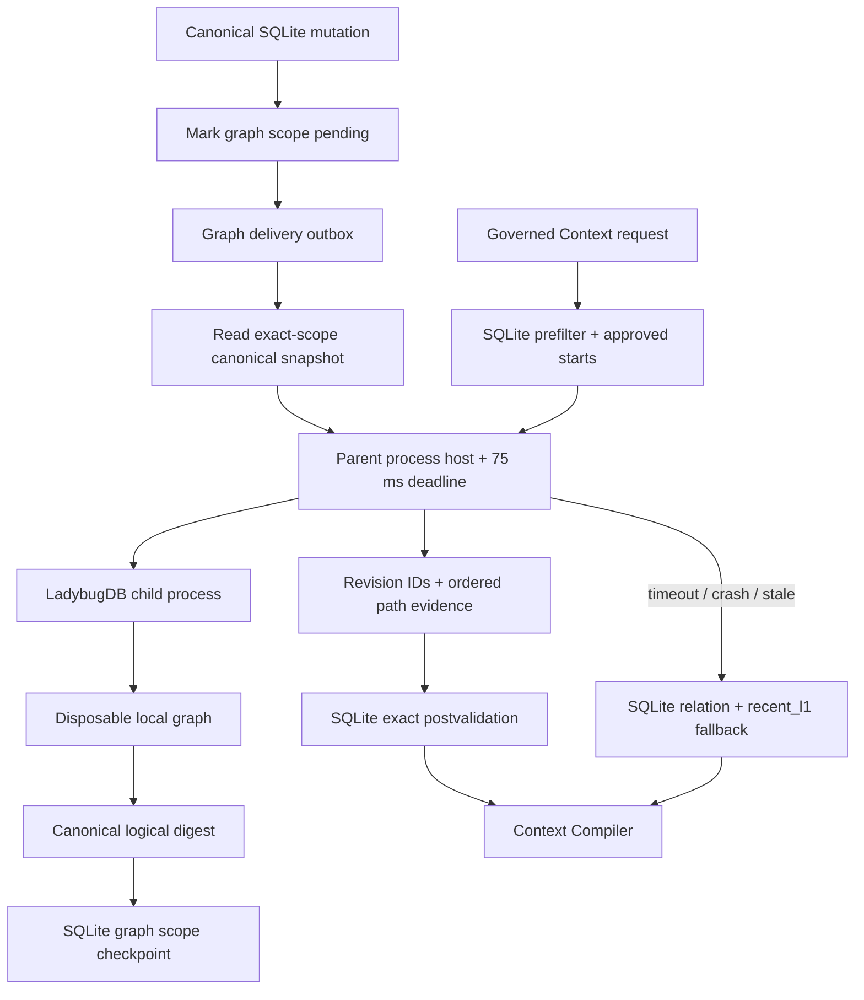
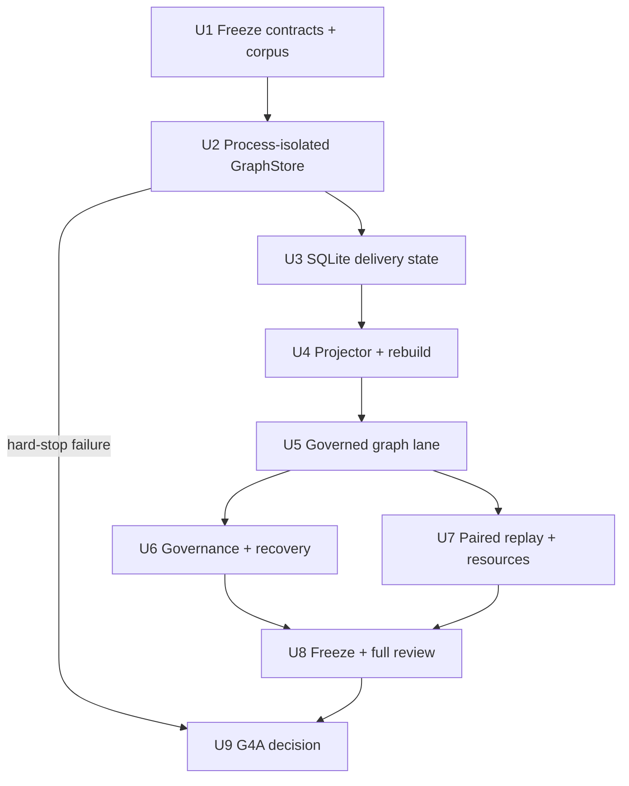
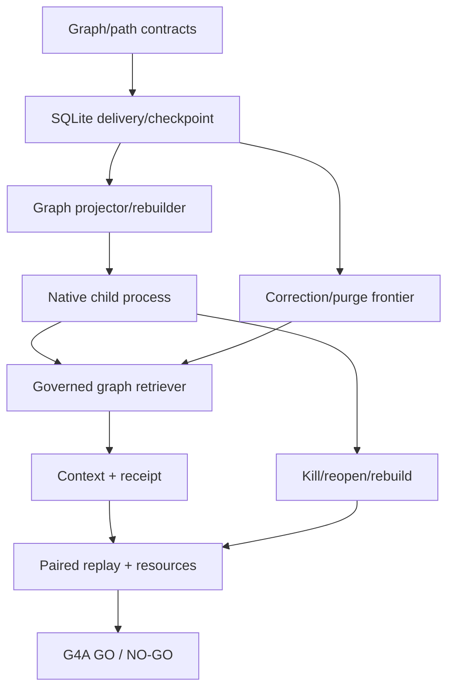

# M4A Local Graph Projection Adoption

## Summary

M4A tested one pinned LadybugDB adapter as a disposable L2/L3 projection
behind SQLite authority. The implementation freezes its structural corpus and
thresholds first, isolates all native queries in a killable local process, and
admits the graph lane only if paired replay proves material value with no
governance, recovery, resource, or fallback regression.

The completed G4A decision is **NO-GO**. Containment, governance, recovery and
artifact integrity passed, but the first hard failure was structural value:
zero strict gains and one transfer regression. The resource gate also failed
because Expected native rebuild evidence is missing and idle RSS exceeds the
frozen threshold. SQLite adjacency remains active and the graph lane remains
disabled for Context.

## Problem Frame

G3R accepted a bounded, scope-keyed L2/L3 runtime whose relation lane uses
deterministic SQLite adjacency. That baseline already performs governed
multi-hop traversal, so adopting a graph backend merely because it supports
Cypher or variable-length paths would add native packaging and operational
cost without proving user value.

The M4A qualification run selected LadybugDB as the only current candidate
worth one spike. Its embedded Node package passed local traversal, deletion,
transaction, persistence, and logical rebuild probes. The same probe exposed
a critical boundary: the wrapper's query timeout was orders of magnitude
coarser than requested, and a synchronous query continued past 30 seconds.
The graph cannot share the MCP process failure domain.

This plan therefore treats G4A as an adoption experiment with symmetric
outcomes. A `GO` permits an opt-in graph lane on the explicitly tested
platform; a `NO-GO` preserves SQLite adjacency as the complete M4A result.

## Assumptions

*This plan was authored under the user's continuous-execution instruction
without a synchronous M4A plan-confirmation pause. These are reviewable
implementation bets, not new Product Contract requirements.*

- `@ladybugdb/core@0.18.3` is the only implementation candidate. A failure
  does not silently widen scope to another graph backend.
- The physically qualified platform is Node `24.18.0` on Darwin arm64.
  Declared Linux, macOS x64, and Windows packages are not treated as locally
  verified.
- The existing projection model and relation revisions are the graph source.
  M4A does not invent new memory content or raise graph state to authority.
- Native graph work runs in a separate child process. A `worker_threads`
  boundary is insufficient because native work may delay thread termination.
- A dedicated graph-delivery queue and per-scope checkpoint are additive
  SQLite derived-state metadata, not a second canonical ledger.
- Scope replacement is the initial incremental unit: a changed exact scope is
  re-projected atomically, while full rebuild replaces every scope and must
  produce the same canonical logical digest.
- Each implementation unit is completed with focused verification and a
  scoped commit, as requested by the user.
- A hard-stop failure transitions directly to evidence capture and G4A
  `NO-GO`; it does not authorize partial enablement.

## Requirements

The parent Product Contract remains the sole R-number authority. M4A directly
implements R8, R12, R14, R19, and R20. R9 remains the independent M4B vector
boundary and is neither implemented nor redefined here.

- **R8:** Keep SQLite as the authoritative local ledger and the graph as a
  replaceable derived view that can be deleted without losing memory.
- **R12:** Return deterministic structural paths and conflict/provenance
  explanations without hiding alternatives or treating graph score as
  authority.
- **R14:** Propagate correction, replacement, demotion, usage block, revoke,
  tombstone, purge, backup, restore, and rebuild without stale resurrection.
- **R19:** Freeze candidate package and native identity, corpus, thresholds,
  frontiers, query hashes, path evidence, bounded-work telemetry, reports, and
  final decision hashes.
- **R20:** Compare accepted G3R SQLite, M4A graph-disabled, and M4A
  graph-assisted arms on identical governed inputs. `GO` requires material
  structural gain and zero critical regression.

**Origin actors:** A1 local user/operator, A2 Codex memory client, A3 Memory
Runtime, A4 graph projection backend, and A5 gate evaluator.

**Origin flows:** F1 maintained-candidate qualification, F2 derived projection
and rebuild, F3 governed graph recall, and F4 G4A adoption decision.

**Origin acceptance examples:** M4A-AC1–M4A-AC9 from the M4A requirements
document.

## Scope Boundaries

- No second graph backend or fallback graph vendor.
- No Kùzu dependency or inherited historical backend approval.
- No vector index, embedding model, or M4B decision.
- No LearningTrace, candidate publication, canary, or M5 release.
- No M6 remote operation, multi-user service, production rollout, or fleet
  observability claim.
- No graph-owned identity, content authority, approval, tombstone, evidence,
  authorization, release pointer, or receipt.
- No graph-only Context result; every candidate is re-read and approved by
  SQLite before packing.
- No default graph enablement, even if G4A records `GO`.
- No tuning against holdout or transfer payloads.
- No claim that a requested native timeout proves wall-clock containment.
- No broad refactor of the accepted G3R projection, ranking, or MCP mutation
  paths.

### Deferred to Follow-Up Work

- **M4B:** independent vector-versus-FTS semantic-gap decision.
- **M5:** candidate-only learning, three-arm evaluation, canary, release, and
  exact rollback.
- **M6:** production recovery exercises, monitoring distribution, platform
  matrix expansion, and operational release.
- Additional graph vendors or package upgrades require a new dated
  qualification gate.

## Context & Research

### Accepted Runtime Patterns

- `packages/contracts/src/projections.ts` owns projection, lane, bounded-work,
  frontier, and telemetry contracts.
- `packages/storage-sqlite/src/projection-repository.ts` owns derived
  projection state, queue work, exact scope frontiers, and rebuild receipts.
- `packages/storage-sqlite/src/projection-effects.ts` synchronously marks an
  affected scope pending inside canonical mutation transactions.
- `packages/storage-sqlite/src/relation-repository.ts` is the accepted
  deterministic SQLite adjacency baseline.
- `packages/storage-sqlite/src/storage-worker.ts` demonstrates the decoded
  process boundary for synchronous native storage.
- `packages/memory-kernel/src/lane-retrievers.ts` owns lane retrieval and
  bounded-work telemetry.
- `packages/memory-kernel/src/recall-orchestrator.ts` performs exact canonical
  source and scope-frontier revalidation after derived retrieval.
- `packages/context-compiler/src/hard-filters.ts` prevents relevance or lane
  score from bypassing eligibility.
- `packages/mcp-server/src/index.ts` defaults the operator lane policy to
  `recent_l1`, so graph remains opt-in.
- `tests/helpers/g3-replay.ts` and the G3 scripts provide hash-bound arm and
  replay patterns.

### Research Results

- Five candidates were compared from first-party maintenance, license, local
  runtime, and platform evidence.
- LadybugDB is embedded, MIT-licensed, current, and has a prebuilt Darwin arm64
  Node package.
- SurrealDB's BSL, FalkorDB's service/SSPL shape, Neo4j's server/JVM and GPL
  boundary, and CozoDB's stale release excluded them from this single spike.
- The local LadybugDB probe passed bounded traversal, exact-scope exclusion,
  relation deletion, rollback, close/reopen, export/import, and logical
  rebuild equality.
- Physical source and rebuilt database hashes differed. G4A must compare a
  canonical logical snapshot, not byte-identical database files.
- Native timeout behavior failed the wall-clock safety assumption. Process
  isolation, host deadline, hard termination, replacement, and SQLite
  fallback are mandatory.

### Sources

- M4A research handoff:
  `.trellis/tasks/07-29-agent-memory-runtime-m4a/research/research-handoff.md`
- Local qualification report:
  `.trellis/tasks/07-29-agent-memory-runtime-m4a/research/local-candidate-probe.md`
- LadybugDB documentation: <https://docs.ladybugdb.com/>
- LadybugDB Node API: <https://docs.ladybugdb.com/client-apis/nodejs/>
- M0 envelope: `docs/evaluations/performance-envelope.md`
- Accepted G3R decision: `docs/evaluations/g3r-h3-decision.md`
- Graph gate ADR: `docs/adr/0003-local-graph-selection-gate.md`

## Key Technical Decisions

### D1. One pinned candidate, with an early hard stop

The spike pins `@ladybugdb/core@0.18.3`, its lockfile resolution, platform
package, native binary hash, Node version, and storage version. U2 proves the
failure-domain boundary before projection integration. If the host cannot
return a typed fallback by its deadline, kill the graph process, reopen safely,
and keep SQLite serving, M4A stops and records `NO-GO`.

Implementing projection logic before proving containment was rejected because
it would spend most of the milestone behind an unsafe runtime assumption.
Automatically trying another backend was rejected because it would invalidate
the frozen candidate and threshold contract.

### D2. Native work lives in a killable child process

The MCP process communicates with one local graph child through a
runtime-decoded request/response protocol. The child is the sole read/write
owner of one graph database path and serializes native operations. It uses the
asynchronous LadybugDB API and cooperative timeout, but the parent-owned
wall-clock deadline is authoritative. On deadline or protocol failure, the
parent quarantines the process, terminates it at the OS boundary, reports a
typed degraded lane, and starts a replacement outside the request critical
path.

An in-process adapter was rejected because a synchronous native call can block
the MCP loop. A worker thread was rejected as the hard boundary because native
termination behavior is not sufficiently independent. A server/container
backend was rejected because it changes the local operational shape selected
by the qualification gate.

The graph path is derived under the configured data root, rejects symlink or
path-escape targets, and is never accepted from a recall request. The child
inherits only an allowlisted environment and receives IDs, hashes, epochs, and
bounded query parameters—never SQLite credentials, memory text, arbitrary
Cypher, or unrelated process secrets. Restart attempts are rate-limited so a
malformed or adversarial request cannot create a fork or crash loop.

This process boundary contains blocking/crash behavior; it is not an OS
sandbox. The pinned native dependency runs with the local user's filesystem
permissions and is part of the trusted dependency set. Minimal environment and
content-free IPC reduce accidental disclosure but do not defend against a
malicious same-UID native module or same-UID filesystem race. Any stronger
isolation claim requires a separate M6 sandbox/privilege design and test.

### D3. Graph state is a minimal logical projection

Graph nodes and edges contain stable projection/revision identifiers,
principal and exact scope keys, abstraction/type, lifecycle marker, validity
window, projection/tombstone epochs, content or payload hashes, transform
identity, and lineage pointers. They do not contain authoritative memory text,
approval, ACL, deletion receipts, or evidence bodies.

The graph may return ordered path identity and relation metadata. It cannot
return final Context content. SQLite re-reads the exact returned revisions and
evidence lineage before any candidate reaches the compiler.

Copying rendered memory content into the graph was rejected because it expands
purge and backup residual surfaces without helping structural traversal.

### D4. SQLite owns independent graph delivery state

An additive migration introduces a graph-delivery outbox, per-scope graph
checkpoint, backend identity, logical digest, attempts, lease, and content-free
error state. Applying or invalidating a canonical projection marks the exact
scope pending and enqueues graph delivery in the same SQLite transaction.

The graph projector claims work, reads one canonical exact-scope snapshot,
revalidates its frontier, replaces that scope in the graph, computes a
canonical logical digest, and atomically advances the SQLite checkpoint only
after the graph write succeeds. A pending, rebuilding, unavailable, or
frontier-mismatched scope cannot serve graph candidates.

Sharing the existing projection worker's processed flag was rejected because
SQLite consolidation and graph delivery are independent consumers with
different retries and failure states.

### D5. Scope replacement is the incremental primitive

The initial projector replaces one exact scope per delivery job instead of
attempting fine-grained node/edge patches. This bounds failure recovery and
makes a correction or purge converge to one authoritative scope snapshot.
Full rebuild enumerates all eligible scopes into a fresh database, compares
the canonical logical digest, then publishes the replacement database only
after SQLite records the coherent frontier.

Per-edge incremental updates were rejected for M4A because their retry and
partial-write state machine adds risk without changing the adoption question.
Global rebuild on every mutation was rejected because it would make local
cost and recovery unrepresentative.

### D6. Structural paths extend the lane contract without replacing SQLite

M4A adds an opt-in `relation_graph` lane alongside `relation_sqlite`. The graph
lane accepts only SQLite-approved start revisions and returns revision IDs,
ordered relation revision IDs, depth, query identity, graph frontier, elapsed
time, and completeness evidence. Existing start, depth, fanout, result, source
batch, and policy limits remain operator-owned; graph-specific path and
wall-clock limits can only be narrowed by a request.

Before graph dispatch, the SQLite relation baseline produces a canonical
bounded structural slice: approved starts, allowed relation revision IDs, and
exact start/fanout/work counts under the same policy. The graph may match typed
or shortest paths only inside that allowlist. This keeps fanout and scan
completeness measurable even when the native engine does not expose exact
visited-work counters. Graph queries are selected from closed templates with
parameterized values; callers cannot submit Cypher.

The same slice also feeds an evaluation-only deterministic graph-free
reference evaluator with identical typed/shortest-path semantics, tie-breaks,
and limits. This reference is not a new production lane; it prevents G4A from
crediting LadybugDB for behavior that a small TypeScript/SQLite algorithm can
provide over the same governed inputs. A graph result that beats accepted
G3R but not this reference is not a backend adoption gain.

An incomplete path query is `DEGRADED`, never an exhaustive `NO_MATCH`.
SQLite relation traversal and `recent_l1` remain active fallbacks. The compiler
can include graph-derived proof metadata only after every endpoint and
relation lineage has passed exact canonical revalidation.

Replacing `relation_sqlite` was rejected because the gate requires a paired
baseline and valid SQLite-only outcome.

### D7. Structural fixtures and thresholds freeze before adapter tuning

The G4A overlay contains six structural cases:

1. typed explanatory relation sequence;
2. temporal conflict with shared provenance;
3. scenario migration across abstraction layers;
4. deterministic shortest valid proof;
5. cycle/high-fanout pressure with typed incompleteness; and
6. mid-path correction with no resurrection.

Two cases are calibration, two are holdout, and two are transfer. Tuning may
read only calibration outcomes. A case is solved only when the expected
governed revision set, ordered proof path, evidence lineage, completeness
status, and abstention behavior all match.

Material gain requires at least three strict case improvements over both
accepted G3R and the graph-disabled reference arm, including at least one
holdout and one transfer case, with no case or partition regression. Each arm
receives the same task semantics and governed slice; an improvement cannot be
created by withholding typed-path behavior from the graph-free arm. This is
intentionally stricter than “one extra candidate” and remains fixed after U1.

A strict case improvement means Arm C matches the complete expected governed
revision set, ordered path, lineage, completeness, and abstention while both
A and B fail at least one of those same predeclared assertions under identical
limits. More candidates, a different ordering, or latency alone does not count
as a strict structural improvement.

### D8. Correctness and recovery gates dominate utility

Every governance, privacy, correction, purge, logical rebuild, backup/restore,
outage, lock, corruption, process-exit, timeout, and disabled-lane Oracle must
pass. Any critical failure forces `NO-GO` regardless of structural score or
latency.

The graph database's physical file hash is diagnostic only. The authoritative
rebuild Oracle is the canonical ordered logical snapshot of node and edge
identities, hashes, scope, validity, lineage, and epochs.

### D9. Resource thresholds are predeclared and platform-scoped

The Expected profile uses 25,000 active L1 memories, 6,000 L2/L3 projections,
and 50,000 relations. After at least 20 warm-up queries, reports use at least
100 measured samples.

For the tested Darwin arm64 environment:

- graph-assisted governed recall targets p50 <= 50 ms and p95 <= 200 ms;
- the host graph-query deadline is 75 ms;
- timeout/unavailable fallback returns by p95 <= 100 ms;
- a replacement process becomes ready within 2 seconds;
- full Expected logical rebuild completes within 60 seconds;
- graph database plus WAL remains <= 512 MiB;
- native package/install delta remains <= 64 MiB;
- idle RSS delta remains <= 128 MiB and Expected peak delta <= 512 MiB.

These are synthetic local acceptance thresholds, not production capacity
claims. Missing Expected physical evidence prevents `GO`.

### D10. GO remains opt-in and NO-GO remains clean

A G4A `GO` allows explicit operator configuration to add `relation_graph`.
The default policy remains `recent_l1`; no migration or package presence
self-enables the lane. Startup without the optional native package remains
valid SQLite-only operation.

A `NO-GO` disables graph integration, records its reason and tested evidence,
and leaves the additive checkpoint history inert. The graph database can be
deleted and rebuilt or retained for inspection, but it cannot contribute
Context candidates.

## Resolved and Deferred Questions

### Resolved During Planning

- **Which candidate is implemented?** LadybugDB `0.18.3`, once.
- **What is the hard isolation boundary?** A local child process owned and
  timed by the parent, not the wrapper timeout or worker thread.
- **Where does authority live?** SQLite before projection, before traversal,
  and after every graph result.
- **What is the incremental unit?** Exact-scope replacement plus independent
  SQLite checkpoint.
- **What proves rebuild identity?** Canonical logical snapshot equality.
- **What is material gain?** Three strict case improvements including holdout
  and transfer, with no regression.
- **What happens on timeout or outage?** Typed degradation and SQLite
  fallback; never clean no-match.
- **What happens if a hard gate fails?** Stop implementation and record
  `NO-GO`.

### Deferred to Implementation

- Exact internal class, message, and method names may change to keep modules
  small and protocol decoding explicit.
- The child-process IPC transport may use Node IPC or framed stdio, provided
  request identity, size bounds, decoding, content-free diagnostics, and kill
  semantics satisfy the same tests.
- LadybugDB physical backup may supplement export/import, but G4A acceptance
  remains based on canonical logical rebuild and successful local restore.
- If migration `0012` exceeds one reviewable responsibility, a forward
  `0013` may complete the same graph-delivery state without editing `0012`.
- Platform packages beyond Darwin arm64 remain declaration-only until M6 or a
  later dedicated portability gate physically tests them.

## Output Structure

```text
packages/
├── contracts/src/
│   └── graph.ts
├── graph-projection/
│   └── src/
│       ├── graph-store.ts
│       ├── process-host.ts
│       ├── ladybug-process.ts
│       ├── ladybug-adapter.ts
│       ├── projector.ts
│       ├── rebuilder.ts
│       ├── graph-retriever.ts
│       └── benchmark.ts
├── storage-sqlite/src/
│   └── graph-projection-repository.ts
└── memory-kernel/src/
    └── lane-retrievers.ts

fixtures/g4a/
├── manifest.json
└── cases/

tests/
├── contract/
├── storage/
├── integration/
├── governance/
├── recovery/
└── replay/
```

This tree communicates ownership. It does not require a separate file when an
existing module remains the clearer owner.

## High-Level Technical Design

> *This is directional design guidance for review, not code to reproduce.*



## Implementation Units



### U1. Freeze graph contracts, fixtures, and thresholds

**Goal:** Make the adoption question immutable before adapter behavior can be
tuned.

**Requirements:** R8, R12, R19–R20; F1/F3/F4;
M4A-AC1/M4A-AC5/M4A-AC8/M4A-AC9.

**Dependencies:** None.

**Files:**

- Create: `packages/contracts/src/graph.ts`
- Modify: `packages/contracts/src/projections.ts`
- Modify: `packages/contracts/src/replay.ts`
- Modify: `packages/contracts/src/mcp.ts`
- Modify: `packages/contracts/src/receipts.ts`
- Modify: `packages/contracts/src/index.ts`
- Create: `fixtures/g4a/manifest.json`
- Create: `fixtures/g4a/cases/*.json`
- Test: `tests/contract/graph-store.contract.test.ts`
- Test: `tests/contract/projections.contract.test.ts`
- Test: `tests/fixtures/g4a-overlay.fixture.test.ts`

**Approach:**

- Define backend-neutral graph identity, minimal node/edge, scope snapshot,
  ordered path evidence, logical digest, checkpoint, process health, bounded
  query, and typed degraded-result contracts.
- Add `relation_graph` as an independent lane without changing the semantics
  of `relation_sqlite`.
- Extend bounded-work and receipt evidence so starts, depth, fanout/path,
  result, wall-clock, process outcome, and completeness remain inspectable.
- Freeze six cases, partitions, expected logical answers, budgets, hashes,
  three-arm protocol, material-gain rule, and resource thresholds.
- Preserve existing G3/V1/V2 artifacts through optional, versioned additions.

**Patterns to follow:**

- `packages/contracts/src/projections.ts`
- `packages/contracts/src/replay.ts`
- `fixtures/g3/manifest.json`
- `tests/fixtures/replay-corpus.fixture.test.ts`

**Test scenarios:**

- **Happy path:** a minimal graph snapshot and complete ordered path seal to
  stable canonical hashes.
- **Edge case:** scope order and insertion order do not change logical digest.
- **Error path:** content-bearing graph nodes, duplicate path elements,
  mismatched scope/frontier, unbounded depth, or incomplete result without a
  reason is rejected.
- **Security boundary:** raw query text, graph file paths, or unbounded
  relation allowlists are not accepted from callers.
- **Compatibility:** old lane policies, Contexts, receipts, and G3 fixtures
  parse and hash unchanged.
- **Evaluation:** case bodies, partitions, thresholds, and expected answers
  match their manifest hashes.

**Verification:** Contract and fixture tests prove a frozen, backward-compatible
adoption contract before the native dependency is integrated.

### U2. Prove the process-isolated LadybugDB GraphStore

**Goal:** Establish native-package provenance, process containment, timeout,
crash, reopen, and logical store behavior before adding runtime projection.

**Requirements:** R8, R14, R19–R20; F1/F3;
M4A-AC1/M4A-AC6/M4A-AC7.

**Dependencies:** U1.

**Files:**

- Create: `packages/graph-projection/package.json`
- Create: `packages/graph-projection/tsconfig.json`
- Create: `packages/graph-projection/src/graph-store.ts`
- Create: `packages/graph-projection/src/process-host.ts`
- Create: `packages/graph-projection/src/ladybug-process.ts`
- Create: `packages/graph-projection/src/ladybug-adapter.ts`
- Create: `packages/graph-projection/src/logical-digest.ts`
- Modify: `package.json`
- Modify: `pnpm-lock.yaml`
- Test: `tests/contract/graph-store.contract.test.ts`
- Test: `tests/recovery/graph-process.recovery.test.ts`

**Approach:**

- Pin the exact package and verify native identity at child startup.
- Declare LadybugDB as the graph package's optional native dependency, update
  the root workspace build order, and prove a frozen install with optional
  dependencies omitted still builds and starts SQLite-only operation.
- Decode every IPC request and response; reject oversized, duplicate,
  malformed, out-of-order, or unknown operations.
- Derive the graph path under the canonical data root, reject path escape and
  symlink substitution, and launch the child with a minimal environment.
- Keep one read/write graph owner per path and serialize writes.
- Use cooperative async cancellation only as a first layer; enforce the 75 ms
  parent deadline and OS process termination as the final boundary.
- Verify transaction rollback, close/reopen, process kill during query,
  process kill during write, WAL recovery, and logical export/import.
- Rate-limit restart attempts and hold the graph unavailable through a bounded
  circuit-breaker cooldown after repeated failure.

**Hard stop:** if the parent cannot return safe fallback by the frozen deadline,
terminate the native process, reopen without corruption, and continue SQLite
operation, skip U3–U8 and proceed to U9 `NO-GO`.

**Verification:** The native process can fail without blocking the MCP process
or changing SQLite availability, and logical store operations are deterministic.

### U3. Add independent SQLite graph-delivery state

**Goal:** Persist retryable graph projection delivery and exact-scope freshness
without changing canonical authority.

**Requirements:** R8, R14, R19; F2/F3;
M4A-AC4/M4A-AC5/M4A-AC7.

**Dependencies:** U2.

**Files:**

- Create: `migrations/0012-graph-projection-delivery.sql`
- Create: `packages/storage-sqlite/src/graph-projection-repository.ts`
- Modify: `packages/storage-sqlite/src/migrations.ts`
- Modify: `packages/storage-sqlite/src/protocol.ts`
- Modify: `packages/storage-sqlite/src/database.ts`
- Modify: `packages/storage-sqlite/src/client.ts`
- Modify: `packages/storage-sqlite/src/storage-worker.ts`
- Modify: `packages/storage-sqlite/src/projection-repository.ts`
- Modify: `packages/storage-sqlite/src/projection-effects.ts`
- Modify: `packages/storage-sqlite/src/index.ts`
- Test: `tests/storage/graph-projection-schema.integration.test.ts`
- Test: `tests/storage/data-root-and-migrations.integration.test.ts`

**Approach:**

- Add append-only graph delivery jobs, per-scope checkpoint/frontier, backend
  identity, logical digest, lease, attempts, and content-free failure state.
- Enqueue or supersede graph scope work in the same SQLite transaction that
  applies or invalidates canonical projections.
- Mark only the affected principal/exact scope pending.
- Expose decoded claim, snapshot, apply, fail, reset, rebuild, and health
  operations through the existing storage worker boundary.
- Keep graph state inert and compatible when the optional graph package is
  absent or disabled.

**Verification:** Migration, transaction, lease/retry, scope isolation,
monotonic frontier, and old-database tests pass with graph disabled.

### U4. Implement exact-scope projection and full rebuild

**Goal:** Project minimal nodes/edges into LadybugDB and prove incremental
scope replacement equals full rebuild.

**Requirements:** R8, R14, R19; F2/F3;
M4A-AC3/M4A-AC4/M4A-AC5/M4A-AC7.

**Dependencies:** U3.

**Files:**

- Create: `packages/graph-projection/src/projector.ts`
- Create: `packages/graph-projection/src/rebuilder.ts`
- Create: `packages/graph-projection/src/sqlite-baseline.ts`
- Modify: `packages/storage-sqlite/src/graph-projection-repository.ts`
- Test: `tests/integration/graph-projection.integration.test.ts`
- Test: `tests/recovery/graph-rebuild.recovery.test.ts`

**Approach:**

- Read one exact-scope canonical projection snapshot at one frontier.
- Implement the evaluation-only graph-free typed/shortest-path reference over
  the same canonical bounded SQLite slice and deterministic tie-breaks used
  by the graph arm.
- Recheck current scope status immediately before graph replacement.
- Replace the scope transactionally with minimal typed nodes and edges.
- Compute the same canonical logical snapshot in SQLite and GraphStore, then
  compare digests before checkpoint publication.
- Rebuild into a fresh path, verify all scope digests and global digest, close
  it, and publish only after coherent reopen.
- Make replay, retry, duplicate job, crash, and partial scope work idempotent.

**Verification:** Incremental scope replacement and clean full rebuild produce
identical logical state; a failed or stale attempt cannot mark a scope ready.

### U5. Add the governed graph recall lane

**Goal:** Retrieve bounded structural proof paths while retaining SQLite
prefilter, postvalidation, telemetry, and fallback.

**Requirements:** R8, R12, R14, R19; F3;
M4A-AC4/M4A-AC5/M4A-AC6/M4A-AC7.

**Dependencies:** U4.

**Files:**

- Create: `packages/graph-projection/src/graph-retriever.ts`
- Modify: `packages/memory-kernel/src/lane-retrievers.ts`
- Modify: `packages/memory-kernel/src/recall-orchestrator.ts`
- Modify: `packages/memory-kernel/src/index.ts`
- Modify: `packages/context-compiler/src/hard-filters.ts`
- Modify: `packages/context-compiler/src/receipt-builder.ts`
- Modify: `packages/mcp-server/src/index.ts`
- Test: `tests/integration/graph-recall.integration.test.ts`
- Test: `tests/compiler/layered-context-compiler.test.ts`
- Test: `tests/mcp/context-compiler.test.ts`

**Approach:**

- Build graph starts only from canonical SQLite-approved revisions in the
  requested principal and exact scope.
- Build an exact bounded SQLite structural slice and pass only its allowed
  relation revision IDs to a closed graph query template.
- Require the graph scope checkpoint to match the current projection
  frontier before querying.
- Encode bounded depth and relation pattern in the query; apply result+1 and
  parent wall-clock boundaries.
- Treat unknown or partial backend work as incomplete and degraded.
- Re-read every returned node, edge, source, evidence lineage, lifecycle,
  validity window, and scope in SQLite before constructing candidates.
- Preserve graph-disabled semantic parity and lower-lane behavior.

**Verification:** Cross-scope, stale, tombstoned, incomplete, timed-out, and
missing-graph paths cannot enter Context; valid ordered proof paths are sealed
with exact telemetry and lineage.

### U6. Close governance, purge, recovery, and privacy Oracles

**Goal:** Prove no stale or prohibited graph path survives canonical lifecycle
changes or operational failures.

**Requirements:** R8, R14, R19–R20; F2/F3;
M4A-AC4/M4A-AC5/M4A-AC6/M4A-AC7.

**Dependencies:** U5.

**Files:**

- Create: `tests/governance/graph-purge-propagation.test.ts`
- Create: `tests/recovery/graph-rebuild.test.ts`
- Create: `tests/recovery/graph-backup-restore.test.ts`
- Create: `tests/security/graph-content-residual.test.ts`
- Create: `docs/runbooks/graph-rebuild.md`
- Modify: `packages/graph-projection/src/projector.ts`
- Modify: `packages/graph-projection/src/rebuilder.ts`

**Approach:**

- Fault inject correction, demotion, usage block, revoke, tombstone, purge,
  concurrent query, locked database, process exit, malformed response,
  corruption, backup/restore, and rebuild.
- Assert immediate visibility suppression through SQLite frontier and
  postvalidation even before graph cleanup drains.
- Scan graph/export/backup/log/error artifacts for prohibited plaintext.
- Verify unrelated scopes remain eligible and ready.
- Document safe inspection, delete, rebuild, fallback, and evidence collection.

**Verification:** Every critical Oracle passes with zero resurrection,
cross-scope change, untyped no-match, or memory content in diagnostics.

### U7. Run frozen paired replay and resource evaluation

**Goal:** Determine whether graph-assisted recall crosses the predeclared
material-gain and M0 resource thresholds.

**Requirements:** R12, R19–R20; F3/F4;
M4A-AC3/M4A-AC5/M4A-AC8.

**Dependencies:** U5; U6 may run in parallel after U5.

**Files:**

- Create: `packages/graph-projection/src/benchmark.ts`
- Create: `scripts/run-g4a-replay.mjs`
- Create: `scripts/run-g4a-resource-benchmark.mjs`
- Create: `scripts/verify-g4a-evidence.mjs`
- Create: `tests/replay/graph-multihop.test.ts`
- Create: `tests/integration/graph-benchmark.integration.test.ts`
- Create: `docs/evaluations/graph-scorecard.md`

**Approach:**

- Run Arm A at exact accepted G3R commit, Arm B at the M4A candidate with
  graph disabled plus the evaluation-only graph-free structural reference,
  and Arm C with graph enabled.
- Give B and C identical typed/shortest-path task semantics, governed slices,
  limits, and scoring so C can receive credit only for backend contribution,
  not for an algorithm withheld from B.
- Reject mixed commit, lock, native binary, case, partition, policy, request,
  frontier, budget, or threshold identities.
- Keep holdout and transfer inaccessible to tuning code.
- Measure solved cases, exact paths, evidence, abstention, pollution,
  governance, p50/p95, fallback, startup, rebuild, disk, install delta, RSS,
  process exits, and resource debt.
- Report measured Darwin arm64 evidence separately from declared platform
  support.

**Verification:** The scorecard makes the material-gain, safety, and resource
result independently reproducible and cannot convert missing evidence into
`GO`.

### U8. Freeze the candidate and run full verification/review

**Goal:** Bind one executable candidate to complete repository, dependency,
artifact, and review evidence before decision.

**Requirements:** R19–R20; F4; M4A-AC8/M4A-AC9.

**Dependencies:** U6–U7.

**Files:**

- Create: `docs/evaluations/g4a-code-review.md`
- Create: `docs/evaluations/g4a-reproducibility-manifest.json`
- Modify: `scripts/verify-g4a-evidence.mjs`
- Modify: `.trellis/tasks/07-29-agent-memory-runtime-m4a/check.jsonl`

**Approach:**

- Freeze the tested implementation commit before evidence-only work.
- Run focused graph, G3R regression, full repository, build, lint, typecheck,
  frozen install, production audit, migration, recovery, benchmark, privacy,
  and artifact verification.
- Review the entire M4A diff for correctness, authority, security, data
  integrity, reliability, performance, tests, project standards, and API
  contract risk.
- Fix any P0/P1 against a new candidate commit, then regenerate all dependent
  evidence; never patch executable code after the final evidence freeze.

**Verification:** One manifest resolves every source and report hash to one
tested implementation with no unresolved P0/P1 and no missing hard-gate
evidence.

### U9. Issue the G4A GO or NO-GO decision

**Goal:** Complete M4A with an honest, hash-bound adoption decision and active
fallback.

**Requirements:** R8, R19–R20; F4; M4A-AC2/M4A-AC8/M4A-AC9.

**Dependencies:** U2 hard-stop evidence or U8 complete evidence.

**Files:**

- Create: `docs/evaluations/g4a-decision.md`
- Modify: `docs/adr/0003-local-graph-selection-gate.md`
- Modify: `docs/plans/2026-07-29-003-feat-local-graph-adoption-plan.md`
- Modify: `.trellis/tasks/07-29-agent-memory-runtime-m4a/task.json`

**Approach:**

- Record `GO` only if structural gain, every critical Oracle, Expected
  physical evidence, resource thresholds, full verification, hashes, and
  review pass.
- Otherwise record `NO-GO` with the first failed hard gate, preserved
  SQLite-only behavior, inert graph state, and exact rerun conditions.
- Keep the default graph lane disabled in both outcomes.
- Explicitly state that M4B remains independent and that M5/M6 are not
  authorized by G4A.

**Verification:** A reviewer can reproduce why graph was accepted or rejected,
identify the active fallback, and verify no undecided state is mislabeled.

## System-Wide Impact



- **Contract surface:** lane enumeration, bounded-work telemetry, path
  evidence, replay protocol, MCP configuration, and receipts gain versioned
  graph-aware additions. Legacy artifacts remain valid.
- **Persistent state:** migration `0012` adds derived delivery/checkpoint data
  only. SQLite remains the only authoritative store and schema owner.
- **Process lifecycle:** the MCP process may supervise one optional local
  native child. Startup, shutdown, timeout, crash, replacement, and orphan
  cleanup become explicit tested states. Path confinement, environment
  allowlisting, closed query templates, and restart rate limits are part of
  that boundary.
- **Mutation lifecycle:** canonical projection apply/invalidate marks the graph
  scope pending before any future read; graph convergence is asynchronous.
- **Read lifecycle:** SQLite prefilter → graph path IDs → SQLite exact
  postvalidation → compiler. Failure at any derived step falls back.
- **Purge surface:** graph database, WAL, logical export, backup, IPC, logs,
  reports, and test artifacts join residual scanning.
- **Compatibility:** SQLite-only install/start/recall and graph-disabled G3R
  parity remain required. `graph-projection` is built in dependency order,
  but LadybugDB remains optional: a frozen install with optional dependencies
  omitted must still build and start the SQLite-only runtime.
- **Operational surface:** one extra local process and database exist only
  when explicitly configured. Health exposes identity, frontier, queue debt,
  last content-free failure, and restart state.

### State transitions

| Event | SQLite graph scope | Graph process/store | Read behavior |
| --- | --- | --- | --- |
| Graph disabled | disabled/inert | absent or stopped | SQLite only |
| Projection mutation | pending | old scope may exist | graph excluded; SQLite fallback |
| Projection success | ready at exact frontier/digest | new scope committed | graph eligible after postvalidation |
| Query timeout | ready or unavailable with failure evidence | process killed/quarantined | degraded graph, SQLite fallback |
| Process restart | rebuilding/unavailable until verified | reopen and health check | SQLite fallback |
| Correction/revoke | pending in canonical transaction | stale path may physically exist | stale path fails pre/postvalidation |
| Purge | pending plus purge evidence | scope replacement/delete required | zero prohibited graph content visible |
| Full rebuild | rebuilding | fresh path under construction | SQLite fallback |
| Rebuild publish | ready after digest equality | coherent fresh path | graph eligible |
| Corruption | unavailable | quarantined | SQLite fallback and rebuild required |

### Plan-level threat model

| Exploit scenario | Required mitigation |
| --- | --- |
| A crafted recall request injects Cypher or escapes the graph data path | Accept only typed relation-pattern modes and parameter values; derive and confine paths under the data root |
| Repeated expensive queries force child churn, CPU pressure, or a fork storm | Bound starts/relations/depth/results/time, supervise one child, rate-limit restarts, and open a circuit breaker |
| Stale or cross-scope graph structure reintroduces sensitive or deleted memory | Project IDs/hashes only, prefilter a SQLite structural slice, postvalidate every path element, and scan every derived artifact for residual content |

## Success Metrics

- Six structural cases and their partitions/hashes remain unchanged after U1.
- Arm C strictly improves at least three cases over both A and B, including
  one holdout and one transfer, with no case/partition regression.
- Exact expected revision set, ordered proof path, evidence lineage,
  completeness, and abstention all match for every solved case.
- Governance, cross-scope, privacy, correction, purge, backup/restore,
  rebuild, timeout, crash, corruption, and disabled-lane violations are zero.
- Incomplete graph traversal never emits clean exhaustive no-match.
- Incremental exact-scope projection and full rebuild logical digests match.
- Graph-disabled candidate is semantically equal to accepted G3R on the full
  frozen regression corpus.
- Expected graph-assisted recall meets p50 <= 50 ms and p95 <= 200 ms.
- Timeout/unavailable fallback meets p95 <= 100 ms with 75 ms host deadline.
- Replacement process is ready <= 2 seconds and Expected rebuild <= 60 seconds.
- Graph database plus WAL <= 512 MiB; install delta <= 64 MiB; idle/peak RSS
  deltas <= 128/512 MiB.
- Every decision artifact names one candidate, lock, native binary, corpus,
  policy, threshold, environment, report set, and implementation commit.

## Risk Analysis & Mitigation

| Risk | Likelihood | Impact | Mitigation |
| --- | --- | --- | --- |
| Native query blocks MCP process | High | Critical | Separate OS process, parent deadline, hard kill, SQLite fallback; U2 hard stop |
| Process kill corrupts graph | Medium | High | WAL/reopen tests, quarantine path, rebuild from SQLite, never make graph authoritative |
| Graph returns stale/cross-scope path | Medium | Critical | SQLite-approved starts, exact scope/frontier query, endpoint/edge/source postvalidation |
| Incomplete traversal becomes no-match | Medium | High | Explicit completeness telemetry; any unknown/partial work is degraded |
| Graph becomes mandatory dependency | Medium | High | Optional package/load, graph-disabled startup tests, default recent-L1 policy |
| Delivery queue duplicates or loses work | Medium | High | Stable job identity, lease/retry, scope checkpoint, logical digest, idempotent replacement |
| Correction/purge leaves stale bytes | Medium | Critical | Synchronous pending frontier, content-minimal graph, residual scans, scope replacement |
| Physical rebuild differs bytewise | High | Low | Compare canonical logical snapshot; physical hash remains diagnostic |
| Evaluation is tuned to graph | Medium | High | Freeze U1 manifest, calibration-only tuning, inaccessible holdout/transfer |
| Structural gain is cosmetic | Medium | High | Require three exact task/path improvements across holdout and transfer |
| Expected evidence is skipped | Medium | High | Missing physical Expected report is automatic NO-GO |
| Resource cost exceeds local value | Medium | Medium | Frozen p95/disk/RSS/install/start/rebuild thresholds |
| Native package/license changes | Low | High | Pin version/lock/binary/license evidence; any drift reopens qualification |
| Raw graph query or path input crosses trust boundary | Low | Critical | Closed parameterized query templates; server-derived confined data path; reject symlinks/path escape |
| Repeated failures create process/CPU denial of service | Medium | High | One child, bounded queue/concurrency, restart rate limit, circuit breaker, resource and orphan tests |
| Child process is mistaken for a native-code security sandbox | Medium | Critical | State the same-UID trust boundary; pin/audit identity; pass no content or SQLite path; make stronger isolation an explicit M6 requirement |
| Other platforms are overclaimed | Medium | Medium | Decision is explicitly Darwin arm64-scoped; declarations are not tests |
| Migration creates downgrade hazard | Low | Medium | Additive inert tables, graph disabled by default, old canonical schema untouched |
| Graph path evidence expands receipts | Medium | Medium | Store IDs/hashes only, cap path count/depth, measure receipt size |
| Review fixes invalidate evidence | Medium | High | Freeze candidate, regenerate all evidence after fixes, evidence-only final phase |

## Phased Delivery

### Phase 1 — Freeze and contain

Land U1–U2. If process containment fails, stop and issue U9 `NO-GO`.

### Phase 2 — Project and retrieve

Land U3–U5 so exact-scope delivery, logical rebuild, and governed graph recall
exist while graph remains disabled by default.

### Phase 3 — Break and measure

Land U6–U7, fault-inject every lifecycle and recovery path, and execute the
frozen structural/resource evaluation.

### Phase 4 — Freeze and decide

Land U8 evidence against one candidate, then U9 records G4A `GO` or `NO-GO`.

Completed on 2026-07-29 as `NO-GO` against candidate
`36421f5cd75007a1421d3e0594e7881dd4b864b2`. See
`docs/evaluations/g4a-decision.md`.

## Documentation / Operational Notes

- `docs/runbooks/graph-rebuild.md` must be executable by a local operator and
  distinguish inspect, disable, quarantine, delete, rebuild, verify, and
  publish.
- Diagnostics and health metadata remain content-free.
- README changes occur only after G4A status is known and must not imply
  default enablement.
- A `NO-GO` records useful evidence and is not an implementation failure.
- The recorded G4A outcome is `NO-GO`; SQLite adjacency is the active
  fallback and graph-derived state is inert.
- A `GO` is scoped to the tested local environment and opt-in configuration;
  it is not M6 production release evidence.
- M4B may start after M4A completion regardless of G4A outcome.

## Sources & References

- **Origin requirements:**
  `docs/brainstorms/2026-07-29-m4a-local-graph-adoption-requirements.md`
- **Product Contract:**
  `docs/brainstorms/2026-07-28-agent-memory-runtime-requirements.md`
- **Parent roadmap:**
  `docs/plans/2026-07-28-001-feat-agent-memory-runtime-plan.md`
- **Trellis PRD:** `.trellis/tasks/07-29-agent-memory-runtime-m4a/prd.md`
- **Research handoff:**
  `.trellis/tasks/07-29-agent-memory-runtime-m4a/research/research-handoff.md`
- **Local probe:**
  `.trellis/tasks/07-29-agent-memory-runtime-m4a/research/local-candidate-probe.md`
- **Accepted G3R:** `docs/evaluations/g3r-h3-decision.md`
- **M0 envelope:** `docs/evaluations/performance-envelope.md`
- **Graph gate ADR:** `docs/adr/0003-local-graph-selection-gate.md`
