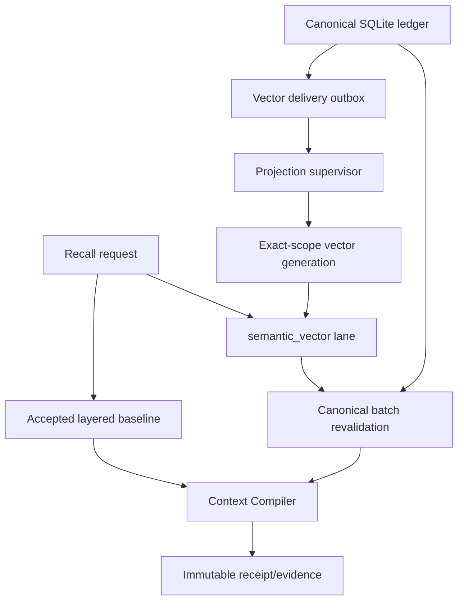
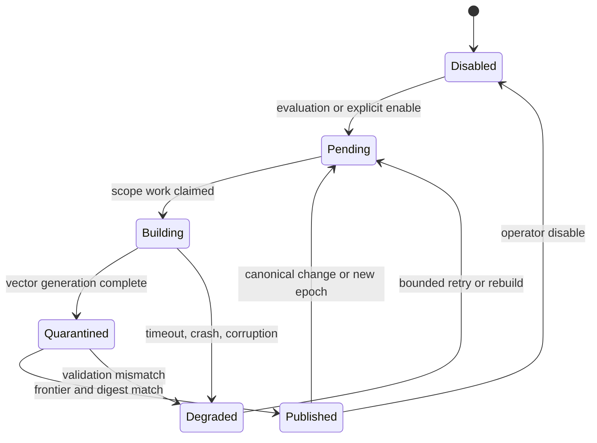
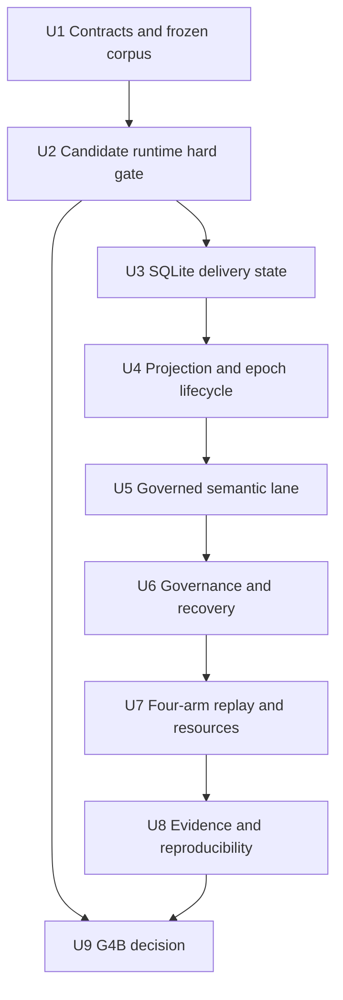
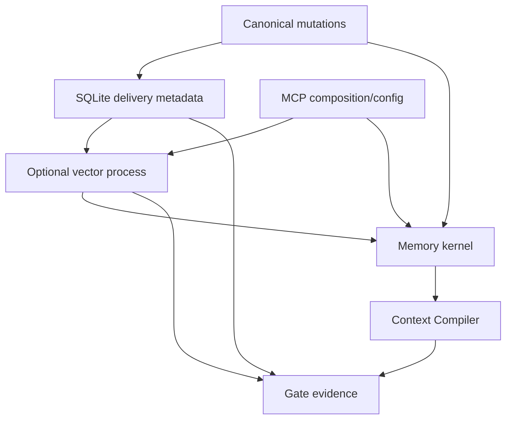

# M4B Local Vector Adoption Decision

## Summary

M4B will implement and evaluate one disabled-by-default local semantic-vector
lane without changing SQLite authority or the accepted vector-free runtime.
The implementation uses a hash-verified offline E5 snapshot, a disposable
exact-scope `sqlite-vec` projection, a killable embedding process, and fresh
canonical postvalidation before the unchanged Context Compiler.

The milestone has two equally complete terminal outcomes. `GO` retains the
tested lane as an opt-in candidate; any hard qualification, governance,
privacy, recovery, dependency, performance, or utility failure records
`NO-GO`, removes active vector enablement, and leaves FTS5/layered recall as
the supported runtime.

---

## Problem Frame

The accepted G3R runtime already combines recency, FTS5, layered projections,
SQLite relations, lifecycle governance, and bounded Context compilation. Its
all-term lexical matching nevertheless misses a frozen set of English
paraphrase and Chinese-to-English intents. M4B must determine whether semantic
retrieval closes those gaps sufficiently to justify a 135 MiB model snapshot,
native ONNX/runtime dependencies, material RSS, projection delivery, purge,
rebuild, and operational complexity.

This is an adoption experiment, not a presumption that vector search belongs
in the product. Similarity remains candidate generation only.

---

## Assumptions

*This plan was authored under the user's continuous-execution instruction
without a synchronous M4B plan-confirmation pause. These are reviewable
implementation bets, not new Product Contract requirements.*

- The only candidate is `@huggingface/transformers@4.2.0`,
  `Xenova/multilingual-e5-small` at revision
  `761b726dd34fb83930e26aab4e9ac3899aa1fa78`, and
  `sqlite-vec@0.1.9` flat cosine. A failure does not widen M4B to another
  runtime, model, or index.
- The physically qualified environment is Node `24.18.0` on Darwin arm64.
  Other platforms are not treated as tested by this gate.
- Embedding runs in a child process so model loading, native execution, and a
  wedged query cannot block MCP or canonical SQLite operations.
- Model acquisition is an explicit operator action. Runtime code verifies a
  private four-file snapshot and never downloads a model.
- Vector database files are partitioned by a one-way hash of principal and
  exact scope. They contain revision identity, epoch identity, and vector
  bytes but no rendered memory text.
- M4B's vector publication policy excludes `sensitive` and `secret` revisions
  even when a caller may request sensitive canonical recall. This prevents a
  same-scope sensitivity-membership signal; the accepted vector-free lanes
  still handle reader-authorized sensitive content.
- Regular tests use an injected deterministic embedder. The real pinned model
  is exercised only by the explicit G4B gate with a verified local snapshot.
- Each completed implementation unit receives focused verification and one
  scoped commit.
- The first hard-stop failure transitions to evidence capture and G4B
  `NO-GO`; partial enablement is forbidden.

---

## Requirements

The Product Contract remains the only R-number authority. M4B implements
R9–R14, R19, and R20 and does not redefine completed M4A behavior.

- **R9:** Treat embeddings and vector indexes as optional, disposable derived
  projections; prove material semantic value before adoption.
- **R10:** Preserve exact principal and scope isolation, sensitivity,
  lifecycle, validity, usage, lineage, conflict, tombstone, and purge
  governance in candidate generation and Context.
- **R11:** Keep the Context Compiler deterministic and budget-bound; similarity
  cannot bypass complementarity, duplicate, contradiction, or pollution
  controls.
- **R12:** Preserve explainable provenance and reasons; vector distance is
  supporting telemetry, never authority or final task success.
- **R13:** Preserve deterministic vector-free fallback for disabled, missing,
  stale, corrupt, rebuilding, locked, or timed-out vector state.
- **R14:** Propagate correction, replacement, demotion, usage block, revoke,
  tombstone, purge, backup, restore, and embedding-epoch transition without
  stale resurrection.
- **R19:** Seal candidate, dependency, model-file, epoch, corpus, threshold,
  environment, executable, report, and decision identities.
- **R20:** Compare `fts_recency`, `layered`, `vector`, and `hybrid` on identical
  frozen inputs. `GO` requires predeclared material gain and zero critical
  regression.

**Origin actors:** A1 local user/operator, A2 Codex memory client, A3 Memory
Runtime, A4 optional local vector projection, and A5 G4B gate evaluator.

**Origin flows:** F1 semantic-gap declaration and candidate qualification, F2
embedding lifecycle and governed recall, F3 correction/purge/epoch rebuild,
and F4 G4B adoption decision.

**Origin acceptance examples:** M4B-AC1–M4B-AC9 from the M4B requirements
document.

---

## Scope Boundaries

- No second embedding runtime, model, vector index, ANN tuning family, or
  remote provider.
- No remote model download or embedding request during runtime or evaluation.
- No graph reopening; G4A remains `NO-GO` and SQLite relations remain active.
- No vector-owned content, authority, approval, lifecycle, ACL, evidence,
  tombstone, deletion receipt, release pointer, or Context eligibility.
- No cross-scope global index whose membership or latency reveals another
  principal or scope.
- No vector-only Context path; every hit is re-read and revalidated from
  canonical SQLite.
- No default vector enablement, even if G4B records `GO`.
- No tuning against holdout or transfer payloads.
- No LearningTrace, learned policy publication, model training, or M5 work.
- No M6 production release, fleet monitoring, remote operation, or
  multi-user-service claim.

### Deferred to Follow-Up Work

- **M5:** candidate-only learning, three-arm evaluation, holdout, canary,
  publication, pause/resume, and exact rollback.
- **M6:** release hardening, recovery drills, operator observability, platform
  expansion, and production-readiness decision.
- Any different model, runtime, index, package upgrade, or remote egress needs
  a new dated qualification gate.

---

## Context & Research

### Relevant Code and Patterns

- `packages/contracts/src/projections.ts` owns lane policy, bounded work,
  frontiers, and projection delivery contracts.
- `packages/storage-sqlite/src/projection-repository.ts` and
  `packages/storage-sqlite/src/projection-effects.ts` own derived-state
  checkpoints and transaction-coupled invalidation.
- `packages/storage-sqlite/src/governed-memory-reader.ts` produces canonically
  eligible exact-scope source rows and validates returned projection sources.
- `packages/storage-sqlite/src/storage-worker.ts` demonstrates decoded IPC and
  a single native SQLite owner.
- `packages/memory-kernel/src/lane-retrievers.ts` composes bounded candidate
  lanes behind backend-neutral ports.
- `packages/memory-kernel/src/recall-orchestrator.ts` performs canonical
  eligibility and frontier postvalidation before Context.
- `packages/context-compiler/src/hard-filters.ts` prevents relevance from
  bypassing authority or lifecycle.
- `packages/graph-projection/src/process-host.ts` is the nearest optional
  native child-process containment pattern, while its graph-specific
  assumptions remain isolated.
- `tests/helpers/g3-replay.ts` and the G3/G4A evidence scripts demonstrate
  frozen-arm replay, artifact hashing, and decision verification.

### Institutional Learnings

- SQLite is authoritative; projections are disposable and must be
  reconstructible from canonical state.
- Runtime success is not gate success. Final decisions bind executable,
  environment, corpus, reports, reviewers, and limitations.
- A projection miss while stale or incomplete is degraded, not clean
  `NO_MATCH`.
- Logical sorted digests, not database file hashes, prove incremental/rebuild
  identity.
- User controls must suppress the next read before asynchronous physical
  cleanup converges.

### Research Results and External References

- The candidate-free semantic gap froze six positive cases and three negative
  controls before candidate selection.
- The selected E5 model requires 384 dimensions, mean pooling, L2
  normalization, and `query: ` / `passage: ` prefixes.
- A simple provider cache failed offline first use; an explicit four-file
  `localModelPath` snapshot with remote access disabled passed.
- Exact upstream dependencies produced four high-severity findings.
  `adm-zip@0.6.0` and `sharp@0.35.3` overrides cleared the isolated audit and
  now require repository-wide compatibility proof.
- The five-revision microprobe passed offline model load, semantic top-five,
  exact-scope insertion, cosine search, deletion, and reopen. It observed a
  135,147,520-byte snapshot, 387,661,824-byte RSS delta, and 6.107 ms warm
  p95 query/search, but does not prove expected-profile behavior.
- The complete Claim/Evidence map and first-party source identifiers live in
  `.trellis/tasks/07-29-agent-memory-runtime-m4b/research/research-handoff.md`.

---

## Key Technical Decisions

| Decision | Selected approach | Why |
| --- | --- | --- |
| Runtime containment | Dedicated local child process | ONNX/native work and model loading must not share the MCP failure domain. |
| Model boundary | Explicit hash-verified four-file snapshot | A cache is mutable/incomplete and runtime download violates the local privacy contract. |
| Index topology | One non-sensitive flat cosine database per principal/exact scope | Prevents cross-scope and sensitivity-membership leakage and keeps the expected per-scope profile small enough for exact search. |
| Persistence authority | Canonical delivery metadata in `memory.db`; vector bytes in disposable files | SQLite can audit, rebuild, and publish epochs without making the index authoritative. |
| Recall boundary | `semantic_vector` candidate lane plus fresh SQLite postvalidation | Similarity proposes revision IDs; canonical state decides eligibility and Context. |
| Evaluation | Four frozen arms through the same reader/compiler/budgets | Prevents a vector-specific reader or budget from manufacturing gain. |
| Failure outcome | Typed degradation and byte-equivalent vector-free fallback | A missing or broken optional projection must not change supported memory behavior. |

### D1. Dependency qualification is the first implementation hard stop

The repository pins the selected package versions and the two audit overrides,
reuses the existing exact `better-sqlite3@13.0.1` runtime required by
sqlite-vec, then proves frozen install, optional-dependency omission, build,
runtime smoke, and high-severity audit before persistence integration. The
vector package must declare this relationship explicitly rather than rely on
workspace hoisting. Any incompatibility or remaining high-severity finding
ends implementation and records G4B `NO-GO`.

This ordering avoids building governance around a dependency set that cannot
be safely shipped. Silently relaxing the audit, using an unpinned transitive
tree, or shopping for a second candidate is rejected.

### D2. The vector package is optional and process-isolated

`@memo-graph/vector-retrieval` owns a backend-neutral vector index port, model
snapshot verification, the child protocol, embedding/index adapter, projection
worker, retriever, and resource measurements. Transformers and sqlite-vec are
dynamically loaded only inside the child. The top-level package and the
SQLite-only MCP runtime must import and start when optional dependencies or the
model snapshot are absent.

The parent enforces wall-clock deadlines, message bounds, matching request
identities, quarantine, termination, restart rate limits, and typed
degradation. The child owns one vector database at a time and never receives
arbitrary paths, SQL, remote URLs, or secrets. Process isolation is crash and
availability containment, not a malicious-native sandbox.

### D3. Exact-scope files store vectors but not rendered memory text

Each projection file is derived beneath the configured data root from a
one-way principal/exact-scope identity. Membership is established from
canonical SQLite before embedding and deliberately excludes `sensitive` and
`secret` sources. The file stores revision ID, epoch ID, normalized vector,
source hash, and lifecycle/frontier hashes required for staleness detection.
It does not persist rendered content, evidence bodies, ACLs, receipts, or raw
model input.

The child may receive canonical text over local IPC for immediate embedding.
It must not log it, cache it after the operation, or include it in errors.
Physical purge removes old generation, quarantine, WAL/sidecars, temporary
snapshot data, and model-input residue for the affected scope.

### D4. SQLite owns delivery, epoch, and publication state

An additive migration adds immutable embedding-epoch identity, exact-scope
vector checkpoint, content-free outbox work, build generation, canonical
source frontier, next validity transition, logical digest, attempts/lease,
and receipts. Canonical mutation transactions mark affected scopes pending
when the lane is enabled or under evaluation. A bounded temporal sweep marks
a scope stale when `valid_from` or `valid_to` crosses the stored transition;
until refreshed the lane degrades instead of claiming a clean miss. The
mutation never waits for model or vector work.

A generation is queryable only when its epoch, source frontier, eligible
revision set, and logical digest match current canonical state. Rebuild writes
to quarantine, validates equality, then atomically publishes the new
generation. An old generation remains isolated until publication and is
deleted after the switch.

### D5. `semantic_vector` is a governed L1 candidate lane

The lane searches only the request's exact-scope non-sensitive projection and
returns bounded revision IDs, distances, rank, epoch, and source frontier. The
memory kernel treats `semantic_vector` as an L1 memory lane—not as a
projection lane—batches fresh canonical reads, rejects changed or ineligible
revisions, and then passes materialized canonical candidates through the same
ranking, conflict, complementarity, and token-budget machinery.

Vector distance cannot grant eligibility, raise sensitivity permission, hide
alternatives, or count as task success. A stale, incomplete, or failed lane is
reported as degraded and the layered result is preserved.

### D6. Epoch identity seals every semantic representation choice

The epoch binds runtime/package versions, model repository and revision, the
four file hashes, ONNX artifact, dimensions, dtype, pooling, normalization,
query/passage prefixes, tokenizer/truncation contract, index package/version,
distance metric, and projection schema. Any difference creates a new epoch;
old and new vectors are never mixed.

Canonical memory and revision identities remain unchanged across epoch
migration. Only a complete quarantine generation with matching canonical
frontier and digest may become active.

### D7. Real-model evaluation is explicit; ordinary CI is deterministic

Unit, governance, and recovery tests inject a deterministic embedder that
exercises the same dimensions, normalization, failure, and epoch boundaries
without network or a 135 MiB fixture. The G4B evaluator requires an explicit
local model root, verifies all file hashes, and runs the pinned runtime,
frozen cases, expected-profile benchmark, and audit.

This keeps normal development reproducible while ensuring the adoption
decision is bound to the actual candidate rather than a test double.

---

## Open Questions

### Resolved During Planning

- **Where does vector state live?** Canonical delivery and publication
  metadata live in `memory.db`; vector bytes live in disposable exact-scope
  files under the data root.
- **How is offline operation enforced?** Only a hash-verified explicit model
  snapshot is accepted, remote model access is disabled, and runtime network
  download is not implemented.
- **How is scope leakage prevented?** A request can open only its derived
  exact-scope database, and canonical postvalidation repeats principal/scope
  checks.
- **How is sensitivity membership hidden?** M4B indexes only non-sensitive,
  non-secret sources. Sensitive canonical recall remains available through
  the accepted vector-free lanes and is never inferred from vector telemetry.
- **How do time boundaries converge without a mutation?** Each scope
  checkpoint records the next `valid_from`/`valid_to` transition. A bounded
  sweep invalidates the generation at that time and schedules replacement;
  stale state degrades until publication.
- **How are native hangs contained?** The embedding/index adapter runs in a
  child process governed by a parent deadline and kill/restart boundary.
- **How does ordinary CI avoid the large model?** It injects a deterministic
  embedder; only the explicit G4B gate uses the real model.
- **What happens after the first hard failure?** Remaining feature work stops,
  evidence is sealed, and the task proceeds directly to the G4B `NO-GO`
  decision unit.

### Deferred to Implementation

- **Final helper and protocol symbol names:** choose the smallest names
  consistent with existing contracts after the first failing tests exist.
- **Flat-index top-k and similarity threshold:** calibrate only against the
  calibration partition; freeze before holdout and transfer are opened.
- **Whether an existing projection-effect helper can be generalized:** decide
  from the actual transaction seam without refactoring unrelated G3/G4A code.
- **Exact resource ceiling beyond mandatory M0 latency:** report observed
  disk, RSS, cold start, and rebuild costs explicitly; G4B may still be
  `NO-GO` if utility does not justify them.

---

## Output Structure

```text
packages/vector-retrieval/
├── package.json
├── tsconfig.json
└── src/
    ├── embedder.ts
    ├── local-model.ts
    ├── vector-index.ts
    ├── protocol.ts
    ├── path-security.ts
    ├── process-host.ts
    ├── vector-process.ts
    ├── projector.ts
    ├── rebuilder.ts
    ├── retriever.ts
    ├── logical-digest.ts
    └── index.ts

fixtures/g4b/
├── manifest.json
└── cases/

docs/evaluations/
├── g4b-*.json
├── vector-scorecard.md
└── g4b-decision.md
```

The tree communicates intended ownership. Per-unit file lists remain
authoritative and implementation may consolidate helpers when that reduces
surface area without changing boundaries.

---

## High-Level Technical Design

> *This illustrates the intended approach and is directional guidance for
> review, not implementation specification. The implementing agent should
> treat it as context, not code to reproduce.*



The active generation lifecycle is:



Only `Published` may serve candidates. Every state other than `Published`
returns typed degradation or disabled status and preserves the vector-free
result.

---

## Implementation Units



U2 has a direct hard-stop edge to U9. The same edge applies to any later
critical governance, privacy, purge, authority, audit, or fallback failure.

- U1. **Freeze vector contracts and translate the semantic-gap corpus**

**Goal:** Establish immutable, backend-neutral contracts and repository
fixtures before the candidate influences implementation behavior.

**Requirements:** R9–R13, R19–R20; F1/F2/F4;
M4B-AC1/M4B-AC4/M4B-AC8/M4B-AC9.

**Dependencies:** None.

**Files:**
- Create: `packages/contracts/src/vector.ts`
- Modify: `packages/contracts/src/projections.ts`
- Modify: `packages/contracts/src/replay.ts`
- Modify: `packages/contracts/src/mcp.ts`
- Modify: `packages/contracts/src/receipts.ts`
- Modify: `packages/contracts/src/index.ts`
- Create: `fixtures/g4b/manifest.json`
- Create: `fixtures/g4b/cases/*.json`
- Test: `tests/contract/vector-index.contract.test.ts`
- Test: `tests/contract/projections.contract.test.ts`
- Test: `tests/contract/mcp.contract.test.ts`
- Test: `tests/contract/receipts.contract.test.ts`
- Test: `tests/fixtures/g4b-overlay.fixture.test.ts`

**Approach:**
- Define embedding epoch, model snapshot, exact-scope generation, query,
  result, health, failure, checkpoint, delivery receipt, replay arm, and G4B
  evidence schemas without importing candidate library types.
- Add `semantic_vector` to exhaustive lane mappings through optional/versioned
  fields while keeping every default lane policy unchanged.
- Translate the committed candidate-free JSON declaration exactly; seal case,
  partition, expected result, token budget, arm, threshold, and baseline
  hashes.
- Reject raw text in index records, model snapshot paths or remote URLs from
  recall requests, mixed epochs, wrong dimensions, non-normalized vectors,
  unbounded top-k, and clean misses from incomplete state.

**Execution note:** Start with failing contract and frozen-fixture tests.

**Patterns to follow:**
- `packages/contracts/src/graph.ts`
- `packages/contracts/src/projections.ts`
- `fixtures/g4a/manifest.json`
- `tests/fixtures/g4a-overlay.fixture.test.ts`

**Test scenarios:**
- Happy path: a valid 384-dimensional normalized result with a matching epoch,
  exact scope, frontier, and digest decodes and normalizes deterministically.
- Edge case: reordered logical records yield the same digest, while changed
  revision, vector, epoch, prefix, scope, or frontier changes it.
- Error path: content-bearing index records, mixed epochs, non-finite values,
  wrong dimensions, remote URLs, path escape, unbounded top-k, or unknown
  failure categories are rejected.
- Integration: an old G3R request, Context, and receipt round-trip to the same
  hash when no vector fields are present.
- Covers F1 / M4B-AC1: translated fixture hashes match the candidate-free
  semantic-gap freeze and holdout/transfer access remains evaluator-only.

**Verification:**
- Contract invalid and boundary cases fail for the intended reason.
- Existing G3R/G4A artifacts remain compatible.
- G4B fixture and threshold hashes are immutable and candidate-independent.

- U2. **Qualify the optional local vector process and dependency set**

**Goal:** Prove the exact dependency tree, offline snapshot, process
containment, and flat-index behavior before any canonical persistence work.

**Requirements:** R9, R10, R13, R19–R20; F1/F2/F4;
M4B-AC2/M4B-AC3/M4B-AC7/M4B-AC9.

**Dependencies:** U1.

**Files:**
- Create: `packages/vector-retrieval/package.json`
- Create: `packages/vector-retrieval/tsconfig.json`
- Create: `packages/vector-retrieval/src/embedder.ts`
- Create: `packages/vector-retrieval/src/local-model.ts`
- Create: `packages/vector-retrieval/src/vector-index.ts`
- Create: `packages/vector-retrieval/src/protocol.ts`
- Create: `packages/vector-retrieval/src/path-security.ts`
- Create: `packages/vector-retrieval/src/process-host.ts`
- Create: `packages/vector-retrieval/src/vector-process.ts`
- Create: `packages/vector-retrieval/src/logical-digest.ts`
- Create: `packages/vector-retrieval/src/index.ts`
- Modify: `package.json`
- Modify: `pnpm-lock.yaml`
- Test: `tests/contract/vector-index.contract.test.ts`
- Test: `tests/recovery/vector-process.recovery.test.ts`
- Test: `tests/security/vector-process-protocol.test.ts`
- Test: `tests/integration/vector-dependency.integration.test.ts`

**Approach:**
- Pin the qualified runtime/index and audit overrides, and explicitly reuse
  `better-sqlite3@13.0.1` without relying on hoisting. Keep the new candidate
  dependencies optional and dynamically loaded only inside the child.
- Verify exactly four model files, repository/revision identity, dimensions,
  pooling, normalization, prefixes, and hashes before ready.
- Derive/confine database paths in the parent; send a bounded, decoded,
  content-free protocol to one child; enforce deadline, quarantine,
  termination, restart rate limit, and fallback.
- Implement flat cosine insert/search/delete/snapshot behavior behind an
  injected embedder/index port so ordinary tests remain deterministic.
- Treat frozen-install, no-optional build/start, actual model smoke, and
  high-severity audit as one hard gate.

**Execution note:** Implement the hard-stop tests before adapter composition.

**Patterns to follow:**
- `packages/graph-projection/src/process-host.ts`
- `packages/graph-projection/src/ladybug-process.ts`
- `packages/storage-sqlite/src/storage-worker.ts`
- `.trellis/tasks/07-29-agent-memory-runtime-m4b/research/local-vector-probe.mjs`

**Test scenarios:**
- Happy path: the verified snapshot loads offline, produces a normalized
  384-dimensional embedding, inserts exact-scope revisions, returns bounded
  cosine hits, deletes, closes, and reopens with the same logical result.
- Edge case: the package top level and SQLite-only MCP start when optional
  dependencies and the model snapshot are absent.
- Error path: version/hash/dimension/prefix mismatch, missing file, symlink or
  path escape, malformed IPC, timeout, child crash, duplicate/late response,
  or extension failure yields stable content-free degradation.
- Security: child environment excludes unrelated secrets; logs and errors do
  not contain passage/query text; raw SQL, arbitrary file path, and remote URL
  are rejected before dispatch.
- Recovery: a child killed during uncommitted write leaves only the previous
  logical digest and replacement occurs outside the request critical path.
- Integration: repository frozen install, no-optional build/start, real pinned
  candidate smoke, and high-severity audit all pass with the exact lockfile.

**Verification:**
- Candidate and dependency hashes are recorded.
- Optional-dependency omission preserves vector-free build/start.
- Parent deadline and process kill preserve responsive fallback.
- A single failure routes directly to U9 `NO-GO`; otherwise U3 is authorized.

- U3. **Persist vector delivery, scope checkpoints, and embedding epochs**

**Goal:** Add canonical, transaction-coupled metadata that makes disposable
vector generations auditable and rebuildable without making them authority.

**Requirements:** R9–R10, R13–R14, R19; F2/F3;
M4B-AC3/M4B-AC5/M4B-AC6/M4B-AC7.

**Dependencies:** U2 hard gate passes.

**Files:**
- Create: `migrations/0013-vector-projection-delivery.sql`
- Create: `packages/storage-sqlite/src/vector-projection-repository.ts`
- Modify: `packages/storage-sqlite/src/protocol.ts`
- Modify: `packages/storage-sqlite/src/database.ts`
- Modify: `packages/storage-sqlite/src/storage-worker.ts`
- Modify: `packages/storage-sqlite/src/projection-effects.ts`
- Modify: `packages/storage-sqlite/src/governance-repository.ts`
- Modify: `packages/storage-sqlite/src/purge-repository.ts`
- Modify: `packages/storage-sqlite/src/restore.ts`
- Modify: `packages/storage-sqlite/src/index.ts`
- Test: `tests/integration/vector-projection.integration.test.ts`
- Test: `tests/governance/vector-correction.integration.test.ts`
- Test: `tests/governance/vector-purge-propagation.test.ts`
- Test: `tests/recovery/vector-outbox.recovery.test.ts`

**Approach:**
- Add embedding-epoch, exact-scope checkpoint, build generation, outbox lease,
  frontier/digest, next validity transition, attempt, failure, publication,
  and receipt tables with monotonic constraints and foreign-key ownership.
- Couple canonical mutations to content-free scope refresh/invalidation only
  while vector evaluation/enablement is active; never embed inside a mutation
  transaction.
- Expose governed exact-scope sources and batch eligibility validation through
  the decoded storage protocol.
- Make retries idempotent and lease recovery monotonic; restore must not move
  behind the tombstone or publication frontier.
- Add a bounded temporal sweep that marks generations stale and enqueues
  rebuild when the next eligibility transition is reached.

**Execution note:** Add migration and transaction tests before repository
methods.

**Patterns to follow:**
- `migrations/0011-scope-projection-frontiers.sql`
- `packages/storage-sqlite/src/projection-repository.ts`
- `packages/storage-sqlite/src/projection-effects.ts`
- `packages/storage-sqlite/src/graph-projection-repository.ts`

**Test scenarios:**
- Happy path: one eligible canonical change enqueues one exact-scope job and a
  successful apply records matching epoch, generation, frontier, digest, and
  receipt.
- Edge case: duplicate delivery and expired lease recovery are idempotent and
  do not move a monotonic frontier backward.
- Error path: wrong scope, mixed epoch, stale source frontier, mismatched
  digest, invalid lease, or failed build cannot publish.
- Integration: correction/revoke/tombstone commits canonical suppression and
  vector invalidation atomically while recall remains available.
- Recovery: restoring an older canonical backup cannot republish a vector
  generation behind the current tombstone frontier.

**Verification:**
- Migration upgrade and reopen preserve canonical state.
- Every affected mutation has durable content-free vector work.
- Delivery failure never rolls back a valid canonical mutation.

- U4. **Build, publish, purge, and rebuild exact-scope generations**

**Goal:** Maintain disposable vector files from canonical sources with
incremental/full-rebuild equality and epoch isolation.

**Requirements:** R9–R10, R13–R14, R19; F2/F3;
M4B-AC3/M4B-AC5/M4B-AC6/M4B-AC7.

**Dependencies:** U3.

**Files:**
- Create: `packages/vector-retrieval/src/projector.ts`
- Create: `packages/vector-retrieval/src/rebuilder.ts`
- Modify: `packages/vector-retrieval/src/vector-index.ts`
- Modify: `packages/vector-retrieval/src/process-host.ts`
- Modify: `packages/vector-retrieval/src/logical-digest.ts`
- Test: `tests/integration/vector-projection.integration.test.ts`
- Test: `tests/recovery/vector-rebuild.test.ts`
- Test: `tests/governance/vector-purge-propagation.test.ts`
- Test: `tests/security/vector-content-residual.test.ts`

**Approach:**
- Claim one exact-scope job, read current governed sources, exclude
  sensitive/secret sources, embed passages in bounded batches, write a
  quarantine generation, compare source frontier and logical digest, then
  publish atomically.
- Replace an affected exact scope rather than mutating across scope files.
  Full rebuild enumerates current governed scopes and produces the same sorted
  logical digest as incremental state.
- New epochs build separately; no query may mix epochs or see quarantine.
- Purge removes old revision/vector rows, database sidecars, temporary
  generations, and content-bearing transient files while leaving unrelated
  scopes untouched.

**Execution note:** Start with deterministic fake-embedder lifecycle tests,
then repeat critical paths with the real candidate gate.

**Patterns to follow:**
- `packages/graph-projection/src/projector.ts`
- `packages/graph-projection/src/rebuilder.ts`
- `packages/storage-sqlite/src/governed-memory-reader.ts`
- `packages/storage-sqlite/src/data-root.ts`

**Test scenarios:**
- Happy path: incremental replacement and clean full rebuild of identical
  canonical sources publish the same ordered logical digest.
- Edge case: empty scope publishes an empty generation and removes the prior
  file without affecting another scope.
- Error path: canonical frontier changes during build, digest mismatch, model
  failure, disk lock, corrupt database, or child crash leaves quarantine
  unpublished and records degradation.
- Epoch: a new model epoch builds beside the old generation and only one
  complete epoch is queryable before and after atomic publication.
- Purge: old revision identity and vector bytes are absent from active,
  quarantine, sidecar, backup-projection, temp, and log surfaces.

**Verification:**
- Incremental/full-rebuild digest equality holds.
- Partial and stale generations never become queryable.
- Scope purge and epoch switch have content-free immutable receipts.

- U5. **Integrate the governed `semantic_vector` recall lane**

**Goal:** Add optional semantic candidate generation while preserving exact
vector-free behavior for every disabled or degraded state.

**Requirements:** R9–R13, R19–R20; F2;
M4B-AC3/M4B-AC4/M4B-AC7/M4B-AC8.

**Dependencies:** U4.

**Files:**
- Create: `packages/vector-retrieval/src/retriever.ts`
- Modify: `packages/vector-retrieval/src/index.ts`
- Modify: `packages/memory-kernel/src/lane-retrievers.ts`
- Modify: `packages/memory-kernel/src/recall-orchestrator.ts`
- Modify: `packages/memory-kernel/src/index.ts`
- Modify: `packages/context-compiler/src/hard-filters.ts`
- Modify: `packages/context-compiler/src/ranking-policy.ts`
- Modify: `packages/context-compiler/src/receipt-builder.ts`
- Modify: `packages/context-compiler/src/index.ts`
- Modify: `packages/mcp-server/src/index.ts`
- Modify: `packages/mcp-server/package.json`
- Modify: `package.json`
- Test: `tests/integration/vector-recall.integration.test.ts`
- Test: `tests/mcp/memory-kernel.integration.test.ts`
- Test: `tests/mcp/context-compiler.test.ts`
- Test: `tests/compiler/layered-context-compiler.test.ts`

**Approach:**
- Compose a backend-neutral semantic retriever only when operator configuration
  enables evaluation or the lane. Keep default operator/request policies
  vector-free.
- Query one published exact-scope generation with bounded top-k/deadline and
  return revision identity plus distance/epoch/frontier telemetry.
- Extend the existing memory-candidate discriminator so `semantic_vector`
  carries a governed L1 memory; do not let
  `Exclude<RecallLane, "recent_l1">` misclassify it as an L2/L3 projection.
- Re-read and batch-validate every hit in SQLite, discard stale/ineligible
  candidates, and pass canonical content to existing ranking and compiler
  rules.
- Preserve base lane ordering and output exactly on disabled or degraded
  vector states; add stable lane status and bounded-work evidence.

**Execution note:** Begin with vector-disabled equivalence and stale-hit
rejection tests.

**Patterns to follow:**
- `packages/memory-kernel/src/lane-retrievers.ts`
- `packages/memory-kernel/src/recall-orchestrator.ts`
- `packages/mcp-server/src/index.ts`
- `packages/context-compiler/src/hard-filters.ts`

**Test scenarios:**
- Happy path: a same-scope paraphrase hit is canonically re-read and enters
  Context with provenance, distance telemetry, epoch, and source frontier.
- Edge case: duplicate vector/base candidates collapse to one canonical
  revision without extra token use or altered conflict handling.
- Error path: disabled, missing, locked, corrupt, stale, rebuilding,
  digest-mismatched, or timed-out state returns stable degradation and the
  exact accepted layered result.
- Security: wrong-principal/scope and sensitive or usage-blocked hits are
  rejected even if the derived index returns them adversarially.
- Integration: legacy MCP clients omit vector fields and receive compatible
  requests, responses, receipts, and defaults.

**Verification:**
- Similarity never bypasses canonical eligibility or Context policy.
- Vector-disabled/degraded result and hashes equal the accepted baseline.
- New telemetry is bounded, content-free, and receipt-bound.

- U6. **Close governance, privacy, correction, and recovery oracles**

**Goal:** Prove that every user control suppresses stale semantic candidates
immediately and that projection failure cannot affect canonical operations.

**Requirements:** R10–R14, R19–R20; F2/F3/F4;
M4B-AC4/M4B-AC5/M4B-AC6/M4B-AC7/M4B-AC9.

**Dependencies:** U5.

**Files:**
- Test: `tests/governance/vector-correction.integration.test.ts`
- Test: `tests/governance/vector-purge-propagation.test.ts`
- Test: `tests/recovery/vector-rebuild.test.ts`
- Test: `tests/recovery/vector-outage.recovery.test.ts`
- Test: `tests/security/vector-content-residual.test.ts`
- Test: `tests/security/vector-scope-isolation.test.ts`
- Modify: `packages/vector-retrieval/src/projector.ts`
- Modify: `packages/vector-retrieval/src/rebuilder.ts`
- Modify: `packages/vector-retrieval/src/retriever.ts`
- Modify: `packages/memory-kernel/src/recall-orchestrator.ts`

**Approach:**
- Drive correction, replacement, pin/demote, Context block, revoke, conflict,
  expiry, tombstone, purge, backup, restore, and epoch migration through
  end-to-end tests.
- Inject stale hits, corrupt files, locked files, killed children, repeated
  failures, publication races, and old backups; require typed fallback and
  canonical continuity.
- Scan vector databases, sidecars, quarantine, temp paths, logs, receipts, and
  backups for forbidden raw content and purged identities.
- Treat any critical authority, cross-scope, privacy, purge, resurrection, or
  fallback failure as a G4B hard stop.

**Execution note:** Add adversarial tests before hardening code paths.

**Patterns to follow:**
- `tests/governance/purge.integration.test.ts`
- `tests/storage/projection-rebuild.integration.test.ts`
- `tests/security/deleted-content-residual.test.ts`
- M4A governance and recovery gate tests.

**Test scenarios:**
- Correction: a vector for the old revision remains physically present but is
  rejected on the very next recall; convergence later removes it.
- Governance: demoted, Context-blocked, revoked, conflicted, expired,
  tombstoned, purged, wrong-scope, sensitive, and usage-blocked candidates
  never enter Context.
- Recovery: corrupt/locked/missing vector state and child crash preserve
  mutation, delete, restore, and vector-free recall.
- Restore: an old vector or canonical backup cannot resurrect a revision
  behind the tombstone frontier.
- Privacy: query/passage content and purged identity are absent from all
  persistent, transient, telemetry, error, and receipt surfaces.

**Verification:**
- Zero critical governance, privacy, correction, purge, resurrection, scope,
  or fallback regressions.
- All failure states are explicit degradation, never false clean miss.
- Any failure is captured and routed directly to U9.

- U7. **Run frozen four-arm replay and expected-profile resources**

**Goal:** Measure semantic utility, Context pollution, latency, rebuild, disk,
RSS, and fallback using the real pinned candidate and unopened evaluation
partitions.

**Requirements:** R9–R13, R19–R20; F1/F2/F4;
M4B-AC1/M4B-AC8/M4B-AC9.

**Dependencies:** U6 hard gates pass.

**Files:**
- Create: `tests/helpers/g4b-replay.ts`
- Create: `tests/replay/vector-semantic-gap.test.ts`
- Create: `tests/integration/vector-benchmark.integration.test.ts`
- Create: `scripts/run-g4b-replay.mjs`
- Create: `scripts/run-g4b-resource-benchmark.mjs`
- Create: `docs/evaluations/g4b-replay-report.json`
- Create: `docs/evaluations/g4b-resource-report.json`
- Create: `docs/evaluations/vector-scorecard.md`

**Approach:**
- Freeze calibration-derived top-k/threshold before the evaluator opens
  holdout and transfer.
- Run `fts_recency`, `layered`, `vector`, and `hybrid` through identical
  canonical setup, reader, filters, Context Compiler, token budgets, and
  scoring.
- Score exact expected revision inclusion, negative-control exclusion,
  explanation/provenance, task outcome, strict paired gain, and pollution.
- Generate the M0 expected profile deterministically and report p50/p95/p99,
  cold start, fallback, rebuild, epoch migration, model/cache/index/WAL bytes,
  disk growth, and idle/peak RSS.

**Execution note:** Keep holdout and transfer values evaluator-only until the
calibration configuration hash is sealed.

**Patterns to follow:**
- `tests/helpers/g3-replay.ts`
- `scripts/run-g3-accepted-m2.mjs`
- `scripts/run-g4a-replay.mjs`
- `docs/evaluations/performance-envelope.md`

**Test scenarios:**
- Happy path: every arm runs the same nine frozen cases at both token budgets
  and emits complete hash-bound measurements.
- Partition: implementation/tuning code cannot open holdout or transfer
  payloads before the calibration configuration receipt exists.
- Utility: strict gain is credited only when hybrid passes the complete case
  and both vector-free arms fail it under identical semantics.
- Negative control: every arm excludes wrong-scope, revoked, future, expired,
  tombstoned, purged, sensitive, secret, and usage-blocked candidates.
- Resource: expected-profile recall, compilation, and fallback thresholds are
  evaluated without omitting p99 or material model/index/RSS costs.

**Verification:**
- Reports reproduce from the frozen corpus and tested executable.
- Material-gain and M0 latency rules are evaluated mechanically.
- Resource costs remain separately visible from semantic utility.

- U8. **Bind reproducibility, audit, and gate evidence**

**Goal:** Make the complete G4B claim independently verifiable before the
adoption decision is written.

**Requirements:** R19–R20; F4; M4B-AC8/M4B-AC9.

**Dependencies:** U7, or the first hard-stop artifact from U2–U7.

**Files:**
- Create: `scripts/verify-g4b-evidence.mjs`
- Create: `docs/evaluations/g4b-verification-report.json`
- Create: `docs/evaluations/g4b-reproducibility-manifest.json`
- Create: `docs/runbooks/vector-rebuild.md`
- Create: `docs/adr/0004-local-vector-adoption.md`
- Modify: `package.json`
- Test: `tests/integration/g4b-artifact-integrity.test.ts`

**Approach:**
- Seal baseline/tested commits, dirty-state policy, lockfile and dependency
  hashes, audit output, model/index identity, four model-file hashes, epoch,
  corpus/config hashes, environment, commands-as-data, reports, limitations,
  privacy boundary, review result, and active fallback.
- Verify report schemas, cross-artifact references, hashes, threshold
  evaluation, and the first-failure rule mechanically.
- Document install/model materialization, rebuild, disable, purge, corruption,
  outage, rollback, and evidence reproduction without claiming untested
  platforms or production readiness.

**Patterns to follow:**
- `scripts/verify-g4a-evidence.mjs`
- `docs/evaluations/g4a-reproducibility-manifest.json`
- `docs/runbooks/graph-rebuild.md`
- `docs/adr/0003-local-graph-selection-gate.md`

**Test scenarios:**
- Happy path: a complete internally consistent evidence set verifies.
- Error path: changed executable, lockfile, model file, epoch, corpus,
  threshold, report, environment, limitation, or fallback invalidates the
  manifest.
- Decision logic: the verifier rejects `GO` when any hard gate fails or when
  material gain is below the frozen threshold.
- Reproducibility: a clean checkout with the explicit local snapshot can
  reproduce the declared gate sequence without network embedding.

**Verification:**
- Every claim resolves to immutable evidence.
- Full static, test, frozen-install, audit, artifact, and diff-review outcomes
  are recorded without hiding failures.
- Documentation clearly separates local tested evidence from untested
  platforms and M6 production claims.

- U9. **Record and activate the G4B GO or NO-GO decision**

**Goal:** Produce the terminal decision, keep the correct runtime path active,
and close M4B symmetrically.

**Requirements:** R9–R14, R19–R20; F4; M4B-AC9.

**Dependencies:** U8, or the first hard-stop evidence from U2–U7.

**Files:**
- Create: `docs/evaluations/g4b-decision.md`
- Modify: `docs/evaluations/vector-scorecard.md`
- Modify: `docs/adr/0004-local-vector-adoption.md`
- Modify: `docs/plans/2026-07-29-004-feat-local-vector-adoption-plan.md`
- Modify: `docs/plans/2026-07-28-001-feat-agent-memory-runtime-plan.md`
- Modify: `.trellis/tasks/07-28-agent-memory-runtime/implement.md`
- Modify: `.trellis/tasks/07-29-agent-memory-runtime-m4b/prd.md`
- Modify: `.trellis/tasks/07-29-agent-memory-runtime-m4b/implement.md`
- Test: `tests/integration/g4b-artifact-integrity.test.ts`

**Approach:**
- `GO` is legal only when hybrid solves at least five positive cases, records
  at least four strict gains including holdout and transfer, has zero critical
  regression/pollution increase, preserves fallback, and meets every M0
  latency threshold.
- `GO` keeps the lane opt-in and binds it only to the tested platform,
  dependency/model/index identity, epoch, and resource limitations.
- The first failed hard rule forces `NO-GO`; vector remains disabled, the
  accepted vector-free runtime stays active, and evidence remains as a
  completed adoption experiment.
- Update parent roadmap and Trellis status only after the decision verifier,
  full-diff review, task archive, and journal evidence agree.

**Patterns to follow:**
- `docs/evaluations/g4a-decision.md`
- `docs/plans/2026-07-29-003-feat-local-graph-adoption-plan.md`
- `.trellis/tasks/archive/2026-07/07-29-agent-memory-runtime-m4a/implement.md`

**Test scenarios:**
- GO path: all mechanical gates pass and the decision remains opt-in with the
  tested identities and vector-free fallback named.
- NO-GO path: one failed hard gate prevents adoption, keeps vector disabled,
  and reports the first failure without shopping for another candidate.
- Integrity: parent roadmap, child task, ADR, scorecard, manifest, verification
  report, and decision point to the same tested commit and outcome.

**Verification:**
- Exactly one supported runtime outcome is active and documented.
- G4B is reproducible, reviewed, archived, and ready to hand off to M5.

---

## System-Wide Impact



- **Interaction graph:** Canonical mutations enqueue vector projection effects;
  the optional process materializes exact-scope generations; MCP composes the
  lane; the kernel revalidates; the compiler packs; gate scripts bind evidence.
- **Error propagation:** Native/model/index failures become typed lane
  degradation. They never fail canonical mutation, storage open, delete,
  restore, vector-free recall, or Context compilation.
- **State lifecycle risks:** Outbox delivery, quarantine publication, epoch
  transition, purge sidecars, restore frontiers, duplicate leases, and process
  death can leave stale derived bytes. Canonical postvalidation and monotonic
  publication state prevent those bytes from becoming authority.
- **API surface parity:** Contracts, MCP request policy, Context lane evidence,
  retrieval receipts, health, and replay schemas gain optional vector fields;
  absent fields preserve old clients and hashes.
- **Integration coverage:** Migration, canonical transaction/outbox coupling,
  real child process, real local model, sqlite-vec extension, MCP composition,
  Context output, purge, restore, rebuild, and four-arm replay require
  cross-package tests.
- **Unchanged invariants:** SQLite remains the sole ledger; graph remains
  disabled after G4A; vector-free lane defaults and accepted G3R outputs remain
  unchanged; similarity never grants eligibility; Context budgets do not
  expand.

---

## Alternative Approaches Considered

| Approach | Why not selected |
| --- | --- |
| In-process Transformers.js and sqlite-vec | Shares native/model stalls and memory pressure with MCP and weakens deterministic fallback containment. |
| One global vector index with metadata filters | Exposes cross-scope membership/timing and makes exact purge/isolation harder to prove. |
| Store rendered content beside vectors | Expands deletion, backup, and privacy residual surfaces without adding authority-safe value. |
| Remote embedding API | Introduces egress, provider retention, credentials, availability, and a new Product Contract outside M4B. |
| Approximate USearch/HNSW index | Adds native lifecycle and tuning without evidence that exact per-scope search misses the M0 envelope. |
| Multiple candidate bake-off | Violates the frozen single-spike boundary and encourages tuning until something passes. |
| Vector result directly into Context | Lets similarity bypass the canonical authority and lifecycle boundary. |

---

## Success Metrics

- Candidate dependency, audit, offline snapshot, and process hard gate passes,
  or the first failure is sealed as a complete `NO-GO`.
- Incremental projection and full rebuild produce the same logical digest.
- Correction and every exclusion control suppress stale vectors on the next
  recall, before physical cleanup converges.
- Cross-principal/scope membership leakage and raw-content residual findings
  are zero.
- Vector-disabled and every degraded state preserve the accepted vector-free
  result and fallback p95 <=100 ms.
- `GO` requires hybrid success on >=5/6 positive cases and >=4 strict gains,
  including holdout and transfer, with zero critical regression and no
  Context-pollution increase.
- Expected-profile recall stays <=50/200 ms p50/p95 and Context compilation
  <=100/400 ms p50/p95.
- Every decision claim resolves to a hash-bound executable, model/index,
  epoch, corpus, report, environment, review, limitation, and fallback.

---

## Risks & Dependencies

| Risk | Mitigation |
| --- | --- |
| Dependency overrides clear audit but break runtime behavior | U2 proves the exact frozen lockfile, real model smoke, full build/test, and audit before persistence work. |
| ONNX/native work blocks or crashes | Dedicated child process, parent deadline, quarantine, OS termination, rate-limited restart, and vector-free fallback. |
| Model cache drifts or triggers network access | Explicit four-file snapshot, hash verification, remote disabled, and no runtime acquisition path. |
| Cross-scope or sensitivity membership leaks through a shared index | One non-sensitive derived database per principal/exact scope, no sensitive/secret embeddings, content-free postvalidation telemetry, and repeated canonical scope validation. |
| Time passage activates/expires a source without a mutation | Store the next validity transition, invalidate through a bounded sweep, and degrade until the exact-scope generation is refreshed. |
| Raw content remains after purge | Do not persist rendered content; scan database, WAL, quarantine, temp, logs, receipts, and backup-projection surfaces. |
| Stale vector wins after correction/revoke | Canonical eligibility changes synchronously; every hit is batch revalidated before Context. |
| Epoch migration mixes incompatible vectors | Immutable epoch identity, quarantine build, matching frontier/digest, atomic publication, and no mixed query. |
| Flat search misses expected-profile latency | Measure the M0 profile; failure is G4B `NO-GO`, not permission to add ANN within M4B. |
| Semantic gain comes from tuning leakage | Freeze the corpus first; calibrate only on calibration; evaluator alone opens holdout/transfer. |
| Model/RSS/install cost outweighs utility | Report costs independently and allow evidence-backed `NO-GO`. |
| Test double passes while real model fails | Bind the final gate to the actual pinned snapshot, packages, environment, and reports. |

---

## Dependencies / Prerequisites

- Accepted G3R tested commit
  `6224f782c86712488d416d8101ef7c9fa477c0ae`.
- Completed G4A `NO-GO` tested commit
  `36421f5cd75007a1421d3e0594e7881dd4b864b2`.
- Frozen semantic-gap commit `92b632e`.
- Qualified-candidate commit `a429f04679899c53b9ed5cacc88d69d2d353b510`.
- Node `24.18.0`, pnpm `10.33.2`, Darwin arm64 for the tested gate.
- Explicit private local model snapshot matching all four committed hashes.
- Existing M0 performance envelope, G3R replay harness, canonical governed
  reader, Context Compiler, and projection delivery patterns.

---

## Phased Delivery

### Phase 1 — Freeze and contain

U1 freezes contracts/corpus; U2 proves the only candidate and is the first
hard stop.

### Phase 2 — Derive and govern

U3–U5 add canonical delivery metadata, disposable generations, and the
optional governed lane.

### Phase 3 — Adversarial verification

U6 attacks governance, privacy, purge, recovery, and fallback. A critical
failure stops adoption.

### Phase 4 — Measure and decide

U7 runs the real four-arm and expected-profile gate; U8 seals reproducibility;
U9 records `GO` or `NO-GO` and activates only that outcome.

---

## Documentation / Operational Notes

- Document how an operator materializes and verifies the pinned local model
  snapshot without committing it or allowing runtime download.
- Document vector-disabled startup, evaluation-only enablement, health states,
  rebuild, epoch migration, corruption recovery, purge verification, and
  rollback to vector-free operation.
- Structured logs and receipts contain stable IDs, counts, hashes, epochs,
  timings, and failure categories only—not query, passage, or rendered memory
  text.
- A `GO` is local tested adoption evidence, not M6 production readiness.
- A `NO-GO` is a completed milestone and keeps the evidence/runbook for future
  dated reevaluation.

---

## Sources & References

- **Origin document:** `docs/brainstorms/2026-07-29-m4b-vector-adoption-requirements.md`
- **Product Contract:** `docs/brainstorms/2026-07-28-agent-memory-runtime-requirements.md`
- **Research handoff:** `.trellis/tasks/07-29-agent-memory-runtime-m4b/research/research-handoff.md`
- **Frozen semantic gap:** `.trellis/tasks/07-29-agent-memory-runtime-m4b/research/semantic-gap-subset.md`
- **Local qualification:** `.trellis/tasks/07-29-agent-memory-runtime-m4b/research/local-candidate-probe.md`
- **Accepted G3R:** `docs/evaluations/g3r-h3-decision.md`
- **Completed G4A:** `docs/evaluations/g4a-decision.md`
- **M0 envelope:** `docs/evaluations/performance-envelope.md`
- **Parent roadmap:** `docs/plans/2026-07-28-001-feat-agent-memory-runtime-plan.md`
- Transformers.js documentation: <https://huggingface.co/docs/transformers.js/>
- E5 model card:
  <https://huggingface.co/intfloat/multilingual-e5-small>
- sqlite-vec documentation: <https://alexgarcia.xyz/sqlite-vec/>
