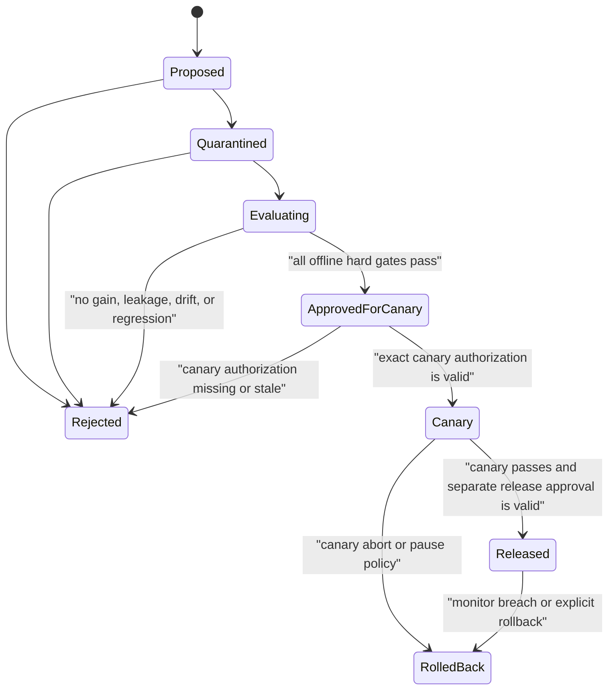
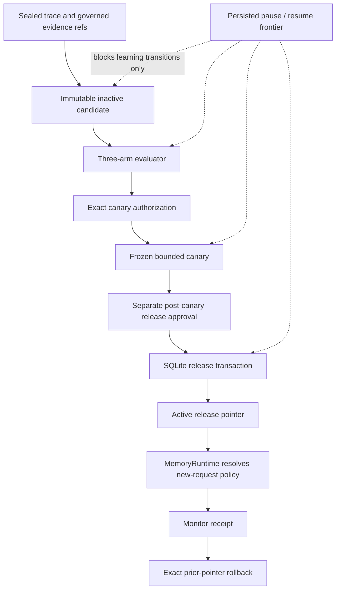
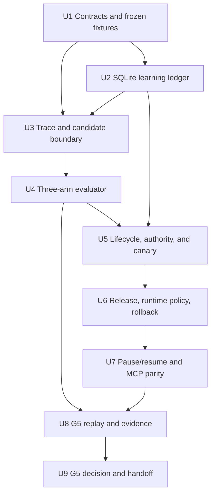
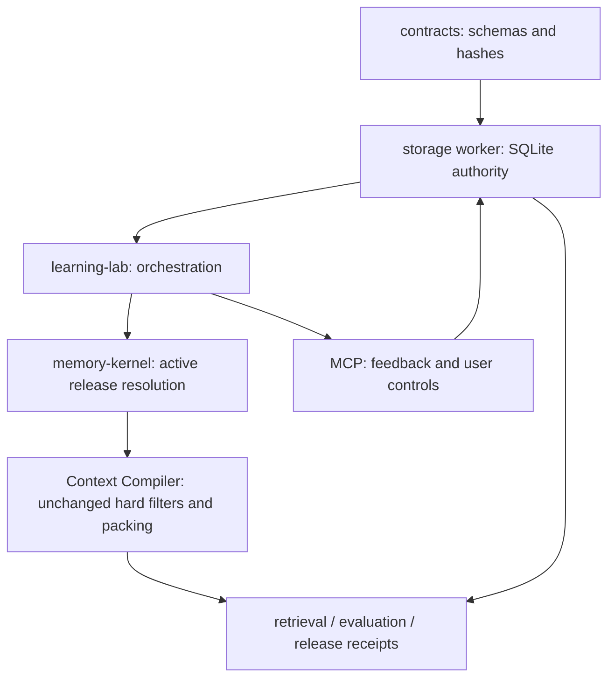

# M5 Governed Learning Lab

## Summary

M5 introduces `@memo-graph/learning-lab` as a governed change-control
boundary over the accepted vector-free runtime. It records privacy-minimal
sealed traces, proposes immutable inactive candidates, compares
`no_candidate`, `current`, and `candidate` on protected partitions, and
publishes only through exact authority, bounded synthetic canary, an atomic
release pointer, and replayable rollback.

The implementation reuses canonical contracts, the single SQLite writer,
existing approval/idempotency patterns, and the governed Context Compiler.
The first full G5 path uses an exact-scope-set retrieval-policy candidate that
can only narrow the operator policy. Memory and procedure candidates may
reference canonical memory candidates/revisions, but they cannot create a
second memory authority.

## Recorded Outcome

G5 is **GO** for the exact local synthetic release path recorded in
`docs/evaluations/g5-decision.md`. The tested implementation is
`91d810efe17632e64f5e9a3ddae81f8e9f0b9985`; the immutable evidence commit is
`b9c0907745cedf3315d7ab3f42a39c9afb8790eb`.

All frozen replay, negative-transfer, authority, canary, release, monitor,
pause/resume, rollback, resource, review, and artifact-integrity hard rules
passed. The qualified learned release is
`release:a8f7214a0c8a8db3b5f2515649b06c0ffc855ab68`; its exact prior/base release
and rollback target are `null`.

The synthetic monitor-breach drill intentionally ended after authorized
rollback on the restored base pointer. Automatic publication remains
disabled; graph/vector remain disabled under their independent `NO-GO`
decisions; M6 production hardening and G6 remain pending.

---

## Problem Frame

M0-M4B established SQLite authority, governed L1 lifecycle, layered Context,
and explicit graph/vector adoption decisions. The remaining hazard is that a
“learning” feature could bypass those boundaries by turning one task,
ambiguous feedback, self-evaluation, or repeated content directly into active
behavior.

M5 must make learning falsifiable and reversible. Evidence collection,
candidate generation, evaluation, approval, canary, publication, monitoring,
pause/resume, and rollback must remain separate durable steps. A rejected
candidate or a G5 `NO-GO` must leave ordinary governed recall and authorized
memory mutation unchanged.

---

## Assumptions

*This plan is written under the user's continuous-roadmap authorization
without a synchronous M5 plan-confirmation pause. These items are explicit,
reviewable implementation bets rather than new Product Contract
requirements.*

- `@memo-graph/learning-lab` is a new domain package. Contracts remain in
  `@memo-graph/contracts`; SQLite ownership remains in
  `@memo-graph/storage-sqlite`; runtime policy resolution remains in
  `@memo-graph/memory-kernel`; MCP remains the composition boundary.
- The G5 GO-path candidate is a retrieval-policy overlay bound to one
  canonically sorted exact scope set. It may remove lanes or lower limits
  within the configured operator ceiling; it cannot add a lane, raise a limit,
  enable graph/vector, change hard filters, or change canonical ranking
  authority.
- A declarative procedure is represented by a canonical procedural memory
  candidate. Memory/procedure learning records store only canonical
  candidate/revision references and hashes, not a duplicate content body.
- Releasing a memory/procedure candidate creates a governed active successor
  and projection work in the same SQLite transaction as the learning release
  version and active-pointer change. Rollback is append-only: it restores the
  exact prior learning release pointer and, where required, writes a governed
  successor with behavior identical to the named prior canonical revision.
- The local canary uses cases sealed before candidate implementation but kept
  inaccessible until `approved_for_canary`. It is not production traffic and
  does not establish production benefit.
- Every effect-bearing `learning_release` and `learning_rollback` requires a
  trusted, exact, single-use approval. Pause/resume also remain important
  mutations, but their effect is limited to the learning frontier.
- Canary uses a separate exact authorization issued after offline evaluation.
  The release approval is issued only after canary completion, so it can bind
  the immutable canary receipt without a circular grant.
- M5 may record and evaluate prompt, CoreProjection, or ScenarioPattern
  candidates, but cannot publish them. Skill/code publication and model
  parameter updates are rejected as unsupported.
- Each completed U-ID, evidence capture, gate decision, task archive, and
  journal entry is one independently verified commit.

---

## Requirements

The Product Contract is the only R-number authority. This plan implements
R16-R20 and refines F4, AE6, and AE7.

- **R16 — Evidence and candidate separation:** learning begins with a task
  outcome, explicit feedback, typed error, observed gap, or offline
  evaluation. It produces independent knowledge, retrieval, or behavior
  candidates and never implies model training.
- **R17 — Governed lifecycle:** every candidate follows proposal, evidence
  binding, three-arm evaluation, release or rejection, monitoring, and
  rollback. Repetition, source count, or self-review is not proof.
- **R18 — Authority and user control:** high-impact, low-confidence,
  sensitive, or long-term preference changes require explicit user authority.
  Learning pause cannot break basic governed reads.
- **R19 — Replayability:** trace, candidate, exclusion, evaluation, authority,
  canary, release pointer, monitor, pause/resume, and rollback records bind
  their immutable inputs and execution identity.
- **R20 — Non-regression:** G5 separately verifies task gain, continuity,
  relevance, Context pollution, conflict behavior, no-resurrection, cost,
  scope/privacy, and rollback. Aggregate gain cannot compensate for a critical
  regression.

**Origin actors:** A1 local user/operator, A2 Codex memory client/agent, A3
Learning Lab, A4 independent evaluator/oracles, A5 Memory Runtime.

**Origin flow:** F4 capture evidence → propose smallest reversible candidate →
run three complete arms on calibration/holdout/transfer → authorize bounded
canary → run canary → obtain a separate post-canary release approval → atomic
release → monitor or exact rollback; learning pause/resume is an orthogonal
persisted frontier.

**Origin acceptance examples:** AE6 harmful/narrow candidates do not publish
and remain exactly rollbackable; AE7 learning-off preserves ordinary governed
reads and explicitly authorized writes.

---

## Scope Boundaries

- No model training, reinforcement learning, fine-tuning, remote trainer, or
  parameter update.
- No automatic product-code, prompt, CoreProjection, ScenarioPattern, or Skill
  publication.
- No reopening G4A graph or G4B vector decisions. Every arm inherits the
  accepted FTS5/recency/layered/SQLite-relations configuration.
- No learned policy may widen the operator lane/limit ceiling or weaken
  authority, scope, sensitivity, lifecycle, conflict, tombstone, purge,
  Context, or receipt rules.
- No proposal, evaluation, or canary may change normal runtime behavior or
  the active release pointer.
- No holdout/transfer expected answer may be visible to proposal generation or
  calibration.
- No multi-user/fleet control plane, online production canary, remote
  synchronization, dashboard, or production-readiness claim.
- No M6 backup/disk/runbook/release-hardening implementation.
- No article or HTML output from the research run.

### Deferred to Follow-Up Work

- **M6:** release-frontier-aware backup/restore, disk pressure, doctor/audit,
  operational telemetry, fault drills, runbooks, and final G6 decision.
- **Future governed capability gate:** explicit publication adapters for
  prompts, CoreProjection, ScenarioPattern, or Skill artifacts.
- **Future production evidence:** real task distribution, human-calibrated
  outcomes, production canary, and fleet authority. Synthetic G5 evidence does
  not satisfy these claims.

---

## Context & Research

### Relevant Code and Patterns

- `packages/contracts/src/learning.ts` owns the provisional M5 vocabulary, but
  its `transcript_baseline`/`fts_baseline` arms and `approved` state do not
  match the frozen research result.
- `packages/contracts/src/mcp.ts` already reserves `memory_feedback`,
  `learning_pause`, `learning_resume`, `learning_release`, and
  `learning_rollback` with proposal/important-mutation safety classes.
- `packages/contracts/src/projections.ts` owns operator lane ceilings and the
  deterministic policy intersection used by recall.
- `packages/storage-sqlite/src/governance-repository.ts` demonstrates
  append-only revisions, compare-and-swap pointers, transaction guards,
  idempotency replay, approval consumption, outbox coupling, and sealed
  mutation receipts.
- `migrations/0001-evidence-ledger.sql` and
  `migrations/0005-tombstone-purge.sql` establish append-only evidence,
  mutation receipts, single-use approvals, and deletion/frontier behavior.
- `packages/memory-kernel/src/index.ts` is the existing policy/runtime boundary
  and must resolve an active learning policy before recall without moving
  storage or MCP concerns into the pure Context Compiler.
- `packages/graph-projection/src/benchmark.ts` and
  `tests/helpers/g4b-replay.ts` provide same-input arm identity, separated
  score dimensions, frozen artifact hashing, and evidence-verification
  patterns.
- `docs/evaluations/g3r-h3-decision.md`,
  `docs/evaluations/g4a-decision.md`, and
  `docs/evaluations/g4b-decision.md` are immutable inputs to G5.

### Institutional Learnings

- SQLite owns canonical identity, lifecycle, release pointers, and receipts;
  caches/projections remain derived.
- Runtime success and gate success are distinct. A decision must bind the
  exact executable, lockfile, schema, corpus, thresholds, reports,
  authorities, limitations, and rollback target.
- Hard filters run before relevance. A learned policy may narrow a configured
  choice but cannot grant eligibility.
- An immutable historical ContextSlice remains valid evidence of its original
  request. Release/rollback affects new requests and must not rewrite old
  slices.
- Idempotency replay happens before re-reading mutable evidence or approval.
- User-visible deletion/revocation takes effect before asynchronous physical
  cleanup; no learning pointer may resurrect an invalidated target.

### External and Claim/Evidence Grounding

- OpenAI evaluation guidance supports task-specific criteria, held-out cases,
  explicit pass/fail, pairwise baselines, and human calibration.
- OpenAI agent tracing supports trace/span hierarchy and explicit sensitive
  payload exclusion.
- scikit-learn guidance establishes split isolation, leakage prevention, and
  reproducible seeds.
- MLflow's version/alias separation supports immutable releases behind a
  mutable active reference.
- Argo Rollouts supports bounded exposure, persisted pause, stable-target
  comparison, and automatic abort.
- SQLite atomic-commit semantics support pointer/receipt/authority changes in
  one transaction.
- NIST's deployed-AI monitoring guidance prevents a synthetic offline result
  from being described as production benefit.
- The complete source mapping is in
  `.trellis/tasks/07-29-agent-memory-runtime-m5/research/claim-map.md` and
  `.trellis/tasks/07-29-agent-memory-runtime-m5/research/research-handoff.md`.

---

## Key Technical Decisions

| Decision | Selected approach | Why |
| --- | --- | --- |
| Learning kernel | Sealed evidence → immutable inactive candidate → protected three-arm evaluation → canary authorization → canary → post-canary release approval → atomic pointer → monitor/rollback | Makes every promotion independently falsifiable and reversible. |
| Authority plane | One SQLite learning ledger behind the existing storage worker | Prevents a second source of truth and reuses serialized transactions/recovery. |
| Candidate payload | Typed reference or declarative bounded policy, never executable code | Keeps the first release units inspectable, hashable, and exactly reversible. |
| Evaluation arms | Exactly `no_candidate`, `current`, `candidate` | Separates value over absence from incremental value over the accepted release. |
| Partitions | Frozen calibration, sealed holdout, distinct-family transfer | Exposes overfit and negative transfer while allowing bounded calibration. |
| Runtime policy | Active learned overlay can only narrow the operator ceiling | Learning cannot enable a rejected lane, raise work bounds, or weaken governance. |
| Release identity | Immutable release versions plus one CAS active pointer per release slot | Separates historical evidence from the currently selected behavior. |
| State | Immutable candidate plus append-only transition log; pause is an orthogonal persisted control epoch | Avoids rewriting history and makes lifecycle replay deterministic. |
| Canary | Frozen local canary cases with declared exposure/time/abort limits | Exercises promotion/abort mechanics without claiming production traffic evidence. |
| Rollback | Restore exact prior release pointer and emit a new rollback release/receipt in one transaction | Makes rollback auditable without mutating history. |
| Gate | Conjunctive hard rules; one critical failure forces rejection/NO-GO | Prevents average gain from hiding authority, privacy, deletion, or rollback failure. |

### D1. The Learning Lab owns orchestration, not authority

`@memo-graph/learning-lab` coordinates trace sealing, candidate qualification,
partition loading, arm execution, lifecycle checks, canary evaluation, and
release requests. It consumes public contracts and a storage port. It does not
open SQLite, parse MCP envelopes, or implement canonical memory eligibility.

The storage package owns every durable learning row and transition. The memory
kernel owns runtime consumption of the active retrieval-policy release. MCP
owns actor/scope claims and trusted approval acquisition.

### D2. Traces retain structure, provenance, and hashes before content

A trace binds task specification, frozen ContextSlice identities, ordered
trajectory evidence references, outcome, feedback/error/gap classifications,
active release set, accepted retrieval configuration, runtime/model/tool
versions, latency/tokens/side effects, scope, and a canonical seal.

Raw trajectory/tool/feedback bodies are not copied into learning tables.
Authorized content remains in existing evidence/blob storage and is referenced
by ID/hash. Redacted or omitted steps retain an ordinal, media class, hash,
and redaction reason so replay can distinguish “not retained” from “missing.”

### D3. Release capability is explicit per candidate type

- `memory` targets an existing canonical memory candidate/revision.
- `procedure` targets an existing canonical procedural memory
  candidate/revision.
- `retrieval_policy` stores a strict, scope-set-bound lane/limit overlay that
  can only narrow the operator policy.
- `prompt`, `core_projection`, and `scenario_pattern` are evaluation-only and
  cannot reach `approved_for_canary`.
- Skill/code/model updates are rejected at the contract boundary.

Every candidate binds exact evidence traces, base release set, release slot,
target/payload hash, expected improvement, protected invariants, risk,
authority class, evaluation contract, and rollback target. Proposal never
moves an active pointer.

### D4. Evaluation identity is shared before arms diverge

An evaluation run seals the common case set, partition manifest, task input,
frozen ContextSlice, readers/tools, base runtime, G3R/G4A/G4B decisions,
retrieval configuration, model/runtime/tool versions, dependency lock, budget,
scorer, thresholds, seed, and environment.

The arm-specific field is limited to:

- `no_candidate`: operator policy and no learned release;
- `current`: operator policy plus the frozen current active release;
- `candidate`: operator policy plus the frozen candidate.

Any other identity difference invalidates the run. Results separately record
task success, typed errors, negative transfer, Context/token cost, latency,
side effects, scope/privacy/governance failures, and critical regressions.

### D5. G5 uses predeclared conjunctive thresholds

The frozen G5 fixture set contains at least three cases in each partition and
explicit positive, negative-transfer, pollution, scope/privacy, conflict,
tombstone, and rollback controls.

GO requires all of the following:

1. all three arms complete every case with identical common identity;
2. candidate adds at least one required task unit over `current` in each of
   calibration, holdout, and transfer;
3. candidate adds at least one required task unit over `no_candidate` in each
   partition;
4. no candidate case loses a required task unit that `current` passed;
5. critical regressions, scope/privacy violations, unauthorized effects,
   tombstone resurrection, Context pollution increases, and budget overflow
   are all zero;
6. candidate compile p95 remains within the accepted 400 ms Context envelope
   and no more than 20% or 25 ms above `current`, whichever allowance is
   larger;
7. the independently sealed three-case canary passes exactly one exposure per
   case within ten minutes, with zero early visibility, drift, side effects,
   or hard-regression failure;
8. exact rollback restores the named prior pointer and subsequent new requests
   reproduce the prior behavior/configuration hash.

Missing evidence is failure. A failed hard rule produces a supported rejection
or G5 `NO-GO`; it never triggers threshold tuning or candidate widening.

### D6. Release slots make multi-scope policy deterministic

A release slot is a canonical hash over principal, candidate type, canonically
sorted exact scope set, and target key. Retrieval-policy resolution occurs once
for the entire recall request's normalized exact scope set, then supplies the same
resolved policy and release reference to every per-scope recall. This avoids
combining different learned policies under one Context receipt.

Requests with no exact slot use the operator policy. Requests with a stale,
invalid, purged, or unresolvable target fail closed to the named prior/base
configuration with typed degradation; they do not choose a “nearby” scope.
Learned retrieval policy is never an ACL, sensitivity rule, mandatory
exclusion, or safety policy. Those remain canonical hard filters, so base
fallback cannot widen authorization.

### D7. Canary authorization and release authority are exact and non-circular

Canary authorization binds principal, candidate, release slot, base release,
evaluation receipt, canary manifest, scopes, issue/expiry time, and manifest
hash. It permits only the sealed candidate/stable comparison and cannot move a
normal runtime pointer.

After canary completion, a separate release approval binds principal, tool,
canonically sorted exact scope set, candidate, release slot, base release,
evaluation receipt, canary receipt, expected pointer revision, request hash,
manifest hash, issuance, expiry, and required authority class. The
proposer/evaluator cannot create either grant.

The runtime checks the post-canary release approval before the effect, confirms
the manifest is unchanged at the effect boundary, and consumes it in the same
transaction as the new release version, pointer CAS, transition, and receipt.
Replay of the same idempotency key returns the durable result before rechecking
an expired or consumed approval.

### D8. Pause is a control frontier, not a runtime outage

Learning control state is per principal and stores status, monotonic epoch,
reason code, time, and frontier hash. Pause blocks new trace-to-candidate,
evaluation-start, canary-start/promotion, and release transitions.

An already running evaluation may write its terminal receipt but cannot
authorize or publish. A canary freezes and records its stop reason. Resume
requires exact frontier, runtime/config/corpus identity, and fresh authority;
drift forces re-evaluation or explicit abandonment. Recall, Context compile,
and authorized ordinary memory writes do not consult the learning pause as an
availability gate.

Pause and release requests carry the observed control epoch and are serialized
by the SQLite writer. If pause commits first, the release sees a stale epoch
and fails. If release commits first, pause records that release in its frontier
and reports `RELEASE_COMPLETED_BEFORE_PAUSE`; the release is never silent, and
an explicit rollback remains available.

### D9. Monitoring and rollback are release-versioned and no-resurrection-aware

Every release freezes monitor metrics and abort thresholds. A breach creates a
monitor receipt and may request rollback, but it cannot mutate the pointer
outside the governed rollback transaction.

The M5 monitor replays each independently sealed canary input once through the
new active pointer. This proves pointer/runtime consumption and drift
detection, not new utility evidence. Any mismatch, critical failure, or
threshold breach records a failed monitor and blocks G5 GO until an authorized
rollback restores the prior pointer.

Rollback names the exact active release version and exact prior target. One
transaction validates pointer CAS, candidate/target eligibility, authority,
monitor/canary identity, and release configuration; writes the rollback
version, transition and receipt; restores the active pointer; and schedules
any required canonical projection effects.

Old ContextSlices and evaluation records remain immutable audit evidence.
New requests resolve the restored pointer. A deleted, revoked, superseded,
purged, cross-scope, or otherwise ineligible target can never be restored;
rollback instead fails closed and keeps the safer current/base configuration.

---

## Open Questions

### Resolved During Planning

- **What is the minimal trace?** Structured task/Context/trajectory references,
  outcome/feedback/error/gap categories, release/config/runtime identity,
  costs/side effects, redaction metadata, and a canonical seal. Raw bodies stay
  in governed evidence storage.
- **Which candidates can publish?** Canonical memory revision, canonical
  procedural memory revision, and a narrowing retrieval-policy overlay.
  Prompt/Core/Scenario remain evaluation-only; Skill/code/model updates are
  unsupported.
- **How are three arms compared?** One shared frozen identity with only the
  active candidate/release mode varied; calibration, sealed holdout, and
  distinct-family transfer are reported independently.
- **How is self-publication prevented?** Append-only lifecycle transitions,
  exact evaluation/canary receipts, a trusted external approval, time-of-effect
  revalidation, single consumption, and pointer CAS.
- **How does pause affect in-flight work?** Evaluation may finish a receipt
  but cannot publish; canary freezes; resume revalidates the full frontier.
- **What proves G5?** Predeclared per-partition gain, zero critical regression,
  bounded cost, canary success, exact rollback, and a hash-bound evidence
  manifest.

### Deferred to Implementation

- **Internal helper names and repository statement grouping:** finalize while
  preserving the package boundaries and transaction invariants in this plan.
- **Whether memory/procedure activation shares a private governance helper or
  a transaction-capable adapter:** decide after characterization tests expose
  the smallest safe refactor. The externally observable atomicity and
  append-only behavior are fixed.
- **Exact frozen case content:** U1 writes and hashes it before any candidate
  behavior is implemented. The partitions, risk families, arm identity, and
  thresholds above are not deferred.

---

## Output Structure

```text
packages/
  learning-lab/
    package.json
    tsconfig.json
    src/
      candidate-builder.ts
      canary-runner.ts
      evaluation-runner.ts
      index.ts
      lifecycle.ts
      partition-loader.ts
      release-manager.ts
      trace-recorder.ts
fixtures/
  g5/
    manifest.json
    thresholds.json
    calibration/
    holdout/
    transfer/
    canary/
tests/
  learning/
  helpers/
    g5-replay.ts
docs/
  evaluations/
    g5-*.json
    g5-code-review.md
    g5-decision.md
    g5-reproducibility-manifest.json
```

The tree is directional scope guidance. Unit file lists are authoritative, and
implementation may combine private files when that reduces complexity without
mixing package responsibilities.

---

## High-Level Technical Design

> *This illustrates the intended approach and is directional guidance for
> review, not implementation specification. The implementing agent should
> treat it as context, not code to reproduce.*



Pause/resume is orthogonal to candidate state:



The implementation-unit dependency graph is:



---

## Implementation Units

- U1. **Freeze learning contracts, G5 thresholds, and partition manifests**

**Goal:** Replace the provisional learning vocabulary with strict,
hash-addressed M5 artifacts and freeze the evaluation problem before
behavioral implementation.

**Requirements:** R16-R20; F4; AE6/AE7.

**Dependencies:** None.

**Files:**

- Modify: `packages/contracts/src/learning.ts`
- Modify: `packages/contracts/src/mcp.ts`
- Modify: `packages/contracts/src/tool-inputs.ts`
- Modify: `packages/contracts/src/projections.ts`
- Modify: `packages/contracts/src/receipts.ts`
- Modify: `packages/contracts/src/replay.ts`
- Modify: `packages/contracts/src/index.ts`
- Create: `fixtures/g5/manifest.json`
- Create: `fixtures/g5/thresholds.json`
- Create: `fixtures/g5/calibration/*.json`
- Create: `fixtures/g5/holdout/*.json`
- Create: `fixtures/g5/transfer/*.json`
- Create: `fixtures/g5/canary/*.json`
- Modify: `tests/contract/learning.contract.test.ts`
- Modify: `tests/contract/mcp.contract.test.ts`
- Modify: `tests/contract/receipts.contract.test.ts`
- Create: `tests/fixtures/g5-overlay.fixture.test.ts`

**Approach:**

- Define schemas for privacy-minimal traces, ordered step references, immutable
  candidates, release capability, release slots, candidate transitions,
  common run identity, arm results, partition seals/visibility, evaluation
  receipts, separate canary authorization and post-canary release approval,
  canary contracts, release versions/pointers, monitor results, pause/resume
  frontiers, rollback receipts, and G5 evidence.
- Replace evaluation arms with exactly `no_candidate`, `current`, and
  `candidate`; replace `approved` with `approved_for_canary` plus `canary`.
- Preserve backward compatibility only where an optional new field can be
  absent without changing an old artifact hash. Explicitly reject obsolete M5
  arm/status inputs rather than silently translating them.
- Freeze at least three cases per evaluation partition, three independent
  canary cases, and all required risk families before candidate behavior
  exists. Canary bodies/oracles remain inaccessible until the candidate has
  reached `approved_for_canary`.
- Freeze the D5 thresholds, accepted G3R/G4A/G4B identities, and vector-free
  retrieval configuration in the G5 manifest.

**Execution note:** Start with failing contract and fixture tests. Search every
consumer of the changed arm/status unions before changing the schemas.

**Patterns to follow:**

- `packages/contracts/src/replay.ts`
- `packages/contracts/src/vector.ts`
- `fixtures/g4b/manifest.json`
- `tests/fixtures/g4b-overlay.fixture.test.ts`

**Test scenarios:**

- Happy path: decode a complete trace, candidate, three-arm run, transition,
  canary authorization, post-canary release approval, canary, release,
  pause/resume, rollback, and G5 envelope.
- Error path: reject a trace missing task/Context/config/runtime identity or
  whose seal does not match canonical content.
- Error path: reject a candidate with executable payload, duplicated evidence,
  mutable base identity, missing rollback target, or unsupported release
  capability.
- Error path: reject obsolete arm/status values, a run missing one arm, or
  candidate-specific drift in common identity.
- Security: reject a trace step that embeds unapproved raw tool/Context content
  where only a reference/redaction is allowed.
- Partition: reject duplicate case IDs, partition-path mismatch, post-freeze
  mutation, expected-answer visibility, missing calibration/holdout/transfer
  coverage, or canary access before `approved_for_canary`.
- Covers F4 / AE6: accept a harmful candidate fixture as evaluable but not
  releaseable.
- Covers F4 / AE7: encode learning pause independently from normal memory
  operation status.
- Compatibility: old G3R/G4A/G4B artifacts without optional learning release
  metadata retain their canonical hashes.

**Verification:**

- Contract and fixture suites pass with intentional invalid fixtures failing
  for the declared reason.
- Every G5 case, threshold, partition, risk family, and accepted baseline hash
  is frozen and reviewable.
- No product implementation exists outside contracts/fixtures.

---

- U2. **Persist the append-only learning ledger and release frontiers**

**Goal:** Add SQLite authority for traces, candidates, transitions,
evaluations, canaries, control epochs, immutable release versions, active
release pointers, approvals, monitors, and rollback receipts.

**Requirements:** R16-R20; F4.

**Dependencies:** U1.

**Files:**

- Create: `migrations/0014-learning-lab.sql`
- Create: `packages/storage-sqlite/src/learning-repository.ts`
- Modify: `packages/storage-sqlite/src/protocol.ts`
- Modify: `packages/storage-sqlite/src/database.ts`
- Modify: `packages/storage-sqlite/src/storage-worker.ts`
- Modify: `packages/storage-sqlite/src/client.ts`
- Modify: `packages/storage-sqlite/src/restore.ts`
- Modify: `packages/storage-sqlite/src/purge-repository.ts`
- Modify: `packages/storage-sqlite/src/index.ts`
- Create: `tests/storage/learning-lab-schema.integration.test.ts`
- Create: `tests/recovery/learning-ledger.recovery.test.ts`
- Create: `tests/security/learning-ledger-residual.test.ts`

**Approach:**

- Keep trace/candidate/release-version/result/receipt rows immutable; use an
  append-only transition sequence to derive candidate state.
- Maintain guarded mutable rows only for the active release pointer and
  per-principal learning control state, each with explicit revision/epoch CAS.
- Persist candidate payloads as typed references or bounded declarative policy
  JSON. Do not duplicate memory/procedure text.
- Couple every effect, idempotency record, approval consumption, pointer/control
  change, transition, and receipt in one immediate transaction.
- Add strict worker request/response decoders and expose only public storage
  operations through `SqliteStorageClient`.
- Carry learning release/control frontiers into health and restore validation;
  M6 will complete backup/runbook policy.
- On canonical delete/purge, invalidate learning targets and prevent a release
  or rollback pointer from resolving a purged memory.

**Execution note:** Characterize current migration, writer-worker,
idempotency, approval-consumption, and crash-rollback behavior before adding
the new repository.

**Patterns to follow:**

- `migrations/0001-evidence-ledger.sql`
- `migrations/0005-tombstone-purge.sql`
- `packages/storage-sqlite/src/governance-repository.ts`
- `packages/storage-sqlite/src/control-repository.ts`
- `tests/governance/revision-cas.integration.test.ts`

**Test scenarios:**

- Happy path: upgrade a current M4B database and append one complete trace,
  candidate, transition sequence, evaluation, canary, release, monitor, and
  rollback chain.
- Idempotency: replay the same request/hash and return the same durable result;
  reuse the key with another hash and return conflict.
- Concurrency: two transitions from one expected state/revision yield one
  success and one typed conflict.
- Atomicity: inject failure before/after pointer, receipt, transition, control,
  approval, and outbox writes; reopen and observe either the entire old state
  or the entire new state.
- Append-only: direct update/delete of trace, candidate, transition, result,
  release version, monitor, or rollback rows fails.
- Error path: reject cross-principal/scope targets, missing base release,
  backward sequence, duplicate release slot/version, stale pointer, and reused
  approval.
- Recovery: reopen WAL after interrupted evaluation/control/release operations
  and reproduce the same current state from durable rows.
- Security: marker content in referenced evidence does not appear in learning
  tables, worker errors, health, or diagnostics.
- No-resurrection: tombstone/purge makes a referenced candidate unresolvable
  and blocks release/rollback to that target.

**Verification:**

- Migration upgrade/reopen and schema-drift checks pass.
- SQLite contains one authoritative, replayable learning state with no second
  content store.
- Crash injection proves pointer/receipt/authority atomicity.

---

- U3. **Build privacy-minimal trace recording and smallest-candidate qualification**

**Goal:** Create the Learning Lab package and ensure incomplete, ambiguous,
paused, unsafe, broad, or non-reversible evidence stops before candidate
creation.

**Requirements:** R16, R18, R19; F4.

**Dependencies:** U1, U2.

**Files:**

- Create: `packages/learning-lab/package.json`
- Create: `packages/learning-lab/tsconfig.json`
- Create: `packages/learning-lab/src/trace-recorder.ts`
- Create: `packages/learning-lab/src/candidate-builder.ts`
- Create: `packages/learning-lab/src/index.ts`
- Modify: `package.json`
- Create: `tests/learning/trace-and-candidate.test.ts`
- Create: `tests/security/learning-trace-redaction.test.ts`
- Create: `tests/integration/learning-candidate-boundary.integration.test.ts`

**Approach:**

- Decode unknown input once through contract schemas, resolve authorized
  evidence/Context references through storage, then seal and persist a trace.
- Preserve positive, negative, and conflicting signals as separate typed
  observations. Do not synthesize agreement by count.
- Emit a typed stop receipt for missing provenance, learning pause, sensitive
  retention risk, ambiguous authority, unsupported candidate type,
  non-reversible target, anecdotal-only evidence, or scope widening.
- Choose the smallest release-capable type: canonical memory revision,
  canonical procedural revision, then bounded retrieval policy. Broader
  evaluation-only types never become release-capable.
- Bind every candidate to the exact trace set, base release set, expected
  improvement, invariant set, scope-set release slot, evaluation contract, and
  rollback target.

**Execution note:** Implement trace and candidate behavior test-first; do not
  add automatic candidate heuristics beyond deterministic fixture-supported
  rules.

**Patterns to follow:**

- `packages/memory-kernel/src/governance.ts`
- `packages/storage-sqlite/src/governance-repository.ts`
- `packages/contracts/src/canonical-json.ts`

**Test scenarios:**

- Happy path: a failed task with frozen Context, typed error, explicit feedback
  evidence, active release/config identity, and bounded gap produces one sealed
  trace and one inactive candidate.
- Evidence ordering: reorder trajectory/evidence steps and prove the trace seal
  changes while canonical replay preserves the declared order.
- Conflicting evidence: positive and negative feedback remain distinct and
  lower confidence/authority rather than being collapsed.
- Covers F4: prefer a bounded memory/procedure/retrieval policy over a prompt,
  CoreProjection, ScenarioPattern, Skill, or code change.
- Error path: missing Context/provenance/failure class creates a stop receipt
  and zero candidate rows.
- Error path: a candidate with no exact base, rollback target, invariant set,
  or release slot is rejected.
- Covers AE7: learning paused before qualification records a stop and creates
  no candidate.
- Security: sensitive raw trajectory/tool payloads are redacted or referenced;
  marker text is absent from package errors and storage.
- Candidate-only: proposal leaves normal Context output and the active release
  pointer byte-identical.

**Verification:**

- Complete evidence produces a reproducible inactive candidate.
- Every unsafe/incomplete path produces a typed stop with zero publication
  effect.
- The package has no SQLite driver, MCP SDK, graph/vector, or model dependency.

---

- U4. **Run protected three-arm evaluation with leakage and drift detection**

**Goal:** Compare one immutable candidate against absence and the current
release on identical frozen inputs while protecting holdout and transfer
oracles.

**Requirements:** R17, R19, R20; F4; AE6.

**Dependencies:** U3.

**Files:**

- Create: `packages/learning-lab/src/partition-loader.ts`
- Create: `packages/learning-lab/src/evaluation-runner.ts`
- Modify: `packages/learning-lab/src/index.ts`
- Create: `tests/helpers/g5-replay.ts`
- Create: `tests/learning/three-arm-evaluation.test.ts`
- Create: `tests/security/learning-partition-isolation.test.ts`
- Create: `tests/replay/learning-negative-transfer.test.ts`

**Approach:**

- Expose calibration bodies to bounded candidate iteration only through the
  declared runner interface. Keep holdout/transfer expected outputs in a
  sealed scorer boundary.
- Freeze one common identity before executing arms; allow only the candidate
  application mode to differ.
- Run every case/arm with isolated state or restored snapshots so one arm
  cannot affect another.
- Report task units, typed failures, negative transfer, selected Context,
  token use, latency, side effects, scope/privacy/governance, and critical
  regression separately.
- Invalidate, rather than score, a run on missing arm, payload mutation,
  partition leakage, config drift, scorer drift, environment drift,
  non-replayable result, or side effect.
- Evaluate D5 as conjunctive rules and persist a signed evaluation receipt plus
  per-case results.

**Execution note:** Freeze the runner identity and write leakage/drift failures
before implementing a passing candidate path.

**Patterns to follow:**

- `packages/graph-projection/src/benchmark.ts`
- `tests/helpers/g4b-replay.ts`
- `tests/replay/layered-context-replay.test.ts`

**Test scenarios:**

- Happy path: all three arms complete every calibration, holdout, and transfer
  case under one common identity.
- Arm semantics: `no_candidate` has no learned release, `current` uses the
  frozen active pointer, and `candidate` uses only the frozen candidate.
- Error path: missing/duplicate arm, changed case input, changed policy,
  changed seed/scorer/runtime, or post-freeze candidate mutation invalidates
  the run.
- Leakage: proposal/calibration cannot read holdout/transfer expected outputs;
  attempted read records contamination and blocks approval.
- Covers AE6: calibration-only gain plus holdout harm or transfer failure
  produces rejection even when aggregate score rises.
- Negative transfer: a distinct scope/scenario family regression is reported
  separately and is a hard fail.
- Side effects: evaluation creates only evaluation rows/receipts; active
  pointer, canonical memory, and normal Context remain unchanged.
- Replay: identical frozen identity reproduces logical results and hashes;
  drift produces a new run identity and cannot reuse approval.

**Verification:**

- The runner can explain every pass, failure, invalidation, and hard-stop rule
  by case/partition/arm.
- No holdout/transfer oracle reaches proposal code.
- A harmful or incomplete candidate cannot advance beyond `evaluating`.

---

- U5. **Enforce lifecycle, exact authority, and bounded canary**

**Goal:** Guard candidate transitions so offline success alone cannot
self-authorize or publish a candidate.

**Requirements:** R17-R20; F4; AE6.

**Dependencies:** U2, U4.

**Files:**

- Create: `packages/learning-lab/src/lifecycle.ts`
- Create: `packages/learning-lab/src/canary-runner.ts`
- Modify: `packages/learning-lab/src/index.ts`
- Modify: `packages/memory-kernel/src/approval.ts`
- Modify: `packages/mcp-server/src/mutations.ts`
- Create: `tests/learning/candidate-lifecycle.test.ts`
- Create: `tests/learning/learning-canary.test.ts`
- Create: `tests/security/learning-release-authorization.test.ts`

**Approach:**

- Implement one exhaustive transition reducer over the state diagram; each
  transition names expected prior transition, reason, actor, evidence receipt,
  control epoch, and idempotency key.
- Permit `approved_for_canary` only from a complete valid evaluation meeting
  all hard rules and only for a release-capable candidate.
- Define a canary authorization over candidate/base/evaluation/canary-manifest
  identity, then extend trusted release/rollback approvals with exact
  candidate, slot, base, evaluation, canary receipt, request, scope, expected
  pointer, manifest, issue, and expiry identity while preserving old grants.
- Require time-of-effect manifest revalidation and single consumption for
  each authorization/approval.
- Run a bounded canary against a post-approval-readable sealed case list,
  stable/current comparator, exposure count, duration, and promote/abort
  metrics. The cases were sealed before candidate implementation but become
  readable only after approval. Canary has no normal runtime pointer effect.

**Execution note:** Characterize current approval grants/manifests first and
  preserve byte/hash compatibility for non-learning tools.

**Patterns to follow:**

- `packages/memory-kernel/src/approval.ts`
- `packages/mcp-server/src/mutations.ts`
- `packages/storage-sqlite/src/control-repository.ts`

**Test scenarios:**

- Happy path: a valid evaluated release-capable candidate advances through
  quarantine, evaluation, approval, and canary with one receipt per step.
- Exhaustiveness: every illegal skip, backward transition, terminal-state
  transition, stale expected state, and duplicate different-hash request is
  rejected.
- Canary authority: missing, expired, changed, or wrong-principal/scope/
  candidate/base/evaluation/manifest authorization prevents canary start.
- Release authority: missing, expired, changed, wrong-principal/tool/scope/
  candidate/base/evaluation/canary/pointer approval fails before effect.
- Self-approval: proposer/evaluator evidence cannot serve as release authority.
- Single use: one approval authorizes one exact release request; replay of the
  same idempotency key returns the same result.
- Capability: prompt/Core/Scenario and unsupported Skill/code/model
  candidates cannot reach canary.
- Canary success: every frozen exposure passes declared metrics without normal
  pointer movement.
- Canary isolation: three independent pre-frozen cases run once each only
  after approval and complete inside the ten-minute deadline.
- Canary failure: threshold breach, config drift, timeout, pause, or critical
  regression freezes/aborts and prevents publication.

**Verification:**

- The append-only transition history deterministically derives one legal
  terminal/current state.
- No evaluator or stale approval can publish.
- Canary success/failure is reproducible and bounded.

---

- U6. **Publish release versions, resolve runtime policy, and roll back exactly**

**Goal:** Make the active release explicit and reversible while preserving
canonical memory governance and unchanged base behavior when no candidate is
active.

**Requirements:** R17-R20; F4; AE6.

**Dependencies:** U5.

**Files:**

- Create: `packages/learning-lab/src/release-manager.ts`
- Modify: `packages/learning-lab/src/index.ts`
- Modify: `packages/storage-sqlite/src/learning-repository.ts`
- Modify: `packages/storage-sqlite/src/governance-repository.ts`
- Modify: `packages/storage-sqlite/src/protocol.ts`
- Modify: `packages/storage-sqlite/src/database.ts`
- Modify: `packages/storage-sqlite/src/storage-worker.ts`
- Modify: `packages/storage-sqlite/src/client.ts`
- Modify: `packages/memory-kernel/src/index.ts`
- Modify: `packages/memory-kernel/src/recall-orchestrator.ts`
- Modify: `packages/contracts/src/projections.ts`
- Modify: `packages/contracts/src/receipts.ts`
- Create: `tests/integration/learning-release.integration.test.ts`
- Create: `tests/governance/learning-memory-release.integration.test.ts`
- Create: `tests/recovery/learning-release-rollback.recovery.test.ts`
- Create: `tests/replay/learning-release-pointer.test.ts`

**Approach:**

- Store immutable release versions separately from one active pointer per
  canonical release slot.
- For retrieval policy, resolve the exact scope-set slot once, validate the
  target and active release, then intersect the learned overlay with the
  operator policy. The resolved release reference/configuration hash enters
  recall and Context receipts.
- For memory/procedure, reuse canonical candidate/evidence identity and add the
  smallest private governance adapter needed to create an active append-only
  successor. Do not update immutable revisions or store duplicate content.
- Release transaction validates expected pointer/state/control epoch,
  candidate target, evaluation, canary, authority and configuration; consumes
  approval; writes release version, pointer, transition, canonical/outbox
  effects, idempotency, and receipt atomically.
- Rollback names the exact active and prior release, validates the prior target
  remains eligible, writes a rollback release/receipt, restores the pointer,
  and schedules inverse canonical/projection effects atomically.
- New request IDs consume the current pointer. Old frozen ContextSlices remain
  historical and are never rewritten.

**Execution note:** Start with crash-injection and no-effect characterization;
keep transaction composition private to the SQLite package.

**Patterns to follow:**

- `packages/storage-sqlite/src/governance-repository.ts`
- `packages/storage-sqlite/src/projection-effects.ts`
- `packages/memory-kernel/src/index.ts`
- `tests/recovery/writer-restart.recovery.test.ts`

**Test scenarios:**

- Retrieval policy: active candidate removes a permitted noisy lane/lowers a
  bound but cannot add a lane, raise a limit, enable graph/vector, or alter
  hard filters. Candidate payload cannot encode ACL, sensitivity, mandatory
  exclusion, or another safety rule.
- Scope-set identity: exact matching canonical set sorting resolves one
  release; subset/superset/foreign scopes do not.
- Base behavior: no active release yields the accepted G3R/G4A/G4B
  vector-free configuration and old artifact hashes.
- Memory/procedure: release creates an active governed successor from the
  canonical candidate with exact lineage and no duplicate learning content.
- Atomicity: injected failure at every release/rollback write leaves either
  the full prior state or the full new state after reopen.
- Covers AE6: rollback restores the exact named prior release pointer and new
  Context requests reproduce prior configuration/behavior hashes.
- No-resurrection: rollback refuses a revoked, tombstoned, purged,
  superseded-invalid, cross-scope, or changed target.
- Stale Context: a new request after release/rollback uses the new/restored
  pointer; the old request ID replays its original frozen Context.
- Concurrency: two releases or rollback/release from one pointer revision yield
  one success and one typed conflict.
- Pause/release race: SQLite serialization makes the first committed control
  epoch authoritative and records whether release completed before pause.
- Recovery: after process death, approval is consumed exactly when the pointer
  effect exists and never otherwise.

**Verification:**

- Release and rollback have one SQLite commit boundary and one replayable
  result.
- Learned retrieval can only narrow the operator ceiling.
- Normal runtime has no dependency on a candidate/evaluation process.

---

- U7. **Expose feedback, pause/resume, release, rollback, and inspection through MCP**

**Goal:** Complete the user/operator control surface and prove learning control
does not become a memory-runtime availability dependency.

**Requirements:** R16-R20; F4; AE7.

**Dependencies:** U6.

**Files:**

- Modify: `packages/contracts/src/tool-inputs.ts`
- Modify: `packages/contracts/src/mcp.ts`
- Modify: `packages/mcp-server/src/index.ts`
- Modify: `packages/memory-kernel/src/index.ts`
- Modify: `packages/storage-sqlite/src/client.ts`
- Modify: `packages/storage-sqlite/src/protocol.ts`
- Create: `tests/mcp/learning-controls.integration.test.ts`
- Create: `tests/integration/learning-pause-runtime-continuity.integration.test.ts`
- Create: `tests/recovery/learning-pause-resume.recovery.test.ts`

**Approach:**

- Implement strict inputs and runtime handlers for `memory_feedback`,
  `learning_pause`, `learning_resume`, `learning_release`, and
  `learning_rollback`.
- Keep tool safety metadata exhaustive and preserve trusted-approval,
  idempotency, expected pointer/control revision, actor, and exact scope
  checks.
- Add a read-only learning inspection resource containing content-free control
  status, active release references, candidate state, limitations, and receipt
  IDs; resources never inject themselves into model Context.
- Pause persists a new epoch/frontier and blocks learning transitions only.
  Resume validates expected epoch plus runtime/config/corpus identity and
  requires reevaluation when drifted.
- Do not route ordinary `memory_search`, `memory_get`,
  `memory_context_compile`, or authorized memory mutations through the
  learning pause check.

**Execution note:** Begin with MCP contract and runtime-continuity tests before
registering handlers.

**Patterns to follow:**

- `packages/contracts/src/tool-inputs.ts`
- `packages/mcp-server/src/index.ts`
- `tests/mcp/governance-mutations.integration.test.ts`
- `tests/integration/codex-explicit-loop.integration.test.ts`

**Test scenarios:**

- Feedback: explicit user feedback becomes governed evidence/trace input and
  never directly changes an active release.
- Pause: exact trusted request advances control epoch and emits a durable
  receipt; duplicate same request replays; changed request conflicts.
- Covers AE7: while paused, search/get/Context compile and an authorized
  ordinary memory write still succeed, while proposal/evaluation/canary/
  release transitions stop.
- In-flight evaluation: may write a terminal evaluation receipt after pause
  but cannot advance candidate/release state.
- In-flight canary: freezes/aborts under the declared policy and cannot
  publish.
- Resume: exact unchanged frontier resumes; runtime/config/corpus or authority
  drift requires reevaluation/abandon and cannot continue stale work.
- Release/rollback: wrong safety class, principal, scopes, expected pointer,
  approval, candidate, evaluation, or canary fails with typed response.
- Metadata parity: every registered tool has exactly one safety class and
  correct read-only/destructive/idempotent annotations.
- Restart: pause/control epoch, active pointer, and pending/frozen work survive
  MCP/storage restart.
- Privacy: resource/error output contains IDs, hashes, status, and codes but
  no raw trace/evidence/Context content.

**Verification:**

- The five reserved M5 tools are implemented and contract/metadata parity
  passes.
- Learning pause is durable and observable without degrading core memory.
- All effect-bearing learning calls return or reference a durable receipt.

---

- U8. **Run the frozen G5 replay, canary, rollback, and evidence verifier**

**Goal:** Execute the complete M5 pipeline on the frozen corpus and bind
reproducible evidence without deciding by narrative.

**Requirements:** R16-R20; F4; AE6/AE7.

**Dependencies:** U4, U7.

**Files:**

- Create: `scripts/run-g5-replay.mjs`
- Create: `scripts/run-g5-canary.mjs`
- Create: `scripts/run-g5-resource-report.mjs`
- Create: `scripts/verify-g5-evidence.mjs`
- Modify: `package.json`
- Modify: `tests/helpers/g5-replay.ts`
- Create: `tests/integration/g5-artifact-integrity.test.ts`
- Create: `docs/evaluations/g5-replay-report.json`
- Create: `docs/evaluations/g5-canary-report.json`
- Create: `docs/evaluations/g5-resource-report.json`
- Create: `docs/evaluations/g5-reproducibility-manifest.json`
- Create: `docs/evaluations/g5-verification-report.json`
- Create: `docs/evaluations/g5-code-review.md`

**Approach:**

- Execute the three arms through the same governed reader, Context Compiler,
  budgets, tools, scorers, runtime, and vector-free configuration.
- Use one frozen narrowing retrieval-policy candidate to exercise the complete
  GO path; do not tune it after holdout/transfer output is visible.
- Exercise at least one harmful/overfit candidate and prove hard rejection
  without pointer change.
- Exercise exact authority, the independently sealed canary, release, monitor
  success/breach, pause/resume, rollback, crash recovery, and ordinary-runtime
  continuity.
- Capture source commit/tree, lockfile, migration hashes, Node/pnpm/SQLite/
  platform, G3R/G4A/G4B decisions, accepted retrieval config, corpus,
  partitions, scorers, thresholds, seeds, reports, approvals, canary,
  limitations, and rollback target.
- Make the verifier recompute every referenced file hash and conjunctive rule.
  Narrative files do not override machine evidence.

**Execution note:** Evidence is captured only from a clean, committed
implementation tree; if U1-U7 verification is not green, do not manufacture a
G5 result.

**Patterns to follow:**

- `scripts/run-g4b-replay.mjs`
- `scripts/verify-g4b-evidence.mjs`
- `docs/evaluations/g4b-reproducibility-manifest.json`
- `tests/integration/g4b-artifact-integrity.test.ts`

**Test scenarios:**

- Complete path: sealed trace → inactive candidate → three arms → approval →
  canary → release → monitor → rollback produces a fully linked receipt chain.
- Gate gain: the selected candidate meets per-partition current/no-candidate
  deltas without any per-case regression.
- Harmful path: calibration gain with holdout/transfer regression is rejected
  and leaves the pointer/base Context unchanged.
- Pause path: pause blocks learning effects while core reads/writes pass, then
  exact resume revalidates the frontier.
- Integrity: changing source/tree, lock, migration, fixture, threshold,
  report, approval, canary, decision input, or rollback target makes the
  verifier fail.
- Reproducibility: two runs on the same committed tree yield identical logical
  case/receipt identities while timing distributions remain separately
  reported.
- Resource: candidate stays within D5 Context latency/token limits and reports
  rather than hides variance.
- Boundary: reports state that synthetic evidence proves the frozen test
  distribution and gate mechanics only.

**Verification:**

- All U1-U7 focused suites, full repository quality gates, G5 scripts, and
  artifact-integrity tests pass.
- The verifier yields one machine result with every failed/passed hard rule and
  no unsupported production claim.
- Evidence capture is its own commit, separate from the G5 decision.

---

- U9. **Record G5 GO or NO-GO and hand off an immutable M6 baseline**

**Goal:** Convert verified evidence into exactly one G5 decision, preserve the
candidate-only fallback, and update parent roadmap status without archiving the
Trellis child or starting M6 inside the same commit.

**Requirements:** R16-R20; F4; AE6/AE7.

**Dependencies:** U8 or the earliest verified hard-stop evidence.

**Files:**

- Create: `docs/evaluations/g5-decision.md`
- Create: `docs/adr/0005-governed-learning-release.md`
- Modify: `docs/plans/2026-07-29-005-feat-governed-learning-lab-plan.md`
- Modify: `docs/plans/2026-07-28-001-feat-agent-memory-runtime-plan.md`
- Modify: `.trellis/tasks/07-29-agent-memory-runtime-m5/task.json`
- Modify: `.trellis/tasks/07-29-agent-memory-runtime-m5/implement.md`

**Approach:**

- Read only verifier-backed hard rules. G5 is `GO` only when every D5 rule,
  authority/canary/release/rollback proof, full quality gate, and document/code
  review is green.
- Any missing evidence, leakage, no-gain, overfit, critical regression,
  authority failure, stale pointer, rollback failure, privacy/scope failure, or
  full-suite regression forces `NO-GO`.
- On `GO`, preserve the exact tested candidate as the only active learned
  release and keep learning release independently pausable/rollbackable.
- On `NO-GO`, restore/retain the base pointer, keep trace collection and
  candidate-only evaluation available, and prove ordinary runtime continuity.
- Update the parent G5 row with tested implementation and decision path; do not
  rewrite G3R/G4A/G4B history.
- Run final review and leave the completed child ready for the separate
  Trellis archive and journal tasks required by the commit rule.

**Execution note:** Do not write the decision before the implementation and
evidence commits are immutable. Do not amend or combine those commits.

**Patterns to follow:**

- `docs/evaluations/g4b-decision.md`
- `docs/adr/0004-local-vector-adoption.md`
- `.trellis/tasks/archive/2026-07/07-29-agent-memory-runtime-m4b/implement.md`

**Test scenarios:**

- GO: every hard rule is true, verifier passes, tested candidate/pointer/
  rollback target match, and parent records exact implementation identity.
- NO-GO: first failed hard rule is named, active base pointer is proven, and
  candidate-only fallback remains available.
- Decision integrity: tampering with an input makes the final verifier fail.
- Full regression: all contract, storage, governance, compiler, MCP,
  integration, replay, recovery, and security suites pass on the decision
  tree.
- Scope: graph/vector remain disabled/default-off and M6 remains pending.
- Archive: task metadata, related files, implementation checklist, parent
  child link, and journal agree with the final commit sequence.

**Verification:**

- Exactly one G5 outcome is recorded with tested commit, evidence commit,
  limitations, active/base release, and rollback target.
- M5 is archived only after final checks and commits.
- M6 receives an immutable baseline and no uncommitted M5 change.

---

## System-Wide Impact



- **Interaction graph:** feedback/evidence enters through existing governed
  envelopes; Learning Lab reads durable references; SQLite owns transitions;
  MemoryRuntime resolves active policy; the unchanged compiler consumes
  canonically materialized candidates; MCP exposes user controls.
- **Error propagation:** contract parse errors become `INVALID_INPUT`;
  permission/authority failures remain distinct; stale state/pointer becomes
  conflict; optional candidate/evaluation failure never becomes a core-memory
  outage; unsafe resolution falls back/degrades to base policy with a receipt.
- **State lifecycle risks:** duplicate requests, partition contamination,
  stale approvals, concurrent transitions, pointer/control CAS, half-written
  release, purged target, frozen Context replay, and crash recovery receive
  explicit tests.
- **API surface parity:** contract schemas, tool inputs, tool safety metadata,
  MemoryRuntime methods, MCP registrations, storage protocol/worker/client,
  health/inspection resources, receipts, and replay artifacts change
  together.
- **Integration coverage:** tests cross contract → MCP → kernel → storage →
  compiler → receipt for pause continuity, release, rollback, crash, purge,
  and three-arm evaluation.
- **Unchanged invariants:** SQLite remains canonical; graph/vector remain
  optional and rejected at their tested gates; hard filters and Context budget
  remain authoritative; old request IDs replay frozen Context; ordinary memory
  controls keep their current approval/idempotency behavior.

---

## Alternative Approaches Considered

- **Publish directly from `memory_propose`:** rejected because admission
  evidence is not equivalent to protected three-arm evaluation, canary, and
  release authority.
- **Store learning state inside `memory-kernel`:** rejected because process
  memory cannot provide crash recovery, CAS, single-use approval, or
  replayable history.
- **Make candidate state one mutable row:** rejected because transition history
  would become reconstructive narrative rather than append-only authority.
- **Expose holdout data to one generic evaluator:** rejected because proposal
  code could accidentally contaminate protected cases.
- **Use a global learned retrieval policy:** rejected because one scenario
  could silently change unrelated scopes and negative transfer would be hard
  to contain.
- **Treat synthetic replay as a production canary:** rejected because it would
  overstate evidence and collapse M5 into M6.

---

## Success Metrics

- 100% of trace/candidate/evaluation/release artifacts pass strict runtime
  decoding and canonical seal verification.
- 100% of candidate state transitions are reconstructible from append-only
  records with no illegal path.
- 100% of evaluation cases have all three arms and identical common identity.
- Holdout/transfer contamination count is zero.
- Unauthorized/self-approved/stale-approved release effects are zero.
- Proposal/evaluation/canary pointer effects are zero.
- Critical regression, scope/privacy violation, Context pollution increase,
  tombstone resurrection, and budget-overflow counts are zero for GO.
- Release/rollback crash points yield atomic old-or-new state.
- Learning pause blocks learning transitions while ordinary governed read and
  authorized write acceptance tests remain green.
- G5 reports one verifier-backed GO or NO-GO and states the synthetic evidence
  boundary.

---

## Risk Analysis & Mitigation

| Risk | Likelihood | Impact | Mitigation |
| --- | --- | --- | --- |
| Holdout/transfer leakage | Medium | High | Separate loader/scorer boundary, visibility metadata, contamination hard fail. |
| Learning widens operator/runtime authority | Medium | Critical | Narrow-only policy intersection plus exact scope-set release slots and hard-filter invariance tests. |
| Self-approval, stale approval, or circular canary grant | Medium | Critical | Separate canary authorization from post-canary release approval; exact binding, revalidation, expiry, and single consumption. |
| Release pointer and canonical effect diverge | Medium | Critical | One immediate SQLite transaction and crash injection at every boundary. |
| Rollback resurrects deleted/revoked content | Low | Critical | Fresh canonical target validation, tombstone frontier, fail-closed rollback. |
| Trace retains sensitive content unnecessarily | Medium | High | Reference/hash-first schema, explicit redaction, marker scans, no raw diagnostics. |
| Mutable candidate/evaluation history | Low | High | Immutable rows, append-only triggers, canonical seals, transition replay. |
| Small synthetic corpus is overfit | High | High | Freeze before behavior, per-partition strict deltas, transfer family, no retuning, honest evidence boundary. |
| New package duplicates governance logic | Medium | High | Learning package orchestrates only; storage/kernel reuse canonical validation and approval patterns. |
| Multi-scope policy ambiguity | Medium | High | One canonically sorted exact scope-set slot resolved before per-scope recall. |
| Monitor breach leaves a bad release active | Low | High | Frozen monitor rules, failure receipt, G5 block, and governed rollback to the named prior pointer. |
| Pause accidentally disables memory | Low | Critical | Orthogonal control state and explicit runtime-continuity integration tests. |
| M5 expands into M6 | Medium | Medium | Keep backup/disk/production canary/runbooks in deferred scope and separate M6 child. |

---

## Phased Delivery

### Phase 1 — Freeze and persist

- U1 freezes contracts, cases, partitions, and thresholds.
- U2 adds durable authority and crash-safe repositories.

### Phase 2 — Qualify and evaluate

- U3 records privacy-minimal evidence and smallest inactive candidates.
- U4 runs protected three-arm evaluation and hard regression rules.

### Phase 3 — Govern publication

- U5 enforces lifecycle, authority, and synthetic canary.
- U6 publishes/rolls back exact release versions and integrates runtime policy.
- U7 exposes feedback and user controls while proving pause continuity.

### Phase 4 — Decide

- U8 captures verifier-backed replay/canary/recovery evidence.
- U9 records G5 and hands an immutable baseline to M6.
- A separate closure task archives M5, followed by a separate journal task.

---

## Documentation / Operational Notes

- Add G5 fixture/corpus documentation and machine reports under
  `docs/evaluations/`.
- ADR 0005 records the tested learning release boundary and G5 decision.
- MCP contract/usage documentation must explain candidate-only default,
  learning pause, exact authority, and synthetic-canary limitations.
- Learning diagnostics contain IDs, hashes, versions, counts, durations, and
  reason codes only; no memory/evidence/Context/tool content.
- M6 must treat the G5 release/control frontier as a backup/restore and
  operational hardening input.

---

## Sources & References

- **Origin document:**
  `docs/brainstorms/2026-07-29-m5-learning-lab-requirements.md`
- **Product Contract:**
  `docs/brainstorms/2026-07-28-agent-memory-runtime-requirements.md`
- **Parent roadmap:**
  `docs/plans/2026-07-28-001-feat-agent-memory-runtime-plan.md`
- **Trellis PRD:**
  `.trellis/tasks/07-29-agent-memory-runtime-m5/prd.md`
- **Research handoff:**
  `.trellis/tasks/07-29-agent-memory-runtime-m5/research/research-handoff.md`
- **Claim map:**
  `.trellis/tasks/07-29-agent-memory-runtime-m5/research/claim-map.md`
- **Accepted compiler decision:** `docs/evaluations/g3r-h3-decision.md`
- **Graph decision:** `docs/evaluations/g4a-decision.md`
- **Vector decision:** `docs/evaluations/g4b-decision.md`
- **Repository patterns:** `packages/contracts/src/learning.ts`,
  `packages/storage-sqlite/src/governance-repository.ts`,
  `packages/memory-kernel/src/index.ts`,
  `packages/mcp-server/src/mutations.ts`
- **External evidence packages:** OpenAI Evals and agent tracing,
  scikit-learn split/leakage guidance, MLflow model registry, Argo Rollouts,
  SQLite atomic commit, and NIST deployed-AI monitoring; stable URLs and
  excerpts remain in the research-to-article topic referenced by the handoff.
