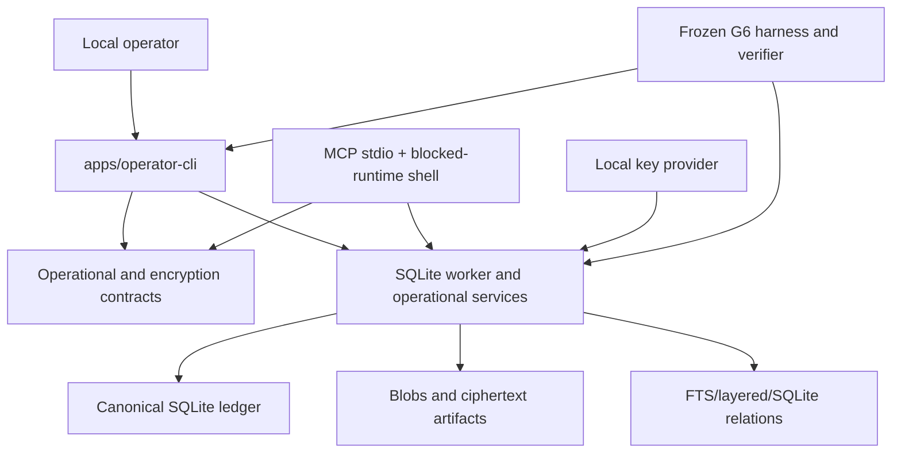
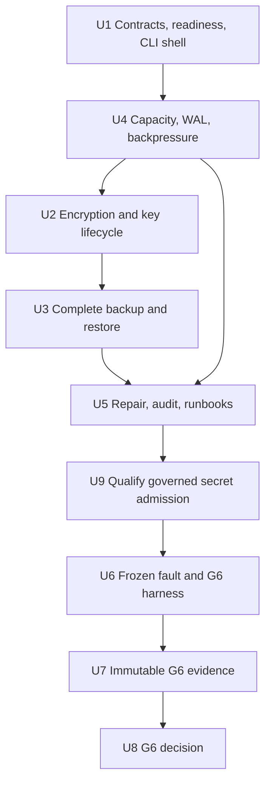
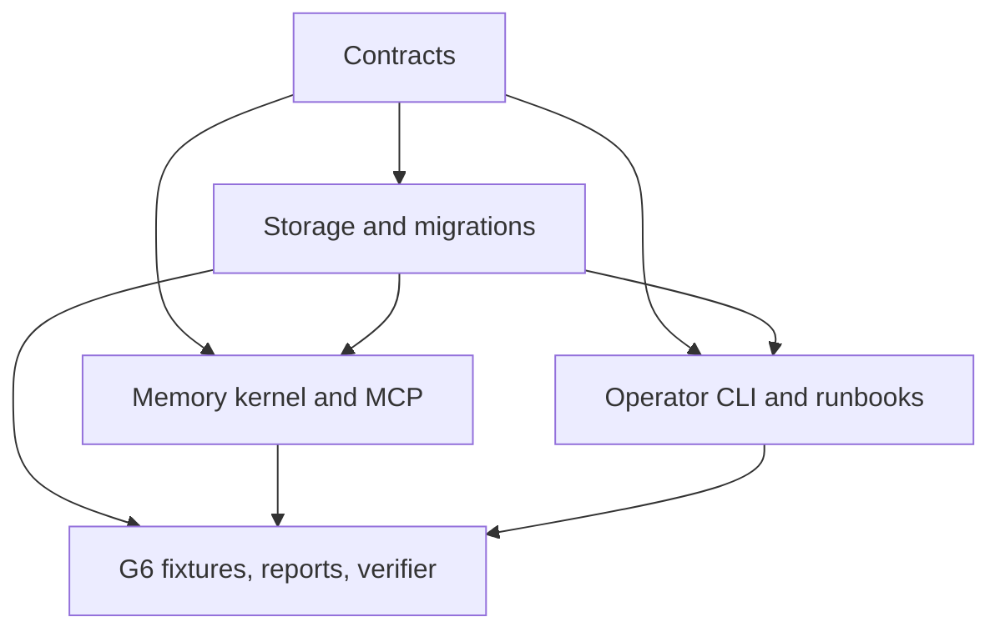

# M6 Agent Memory Runtime Operational Hardening

## Summary

M6 extends the accepted local SQLite runtime with one typed operational
contract, bounded write admission, application-encrypted secret persistence,
complete frontier-aware backup/restore, deterministic repair, executable
runbooks, and a first-false G6 verifier. A new local operator CLI composes
these capabilities without turning MCP into an administrative control plane.

The implementation extends the current contracts, storage worker, backup,
restore, health, purge, and evidence patterns. It keeps SQLite authoritative,
publishes restores only to a new root, preserves graph/vector `NO-GO`,
preserves automatic learning publication as disabled, and treats a supported
G6 `NO-GO` as a complete milestone outcome.

## Recorded G6 outcome

M6 completed on 2026-08-02 with a verifier-backed **G6 NO-GO**. The tested
candidate is `6e2ca601e435c0fa585341c5bdde2c68a12c9e25`; immutable evidence is committed
at `33549e61c73a801fdaca33be54a51d0754790c0b`; the evidence bundle is
`sha256:1d6d025934733687cefec12cd97e0c8e8cc3e0c4c7f1acc42bf6af5078f5cb45`.

The first non-pass is `integrity`. Forty fault obligations remain blocked
because the frozen evaluator does not accept their aggregate proof commands as
direct per-obligation evidence. All ten Runbook proof tests pass, but direct
automation observation and typed-result verification remain absent. The signed
NO-GO control therefore sets `secret_admission_allowed=false`.

This result preserves the last verified non-secret local runtime, G3R layered
Context, SQLite relations, FTS5 recall, and the exact G5 release/rollback
mechanism. Graph/vector remain disabled and automatic learning publication
remains disabled. See [`g6-decision.md`](../evaluations/g6-decision.md) and
[`g6-handoff.md`](../evaluations/g6-handoff.md). No production, fleet,
multi-platform, traffic, or SLO claim is made.

## Problem Frame

M0-M5 prove the individual authority, lifecycle, Context, optional-retrieval,
and learning mechanisms. They do not yet prove that the combined runtime can
survive low disk, unbounded WAL, interrupted migration, wrong keys, stale
snapshots, partial purge, damaged projections, or a failed learning rollback
without leaking content or serving an ambiguous state.

The current runtime has useful primitives but no single operational meaning.
`StorageHealth` reports schema and frontiers but not readiness, capacity,
maintenance, or key state. The writer queue is observable but unbounded.
Backup and empty-root restore are already safe starting points, but the
snapshot result is not a complete manifest and exposes raw paths. `secret`
content still fails with `ENCRYPTION_REQUIRED`, and a blocked storage open
prevents the MCP health resource from explaining the failure.

G6 therefore cannot be inferred from the sum of prior green suites. It must
bind one immutable exact-platform candidate, exercise cross-frontier faults,
verify the evidence independently, and record the first false hard rule.

## Assumptions

*This plan runs headlessly under the user's continuous-roadmap authorization.
The following plan-time decisions were not separately confirmed in chat and
remain explicit review targets rather than new Product Contract requirements.*

- Add `apps/operator-cli` as the human/automation entry point. Keep the current
  MCP CLI focused on stdio serving, while both surfaces consume the same
  content-free operational contract.
- Put shared operational and encryption schemas in
  `@memo-graph/contracts`; put cryptography, key-state authority, write
  admission, backup/restore, and durable receipts in
  `@memo-graph/storage-sqlite`; keep raw key loading at the operator/runtime
  composition boundary.
- Add a minimal fenced data-root lease. The MCP runtime owns the exclusive
  writer lease while running; effect-bearing operator commands require the
  runtime stopped and acquire the same lease. This is local root exclusion,
  not multi-process failover or distributed coordination.
- Raw key material is supplied at process start through a local provider,
  checked for restrictive ownership/permissions, held only in process memory,
  and never written to SQLite, manifests, logs, diagnostics, receipts, or
  evidence.
- M6 enables encrypted canonical storage and authorized local cryptographic
  operations for `secret` content. Standard MCP recall and model Context keep
  returning `SECRET_EXCLUDED`; model visibility requires a future explicit
  product decision and cannot be inferred from key availability.
- Readiness has four top-level states: `ready`, `degraded`, `read_only`, and
  `blocked`. `rebuilding` is a component/maintenance state; `repairable` is an
  operator action classification rather than a fifth readiness state.
- A blocked-runtime MCP shell remains available for content-free health and
  rejects ordinary memory tools with typed blocked status. It never opens an
  alternate data authority or serves cached memory.
- Restore requires a snapshot-external, hash-bound recovery anchor containing
  trusted minimum authority frontiers and required key identities. The
  snapshot cannot vouch for its own freshness.
- Capacity thresholds and hysteresis are frozen only after Small/Expected
  measurement. Any initial constants are fixture-bound exact-platform policy,
  not universal SLOs.
- Each U-ID, activation, evidence capture, G6 decision, archive, journal, and
  roadmap-status update is its own independently verified logical commit.
  Parent status, archive, and journal are split when they touch independent
  artifact classes. Any review fix receives a new stable remediation ID and
  commit; existing U-IDs are never renumbered.
- Secret support is dark-launched: U2 persists only encrypted test fixtures
  and key/rotation state while normal admission remains
  `ENCRYPTION_REQUIRED`; U3/U5 prove recovery and purge; U9 qualifies the
  governed path behind a precommitted G6 release-control contract. Only U8 may
  issue the exact release-control artifact that permits admission after a
  `GO`; `NO-GO` leaves admission disabled.

## Requirements

The Product Contract remains the sole R-number authority. M6 carries all
R1-R20 into operations; it does not create a second requirement namespace.

- **R1-R3 — ownership, local boundary, and authority:** the MCP loop remains
  independently operable; every data root, snapshot, staging root,
  quarantine, key identity, diagnostic, and evidence artifact remains local;
  destructive restore, purge retry, key mutation, and gate decisions require
  operator authority and cannot self-authorize from a payload.
- **R4-R9 — complete topology and rebuildability:** backup, restore, doctor,
  and G6 cover accepted L0-L3 state, canonical and derived lifecycles, live
  provenance, FTS/layered/SQLite relation rebuilds, and explicit graph/vector
  absence without making an optional lane a startup dependency.
- **R10, R11, R12, R13 — bounded service and distinct degradation:** queueing,
  transactions, checkpoint, backup, rebuild, and repair have explicit
  capacity/time/concurrency policy; health distinguishes no-match, policy
  exclusion, optional degradation, read-only pressure, corruption, and
  unrecoverable blocking with safe actions.
- **R14-R15 — correction, deletion, and immutable history:** correction,
  control, revoke, tombstone, purge, learning pause/rollback, and their
  frontiers survive restart/snapshot/migration/rebuild; repair cannot rewrite
  immutable history or leave supported plaintext/decryptable deleted content.
- **R16-R18 — learning separation and fail-closed authority:** operational
  metrics cannot activate candidate-only state; G5 release/control identity is
  preserved; missing key or approval authority fails closed without breaking
  ordinary non-secret governed reads when canonical integrity permits.
- **R19-R20 — replayable evidence and conjunctive gate:** every serving,
  canonical, key, snapshot, maintenance, and release effect produces
  content-free hash-bound evidence; G6 binds frozen fault, recovery, security,
  resource, supply-chain, and runbook checks, and any false critical rule
  forces `NO-GO`.

**Origin actors:** local operator/owner, Codex Agent, Memory Runtime, and
independent release evaluator.

**Operational flows carried forward:** start/diagnose; create/restore a
complete governed snapshot; degrade/recover under faults; audit/retry purge;
admit/rotate/remove secret content; and execute the final release gate. These
are M6 descriptions of Product Contract behavior, not additional Product
Contract F-IDs.

**Acceptance examples:** the M6 operational acceptance examples AE1-AE8 in
`docs/brainstorms/2026-07-30-m6-operational-hardening-requirements.md` remain
unchanged and are traced as **M6 AE1-AE8** in the implementation units and
verification matrix below. They do not redefine the Product Contract's own
acceptance-example namespace.

## Scope Boundaries

- No cloud/remote/shared/removable/network data root, remote backup service,
  cross-device merge, or remote key service.
- No multi-user authorization, daemon cluster, leader election, HA, fleet
  rollout, distributed transaction, dashboard, or web administration.
- No general secret manager, hardware-backed security claim, protection
  against a compromised process owner/host administrator, or physical-block
  erasure claim.
- No secret content in default MCP search, recall, Context, diagnostics,
  evidence, or CLI output.
- No in-place restore over a live root and no automatic SQLite salvage
  publication.
- No graph/vector reevaluation, candidate substitution, optional-process
  startup, or model/index installation.
- No automatic learning publication, new candidate type, prompt/code/Skill
  self-modification, training, or broad capability release.
- No production traffic, multi-platform certification, fleet canary, or
  universal production SLO claim.
- No unrelated UI, Host Adapter automation, or enterprise packaging.

### Deferred to Follow-Up Work

- Explicit product authorization for secret content to enter MCP recall or
  model Context.
- OS keychain/HSM providers, remote backup, multi-user access, multi-process
  coordination, fleet operations, and platform certification beyond the G6
  environment.
- Quarantined SQLite salvage tooling. Salvage output can be inspected
  offline, but cannot publish or satisfy a G6 recovery Oracle.
- Reopening graph/vector or automatic learning publication after their
  independent future gates.

## Context & Research

### Repository Patterns to Extend

- `packages/contracts/src/common.ts`, `receipts.ts`, and `index.ts` establish
  strict Zod ownership, inferred public types, canonical hashes, and one
  export boundary.
- `packages/storage-sqlite/src/database.ts`, `storage-worker.ts`, `client.ts`,
  and `writer-queue.ts` establish the single SQLite owner, worker protocol,
  serialized effects, health, WAL checkpoint, online backup, and queue
  metrics.
- `packages/storage-sqlite/src/restore.ts` already implements absent-target
  staging, restrictive permissions, fsync, restore verification, derived
  degradation, cleanup on failure, and atomic rename.
- `governance-repository.ts`, `purge-repository.ts`, and
  `learning-repository.ts` establish append-only receipts, CAS, single-use
  approvals, tombstone/purge frontiers, and learning release/control
  frontiers.
- `packages/mcp-server/src/cli.ts` and `index.ts` establish stdio lifecycle and
  the existing health resource, but startup currently collapses all open
  failures into a generic error.
- `scripts/g5-evidence-common.mjs`, `build-g5-manifest.mjs`, and
  `verify-g5-evidence.mjs` establish source/tree/lock/migration/environment
  binding, raw/canonical report hashes, dirty-path control, and first-false
  verification.

### Institutional Learnings

- Secret handling has only a fail-closed boundary; no existing key lifecycle
  implementation is reusable. M6 must treat nonce uniqueness, key state,
  rotation, wrong-key restore, and residual scanning as new high-risk work.
- Restore must publish only a new empty root and migration history is
  forward-only/hash-bound. A migration failure is not permission to rewrite
  an applied migration.
- Receipts, not logs, are the replayable audit authority. Existing queue and
  health signals are useful, but historical Small-workload timing does not
  justify M6 pressure thresholds.
- Existing crash/retry and projection rebuild Oracles prove old-or-new,
  idempotent, rebuildable behavior; they do not prove encryption, canonical
  migration, backup publish, or every purge store.
- G5's separation of tested implementation, evidence, verifier, decision,
  archive, and journal is mandatory for G6 and for the one-task/one-commit
  rule.

### External Claim/Evidence Grounding

The research run
`RUN20260730-030946-research-m6-operational--94a335` passed its Ready Gate with
21/21 supported Claims, 16/16 supported core Claims, 13 primary-source web
packages across six independence groups, and 17 repository evidence
packages.

The plan consumes these conclusions:

- versioned AEAD envelope, unique nonce, authenticated metadata, and bounded
  `current`/`retired`/`revoked_or_compromised`/`unavailable` key states;
- complete manifest plus empty-root staging restore and external minimum
  frontiers;
- disk/WAL/backup/queue/maintenance/key readiness with pre-transaction
  rejection and measured thresholds;
- one content-free schema for health, logs, metrics, receipts, MCP, and both
  CLI render modes;
- deterministic fault hooks with old-or-new/no-resurrection Oracles;
- exact source/tree/lock/native-build/platform/schema/config/fixture/report
  binding and a conjunctive first-false G6 decision.

## Key Technical Decisions

### D1. One operational schema, several renderers

`packages/contracts/src/operations.ts` owns readiness, component state, reason
codes, recovery actions, measurements, operator command results, operational
receipts, recovery anchors, backup manifests, G6 qualification, and G6
envelopes. Internal raw paths may exist below the boundary, but operator JSON,
human output, MCP health, logs, and evidence decode from the same content-free
semantic object.

Runtime readiness and release qualification are independent fields. Readiness
reports `ready | degraded | read_only | blocked`. Qualification reports
`pending | GO | NO-GO | outside_tested_envelope`, plus the tested-envelope
digest when one exists. A healthy runtime outside the exact G6 envelope is
still `ready` but not release-qualified; a qualified candidate can later
become operationally degraded without rewriting the immutable gate result.

This prevents CLI/MCP parity drift and prevents public `BackupResult` path
fields from becoming telemetry. Public operational surfaces never emit stable
plaintext-derived content/path hashes. They use opaque IDs, bundle-local
aliases, or context-keyed pseudonyms; repository source paths and artifact
integrity hashes are allowed only inside the G6 source-binding manifest.

### D2. Operator CLI is a separate app

`apps/operator-cli` owns argument parsing, local configuration/key loading,
human/JSON rendering, exit-class mapping, dry-run/confirmation, and command
composition. It imports public contracts and storage APIs, not
`better-sqlite3`. Destructive execution accepts the exact digest produced by a
fresh dry run and revalidates that digest immediately before effect. The
digest binds canonical command intent, source/target/root identity, recovery
anchor, expected frontiers/config/key state, local principal, a fresh
single-use nonce, and expiry. An `OperatorConfirmationAuthority` signs that
digest with a separately opened private local key during an explicit
trusted-terminal confirmation step. Effect execution receives only the signed
grant and verifier identity; it has no signing key. This prevents payload or
effect-process self-authorization, not a hostile local account that can steal
the operator key. Confirmation, recovery-head, data-encryption, and G6
decision keys use distinct purpose/domain identities and are never
interchangeable.

An external local operator-action ledger, outside every source/target data
root, durably advances
`authorized → effect_prepared → effect_committed → receipt_committed →
responded`. Every filesystem/external-anchor command records and fsyncs the
next state around its commit point. Restart returns the recorded result or
continues reconciliation; it never repeats the effect or strands a consumed
grant. Transaction-local effects may consume the confirmation in their
SQLite transaction, but all commands use the same observable saga semantics.

The confirmation algorithm, purpose domain, key ID, pinned public verifier,
expiry, rotation, and revocation policy come only from trusted operator
configuration. The grant/payload may name the expected key ID but cannot
supply or replace the verifier. Unknown, attacker-generated, expired, or
revoked identities fail before an effect.

This keeps offline authority out of MCP and avoids a new long-running control
plane. A read-only inspection path is explicitly enumerated. Any
effect-bearing command requires the MCP runtime stopped, acquires the fenced
exclusive data-root lease before opening the writer, and rejects live or
ambiguous ownership. Crash recovery of a stale lease requires a separate
dry-run/confirmation, proof that the recorded owner is not live, and a
monotonic fence advance.

### D3. SQLite owns key state; callers own raw key supply

SQLite persists only key ID, envelope version/algorithm, lifecycle state,
activation/retirement/revocation metadata, rotation progress, and sealed
receipts. The process key provider supplies exact key bytes for declared IDs
after local permission checks. Only `current` encrypts; `retired` decrypts
existing content for authorized reads/rotation; unknown, ambiguous, missing,
wrong, revoked, or unavailable keys fail closed.

Rotation is an append-only resumable state machine under exclusive
maintenance. At begin, the old key remains the sole `current` key and the new
key becomes `rotating_to`; secret writes are quiesced. Existing items are
rewritten resumably to the new key. Completion atomically changes old
`current → retired`, new `rotating_to → current`, and commits the final receipt.
Abort is allowed only before the first rewritten item; afterward recovery is
roll-forward. Compromise of a required source key blocks rather than inventing
a decrypt path. Thus there is never zero or more than one current key.

Key availability is capability supply, not authorization. Secret admission
requires a new single-use `SecretAdmissionApproval` bound to principal, owner,
canonical scope, sensitivity, request/envelope/key identity, current root
fence, and expiry. It is checked before enqueue and consumed/rechecked in the
canonical transaction. The operator-only `secret admit` command is the sole
plaintext ingress and reads from a private inherited file descriptor, never
argv, environment values, inline config, or an MCP payload. All MCP tools,
including `memory_episode_commit` and `memory_propose`, reject secret
plaintext; they may reference an already encrypted secret evidence identity.
The MCP protocol/router never receives keys or secret plaintext.

A distinct `SecretAdmissionAuthority` issues that approval; it is not the
destructive-command signer. The operator keeps one private, regular, seekable
secret file descriptor open across two commands. `secret approve` preads the
bounded descriptor, verifies owner/mode/type/size/stat identity, computes a
request-nonce-scoped HMAC with a purpose-specific admission commitment key,
and signs the canonical grant using a private signing-key descriptor.
`secret admit` has only the pinned public verifier plus commitment key,
rechecks the same descriptor identity/stat before and after pread, recomputes
the HMAC, and consumes the single-use grant with the effect. Signing key,
commitment key, encryption key, and G6 decision key are distinct. Empty,
oversized, short-read, read-error, changed, non-regular, non-seekable, or
wrong-owner descriptors fail closed; retry requires a fresh grant.

The provider accepts only bounded raw 32-byte material from an opened trusted
local regular file outside argv, environment values, and inline config. The
opened object is checked for expected owner, private mode, type, size, and
symlink/replacement resistance before bytes are read. Errors are content-free.
Key and plaintext buffers are short-lived and zeroed best-effort after use;
M6 does not claim protection from process-memory inspection or swap, and G6
requires core dumps disabled for the tested process.

Decryption requires a single-use `SecretUseAuthority` bound to principal,
operation class, owner identity, exact scope, request digest, ciphertext/key
identity, expiry, and receipt. Allowed purposes are integrity verification,
rotation, backup/restore verification, and purge. There is no general plaintext
read.

A non-exported main-thread `SecretIngressCoordinator` inside
`storage-sqlite` is the sole storage plaintext-ingestion boundary. It accepts
the validated buffer from the operator-only private descriptor path, asks the
worker to reserve
the idempotent operation and nonce, encrypts with the local provider, zeroes
the buffer best-effort, and sends only envelope/ciphertext metadata through
worker structured-clone IPC for commit. Plaintext is prohibited from worker
IPC and every outward storage result, CLI, MCP response, renderer, log, error,
diagnostic, receipt, and evidence artifact.

### D4. Secret ciphertext is a distinct durable artifact class

The next forward migration introduces an explicit encrypted content/envelope
table rather than disguising ciphertext as an existing plaintext blob. Inline
SQLite ciphertext is the M6 default so owner reference, ciphertext, receipt,
and frontier commit atomically. Only payloads that already cross the frozen
blob threshold use the existing external blob class, now with an encrypted
variant. Each evidence/candidate/revision owner has an independent envelope;
cross-owner or cross-authority-class ciphertext reuse is forbidden.
`key_id + nonce` is unique, envelope generation is monotonic, and rotation
switches the owner reference atomically.

Envelope version 1 freezes AES-256-GCM with a 32-byte key, 12-byte nonce, and
16-byte tag. AAD bytes are the UTF-8 domain separator
`memo-graph/secret-envelope/v1` followed by the canonical JSON bytes of the
versioned metadata. The storage worker owns nonce reservation in durable
prepared state; `(key_id, nonce)` has a database unique constraint, and crash
retry reuses the nonce only when the prepared row's key generation, canonical
AAD hash, keyed plaintext commitment, owner generation, and request digest all
match exactly. Prefer resuming already persisted ciphertext; changed input
under the same idempotency key fails closed and never re-encrypts with the
reserved nonce. Unknown suites, lengths, or AAD encodings fail before
decryption.

AEAD authenticated metadata binds a keyed, owner/scope-specific plaintext
commitment plus memory/evidence identity, exact scope, sensitivity, envelope
version, and key ID. An unkeyed low-entropy plaintext hash is not persisted in
clear for secret content. Plaintext is encrypted before any SQLite/WAL/
blob-temp durable boundary and is never indexed into FTS or copied into
derived projections.

Inline ciphertext commits in the canonical SQLite transaction. For the
existing blob-eligible path only, files and SQLite cannot commit atomically,
so storage uses the worker-owned durable artifact protocol: idempotent
operation ID, `prepared → committed → retired`, startup reconciliation, orphan
quarantine, and atomic owner-reference/receipt/frontier commits. Rotation,
purge, and backup reuse that bounded external artifact inventory.

Existing non-secret rows retain their canonical identity. Existing databases
contain no accepted secret plaintext because admission was fail-closed, so
the migration does not attempt an unsafe secret backfill.

### D5. Readiness is a deterministic reducer

One reducer combines schema/integrity, frontiers, optional lanes, purge debt,
learning control/release, key state, maintenance, capacity, WAL/checkpoint,
and writer queue observations into `ready`, `degraded`, `read_only`, or
`blocked`, plus ordered reason/action codes. Canonical corruption or missing
required key blocks relevant serving; optional-lane failure degrades; pressure
narrows writes while preserving verified reads.

MCP startup uses a preflight shell so content-free health remains inspectable
even when the full runtime cannot open.

### D6. Admission is checked before enqueue and before transaction

The writer queue is bounded by frozen depth and oldest-age policy. Every
mutation is checked before enqueue, then checked again at transaction start
against current disk headroom, maintenance state, key readiness, and
hysteresis. A rejected operation produces no canonical effect, idempotency
row, receipt/frontier drift, or delayed execution after recovery.

The dequeue-time rejection is a terminal typed response for that attempt. A
retry with the same idempotency key re-evaluates current policy and may execute
only as a new explicit request; the rejected queue entry is never retained for
automatic execution.

### D7. Maintenance is one explicit compatibility state

Backup, restore, checkpoint, rebuild, purge retry, key rotation, and migration
share one typed maintenance contract. Read-only observation may run
concurrently where declared; incompatible effects are rejected before work.
Restore remains an offline publish-new-root operation and never acquires a
lease in the source root on behalf of the target.

The maintenance contract is built in U4 immediately after U1 and before U2/U3.
It combines the fenced root lease, bounded queue, operation compatibility, and
transaction-start recheck so every later effect-bearing unit is independently
safe.

### D8. Restore trusts an external recovery anchor

The complete backup manifest binds the database, every blob/ciphertext,
migration set, ledger/receipt/tombstone/purge/projection/Context/learning/key
frontier, configuration, environment, and artifact hashes. A separately held
recovery anchor supplies minimum frontiers and allowed key identities.

Restore stages into a nonexistent target, verifies manifest/artifacts/keys/
frontiers, runs migration and the full Oracle, resolves or blocks incomplete
purge debt, marks rebuildable projections degraded, closes/fsyncs, and
atomically renames. Failure removes staging and leaves the target absent.

The anchor is operator-owned outside the data root, bound to root/principal
identity, and authenticated by a provider-held recovery-authority key. A
separately configured `RecoveryHeadProvider`, outside the snapshot and anchor
bundle, stores the current signed generation/head with atomic replace and
directory fsync. Restore must query that provider; a snapshot plus its old
bundle-local anchor cannot vouch for freshness. M6 protects against data-root
or snapshot rollback and accidental replacement of snapshot+anchor together.
Rollback or compromise of the separately retained head provider by the same
local owner/administrator is outside the threat model and is reported as
operator trust loss, not silently accepted.

The provider is a versioned authenticated extension of the existing
caller-supplied tombstone/learning-minima restore seam, not a second canonical
data authority. It stores only current generation, minimum frontiers, required
key identities, and hashes; the confirmed stale-snapshot/joint-bundle Oracle
is the reason this small external head exists.

Every protected authority effect uses a crash-recoverable protocol:
`signed pending reservation + fsync → SQLite effect carrying pending_id →
signed committed CAS head + fsync → reconciled anchored receipt`. Startup
reconciles completed SQLite effects and advances their pending reservation. If
the exact idempotent SQLite effect provably never began, it appends/fsyncs a
signed `aborted` entry against the same prior head; ambiguous state remains
blocked. Until committed or safely aborted, the pending intended minimum is
fail-closed for startup and restore. A snapshot/manifest cannot create, reset,
or lower the append-only anchor chain. Missing or lost anchor authority blocks
automatic restore; it never triggers a guessed minimum.

A storage-level `AnchorCoordinator` makes the protocol mandatory for every
transaction owner. The protected set is explicit: governed canonical
admission/correction, control/revoke/delete/tombstone/purge, Context/projection
frontier publication, learning control/release/rollback, key activation/
retirement/revocation/rotation completion, and installed G6 release-control
identity. Storage repositories cannot accept an optional callback or bypass
the coordinator. The MCP and operator composition roots inject the configured
`RecoveryHeadProvider`; provider loss blocks the protected effect before
commit or leaves a durable pending debt that blocks serving/backup/restore
until reconciliation.

Backup holds the U4 maintenance/root lease from the frozen SQLite
epoch/receipt/artifact inventory through online backup, artifact copy,
manifest write, and fsync. Purge, rotation, and mutation cannot change that
inventory. Restore writes and fsyncs a verified publication marker in staging,
acquires a fenced parent-directory target-name reservation, and publishes with
an exact-platform audited no-replace primitive
(`renameatx_np(..., RENAME_EXCL)` on the G6 Darwin envelope), then fsyncs the
target parent directory. Unsupported no-replace capability is blocked, never
emulated by check-then-rename. Before publication, failure leaves the target
absent; after the commit point, interruption yields a complete reopenable
target and response-loss reconciliation, never a partial root.

### D9. Fault hooks are deterministic test seams

Test-only hooks surround migration, canonical commit/receipt, encrypted
temp/write/rename, nonce reservation/input sealing, key rotation, recovery
anchor pending/SQLite/CAS/reconciliation, operator confirmation/action-ledger
states, root fence/heartbeat, target-name reservation/no-replace publication,
backup copy/manifest, checkpoint, each purge store, secret approval
consumption/ciphertext publication, and learning pointer rollback. They are
disabled by default and cannot be selected by normal MCP/operator payloads.

Every hook asserts old-or-new canonical state, receipt/epoch/frontier
agreement, restart idempotency, and no deleted/secret/candidate resurrection.

### D10. G6 evidence and decision remain separate

All harnesses and the verifier are committed before evidence capture. U7 runs
them against a clean immutable U6 implementation, records raw/canonical
reports and independent review, and leaves `decision_recorded=false`. U8 reads
only verifier-backed evidence and records one `GO` or supported `NO-GO`.

A distinct offline `G6DecisionAuthority` roots release control. U6 freezes its
signature algorithm, key ID, pinned public verification key, expiry, rotation,
and revocation rules. The normal runtime contains only the pinned verifier and
cannot mint a control. U8 loads the private decision key from a separately
opened restricted local file only after verification and signs the exact
terminal control. Unknown, expired, revoked, or mismatched signer identities
fail closed.

Registry/audit unavailability is `blocked`, never an ignored pass. Graph and
vector remain `NO-GO`; automatic learning publication remains disabled.

## Resolved Planning Questions

- **Key ownership:** contracts own vocabulary, storage owns crypto/key-state
  effects, and the operator/runtime boundary supplies raw material. MCP never
  handles keys.
- **Secret visibility:** encrypted storage and local lifecycle operations are
  in scope; default MCP/model visibility remains excluded.
- **Blocked startup:** a content-free preflight shell exposes readiness while
  ordinary memory tools stay blocked.
- **Restore freshness:** a snapshot-external recovery anchor is required;
  manifest self-consistency alone is insufficient. The anchor has a separate
  authenticated authority key, append-only chain, monotonic CAS, and loss
  means blocked restore.
- **Incomplete purge on restore:** publication may be degraded only if every
  residual outcome is already verified and no supported artifact can serve
  the content; otherwise publication is blocked.
- **Threshold ownership:** U4 freezes exact-platform Small/Expected policy
  from measurement with hysteresis and recovery criteria.
- **Gate split:** U6 freezes harness/verifier code, U7 records evidence, and U8
  records the decision.
- **Commit protocol:** encrypted artifacts use a durable prepared/committed/
  retired state machine with startup reconciliation; filesystem rename is not
  treated as a SQLite transaction.
- **Execution order:** U1 → U4 → U2 → U3 → U5 → U9 → U6 → U7 → U8. Stable
  U-IDs are preserved even though U4 moves ahead of U2.

## Output Structure

```text
apps/operator-cli/
  package.json
  tsconfig.json
  src/
    cli.ts
    config.ts
    exit-codes.ts
    render.ts
    commands/

packages/contracts/src/
  encryption.ts
  operations.ts

packages/storage-sqlite/src/
  admission-control.ts
  backup-manifest.ts
  encrypted-content-store.ts
  key-repository.ts
  operational-health.ts
  operational-repository.ts
  root-lease.ts

migrations/
  0015-operational-hardening.sql

fixtures/g6/
  manifest.json
  thresholds.json
  faults/
  recovery/
  resources/
  runbooks/
  security/

docs/runbooks/
  m6-doctor.md
  m6-backup-restore.md
  m6-storage-pressure.md
  m6-key-rotation.md
  m6-purge-repair.md
  m6-learning-rollback.md

scripts/
  g6-evidence-common.mjs
  run-g6-fault-matrix.mjs
  run-g6-resource-report.mjs
  run-g6-runbooks.mjs
  build-g6-manifest.mjs
  verify-g6-evidence.mjs
```

Names may be consolidated during implementation only when the same owner and
test boundary remain explicit. New duplicate contracts or direct SQLite
consumers are not permitted.

## High-Level Technical Design

The diagrams are directional boundaries, not code-level prescriptions.





### Readiness reduction

```text
validate root/schema/integrity/frontiers
  → observe key/maintenance/capacity/WAL/queue/components
  → reduce ordered reason codes
  → choose ready | degraded | read_only | blocked
  → emit identical semantics to CLI JSON/human, MCP, logs, and receipt
```

### Restore publication

```text
snapshot + external recovery anchor
  → verify hashes, key identities, migrations, configuration, frontiers
  → copy into private staging
  → migrate/open/verify/purge-audit/rebuild-plan
  → close and fsync files/directories
  → fenced audited no-replace atomic publish to absent target

pre-rename failure → remove staging → target remains absent
post-rename interruption → reopen marker-bound complete target
```

## Implementation Units

Execute by dependency order, not numeric display order:
**U1 → U4 → U2 → U3 → U5 → U9 → U6 → U7 → U8**.
U-IDs stay stable after deepening.

### U1. Freeze operational contracts, readiness, and operator shell

**Goal:** Establish one content-free operational language and read-only
diagnostic path before effect-bearing hardening.

**Requirements:** R1-R3, R5, R10-R13, R18-R20; startup/diagnosis flow;
M6 AE5.

**Dependencies:** None.

**Files:**

- Create: `packages/contracts/src/operations.ts`
- Modify: `packages/contracts/src/mcp.ts`
- Modify: `packages/contracts/src/index.ts`
- Create: `apps/operator-cli/package.json`
- Create: `apps/operator-cli/tsconfig.json`
- Create: `apps/operator-cli/src/cli.ts`
- Create: `apps/operator-cli/src/config.ts`
- Create: `apps/operator-cli/src/exit-codes.ts`
- Create: `apps/operator-cli/src/render.ts`
- Create: `apps/operator-cli/src/commands/doctor.ts`
- Create: `packages/storage-sqlite/src/operational-health.ts`
- Modify: `packages/storage-sqlite/src/protocol.ts`
- Modify: `packages/storage-sqlite/src/client.ts`
- Modify: `packages/storage-sqlite/src/errors.ts`
- Modify: `packages/mcp-server/src/index.ts`
- Modify: `packages/mcp-server/src/cli.ts`
- Modify: `package.json`
- Modify: `tsconfig.json`
- Create: `tests/contract/operations.contract.test.ts`
- Create: `tests/integration/operator-cli.integration.test.ts`
- Create: `tests/integration/operator-health-parity.integration.test.ts`
- Create: `tests/recovery/canonical-corruption-startup.recovery.test.ts`
- Create: `tests/security/operational-redaction.test.ts`

**Approach:**

- Define exhaustive readiness/component/reason/action/measurement/receipt and
  command-result schemas with canonical hashing and bounded content-free
  fields.
- Define release qualification independently as
  `pending | GO | NO-GO | outside_tested_envelope`, with an optional exact
  tested-envelope digest. `doctor` and MCP health expose it beside readiness,
  never derive one from the other, and never claim current qualification after
  source/lock/platform/config drift.
- Build a pure reducer whose ordered reasons determine readiness and stable
  exit classes. Human and JSON renderers consume the same parsed result.
- Add a read-only `doctor` command and public path redaction. No key mutation,
  restore, purge retry, or repair effect lands in U1.
- Add the reusable operation digest/freshness/confirmation contract and
  zero-effect rejection harness, but keep effect-bearing commands disabled.
- Define root lease identity/fence/heartbeat/stale-recovery contracts; U4
  implements their storage/process behavior.
- Extend storage health through a typed adapter rather than exposing raw
  internal backup paths or unparsed errors.
- Add an MCP preflight/blocked shell. Health remains inspectable after wrong
  key, migration drift, corruption, or unsafe capacity; normal tools cannot
  operate without a verified runtime.
- U1 covers wrong-key and low-capacity as contract/reducer fixtures only.
  U2 and U4 add the real provider and resource integration paths.
- Characterize existing healthy/degraded/no-match behavior before changing
  mappings.

**Test scenarios:**

- Healthy root produces byte-equivalent semantic JSON for CLI and MCP, with a
  deterministic human rendering and success exit class.
- Ready-but-pending, ready-and-qualified, degraded-and-qualified, and
  ready-outside-tested-envelope fixtures preserve independent readiness and
  qualification semantics.
- Optional graph/vector absence is reported as accepted disabled state, not a
  startup error or activation request.
- True no-match, optional outage, low-disk read-only, migration drift,
  canonical corruption, and internal failure fixtures produce distinct
  codes/actions.
- A blocked open still serves content-free health while every memory tool
  rejects with the same blocked reason.
- Dry-run/confirmation schema rejects generic, stale, mismatched, or
  self-authorized execution with zero effects.
- Marker payload, query, Context, ciphertext, key, token, and raw path strings
  are absent from outputs, errors, logs, snapshots, and test diagnostics.
- Invalid config fails before opening storage and never echoes secret fields.

**Verification outcome:** contract, CLI, MCP, recovery, and redaction tests
prove one semantic health model and no effect-bearing operator capability.

**Rollback:** remove the new app/contracts/adapter and restore the previous
generic startup behavior; no migration or durable state exists.

### U2. Dark-launch AEAD envelopes, key authority, and rotation

**Goal:** Land the forward schema, durable ciphertext protocol, key authority,
and crash-safe rotation while normal secret admission remains fail closed.

**Requirements:** R2-R3, R6-R7, R14-R15, R18-R20; secret lifecycle flow;
M6 AE8.

**Dependencies:** U1 and U4.

**Files:**

- Create: `packages/contracts/src/encryption.ts`
- Modify: `packages/contracts/src/operations.ts`
- Modify: `packages/contracts/src/memory.ts`
- Modify: `packages/contracts/src/mcp.ts`
- Modify: `packages/contracts/src/tool-inputs.ts`
- Modify: `packages/contracts/src/receipts.ts`
- Create: `packages/contracts/src/g6.ts`
- Modify: `packages/contracts/src/index.ts`
- Create: `migrations/0015-operational-hardening.sql`
- Create: `packages/storage-sqlite/src/key-repository.ts`
- Create: `packages/storage-sqlite/src/encrypted-content-store.ts`
- Create: `packages/storage-sqlite/src/secret-ingress.ts`
- Create: `packages/storage-sqlite/src/operational-repository.ts`
- Modify: `packages/storage-sqlite/src/blob-store.ts`
- Modify: `packages/storage-sqlite/src/database.ts`
- Modify: `packages/storage-sqlite/src/storage-worker.ts`
- Modify: `packages/storage-sqlite/src/client.ts`
- Modify: `packages/storage-sqlite/src/governance-repository.ts`
- Modify: `packages/storage-sqlite/src/governed-memory-reader.ts`
- Modify: `packages/storage-sqlite/src/purge-repository.ts`
- Modify: `packages/storage-sqlite/src/protocol.ts`
- Modify: `packages/storage-sqlite/src/index.ts`
- Modify: `packages/memory-kernel/src/approval.ts`
- Modify: `packages/memory-kernel/src/index.ts`
- Modify: `packages/mcp-server/src/index.ts`
- Modify: `packages/mcp-server/src/cli.ts`
- Modify: `apps/operator-cli/src/cli.ts`
- Create: `apps/operator-cli/src/commands/key.ts`
- Create: `apps/operator-cli/src/commands/secret.ts`
- Create: `tests/contract/encryption.contract.test.ts`
- Create: `tests/contract/g6.contract.test.ts`
- Create: `tests/storage/operational-schema.integration.test.ts`
- Create: `tests/storage/encryption-key-lifecycle.integration.test.ts`
- Create: `tests/recovery/key-rotation.recovery.test.ts`
- Create: `tests/security/secret-at-rest.test.ts`
- Create: `tests/security/secret-content-residual.test.ts`

**Approach:**

- Add strict AES-256-GCM v1 envelope, domain-separated canonical AAD,
  `SecretUseAuthority`, `SecretAdmissionApproval`, keyed commitment, key
  identity/state, rotation progress, and receipt schemas. Freeze
  key/nonce/tag lengths.
- Add the authoritative `G6ReleaseControl` schema, canonical signature
  contract, and injectable `RuntimeIdentityProvider` required to keep secret
  admission default-off. U2 uses synthetic verifier identities only; U6 later
  freezes the exact decision authority and runtime/build path set.
- Introduce a forward-only migration with explicit inline encrypted payload,
  bounded external encrypted-blob variant, keyed commitment, key-state,
  rotation, versioned artifact-store registry, per-store purge debt/frontier,
  and operational receipt structures. Do not rewrite prior migration files or
  masquerade ciphertext as plaintext blobs.
- Rehearse the exact table-copy/index/trigger/FK impact and require a
  pre-upgrade verified backup before migration activation.
- Make the non-exported main-thread `SecretIngressCoordinator` the sole
  plaintext-ingestion boundary. It accepts the validated buffer from
  the operator-only `secret admit --input-fd <n>` path, asks the worker to
  reserve the operation/nonce, encrypts using the verified process-local
  provider, zeroes plaintext best-effort, and returns only ciphertext/envelope
  material to the worker.
  Persist ciphertext hash/size and keyed owner/scope-specific commitment;
  never persist an unkeyed low-entropy secret hash.
- Reserve nonces durably in the worker, enforce `(key_id, nonce)` uniqueness,
  seal key generation/canonical AAD hash/keyed commitment/owner generation/
  request digest on the prepared row, and send only ciphertext/envelope
  metadata through worker IPC. A retry with changed sealed input fails closed.
- Commit inline ciphertext atomically with the canonical effect. Use the
  worker-owned prepared/committed/retired artifact state machine, idempotent
  operation IDs, startup reconciliation, and orphan quarantine only for
  payloads already eligible for the external blob path.
- Keep raw key bytes out of commands, SQLite, receipts, manifests, and logs.
  Load fixed-size key material only from a verified opened local file; never
  from argv, environment values, or inline config.
- Require single-use purpose-bound `SecretUseAuthority` for internal
  decryption and ensure plaintext never crosses worker IPC or outward
  result/rendering/diagnostic boundaries.
- Freeze the operator-only private-descriptor command as the sole secret-
  plaintext ingress. Add the `SecretAdmissionApproval` registry and
  transactional consumption contract in dark-launch mode. MCP secret requests
  may reference an existing encrypted evidence identity but cannot carry
  plaintext.
- Preserve `ENCRYPTION_REQUIRED` at normal admission and `SECRET_EXCLUDED` for
  retrieval/Context. Provide only test-fixture and exact local cryptographic
  operations needed for integrity, recovery, rotation, and purge evidence.
- Make rotation resumable and idempotent under exclusive maintenance: old key
  remains sole current, new key is `rotating_to`, secret writes are quiesced,
  completion atomically swaps current/retired plus receipt, and abort is legal
  only before the first rewrite. Unknown/wrong/revoked/unavailable key states
  block secret access and relevant writes without plaintext fallback.
- Purge removes supported live ciphertext references and records per-store
  outcomes; stale snapshot publication remains governed by U3 anchors.
- Register read-only key inspection and internal test-only rotation entry
  points. Operator-triggered rotation stays disabled until U5 lands signed
  confirmation and the action-ledger saga.

**Test scenarios:**

- Test-only dark-launch secret persistence writes no plaintext in SQLite, WAL,
  ciphertext blob names/bytes, temp files, diagnostics, FTS, projections, or
  receipts.
- Normal runtime admission still returns `ENCRYPTION_REQUIRED`.
- Every MCP tool rejects secret plaintext. Only the dark-launch operator
  private-descriptor test path reaches the private coordinator, and the
  descriptor content is never echoed to argv/config/output.
- Known-answer vectors pass; envelope decode rejects wrong domain/AAD field
  order/identity/scope/sensitivity/commitment, duplicate or cross-restart
  nonce, collision, altered/truncated tag/ciphertext, wrong length, unknown
  version/algorithm, wrong key, ambiguous current key, revoked key, and
  unavailable provider.
- Same idempotency key with changed plaintext commitment, AAD, owner
  generation, request digest, or key generation never reuses a reserved nonce.
- Forged, replayed, expired, wrong-purpose, cross-scope, or cross-owner
  `SecretUseAuthority` produces no plaintext or durable effect.
- Missing, stale, reused, wrong-principal/owner/scope/request/envelope/key/
  fence `SecretAdmissionApproval` produces no queued work, durable effect, or
  consumed grant.
- Existing non-secret databases migrate and reopen without hash or behavior
  drift; current fail-closed secret fixtures become encrypted only with exact
  authority and a current key.
- Faults before/after encrypted temp write, fsync, rename, row commit, key
  transition, item rewrite, and final rotation receipt exercise process
  termination and yield old-or-new canonical state, reconciled orphan state,
  and no double effects.
- Old key remains usable until rotation completion; new writes use only the
  current key; retirement/revocation rules are enforced.
- Secret deletion/purge leaves no supported decryptable result while ordinary
  non-secret recall remains available.

**Verification outcome:** migration, crypto, storage, recovery, and residual
tests prove fail-closed encrypted persistence and exact key-state replay.

**Rollback:** an applied 0015 migration is never rolled back by code reversion.
Return to an independently verified pre-upgrade root or publish a new root
from its pre-migration backup. A forward-compatible binary may continue to
open 0015 with secret admission disabled; no plaintext fallback is allowed.

### U3. Complete backup manifests and publish-new-root restore

**Goal:** Bind every accepted authority/artifact frontier and publish a
restored root only after external-freshness and full recovery verification.

**Requirements:** R2-R9, R14-R20; backup/restore flow; M6 AE1-AE4 and
M6 AE6-AE8.

**Dependencies:** U2 and U4.

**Files:**

- Modify: `packages/contracts/src/operations.ts`
- Create: `packages/storage-sqlite/src/backup-manifest.ts`
- Create: `packages/storage-sqlite/src/anchor-coordinator.ts`
- Modify: `packages/storage-sqlite/src/database.ts`
- Modify: `packages/storage-sqlite/src/client.ts`
- Modify: `packages/storage-sqlite/src/protocol.ts`
- Modify: `packages/storage-sqlite/src/storage-worker.ts`
- Modify: `packages/storage-sqlite/src/control-repository.ts`
- Modify: `packages/storage-sqlite/src/governance-repository.ts`
- Modify: `packages/storage-sqlite/src/purge-repository.ts`
- Modify: `packages/storage-sqlite/src/learning-repository.ts`
- Modify: `packages/storage-sqlite/src/projection-repository.ts`
- Modify: `packages/storage-sqlite/src/projection-effects.ts`
- Modify: `packages/storage-sqlite/src/key-repository.ts`
- Modify: `packages/storage-sqlite/src/restore.ts`
- Create: `packages/storage-sqlite/src/no-replace-publish.ts`
- Modify: `packages/storage-sqlite/src/data-root.ts`
- Modify: `packages/storage-sqlite/src/index.ts`
- Create: `tools/rename-noreplace/rename-noreplace.c`
- Create: `tools/rename-noreplace/build.mjs`
- Modify: `packages/storage-sqlite/package.json`
- Create: `apps/operator-cli/src/commands/backup.ts`
- Create: `apps/operator-cli/src/commands/restore.ts`
- Modify: `apps/operator-cli/src/cli.ts`
- Modify: `apps/operator-cli/src/config.ts`
- Modify: `packages/mcp-server/src/cli.ts`
- Modify: `tests/storage/fts-and-backup.integration.test.ts`
- Create: `tests/recovery/complete-backup-restore.recovery.test.ts`
- Create: `tests/recovery/encrypted-backup-restore.recovery.test.ts`
- Modify: `tests/recovery/stale-tombstone-restore.recovery.test.ts`
- Modify: `tests/recovery/learning-ledger.recovery.test.ts`
- Create: `tests/recovery/restored-learning-rollback.recovery.test.ts`
- Create: `tests/recovery/paused-learning-snapshot.recovery.test.ts`
- Create: `tests/recovery/disabled-optional-lanes-restore.recovery.test.ts`
- Create: `tests/integration/m6-restored-context-equivalence.integration.test.ts`

**Approach:**

- Extend the existing online backup and verified artifact copy; do not replace
  them with file-level SQLite copying.
- Acquire the fenced maintenance/root lease, freeze epoch/receipt/artifact
  inventory inside the worker, and hold that cut through manifest fsync.
- Write a canonical manifest binding database/blob/ciphertext hashes and
  sizes, migration set, schema, ledger/receipt/tombstone/purge/projection/
  Context/learning/key frontiers, config, environment, and accepted gate
  decisions.
- Create an operator-owned recovery-anchor chain outside the snapshot, bound
  to root/principal identity and authenticated by a provider-held
  recovery-authority key. Before each protected authority effect, append and
  fsync a signed pending reservation; commit SQLite with its `pending_id`;
  append/fsync the committed CAS head; then reconcile an anchored receipt.
  Require the current CAS head, every unresolved pending minimum, frontiers,
  key identities, and trust-root version. The anchor digest participates in
  confirmation; lost or mid-rotation authority blocks restore.
- Add one mandatory `AnchorCoordinator` to every enumerated canonical,
  control, purge, projection/Context, learning, key, and release-control
  transaction owner. Inject the provider only from trusted MCP/operator
  composition configuration; it is not request-selectable.
- Require a separately retained current `RecoveryHeadProvider`; a
  snapshot+old-anchor bundle cannot supply its own current head. Scope the
  anti-rollback claim to data-root/snapshot rollback and accidental
  snapshot+anchor replacement, not hostile rollback of the separate head
  provider by the same local administrator.
- Restore only to an absolute absent target via private staging. Reserve the
  target name under a fenced parent-directory lease and publish with the
  audited Darwin `renameatx_np(RENAME_EXCL)` helper; unsupported capability
  blocks instead of falling back to check-then-rename. Verify all
  artifacts and required keys before opening; then run migration, integrity,
  foreign-key, canonical, receipt, purge, release/control, and
  no-resurrection Oracles.
- Register backup/restore verification in the CLI, but keep restore
  publication unreachable from an operator command until U5 supplies signed
  confirmation and cross-resource action-ledger reconciliation. U3 recovery
  tests call the internal capability directly.
- Rebuild or mark derived FTS/layered/SQLite-relation state degraded. Never
  import/activate graph/vector or candidate-only learning.
- Use U2's versioned store registry. Any unverified canonical, ciphertext,
  backup-generation, key, or purge debt blocks publication; only rebuildable
  derived projection absence may publish as degraded.
- Write/fsync a verified publication marker, close/fsync, rename, then fsync
  the parent directory. Pre-commit error leaves target absent; post-rename
  interruption yields a complete reopenable target and idempotent response
  reconciliation.

**Test scenarios:**

- Current snapshot restores equivalent governed preference/project items,
  source/scope/explanations, Context budget, frontiers, paused learning state,
  and qualified release/rollback identity.
- Stale/tampered/incomplete/extra-artifact/wrong-key/missing-key/config-drift/
  migration-drift snapshots fail with an absent target.
- Snapshot+anchor joint replacement, an old valid anchor, unauthorized signer,
  missing trust root, and trust-root rotation mismatch all block publication.
- Replacing snapshot+anchor while the independently retained current head
  remains intact blocks; replacing/compromising the head provider itself is
  reported as lost operator trust and remains outside the stated adversary.
- Process death before pending fsync, after pending fsync, after SQLite commit,
  before committed-head fsync, and before anchored-receipt reconciliation is
  restart-idempotent. An unresolved pending reservation fails closed and an
  old snapshot cannot pass below its reserved minimum.
- A pending reservation with provably absent idempotent SQLite effect advances
  only to signed `aborted`; any ambiguous begin/commit state remains blocked.
- Each enumerated repository operation proves it cannot commit without the
  matching pending ID and cannot serve/backup/restore while anchor debt is
  unresolved.
- A snapshot cannot lower a trusted tombstone, purge, release/control,
  projection, Context, or key frontier supplied by the external anchor.
- Graph/vector-disabled restore starts no optional child process, loads no
  model/index, and rebuilds accepted SQLite-only lanes.
- Faults at database copy, artifact copy, manifest write, verify, migration,
  fsync, close, rename, parent-directory fsync, and response return leave
  source intact and target absent or fully verified/reopenable.
- Concurrent target creation/open/symlink attempts at reservation, verify,
  no-replace publish, and parent-fsync boundaries either win before
  reservation or are rejected; restore never overwrites or publishes into the
  competing target.
- A restored monitor breach rolls back to the exact named base pointer without
  changing graph/vector decisions; a paused snapshot preserves ordinary
  governed continuity while learning transitions remain blocked.

**Verification outcome:** backup, recovery, security, Context-equivalence, and
learning rollback tests prove a complete manifest and atomic publication.

**Rollback:** retain the prior limited backup/restore API only on an
independently preserved pre-0015 root. After migration, roll forward or publish
a verified new root; do not run an old binary against the new schema. Secret
admission remains blocked until U8 supplies an exact qualifying G6 release
control.

### U4. Bound queue, disk, WAL, checkpoint, and maintenance admission

**Goal:** Narrow service before unsafe writes and prove deterministic
convergence after resource pressure.

**Requirements:** R3, R5, R10-R13, R19-R20; fault degradation/recovery flow;
M6 AE5.

**Dependencies:** U1. U4 executes before U2 and U3.

**Files:**

- Create: `packages/storage-sqlite/src/admission-control.ts`
- Create: `packages/storage-sqlite/src/root-lease.ts`
- Modify: `packages/storage-sqlite/src/operational-health.ts`
- Modify: `packages/storage-sqlite/src/writer-queue.ts`
- Modify: `packages/storage-sqlite/src/client.ts`
- Modify: `packages/storage-sqlite/src/database.ts`
- Modify: `packages/storage-sqlite/src/storage-worker.ts`
- Modify: `packages/storage-sqlite/src/errors.ts`
- Modify: `packages/storage-sqlite/src/protocol.ts`
- Modify: `packages/memory-kernel/src/index.ts`
- Modify: `packages/mcp-server/src/index.ts`
- Create: `fixtures/g6/thresholds.json`
- Create: `tests/storage/admission-control.test.ts`
- Create: `tests/recovery/storage-pressure.recovery.test.ts`
- Create: `tests/recovery/wal-checkpoint.recovery.test.ts`
- Create: `tests/recovery/maintenance-concurrency.recovery.test.ts`
- Create: `tests/recovery/root-lease.recovery.test.ts`
- Create: `tests/integration/bounded-write-admission.integration.test.ts`

**Approach:**

- Measure available bytes, database/WAL sizes, checkpoint
  busy/log/checkpointed, queue depth/oldest/completed/rejected, active
  maintenance, and readiness transitions.
- Freeze Small/Expected queue, age, disk-headroom, maximum-operation, WAL, and
  recovery hysteresis policy from reproducible local measurements.
- Implement an exclusive runtime-writer/root lease with owner/fence/heartbeat,
  enumerated read-only inspection, effect-command stop requirement, and
  confirmed stale-owner recovery.
- Reject before enqueue and recheck before transaction. Preserve idempotency:
  a rejected request cannot later execute from the queue.
- Bound queue storage and propagate stable pressure/maintenance errors through
  memory-kernel and MCP without collapsing them into no-match.
- Treat repeated checkpoint busy as an observation and bounded state
  transition, not an invented success. Verify recovery convergence after the
  long reader exits or capacity returns.
- Freeze the generic maintenance states, unknown-as-reject rule, and the
  compatibility rows for operations that already exist. U2 adds key/rotation/
  encrypted-blob rows, U3 adds complete-backup/restore rows, and U5 closes the
  full concrete cross-operation matrix before U9/G6.

**Test scenarios:**

- Queue depth and oldest-age saturation reject new effects before transaction;
  accepted earlier work cannot cross a later read-only recheck.
- Low disk reserves maximum-operation headroom, transitions to read-only with
  hysteresis, keeps verified reads available, and returns to ready only after
  the recovery Oracle.
- Long reader grows WAL; repeated checkpoint busy/log/checkpointed values are
  reported separately; bounded retry converges without truncating live data.
- Disk-full at existing canonical/WAL/checkpoint boundaries produces no
  partial effect, receipt/frontier drift, or hidden retry. U2/U3 own the later
  ciphertext/complete-backup boundaries.
- Existing incompatible maintenance pairs and every unknown future operation
  reject deterministically; read-only doctor remains available.
- Two writer processes cannot open the same root; effect-bearing CLI refuses a
  live runtime. Crash/stale recovery cannot steal a live or ambiguous lease.

**Verification outcome:** focused resource/recovery suites demonstrate bounded
memory/queue behavior, safe pressure states, and measured exact-platform
thresholds.

**Rollback:** restore unbounded queue behavior only as pre-G6 experimental
fallback and keep release blocked; do not silently weaken thresholds.

### U5. Add repair, purge audit, observability, and executable runbooks

**Goal:** Give the local operator bounded recovery actions with replayable
receipts and content-free evidence.

**Requirements:** R1, R3, R6-R8, R11-R15, R17-R20; repair/purge flow;
M6 AE2-AE7.

**Dependencies:** U2-U4.

**Files:**

- Modify: `packages/contracts/src/operations.ts`
- Modify: `packages/storage-sqlite/src/operational-repository.ts`
- Modify: `packages/storage-sqlite/src/purge-repository.ts`
- Modify: `packages/storage-sqlite/src/projection-repository.ts`
- Modify: `packages/storage-sqlite/src/learning-repository.ts`
- Modify: `packages/storage-sqlite/src/client.ts`
- Create: `apps/operator-cli/src/confirmation-authority.ts`
- Create: `apps/operator-cli/src/operator-action-ledger.ts`
- Modify: `apps/operator-cli/src/cli.ts`
- Create: `apps/operator-cli/src/commands/rebuild.ts`
- Create: `apps/operator-cli/src/commands/purge-audit.ts`
- Modify: `apps/operator-cli/src/commands/key.ts`
- Modify: `apps/operator-cli/src/commands/restore.ts`
- Create: `apps/operator-cli/src/commands/rollback.ts`
- Create: `apps/operator-cli/src/commands/g6.ts`
- Create: `docs/runbooks/m6-doctor.md`
- Create: `docs/runbooks/m6-backup-restore.md`
- Create: `docs/runbooks/m6-storage-pressure.md`
- Create: `docs/runbooks/m6-key-rotation.md`
- Create: `docs/runbooks/m6-purge-repair.md`
- Create: `docs/runbooks/m6-learning-rollback.md`
- Create: `tests/recovery/interrupted-projection-rebuild.recovery.test.ts`
- Create: `tests/recovery/complete-purge-audit.recovery.test.ts`
- Create: `tests/security/operational-artifact-residual.test.ts`
- Create: `tests/integration/operator-destructive-confirmation.integration.test.ts`

**Approach:**

- Implement read-only inventory/dry run for rebuild, purge audit/retry, key
  rotation, restore, and rollback. Effect execution requires the exact
  dry-run digest plus an `OperatorConfirmationAuthority` signature produced by
  the explicit trusted-terminal confirmation step and a current-state recheck.
  The effect executor has the verifier identity but not the signing key.
- Load the confirmation algorithm/key ID/pinned public verifier/rotation/
  revocation policy only from trusted operator configuration. A grant cannot
  introduce its own verifier.
- Bind confirmation to full intent, root/source/target/anchor, principal,
  expected frontiers/config/key state, fresh nonce, and expiry; atomically
  consume it inside transaction-local effects. For restore, anchor, lease, and
  other cross-resource effects, use the external operator-action ledger saga:
  `authorized → effect_prepared → effect_committed → receipt_committed →
  responded`, fsyncing each transition around the exact commit point.
- Register canonical, derived, backup, log, temp, quarantine, ciphertext, and
  learning artifact classes through U2's versioned registry. Purge is complete
  only when every registered outcome is verified.
- Rebuild disposable FTS/layered/SQLite relation state from canonical sources
  and retain a named degraded state until frontier verification completes.
- Emit append-only content-free operational receipts for effect-bearing
  actions. Logs/metrics mirror typed fields but remain non-authoritative.
- Make every runbook executable against fixtures, with prerequisites,
  expected states/codes, abort conditions, rollback, and evidence output.
- Keep SQLite salvage explicitly quarantined and outside all automatic repair
  or G6 pass paths.

**Test scenarios:**

- Dry-run digest changes when frontier/config/key/target state changes;
  execution with stale/mismatched/self-generated confirmation performs zero
  effects.
- A payload or effect process without the confirmation signing key cannot
  manufacture the operator grant; a stolen local operator key is explicitly
  outside the M6 threat claim.
- Unknown, self-signed, wrong-purpose, expired, or revoked confirmation
  verifier identities fail before action-ledger preparation.
- Replayed, expired, cross-command, cross-target, restart-reused, or
  concurrently double-submitted confirmation produces at most one exact
  effect and receipt.
- Process death at every operator-action ledger transition returns the recorded
  result or resumes reconciliation without repeating the filesystem/external
  effect or permanently consuming an uncommitted action.
- Interrupted projection rebuild resumes from canonical state and exposes
  only the current revision, never stale `NO_MATCH`.
- One deleted marker spanning Context, projections, learning, backup, temp,
  log, and ciphertext produces a verified outcome for every class and cannot
  publish while one outcome is missing.
- Purge retry is exact, authorized, idempotent, and cannot rewrite immutable
  history or resurrect deleted content.
- Each runbook command/output matches its automation schema and passes the
  global redaction scan.

**Verification outcome:** operator, recovery, purge, security, and runbook
tests prove bounded action/confirmation and content-free audit replay.

**Rollback:** disable effect-bearing operator commands while retaining doctor
and stored receipts; core governed runtime remains available at its last
verified frontier.

### U9. Qualify governed secret admission behind G6 release control

**Goal:** Implement and prove the complete governed secret-ingestion path
without enabling it for normal admission. Runtime activation remains
impossible until U8 issues an exact G6 `GO` release-control artifact.

**Requirements:** R2-R3, R7, R14-R15, R18-R20; secret lifecycle; M6 AE8.

**Dependencies:** U2-U5.

**Files:**

- Modify: `packages/storage-sqlite/src/database.ts`
- Modify: `packages/storage-sqlite/src/governance-repository.ts`
- Modify: `packages/storage-sqlite/src/client.ts`
- Modify: `packages/storage-sqlite/src/protocol.ts`
- Modify: `packages/contracts/src/mcp.ts`
- Modify: `packages/contracts/src/tool-inputs.ts`
- Modify: `packages/contracts/src/receipts.ts`
- Modify: `packages/memory-kernel/src/approval.ts`
- Modify: `packages/memory-kernel/src/index.ts`
- Modify: `packages/mcp-server/src/index.ts`
- Modify: `packages/mcp-server/src/cli.ts`
- Modify: `apps/operator-cli/src/cli.ts`
- Modify: `apps/operator-cli/src/config.ts`
- Create: `apps/operator-cli/src/secret-admission-authority.ts`
- Modify: `apps/operator-cli/src/commands/secret.ts`
- Modify: `apps/operator-cli/src/commands/key.ts`
- Modify: `tests/storage/encryption-key-lifecycle.integration.test.ts`
- Create: `tests/integration/governed-secret-admission.integration.test.ts`
- Modify: `tests/security/secret-at-rest.test.ts`
- Modify: `tests/recovery/encrypted-backup-restore.recovery.test.ts`

**Approach:**

- Require the new single-use `SecretAdmissionApproval` bound to principal,
  owner, scope, sensitivity, request, envelope version, current key ID, root
  fence, and expiry. Recheck before enqueue and transaction; consume it with
  the canonical effect.
- Implement separate `secret approve` and `secret admit` stages.
  `SecretAdmissionAuthority` loads its private signing key only for approve;
  admit resolves the pinned public verifier and purpose-specific admission
  commitment key from trusted config, never from the grant. Both stages pread
  the same still-open private regular descriptor, bind stat identity/size and
  request-nonce-scoped HMAC, and admit rechecks before/after read.
- Accept secret plaintext only through the operator CLI's private inherited
  descriptor and the private `SecretIngressCoordinator`. Every MCP tool
  rejects secret plaintext and may only reference already encrypted evidence.
- Add a precommitted `G6ReleaseControl` verifier. Runtime admission requires a
  supplied control whose decision is `GO`, `secret_admission_allowed=true`,
  tested-envelope digest matches the current source/lock/platform/schema/
  config/key identity, and signature/hash verifies. Absence, `NO-GO`, or drift
  keeps `ENCRYPTION_REQUIRED`.
- Consume U2's authoritative release-control schema and injectable
  `RuntimeIdentityProvider`; U9 adds default-off runtime enforcement without
  duplicating or changing the contract.
- Use synthetic signed GO-control fixtures only inside the U9 test harness to
  prove admission → restart → rotate → backup → restore → purge as the combined
  M6 AE8 Oracle. Do not create the real release-control artifact in U9.
- Keep default recall/Context `SECRET_EXCLUDED` in all cases.

**Test scenarios:**

- Missing/stale/reused/wrong-scope approval, available key without authority,
  authority without key, fence drift, or pressure creates zero effect.
- Empty, oversized, short-read, read-error, changed, non-regular, non-seekable,
  wrong-owner/mode, replaced, or closed secret descriptors fail before
  enqueue. Retry uses a fresh approval.
- Unknown/self-signed/wrong-purpose/expired/revoked admission authority,
  mismatched descriptor stat, or HMAC mismatch creates zero effect and does
  not relax the original single-use/expiry rule.
- Missing, malformed, `NO-GO`, false-capability, or mismatched tested-envelope
  release control keeps normal admission at `ENCRYPTION_REQUIRED`.
- Authorized admission produces one ciphertext artifact and one canonical
  effect/receipt only under the synthetic exact GO-control fixture, with no
  unkeyed plaintext hash or marker leakage.
- `memory_episode_commit`, `memory_propose`, and every other MCP request with
  secret plaintext are rejected; secret references name an existing encrypted
  evidence identity.
- Standard MCP recall/Context cannot serve the secret.
- Combined rotation/backup/restore/purge leaves no supported decryptable
  deleted result.

**Verification outcome:** the governed path is executable only with an exact
synthetic release control, while the committed normal runtime still returns
`ENCRYPTION_REQUIRED`.

**Rollback:** remove the qualification path or keep release control absent
while retaining the ability to open, rotate, back up, restore, purge, or
export already-encrypted 0015 state. Never revert migrations or persist
plaintext.

### U6. Freeze the combined fault, security, resource, and runbook harness

**Goal:** Commit all G6 inputs and executable verifiers before evidence is
captured from one immutable implementation.

**Requirements:** R1-R20; all operational flows; M6 AE1-AE8.

**Dependencies:** U1-U5 and U9.

**Files:**

- Create: `fixtures/g6/manifest.json`
- Modify: `fixtures/g6/thresholds.json`
- Create: `fixtures/g6/faults/*`
- Create: `fixtures/g6/recovery/*`
- Create: `fixtures/g6/resources/*`
- Create: `fixtures/g6/runbooks/*`
- Create: `fixtures/g6/security/*`
- Create: `fixtures/g6/release-control.json`
- Create: `fixtures/g6/decision-authority.json`
- Create: `fixtures/g6/runtime-inputs.json`
- Create: `scripts/g6-bootstrap.mjs`
- Create: `scripts/build-g6-runtime-identity.mjs`
- Create: `scripts/build-g6-release-control.mjs`
- Create: `scripts/g6-evidence-common.mjs`
- Create: `scripts/run-g6-fault-matrix.mjs`
- Create: `scripts/run-g6-resource-report.mjs`
- Create: `scripts/run-g6-runbooks.mjs`
- Create: `scripts/build-g6-manifest.mjs`
- Create: `scripts/verify-g6-evidence.mjs`
- Create: `scripts/verify-g6-evidence.d.mts`
- Modify: `package.json`
- Create: `tests/fixtures/g6.fixture.test.ts`
- Create: `tests/integration/g6-artifact-integrity.test.ts`
- Create: `tests/security/g6-evidence-redaction.test.ts`

**Approach:**

- Freeze named fault points, workload profiles, thresholds/hysteresis, recovery
  anchors, key identities, security markers, runbook steps, expected
  observations, hard-rule order, and exact accepted prior-gate identities.
- Freeze the `G6ReleaseControl` schema, canonical digest/signature rules, and
  pending/GO/NO-GO fixtures. Freeze the offline `G6DecisionAuthority`
  algorithm, key ID, pinned public verifier, expiry/rotation/revocation rules,
  and private-key loading boundary. No fixture is accepted as the current
  runtime release control.
- Freeze the runtime/source/build input allowlist used for
  `tested_implementation_digest`. The digest excludes U7 evidence and U8
  decision/handoff paths by explicit rule, while including all runtime,
  contract, migration, dependency, native-helper, and build inputs. Runtime
  recomputes the same digest through the U9 `RuntimeIdentityProvider`.
- Cover migration, canonical receipt, encrypted temp/write/rename, rotation,
  nonce/input seal, anchor pending/SQLite/CAS/reconciliation,
  confirmation/action-ledger transitions, root fence/heartbeat, target
  reservation/no-replace publish, secret approval/ciphertext/canonical commit,
  backup/manifest, checkpoint, every purge store, projection rebuild, and
  learning rollback.
- Build reports for correctness, retrieval continuity, governance, recovery,
  resource/latency, privacy, supply chain, and operator execution without
  aggregate compensation.
- Bind exact Node/pnpm/SQLite/OS/architecture/filesystem, source/tree/lock,
  approved native builds, migration set, configuration, fixtures, thresholds,
  graph/vector decisions, and learning release/control frontier.
- Bind the exact package-manager config, lock/store and tarball integrity,
  every lifecycle script/native addon with package/version/source/hash,
  prohibited runtime downloads, generated SBOM/provenance, and a frozen
  vulnerability policy whose exceptions require reason and expiry.
- Bootstrap in a clean isolated dependency store with lifecycle scripts
  disabled; verify frozen lock/tarballs/SBOM/provenance and the lifecycle/
  native allowlist before executing only approved native builds. Verify build
  outputs before any candidate or verifier code runs.
- Implement deterministic report hashing, allowed-path policy, first-false
  ordering, audit `blocked` semantics, and pre-decision
  `decision_recorded=false`.
- Precommit and test `build-g6-release-control.mjs`; U8 may only execute this
  frozen signer against immutable verification evidence and the restricted
  decision key.
- Run the mandated code/security/data-integrity/performance/reliability review
  on the committed implementation. Any verified P0/P1 fix becomes a separate
  remediation U-ID/commit before U7.

**Test scenarios:**

- Fixture mutation, missing family, duplicate fault, changed hard-rule order,
  unbound prior decision, environment/config drift, or extra evidence path
  invalidates the harness.
- Each M6 AE1-AE8 has at least one positive and one relevant failure Oracle.
- Fault reports prove old-or-new/idempotent/no-resurrection invariants.
- Process termination before/after every U1-U5 and U9 cross-resource commit
  boundary proves bounded reconciliation and no duplicate effect.
- Resource report proves thresholds came from Small/Expected measurement and
  labels the exact-platform boundary.
- Audit registry failure becomes blocked; known prohibited native build or
  lock drift fails.
- Store/tarball tampering, new install script/native addon, unbound runtime
  download, missing SBOM/provenance, or expired vulnerability waiver fails.
- Attempting to execute lifecycle/native code before scripts-disabled
  verification fails the bootstrap.
- Any marker content in reports, runbooks, diagnostics, paths, or review
  evidence fails redaction.

**Verification outcome:** all harness code, frozen inputs, integrity tests, and
review scope are committed before evidence capture.

**Rollback:** revert U6 without changing the hardened runtime; G6 remains
unevaluated.

### U7. Record immutable G6 evidence and independent verification

**Goal:** Execute the frozen matrix against the clean U6 candidate and commit
only hash-bound evidence/review artifacts.

**Requirements:** R1-R20; all operational flows; M6 AE1-AE8.

**Dependencies:** U6 or the first reproducible hard stop.

**Files:**

- Create: `docs/evaluations/g6-fault-report.json`
- Create: `docs/evaluations/g6-resource-report.json`
- Create: `docs/evaluations/g6-runbook-report.json`
- Create: `docs/evaluations/g6-security-report.json`
- Create: `docs/evaluations/g6-supply-chain-report.json`
- Create: `docs/evaluations/g6-code-review.md`
- Create: `docs/evaluations/g6-reproducibility-manifest.json`
- Create: `docs/evaluations/g6-verification-report.json`
- No plan/task metadata changes

**Approach:**

- Start from a clean committed U6 tree and record commit/tree/lock/migration/
  platform/config/threshold/fixture/prior-gate identities before execution.
- Record both the repository commit/tree for evidence provenance and the
  separately recomputed `tested_implementation_digest` over the frozen
  runtime/build input allowlist. U7 evidence paths are not implementation
  inputs.
- Run fault, recovery, security, resource, backup/restore, deletion,
  encryption, learning rollback, runbook, full repository, frozen-lock,
  approved native-build, and JSON audit checks.
- Record raw and canonical hashes for every JSON input/report and raw hash for
  prose review artifacts.
- Independently recompute all bindings and hard rules; name the first false or
  unavailable rule and keep `decision_recorded=false`.
- Verify the candidate's release-control enforcement using synthetic
  GO/NO-GO/drift fixtures, but do not create, install, or reference a current
  release-control artifact.
- Do not alter implementation or planning/task metadata during evidence
  capture. Any implementation defect returns to a newly planned remediation
  unit and a new candidate.

**Test scenarios:**

- Clean candidate verifies; tampered report/source/fixture/lock/migration/
  decision/config/platform identity fails.
- Missing/extra evidence or dirty path fails the allowed-path check.
- Tested implementation hash, precommitted evaluator hash, and evidence-bundle
  hash are distinct and independently recomputed.
- A single false privacy/deletion/encryption/restore/rollback/supply-chain
  rule makes decision eligibility false even if every aggregate score passes.
- Audit registry unavailability is blocked with rerun instructions.
- Verifier can reproduce the first-false result from committed evidence only.

**Verification outcome:** immutable reports and verifier agree on one exact
candidate and expose an eligible result or an honest first-false/blocked
result without recording the decision.

**Rollback:** delete/regenerate U7 evidence from the same candidate; any
candidate change requires a new evidence run and commit.

### U8. Record the G6 decision and roadmap handoff

**Goal:** Close M6 with one verifier-backed `GO` or supported `NO-GO` and
update the authoritative roadmap without rewriting evidence.

**Requirements:** R1-R20; final release flow; M6 AE1-AE8.

**Dependencies:** U7 or earliest immutable hard-stop evidence.

**Files:**

- Create: `docs/evaluations/g6-decision.md`
- Create: `docs/evaluations/g6-handoff.md`
- Create: `docs/evaluations/g6-release-control.json`
- Create: `docs/adr/0006-local-operational-release-baseline.md`
- Modify: `docs/plans/2026-07-30-001-feat-agent-memory-runtime-m6-operational-hardening-plan.md`
- Modify: `docs/plans/2026-07-28-001-feat-agent-memory-runtime-plan.md`
- Modify: `.trellis/tasks/07-30-agent-memory-runtime-m6/task.json`
- Modify: `.trellis/tasks/07-30-agent-memory-runtime-m6/implement.md`
- Modify: `README.md`
- Modify: `.trellis/spec/backend/database-guidelines.md`

**Approach:**

- Read only the immutable G6 verification report and referenced evidence.
- Record `GO` only if every critical rule is true and no required evidence is
  blocked; otherwise record `NO-GO` with the first false/blocked rule and last
  verified fallback.
- Create the canonical `g6-release-control.json` from the immutable decision:
  execute only U6's precommitted `build-g6-release-control.mjs`, bind the exact
  `tested_implementation_digest` plus platform/schema/config/key envelope, and set
  `secret_admission_allowed=true` only for `GO`. For `NO-GO`, record
  `secret_admission_allowed=false`. This U8 artifact is the only release
  control accepted by normal runtime configuration; the runtime never
  auto-discovers or self-issues it. Load the offline
  `G6DecisionAuthority` private key only from the verified restricted local
  file, sign the canonical control, and leave the runtime with only the U6
  pinned verifier.
- Scope any `GO` to the exact local single-user/root/writer/stdio topology,
  tested platform, lock, filesystem, schema, configuration, thresholds, and
  gate decisions.
- Preserve graph/vector `NO-GO`, automatic learning publication disabled,
  exact rollback, and the local experimental fallback.
- Update stale README/spec gate language to the recorded G3R/G4A/G4B/G5/G6
  state, without overstating production readiness.

**Test scenarios:**

- Decision parser/links agree on tested implementation, evidence commit,
  first-false rule, prior gates, active learning/base pointer, and fallback.
- `GO` is impossible when any critical or supply-chain rule is false/blocked.
- A `GO` release control enables only the exact tested envelope; source, lock,
  runtime/build input, lock, platform, schema, config, key, or control drift
  reports
  `outside_tested_envelope` and keeps secret admission disabled.
- U7 evidence and U8 decision/handoff/documentation commits do not change the
  frozen runtime/build input set and therefore do not invalidate the control;
  any runtime/contract/migration/dependency/native/build change does.
- A `NO-GO` release control is auditable but cannot enable secret admission.
- Unknown, expired, revoked, wrong-key, or candidate-minted release controls
  cannot enable admission.
- `NO-GO` remains a valid terminal milestone and keeps the last verified core
  runtime independently operable.
- Parent plan, ADR, task metadata, implementation checklist, README, and spec
  report the same terminal result.

**Verification outcome:** exactly one auditable terminal G6 decision exists and
the parent roadmap is ready for archive/journal/final closure.

**Rollback:** revert only U8 documentation/metadata; U7 evidence and the
tested implementation remain immutable.

## System-Wide Impact



- **Contracts:** new persisted/cross-process/public types require exhaustive
  consumer searches, boundary parsing from `unknown`, canonical hash tests,
  and backward-hash checks for older artifacts.
- **Persistence:** migration 0015 is forward-only and may rebuild CHECK-bound
  content tables. Upgrade, interrupted upgrade, drift, downgrade, backup, and
  restore must all fail before serving when unsafe.
- **Security/privacy:** encryption adds ciphertext identity and a keyed
  owner/scope commitment without exposing a stable plaintext-derived secret
  hash. Raw keys/plaintext cannot cross durable, worker-IPC, public API,
  renderer, log, diagnostic, evidence, FTS, Context, or projection boundaries.
- **Failure propagation:** storage readiness maps consistently through
  memory-kernel, MCP preflight/tools, CLI output, operational receipts, and
  G6 reports. No layer maps corruption or pressure to no-match.
- **State lifecycle:** key, maintenance, readiness, backup, restore, purge,
  projection, and learning frontiers are explicit and replayable. Logs and
  metrics cannot mutate them.
- **Performance/resources:** encryption, hash verification, fsync, double
  admission checks, checkpoint observation, and backup manifesting add cost.
  U4/U7 measure exact Small/Expected behavior and avoid universal claims.
- **Compatibility:** graph/vector packages and native dependencies remain in
  the lock but disabled at runtime. Their absence/inert state is explicitly
  tested rather than removed as part of M6.

## Alternative Approaches Considered

| Alternative | Decision | Reason |
| --- | --- | --- |
| Put operator commands in MCP | Rejected | Offline/destructive authority would become a routine agent mutation surface. |
| Reuse the MCP CLI as operator CLI | Rejected | Stdio lifecycle and human/JSON administration have different safety and rendering boundaries. |
| Store raw keys in SQLite or backup | Rejected | Violates bounded key ownership and makes backup compromise sufficient for decryption. |
| Treat ciphertext as an existing plaintext blob | Rejected | Conflates canonical and physical identity and bypasses explicit envelope/key metadata. |
| Encrypt the entire data root only | Rejected | Does not satisfy application-level secret admission, rotation, key identity, or content-free evidence requirements. |
| Restore in place | Rejected | Partial failure could destroy the last verified root and cannot provide atomic publication. |
| Let snapshot manifest supply freshness minima | Rejected | A stale snapshot could self-attest to stale frontiers. |
| Unbounded queue plus retry | Rejected | Accepted writes can execute after state changes and exhaust memory/disk before a safe transaction check. |
| Add OpenTelemetry SDK/Collector | Deferred | Typed-field guidance is useful; a new telemetry runtime is unnecessary for local G6. |
| SQLite recovery as automatic repair | Rejected | Salvage may resurrect deleted rows or violate constraints and cannot satisfy G6. |
| Aggregate G6 score | Rejected | Privacy/deletion/encryption/restore/rollback failures cannot be compensated by other gains. |

## Success Metrics

- Operator CLI and MCP health agree on `ready/degraded/read_only/blocked`,
  ordered reasons, actions, and frontiers, including blocked startup.
- Every accepted secret is encrypted before durability; plaintext/key markers
  are absent from persisted and operational artifacts; wrong key fails closed;
  rotation/restart/purge are idempotent and replayable.
- Complete backup plus external anchor restores only an equivalent new root;
  stale/tampered/incomplete/wrong-key input leaves the target absent.
- Queue/disk/WAL/maintenance pressure is bounded, produces zero partial
  effects, and converges through a measured recovery Oracle.
- M6 AE1-AE8 have combined-system positive and failure evidence.
- Runbooks execute against the candidate and their machine observations match
  the content-free contract.
- G6 verifier binds one exact candidate and records a first-false result; U8
  records exactly one `GO` or supported `NO-GO`.
- Full repository test, lint, typecheck, build, frozen-lock, native-build,
  audit-policy, Trellis, diff, and Markdown gates pass or are explicitly
  blocked/failed without suppression.

## Risk Analysis & Mitigation

| Risk | Mitigation |
| --- | --- |
| Plaintext reaches WAL/temp before encryption | Encrypt before worker durability; scan DB/WAL/temp/backups/logs/evidence at every fault point. |
| Ciphertext rename and SQLite commit diverge | Prepared/committed/retired artifact protocol, idempotent operation IDs, startup reconciliation, orphan quarantine. |
| Low-entropy secret hash leaks identity | Persist only keyed owner/scope commitment and ciphertext identity; forbid cross-owner ciphertext reuse. |
| Nonce reuse or AAD confusion | Freeze AES-256-GCM v1 parameters/domain-separated canonical AAD; durable worker reservation and unique `(key_id, nonce)`; known-answer/negative fixtures. |
| Key rotation strands or corrupts content | Append-only progress, old-key retention, per-item idempotency, final atomic state/receipt, restart matrix. |
| Forward migration damages current data | Characterization first, new migration only, private copy/fault tests, drift/downgrade fail before serving. |
| Stale snapshot self-validates | Require snapshot-external recovery anchor and minimum frontiers/key identities. |
| Snapshot and anchor are replaced together | Authenticate the append-only anchor chain with a provider-held recovery-authority key outside the snapshot. |
| CLI and MCP create two writers | Fenced exclusive root lease; runtime-stop requirement for effects; explicit stale-owner recovery Oracle. |
| Restore publishes partial/deleted/candidate state | Full Oracle before no-replace atomic publish; unresolved residuals block; derived state degrades/rebuilds; optional/learning candidate state stays inactive. |
| Queue pressure races transaction admission | Check before enqueue and transaction; bounded queue; no receipt on rejection; hysteresis before reopening writes. |
| MCP becomes unavailable exactly when diagnosis is needed | Preflight blocked-runtime shell exposes only content-free health and rejects all ordinary tools. |
| CLI confirmation becomes a generic bypass | Bind full intent/caller/target/anchor/frontier/key state/nonce/expiry and atomically consume independent confirmation. |
| Diagnostics leak paths/content/keys | One allowlisted schema, opaque/bundle-local/keyed identifiers, dictionary/linkability tests, marker scans, and identical renderer semantics. |
| Synthetic thresholds are overclaimed | Bind exact workload/platform/config and state that they are not production SLOs. |
| Supply-chain check is silently skipped | JSON audit/native-build/frozen-lock checks; network/registry failure is blocked. |
| Evidence changes after candidate freeze | U6 commits harness, U7 runs clean committed tree, verifier enforces source/allowed-path hashes, and U8 changes only decision/handoff plus the signed control artifact, never candidate code or evidence. |

## Phased Delivery

1. **Operational language:** U1 freezes health/readiness/CLI/MCP semantics.
2. **Admission foundation:** U4 adds root exclusion, maintenance, and bounded
   resource admission before any new durable effect.
3. **Durable safety:** U2 dark-launches encryption/key/artifact state; U3
   completes backup/restore; U5 adds repair, purge audit, and runbooks; U9
   qualifies authorized secret admission behind default-off release control.
4. **Gate:** U6 freezes harnesses; U7 records immutable evidence; U8 records
   the terminal G6 result and issues the only exact signed release control.
5. **Closure:** archive the M6 Trellis child and record its journal/parent
   handoff, then close parent roadmap status, archive the parent, and record
   the parent journal with final integration verification. Each logical
   artifact is a separate commit.

## Documentation / Operational Notes

- Keep `docs/runbooks/*` executable and hash-bound; do not write aspirational
  steps that are absent from the CLI.
- Record internal paths only in process-local debugging when explicitly
  enabled; default operator/MCP output uses opaque or bundle-local aliases.
  Committed evidence may name repository source paths, but user data-root
  paths/content use keyed, context-specific pseudonyms that cannot be linked
  across bundles.
- Preserve exact Node command preamble:

  ```bash
  source /Users/lienli/.nvm/nvm.sh
  nvm use 24.18.0
  ```

- Do not push, publish, or open a PR without explicit user authorization.
- Start every unit from a clean worktree, load Trellis context before edits,
  run focused checks, run the required review, and create exactly one commit
  for the completed logical task.

## Sources & References

- `docs/brainstorms/2026-07-30-m6-operational-hardening-requirements.md`
- `.trellis/tasks/07-30-agent-memory-runtime-m6/prd.md`
- `.trellis/tasks/07-30-agent-memory-runtime-m6/research/research-handoff.md`
- `.trellis/tasks/07-30-agent-memory-runtime-m6/research/claim-map.md`
- `docs/brainstorms/2026-07-28-agent-memory-runtime-requirements.md`
- `docs/plans/2026-07-28-001-feat-agent-memory-runtime-plan.md`
- `docs/evaluations/g3r-h3-decision.md`
- `docs/evaluations/g4a-decision.md`
- `docs/evaluations/g4b-decision.md`
- `docs/evaluations/g5-decision.md`
- `docs/evaluations/g6-verification-report.json`
- `docs/evaluations/g6-decision.md`
- `docs/evaluations/g6-handoff.md`
- `docs/operations/backup-restore.md`
- `docs/storage/sqlite-ledger.md`
- `docs/threat-model.md`
- `/Users/lienli/Documents/work/深度调研/research/memo-graph-m6-operational-hardening`
