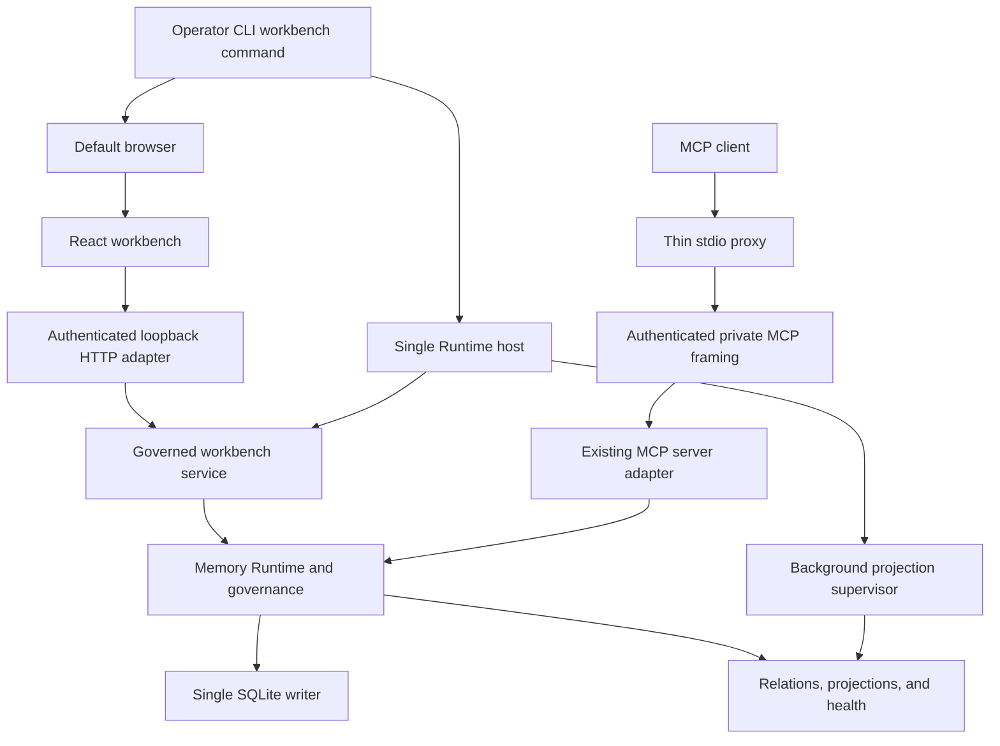
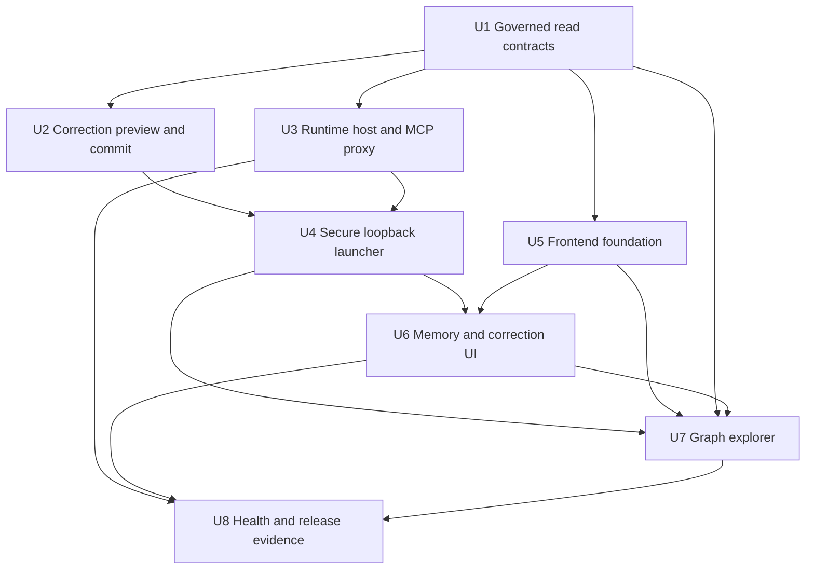
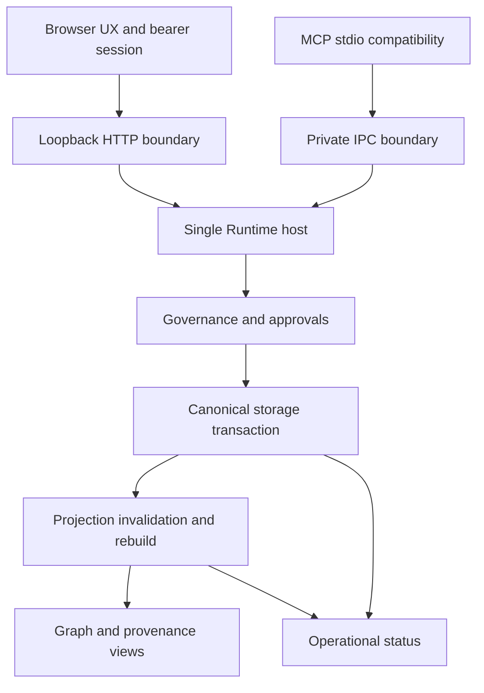

# Memo Graph Memory Workbench Implementation Plan

## Summary

Introduce a single-owner Runtime host that serves both a secure loopback browser workbench and thin stdio MCP proxies, then build the memory, Graph, and health experiences on governed contracts shared with the existing kernel. The implementation extends current SQLite, immutable correction, projection, and operational-status patterns without creating a second authority or adopting a new graph backend.

---

## Problem Frame

The current Runtime can recall, explain, correct, and diagnose memory through MCP and operator surfaces, but it does not expose the browse-first, provenance-rich, safety-previewed workflow required by the workbench. The main planning challenge is therefore not only adding pages: it is preserving one storage writer, one governance path, and explicit degraded states while introducing a browser control surface.

---

## Requirements

**Startup and Navigation**

- R1. A normal management launch starts or reuses the local workbench host and automatically opens an authenticated page in the default browser unless the user explicitly selects no-open or headless mode.
- R2. The default page shows current effective memories, with Memory, Graph, and Runtime Health as first-class navigation; Memory remains the primary entry.
- R3. Startup and connection handling distinguish workbench unavailable, Runtime unavailable or blocked, browser-open failure, stale session, and ready operation from an empty memory set.

**Memory Browsing and Explanation**

- R4. Current effective memories can be browsed without a query and organized through exact workspace/project and topic grouping axes; topic-scoped memory is not assigned an invented workspace parent.
- R5. Search and filters cover memory layer, lifecycle status, source, and time while keeping non-current records visibly separate from the default set.
- R6. Memory detail explains content, kind or layer, lifecycle, scope, authority, validity, current revision, provenance, conflicts, and supersession.
- R7. Raw conversation, tool, and other evidence content remains read-only and visually distinct from authoritative memory.
- R8. List, search, and detail flows distinguish no match, governance exclusion, projection unavailability, authorization failure, and Runtime failure.

**Governed Memory Correction**

- R9. Only a current authoritative memory can start a correction; derived topics, scenarios, Graph relationships, and raw evidence are not directly editable.
- R10. Correction appends an immutable successor revision and user-correction provenance; it never silently overwrites a revision or its original evidence.
- R11. A pre-mutation preview shows the content diff and a complete canonical descendant closure within the supported bound, plus affected topic, scenario, and Graph counts and optionally truncated display samples. If the canonical closure cannot be proven within the bound, confirmation is unavailable.
- R12. Only an explicit, current, single-use confirmation can commit a correction; before the confirmation request is accepted, cancel, expiry, conflict, navigation away, or preview failure is side-effect free. After acceptance, lost responses recover by operation identity rather than assuming no mutation occurred.
- R13. After commit, the canonical successor is visible immediately, old descendants are ineligible before acknowledgement, and projection convergence or failure is explicit.

**Graph Browsing and Provenance**

- R14. Graph defaults to bounded stable memory, topic, scenario, and concept relationships rather than all raw evidence.
- R15. Graph nodes link to governed memory detail and support bounded expansion through revisions and read-only provenance.
- R16. Graph relationships expose meaning, provenance, and projection state without presenting derived edges as independent authority.
- R17. Graph ready-empty, truncated, stale, degraded, unavailable, and failed states are distinct and retain a path back to authoritative memory.

**Read-Only Runtime Health**

- R18. Runtime Health separately reports Runtime, canonical storage, projections, and background work using stable health semantics.
- R19. Health observations include scope, observation time, reason, and action guidance without memory text or sensitive payloads.
- R20. The first dashboard is read-only and exposes no retry, rebuild, backup, restore, cleanup, rollback, key, or other operational mutation.

**Origin actors:** A1 (local memory owner), A2 (Memory Workbench), A3 (Memory Runtime)

**Origin flows:** F1 (launch workbench), F2 (find and explain memory), F3 (safely correct authoritative memory), F4 (trace provenance through Graph), F5 (inspect runtime health)

**Origin acceptance examples:** AE1 (R1-R3), AE2 (R4-R6, R8), AE3 (R7, R9), AE4 (R10-R12 cancel path), AE5 (R10-R13 commit path), AE6 (R14-R16), AE7 (R17), AE8 (R18-R20)

---

## Scope Boundaries

- Do not modify, overwrite, or delete raw conversations, tool results, or other evidence bodies. A correction may append a new `user_feedback` evidence record but cannot rewrite prior evidence.
- Do not directly create, edit, or delete Graph relationships, topics, scenarios, or other projections.
- Do not add operational mutations to Runtime Health.
- Do not introduce a desktop client, remote access, multi-user collaboration, cloud administration, or mobile UI.
- Do not introduce a graph database or re-open the G4A native graph adoption decision; SQLite relations and layered projections remain the accepted source for the first workbench Graph.
- Do not redesign the existing memory hierarchy, lifecycle, recall eligibility, governance, correction, deletion, or invalidation semantics.
- Do not treat feature completion as G6 or production qualification. The workbench expands the evaluated surface and requires its own evidence before any later release decision.
- Do not mix implementation with the active MemOS-inspired optimization task. Start from a pinned, clean post-task baseline in a separate Trellis task.

### Deferred to Follow-Up Work

- Public MCP exposure of every workbench-specific browse, history, Graph, or preview contract; v1 preserves existing MCP compatibility and shared mutation semantics without expanding all public tools.
- Graph layout persistence, user-authored collections, trend analytics, learning-candidate management, and governance queues.
- Remote or multi-user authentication and authorization; these require a different threat model and product contract.
- Dashboard write actions and operational automation; these require independent governed flows and requirements.
- Packaged Linux and Windows IPC, browser-opening, and physical qualification; v1 preserves narrow platform seams but ships and verifies the management lifecycle on macOS only.

---

## Context & Research

### Relevant Code and Patterns

- `packages/mcp-server/src/index.ts` currently composes storage, retrievers, approval registry, and `MemoryRuntime`; this composition must move behind a transport-neutral host factory instead of being duplicated by the workbench.
- `packages/mcp-server/src/cli.ts` is a stdio lifecycle. Browser opening cannot attach to this process because Codex or another client may restart it and because stdin closure currently owns shutdown.
- `packages/storage-sqlite/src/root-lease.ts` enforces one writer per data root. The host must be the only managed-mode owner; browser and MCP proxy code must never bypass it.
- `packages/storage-sqlite/src/governed-memory-reader.ts`, `relation-repository.ts`, `projection-repository.ts`, and `operational-health.ts` provide governed read, bounded relation, projection, and health primitives to extend.
- `packages/storage-sqlite/src/protocol.ts`, `storage-worker.ts`, `database.ts`, and `client.ts` define the strict worker boundary that every new read or transactional operation must cross.
- `packages/contracts/src/tool-inputs.ts` and `packages/memory-kernel/src/index.ts` already enforce exact expected revision, idempotency, approval verification, dry run, and immutable correction receipts.
- `packages/memory-kernel/src/approval.ts` is the authority seam for a browser confirmation registry; a browser session credential alone must not satisfy it.
- `packages/contracts/src/operations.ts` and `packages/storage-sqlite/src/operational-health.ts` establish the reusable status vocabulary and content-free diagnostic boundary.
- `tests/governance/correction.integration.test.ts`, `tests/governance/derived-invalidation.integration.test.ts`, `tests/recovery/graph-rebuild.test.ts`, and `tests/mcp/governance-mutations.integration.test.ts` are the main characterization and regression patterns.

### Institutional Learnings

- There is no `docs/solutions/` corpus in this repository. Relevant accepted evidence is in plans, evaluations, tests, and Trellis specifications.
- `docs/evaluations/g3r-h3-decision.md` demonstrates that invalidation must be scope-local: a correction must not remove or suppress unrelated projections in another scope.
- `docs/evaluations/g4a-decision.md` records the native graph route as NO-GO. The UI is a view over the accepted SQLite baseline, not a reason to reverse the storage decision.
- `docs/evaluations/g6-decision.md` separates a green feature gate from production qualification. New HTTP, browser, and IPC surfaces expand the unqualified envelope.
- `.trellis/spec/backend/` requires strict Zod boundaries, a single SQLite owner, explicit failure distinctions, and content-free diagnostics.
- `.trellis/spec/frontend/` is currently placeholder-only; U5 must establish reviewable frontend conventions before feature pages spread new patterns.

### External References

- [React: build a React app from scratch](https://react.dev/learn/build-a-react-app-from-scratch) supports a client SPA with Vite when framework-level routing or SSR is unnecessary.
- [Vite 7 guide](https://v7.vite.dev/guide/) and the [React plugin release history](https://www.npmjs.com/package/@vitejs/plugin-react?activeTab=versions) establish Node and plugin compatibility constraints.
- [Cytoscape.js documentation](https://js.cytoscape.org/) covers bounded graph rendering, layout, interaction, and cleanup.
- [Vitest Browser Mode](https://vitest.dev/guide/browser/) and [component testing](https://vitest.dev/guide/browser/component-testing) support real-browser component verification.
- [Playwright best practices](https://playwright.dev/docs/best-practices) and [web server integration](https://playwright.dev/docs/test-webserver) guide complete built-application flows.
- [RFC 8252 loopback redirects](https://www.rfc-editor.org/rfc/rfc8252.html) supports loopback IP literals and ephemeral ports for local native applications.
- [Node.js HTTP](https://nodejs.org/download/release/latest-v24.x/docs/api/http.html), [IPC](https://nodejs.org/download/release/latest-v24.x/docs/api/net.html), [child process](https://nodejs.org/download/release/latest-v24.x/docs/api/child_process.html), and [process lifecycle](https://nodejs.org/download/release/latest-v24.x/docs/api/process.html) define Host validation, private IPC, shell-free browser launch, and graceful shutdown behavior.
- [MCP transports](https://modelcontextprotocol.io/specification/2025-11-25/basic/transports) and [MCP security best practices](https://modelcontextprotocol.io/docs/tutorials/security/security_best_practices) support stdio for local clients and require origin validation, loopback binding, and authentication on HTTP surfaces.
- [OWASP CSRF guidance](https://cheatsheetseries.owasp.org/cheatsheets/Cross-Site_Request_Forgery_Prevention_Cheat_Sheet.html), [Fetch Metadata](https://www.w3.org/TR/fetch-metadata/), and [CSP](https://www.w3.org/TR/CSP/) ground the browser control-plane defenses.

---

## Key Technical Decisions

- **One managed Runtime owner:** A long-lived host owns SQLite, projections, mutation ordering, background work, browser HTTP, and private MCP IPC. A workbench process or proxy never opens the same data root independently.
- **Explicit direct and managed MCP modes:** Existing direct stdio composition remains compatible. Workbench-managed configuration switches the stdio process to an attach-only proxy; it returns typed host unavailability instead of falling back to direct storage and contending for the lease.
- **Operator-owned management lifecycle:** `apps/operator-cli` remains the public management entry and gains the workbench command, reusing its configuration, runtime identity, rendering, and exit semantics. Only that command starts or stops the host and opens a browser; proxy starts, proxy exits, and host-internal restarts never open tabs.
- **Per-root startup arbitration:** Before Runtime or descriptor work, management launch acquires a short-lived per-root bootstrap lock. A concurrent launcher waits for a bounded interval and performs an authenticated instance probe; stale cleanup requires failed ownership and liveness checks rather than PID absence alone.
- **Transport-neutral application service:** Governed browse, detail, history, provenance, impact, Graph, health, and correction operations live below HTTP and MCP adapters so transport cannot change authority or error semantics.
- **Scope-faithful project and topic grouping:** Workbench grouping never invents a parent hierarchy absent from `ScopeSchema`. Workspace scopes are project groups, topic scopes are topic groups, and other exact scopes remain explicit. Within a scope, current topic, scenario, and core projection nodes derive membership edges from `projection_revision_sources`; cross-scope workspace-to-topic parentage is shown only when an accepted governed relation exists.
- **Current effective means recall-eligible now:** The default collection contains the current governed revision only when validity, lifecycle, tombstone, conflict, and usage controls allow recall. Conflicted, blocked, superseded, revoked, quarantined, and purged records require an explicit status or history path.
- **Bounded server-side snapshot pagination:** The host stores an expiring, per-session ordered membership snapshot keyed by filter hash and canonical frontier. Cursors reference that snapshot plus position; expiry, eviction, host restart, or incompatible frontier returns a typed stale-cursor result. Snapshot count, membership size, and lifetime are bounded, and no SQLite transaction remains open across browser requests.
- **Correction adds user provenance:** Confirmation atomically appends user feedback evidence and the successor revision. Earlier evidence remains linked as contextual history but is not rewritten to claim it expressed the correction.
- **Correction reason is required:** The UI captures the existing correction reason as a required bounded field, includes it in preview and receipt context, and renders its `user_feedback` evidence in provenance/history. Content and reason drafts share one lifecycle: explicit cancel discards after confirmation, stale/conflict/session loss preserves them in current-page memory, and page close or navigation uses an unsaved-change guard.
- **Preview is a sealed, single-use capability:** Preview binds the normalized replacement, target revision, scope, relevant governance and impact frontiers, user session, idempotency identity, and expiry. It does not bind to an unrelated global epoch.
- **Bounded canonical invalidation controls correction availability:** Preview and confirm use the same scope-local descendant walk with a hard supported closure limit. A degraded projection may reduce display detail, but confirmation proceeds only when the complete invalidation set is proven within that limit and can be suppressed atomically; exceeding the bound or losing the invariant fails closed before mutation.
- **Browser authentication is not approval:** A one-time fragment bootstrap exchanges for a short-lived per-page bearer. Explicit confirmation then creates a separate server-side approval bound to the exact request and consumed by the existing approval seam.
- **No cookie-based localhost authority:** Browser authorization does not use a port-shared loopback cookie. Browser and MCP credentials are separate, rotated per host instance, and invalid after restart.
- **Explicit local trust and pairing boundary:** V1 trusts the current OS user and excludes hostile same-UID processes from its threat boundary. Normal launch uses a one-use fragment ticket; browser-open failure or manual recovery uses a short-lived terminal-displayed pairing code entered into the unauthenticated shell page. Tickets, codes, and bearers are never written to logs, files, browser storage, URLs after exchange, argv beyond the one launch handoff, or environment variables.
- **Strict and resource-bounded loopback HTTP:** Bind to an OS-assigned port on `127.0.0.1`, validate the exact `Host`, reject cross-origin and form requests, expose no CORS, set restrictive response headers, use no remote assets, and render memory payloads as text rather than trusted HTML. Header/body/time/connection limits, per-session and global concurrency, bounded queues, cancellation, and reserved capacity prevent HTTP polling from starving IPC or mutations.
- **Existing MCP framing over private IPC:** Managed mode forwards the current MCP protocol over an authenticated private socket and terminates it through the existing MCP server adapter in the host. Runtime host remains independent of MCP; a custom operation RPC is permitted only if a characterization spike proves MCP framing cannot preserve a required cancellation or lifecycle semantic.
- **Managed background supervisor:** Managed mode continuously owns configured consolidation, FTS, Graph, and vector job processors with bounded claims, concurrency, retry/backoff, terminal failure, startup recovery, health publication, and shutdown drain. Direct stdio mode preserves its current non-supervised behavior.
- **Polling before streaming:** V1 uses authenticated request/response and bounded polling for convergence and health. It does not add WebSocket or native `EventSource` credential complexity before live streaming is required.
- **Bounded, accessible Graph:** The API enforces deterministic node, edge, depth, and fan-out bounds and reports truncation. Cytoscape is a synchronized visual layer over an equivalent semantic list and detail panel, not the only path to inspect relationships.
- **Minimal frontend stack:** Use React 19 with the existing Vite 7 and TypeScript 6 toolchain, a browser-specific TypeScript config, direct Cytoscape integration, Zod response validation, Vitest Browser Mode, and Playwright. Structural filters and selected governed IDs may use an allowlisted URL state; free-text search and drafts remain in page memory and travel only in authenticated request bodies. Do not add a full-stack React framework, client router, or server-state library in v1.
- **macOS v1 evidence target:** The first executable qualification target is the repository's current macOS environment. IPC and browser-opening code keeps narrow platform seams, but Linux and Windows implementation and physical verification are follow-up work rather than implicit v1 requirements.

### Runtime Capability Matrix

| Runtime mode | Memory | Correction | Graph | Health |
|---|---|---|---|---|
| Ready | Governed browse and detail | Enabled after fresh preview | Available subject to bounds | Full component status |
| Degraded | Canonical browse with named warnings | Enabled only when canonical invalidation remains safe | Stale, partial, or unavailable state is explicit | Component failures remain separate |
| Read-only | Verified browse and detail | Disabled | Read-only if its snapshot is verified | Available |
| Blocked | Not represented as an empty library | Disabled | Disabled | Health-only diagnosis |
| Disconnected or stale instance | Cached content is no longer presented as current | Disabled; no automatic replay | Disabled | Reopen or reconnect guidance only |

### Cross-Feature Recovery Matrix

| State | Content treatment | Mutations | Primary recovery and focus |
|---|---|---|---|
| Initial loading | No prior content is presented as authoritative | Disabled | Focus the page heading, then the first result or state message |
| Refreshing | Keep prior content labeled refreshing | Disabled until a fresh authority check completes | Preserve current focus and announce completion politely |
| Ready-empty | Show a verified empty collection | Disabled where no target exists | Offer scope navigation or source ingestion guidance |
| Filtered-empty | Preserve filter context; do not imply an empty library | Disabled where no target exists | Focus clear-filters, then return to results heading |
| Governance-excluded | Show counts/reasons without excluded content | Disabled for excluded records | Offer permitted filters or Runtime Health |
| Truncated | Keep retained results and omitted counts | Governed actions remain target-specific | Offer bounded continuation or expansion |
| Degraded | Keep verified canonical content with named projection warnings | Follow the Runtime Capability Matrix | Offer authoritative detail and Runtime Health |
| Blocked | Show no memory content as an empty result | Disabled | Focus health-only diagnosis and relaunch guidance |
| Unauthorized or expired | Remove authority indicators; retain unsent draft only in page memory | Disabled | Focus re-open/pair action; never replay automatically |
| Disconnected, stale instance, or failed | Prior content may remain only as clearly stale context | Disabled | Focus relaunch/retry action and stop authenticated polling |

The shell, grouped list, detail panels, correction preview, Graph plus semantic list, and Health view must reflow at narrow desktop windows and 200% zoom. Modal flows trap focus and restore it to their trigger, asynchronous commit/projection changes use restrained live-region announcements, and Graph canvas interaction always has an equivalent semantic path.

---

## Open Questions

### Resolved During Planning

- **How does workbench lifecycle differ from Codex-started MCP lifecycle?** The management launcher owns the host and browser; managed MCP processes attach through private IPC, while existing direct mode remains available.
- **Which read capabilities must be added?** Add strict list, detail, history, provenance-chain, impact, Graph snapshot/expansion, and aggregate health contracts through storage and kernel boundaries.
- **How is preview made stable?** Seal it against the exact target revision, replacement, scope, relevant frontiers, session, expiry, and idempotency identity, then revalidate before issuing a one-use approval.
- **What Graph backend and UI are used?** Keep the accepted SQLite relations/projections and render bounded snapshots with Cytoscape plus a semantic alternative.
- **How are health states normalized?** Extend the existing operational status vocabulary with an aggregate that never converts missing observation into healthy.
- **What local security boundary is required?** Use loopback IP binding, exact Host and Origin checks, Fetch Metadata, bearer authentication, strict response headers, no CORS, and a distinct private IPC credential.
- **Who starts and stops the host?** Only the management launcher; proxy EOF never stops it and a proxy never auto-starts it.
- **What authorizes browser correction?** Explicit confirmation creates a server-side single-use approval; browser authentication only identifies an eligible session.
- **What evidence supports a correction?** An atomic `user_feedback` evidence append records the user's correction and reason while preserving all previous evidence.
- **What happens when impact detail is unavailable?** Confirmation is allowed only when the complete canonical invalidation set and its count/hash are proven within the hard bound. Display samples may be truncated or degraded, but the canonical closure is never unknown at commit time.
- **What does MCP parity mean in v1?** Existing MCP schemas remain compatible and share mutation, CAS, idempotency, receipt, invalidation, and error semantics; UI-only reads need not all become new public tools.
- **How does grouping work without an existing project/topic hierarchy?** Use exact governed scopes as peer grouping axes and projection-source lineage for within-scope derived membership; never infer cross-scope parentage.
- **How are stable cursors implemented?** Use bounded, expiring host-side membership snapshots and return a typed stale-cursor state after expiry, eviction, or restart.
- **Who drains projection jobs?** Managed mode adds one supervised background lifecycle; direct stdio mode remains behaviorally compatible and does not silently gain a daemon.
- **What is the public management entry?** Extend `apps/operator-cli` with the workbench command and keep `apps/memory-workbench-host` as the process/package boundary behind it.
- **Which platform is v1?** Physically verify macOS; preserve seams and defer Linux/Windows implementation evidence.

### Deferred to Implementation

- Exact default list page size and Graph node, edge, depth, and fan-out limits: choose conservative constants from existing bounded-query behavior, then validate against representative fixtures and browser performance evidence.
- Exact macOS private IPC path: keep it behind a platform adapter while preserving user-private permissions, root/config identity, bootstrap arbitration, and stale-owner probing.
- Browser opener package versus a small platform adapter: select the maintained shell-free option that passes packaged macOS tests without changing the lifecycle contract.
- Exact snapshot count, membership, byte, and lifetime limits: select conservative defaults from representative workbench fixtures and prove eviction/stale-cursor behavior.
- Exact HTTP header/body/time/connection and fairness budgets: establish finite defaults with real-process slow-client and polling-storm tests before enabling correction routes.
- Whether polling intervals need adaptive backoff: start bounded and tune from component/E2E evidence without adding a live-stream protocol.

---

## Output Structure

    apps/
      operator-cli/src/commands/workbench.ts
      memory-workbench-host/
        src/
          http/
          ipc/
          lifecycle/
        package.json
        tsconfig.json
      memory-workbench-web/
        src/
          api/
          app/
          features/
            memories/
            corrections/
            graph/
            health/
          styles/
        package.json
        tsconfig.json
        vite.config.ts
    packages/
      contracts/src/workbench.ts
      runtime-host/
        src/
          host.ts
          runtime-factory.ts
          approval-registry.ts
          background-supervisor.ts
          launch-lock.ts
          snapshot-registry.ts
          ipc-handshake.ts
        package.json
        tsconfig.json
      memory-kernel/src/workbench-service.ts
      storage-sqlite/src/workbench-reader.ts
    tests/
      browser/
      contract/workbench.contract.test.ts
      governance/workbench-correction-impact.integration.test.ts
      integration/workbench-host.integration.test.ts
      recovery/workbench-lifecycle.recovery.test.ts
      security/workbench-http-boundary.test.ts
      storage/workbench-reader.integration.test.ts

This tree declares responsibility boundaries, not immutable filenames. Implementation may consolidate small modules while preserving the same dependency direction.

---

## High-Level Technical Design

> *This illustrates the intended approach and is directional guidance for review, not implementation specification. The implementing agent should treat it as context, not code to reproduce.*

The operator command first acquires a per-root bootstrap lock. The host publishes a restrictive instance descriptor only after it owns the IPC endpoint, has opened or classified the Runtime, has bound the loopback port, and has completed an internal readiness check. The descriptor binds instance, data root, configuration, protocol version, and endpoint; credentials live in user-private runtime state rather than the descriptor or logs, and reuse requires an authenticated probe rather than a PID check alone.

Normal browser launch uses a one-use fragment ticket. If the browser cannot be opened, the unauthenticated shell page accepts a short-lived pairing code displayed only on the controlling TTY; no recovery path prints an authenticated URL. The current OS user is the accepted local trust boundary for v1, while cross-origin websites, other OS users, stale processes, and reused ports remain adversarial.

A workbench correction proceeds through four authority-preserving states:

1. The browser holds a draft only; no evidence, revision, pointer, approval, or projection changes exist.
2. Preview resolves the current revision, validates the required reason, builds the diff and complete impact within the supported closure bound, and returns an expiring sealed preview capability.
3. Explicit confirmation revalidates the seal and creates a single-use approval bound to the exact governed correction request.
4. One canonical transaction appends correction provenance and the successor, advances the pointer, suppresses the revalidated bounded descendant set, and records pending projection work; the managed background supervisor drives convergence and later polling reports it without weakening the acknowledgement invariant.

If confirmation loses its response after commit, the same operation identity resolves to the existing receipt. If the preview is stale or expired, no write occurs, the browser preserves the draft, and the user must refresh and preview again.

---

## Implementation Units

- U1. **Governed Workbench Read Contracts and Queries**

**Goal:** Provide transport-neutral, strictly validated memory list, detail, history, and provenance reads without exposing direct SQLite access or weakening recall eligibility.

**Requirements:** R4-R8, R10

**Dependencies:** Clean post-current-task baseline; no implementation-unit dependency

**Files:**
- Create: `packages/contracts/src/workbench.ts`
- Create: `packages/storage-sqlite/src/workbench-reader.ts`
- Create: `packages/memory-kernel/src/workbench-service.ts`
- Modify: `packages/contracts/src/index.ts`
- Modify: `packages/storage-sqlite/src/protocol.ts`
- Modify: `packages/storage-sqlite/src/storage-worker.ts`
- Modify: `packages/storage-sqlite/src/database.ts`
- Modify: `packages/storage-sqlite/src/client.ts`
- Modify: `packages/storage-sqlite/src/index.ts`
- Modify: `packages/memory-kernel/src/index.ts`
- Test: `tests/contract/workbench.contract.test.ts`
- Test: `tests/storage/workbench-reader.integration.test.ts`

**Approach:**
- Define browser-safe Zod DTOs that contain no SQLite, filesystem, MCP, or Node implementation types.
- Add deterministic list and history queries with a host-facing snapshot-registry interface, exact-scope project/topic grouping, explicit filters, and a default recall-eligible-current predicate. The host implementation materializes bounded ordered membership and returns typed stale-cursor outcomes after expiry or restart.
- Return authoritative detail separately from status, conflicts, supersession, projection state, and source-chain nodes so missing, redacted, purged, cyclic, and truncated provenance is representable without inventing content.
- Keep memory content out of logs, exception text, cursor state, and instance metadata.

**Execution note:** Characterize current recall eligibility, history, provenance, and cursor behavior before extending the worker protocol.

**Patterns to follow:**
- `packages/storage-sqlite/src/governed-memory-reader.ts`
- `packages/contracts/src/operations.ts`

**Test scenarios:**
- Happy path: browse a mixed exact-scope fixture without a query and receive only current recall-eligible memories grouped into workspace/project, topic, and explicit other-scope groups without invented parentage.
- Happy path: open current detail, traverse immutable revision history, and follow a complete source chain without elevating evidence to authority.
- Edge case: paginate a stable snapshot while another memory is corrected and observe no duplicates or skips in the original cursor sequence.
- Edge case: retrieve superseded, revoked, quarantined, purged, conflict-blocked, and usage-blocked records only through explicit filters or history, each carrying a non-current reason.
- Edge case: source traversal encounters redacted, deleted, unavailable, cyclic, or over-depth evidence and returns typed placeholders and truncation rather than fabricated absence.
- Error path: snapshot expiry, eviction, and host restart return stale-cursor rather than continuing from a changed collection or holding a database transaction open.
- Security: cursor state and protocol errors contain identifiers, codes, scopes, and times but no memory body or raw evidence content.

**Verification:**
- AE2 and AE3 can be expressed entirely through the new service without opening a second storage client.
- Contract and storage tests prove deterministic pagination, content redaction, and state distinctions.

---

- U2. **Sealed Correction Preview, Approval, and Atomic Provenance**

**Goal:** Extend correction into a two-step workbench flow that previews real impact, preserves immutable provenance, and commits through the existing governance and idempotency semantics.

**Requirements:** R9-R13

**Dependencies:** U1

**Files:**
- Modify: `packages/contracts/src/workbench.ts`
- Create: `packages/memory-kernel/src/workbench-approval.ts`
- Modify: `packages/memory-kernel/src/workbench-service.ts`
- Modify: `packages/memory-kernel/src/approval.ts`
- Modify: `packages/memory-kernel/src/index.ts`
- Modify: `packages/storage-sqlite/src/projection-effects.ts`
- Modify: `packages/storage-sqlite/src/governance-repository.ts`
- Modify: `packages/storage-sqlite/src/protocol.ts`
- Modify: `packages/storage-sqlite/src/database.ts`
- Test: `tests/governance/workbench-correction-impact.integration.test.ts`
- Test: `tests/replay/governance-replay.test.ts`

**Approach:**
- Factor impact enumeration from the same recursive descendant logic that performs correction invalidation, preserving exact scope boundaries and cycle handling. Establish a hard supported closure limit that both preview and commit enforce before any write.
- Preview runs without mutation and seals the target revision, normalized replacement, relevant control and impact frontiers, session identity, expiry, and operation identity.
- Confirmation revalidates only relevant frontiers; unrelated memory or projection progress must not invalidate the preview.
- Convert explicit confirmation into a single-use trusted approval through the existing approval registry interface rather than treating browser authentication as authority.
- Require the existing bounded correction reason and extend the governed transaction so its `user_feedback` evidence record, successor revision, pointer advance, complete bounded descendant suppression, receipt, and pending projection effects are atomic.
- Preserve existing `memory_correct` schema compatibility and replay semantics for MCP callers; the workbench orchestration is additive.
- Permit degraded display detail only when the complete canonical invalidation set is still proven within the hard limit. Exceeding the limit fails closed before approval or mutation.

**Execution note:** Test side-effect freedom and existing correction replay behavior first; the transaction boundary is the primary correctness risk.

**Patterns to follow:**
- `packages/contracts/src/tool-inputs.ts` correction and envelope schemas
- `packages/memory-kernel/src/index.ts` governed mutation flow
- `packages/storage-sqlite/src/governance-repository.ts` correction basis and receipt persistence
- `tests/governance/derived-invalidation.integration.test.ts`

**Test scenarios:**
- Happy path: preview a current authoritative memory, confirm once, and observe one feedback evidence item, one successor, one pointer advance, one receipt, and pending or completed projection effects.
- Happy path: lose the confirmation response after commit and resolve or replay the same operation to the same receipt without a second successor.
- Edge case: two tabs preview the same revision; the first confirmation succeeds and the second returns a stale result with zero write while preserving its draft.
- Edge case: a relevant descendant or governance frontier changes after preview; confirmation fails closed and requires a fresh preview.
- Edge case: an unrelated memory or projection advances; the preview remains valid.
- Edge case: display samples are truncated or partially unavailable while the complete canonical descendant set, count, and seal are proven; confirmation succeeds with explicit sample limitations and no unknown canonical targets.
- Edge case: descendant closure exceeds the supported commit bound; preview refuses confirmation with zero canonical or projection writes.
- Edge case: correction reason is missing, blank, or over its existing contract limit; preview rejects it before issuing a capability.
- Error path: canonical invalidation safety cannot be established, approval expires, approval is replayed, or evidence append fails; no partial evidence, revision, pointer, or projection state remains.
- Error path: cancel, close, navigate away, or preview failure leaves storage byte-for-byte equivalent for the governed entities involved.
- Integration: browser and MCP race to correct the same revision; exactly one CAS wins and both observe the same receipt or error semantics.
- Regression: correcting one scope does not suppress projections belonging to an unrelated scope.

**Verification:**
- AE4 and AE5 pass with explicit proof of no side effects on every pre-confirmation exit.
- The correction result remains replayable and compatible with existing MCP governance tests.

---

- U3. **Transport-Neutral Runtime Host and MCP Attach Proxy**

**Goal:** Establish one managed Runtime owner while preserving the existing stdio MCP protocol and direct-mode compatibility.

**Requirements:** R1, R3, R13, R18-R19

**Dependencies:** U1

**Files:**
- Create: `packages/runtime-host/package.json`
- Create: `packages/runtime-host/tsconfig.json`
- Create: `packages/runtime-host/src/runtime-factory.ts`
- Create: `packages/runtime-host/src/host.ts`
- Create: `packages/runtime-host/src/approval-registry.ts`
- Create: `packages/runtime-host/src/background-supervisor.ts`
- Create: `packages/runtime-host/src/snapshot-registry.ts`
- Create: `packages/runtime-host/src/ipc-handshake.ts`
- Create: `packages/runtime-host/src/index.ts`
- Create: `packages/mcp-server/src/ipc-proxy.ts`
- Modify: `packages/mcp-server/src/mutations.ts`
- Modify: `packages/mcp-server/src/trusted-file.ts`
- Modify: `packages/mcp-server/src/index.ts`
- Modify: `packages/mcp-server/src/cli.ts`
- Modify: `packages/mcp-server/package.json`
- Modify: `package.json`
- Test: `tests/integration/workbench-host.integration.test.ts`
- Test: `tests/mcp/managed-host-proxy.integration.test.ts`
- Test: `tests/recovery/workbench-lifecycle.recovery.test.ts`

**Approach:**
- Publish an acyclic dependency direction: contracts and storage feed memory-kernel; runtime-host owns composition and concrete manifest/browser approval registries; `mcp-server` and both apps depend on runtime-host. Move or inject current trusted-file and manifest registry behavior so runtime-host never imports `mcp-server`.
- Extract Runtime composition from the MCP adapter into `runtime-host`; both direct stdio and the managed host use the same factory.
- Characterize forwarding the existing MCP framing over the private authenticated socket and terminate it through the existing MCP adapter in the host. Introduce a separate operation RPC only if the characterization proves a required cancellation or lifecycle semantic cannot be preserved, and then derive both adapters from one exact operation registry.
- Place the IPC endpoint and non-secret atomic descriptor in a user-private location. Bind them to instance ID, protocol version, root identity, and configuration identity; keep the machine credential in restrictive runtime state and authenticate before accepting an existing process as the owner.
- Implement the bounded per-session snapshot registry introduced by U1, including expiry, eviction, restart invalidation, and resource accounting.
- Supervise configured consolidation, FTS, Graph, and vector job processors in managed mode with bounded claims, concurrency, retry/backoff, terminal failure, startup recovery, health observations, and shutdown drain.
- In managed mode, the MCP CLI is a framing proxy only. It writes only MCP protocol output to stdout and never opens SQLite, workers, projection stores, or browser processes.
- Preserve direct stdio mode for existing configurations. Managed mode fails closed with a typed host-unavailable state rather than silently acquiring the storage lease.
- Handle stale socket/descriptor cleanup only after a failed authenticated liveness probe; PID existence alone is insufficient because of PID reuse.
- Keep host lifetime independent from proxy stdin/EOF. Graceful host shutdown drains bounded in-flight work, revokes sessions, closes HTTP and IPC, flushes storage, and removes owned metadata.

**Execution note:** Characterize all existing MCP tools/resources in direct mode before routing them over IPC; stdout purity and semantic parity are release blockers.

**Patterns to follow:**
- `packages/mcp-server/src/index.ts` Runtime composition
- `packages/mcp-server/src/cli.ts` stdio discipline
- `packages/storage-sqlite/src/root-lease.ts` ownership semantics
- `tests/mcp/` transport and mutation fixtures

**Test scenarios:**
- Happy path: management host owns one root and multiple sequential or concurrent stdio proxies serve existing MCP operations through it.
- Happy path: direct mode continues to open and close its own Runtime exactly as before when workbench management is not configured.
- Edge case: proxy EOF, cancellation, or crash does not stop the managed host or cancel unrelated clients.
- Edge case: snapshot registry reaches count, membership, byte, or lifetime limits; deterministic eviction produces a typed stale cursor and releases all retained state.
- Edge case: configured projection workers recover claimed or pending work after restart, bound retries, publish terminal failure, and stop accepting claims during shutdown.
- Edge case: a second management launch validates root, config, protocol, and instance identity and reuses the matching host without opening a second SQLite owner.
- Error path: host absent, root/config mismatch, incompatible protocol, active direct owner, port conflict, stale descriptor, stale socket, and PID reuse each produce a distinct recoverable result.
- Error path: host stops with active proxies; pending calls fail cleanly, no mutation is automatically replayed, and a later host instance requires a new authenticated handshake.
- Integration: every existing MCP mutation preserves CAS, idempotency, approval, receipt, invalidation, and public error behavior through the proxy.
- Integration: the MCP-framing characterization either proves direct private forwarding or records the concrete semantic that requires the shared generated operation registry before proxy implementation continues.
- Security: browser bearer cannot authenticate IPC and the IPC machine credential cannot authenticate browser APIs.

**Verification:**
- Exactly one managed storage writer exists for a root under repeated launch and multi-proxy tests.
- The existing MCP contract and integration suites pass in direct mode, with a representative parity matrix passing in managed mode.

---

- U4. **Secure Loopback HTTP Host and Management Launcher**

**Goal:** Serve a static workbench fixture and the governed API on a hardened local origin, manage browser bootstrap and concurrent startup, and expose truthful lifecycle states independently of the final SPA.

**Requirements:** R1-R3, R8, R12, R17-R20

**Dependencies:** U2, U3

**Files:**
- Create: `apps/memory-workbench-host/package.json`
- Create: `apps/memory-workbench-host/tsconfig.json`
- Create: `apps/memory-workbench-host/src/http/`
- Create: `apps/memory-workbench-host/src/ipc/`
- Create: `apps/memory-workbench-host/src/lifecycle/`
- Create: `apps/operator-cli/src/commands/workbench.ts`
- Modify: `apps/operator-cli/src/cli.ts`
- Modify: `apps/operator-cli/src/config.ts`
- Modify: `apps/operator-cli/src/render.ts`
- Modify: `apps/operator-cli/src/exit-codes.ts`
- Modify: `package.json`
- Modify: `pnpm-lock.yaml`
- Test: `tests/integration/workbench-host.integration.test.ts`
- Test: `tests/recovery/workbench-lifecycle.recovery.test.ts`
- Test: `tests/security/workbench-http-boundary.test.ts`

**Approach:**
- Keep `apps/operator-cli` as the public management command and reuse its configuration, runtime identity, rendering, and exit conventions to launch or attach to `apps/memory-workbench-host`.
- Acquire a per-root bootstrap arbitration lock before Runtime or descriptor creation. Concurrent launches wait for a bounded interval and probe the matching instance; crash recovery distinguishes a booting host, active direct owner, and stale lock.
- Use Node 24's built-in HTTP server for the bounded local route set, with explicit route and static-fixture allowlists, request size limits, method and content-type checks, and no directory-style path resolution.
- Bind an ephemeral port on the `127.0.0.1` literal. Validate exactly one canonical Host before routing, disable CORS, and require exact same-origin and Fetch Metadata checks on authenticated API calls.
- Generate a high-entropy, one-use bootstrap ticket, place it in the browser fragment, exchange it for a short-lived per-page bearer, remove the fragment, and bind the session to the host instance.
- For browser-open failure or manual recovery, serve only an unauthenticated shell and pair it with a short-lived code displayed on the controlling TTY. The base URL never mints authority by itself, and tickets, codes, and bearers are not persisted or logged.
- Enforce finite header/body/request/idle/keep-alive timeouts, maximum open connections, unauthenticated and authenticated rate limits, per-session/global concurrency, bounded queues, close-driven cancellation, and reserved mutation/IPC/health capacity.
- Set no-store caching, restrictive CSP, framing denial, MIME sniff prevention, no-referrer, and same-origin resource policy on every relevant response. Bundle all assets locally; render content as plain text and do not register a service worker.
- Start the host in dependency order, publish non-secret endpoint metadata atomically only after readiness, and open the browser with a shell-free process API. Browser-open failure leaves the host running and prints the base recovery route plus TTY pairing guidance, never an authenticated URL.
- Provide an explicit no-open/headless path. Background proxy connection never invokes the browser opener.
- When Runtime is blocked, expose health-only mode and reject content routes rather than returning empty collections. When the host instance changes, revoke sessions, previews, and retries from stale tabs.

**Execution note:** Build adversarial HTTP and lifecycle tests before enabling the correction route.

**Patterns to follow:**
- `packages/mcp-server/src/cli.ts` process shutdown handling
- `packages/storage-sqlite/src/root-lease.ts` single-owner recovery
- `tests/security/` content-residual and boundary tests
- `tests/recovery/` outage and restart patterns

**Test scenarios:**
- Happy path: a management launch obtains the host, opens one authenticated tab, and serves current memories from the canonical origin.
- Happy path: the existing operator command starts or reuses the host using the same root/config identity and diagnostic conventions as other operator commands.
- Happy path: an explicit second management launch reuses the matching host and mints a fresh one-use page ticket without starting another writer.
- Edge case: default browser opening fails or headless mode is selected; the host remains usable and reports a safe recovery instruction.
- Edge case: two launchers start simultaneously and one crashes before descriptor publication; the surviving command uses the bootstrap lock and bounded probe to return one truthful owner result.
- Edge case: Runtime enters blocked mode; health remains accessible while list, detail, Graph, and correction are unavailable rather than empty.
- Error path: wrong or duplicate Host, rebinding hostname, cross-site Origin, `Origin: null`, cross-site Fetch Metadata, form content type, oversized body, disallowed method, traversal path, replayed ticket, expired bearer, and stale instance are rejected without data disclosure.
- Error path: slowloris connections, connection floods, polling storms, and expensive-query bursts hit finite budgets without starving MCP, mutation, or health capacity.
- Error path: pairing-code replay, expiry, wrong instance, or navigation to the base URL without pairing cannot read memory or create an approval.
- Error path: shutdown with active polling and in-flight preview revokes sessions, drains bounded work, closes ownership resources, and leaves no descriptor claiming a dead instance.
- Security: a credential associated with another loopback port, a browser cookie, or an IPC handshake cannot authenticate the API.
- Security: HTML, API, error, and static responses carry the required cache and browser-hardening headers and contain no remote or inline executable content.

**Verification:**
- AE1 and the host/security portions of the failure distinctions in AE2, AE7, and AE8 pass through the built host using the static fixture; full built-SPA integration is completed in U8.
- The adversarial loopback suite proves that local binding alone is not the only security control.

---

- U5. **Frontend Foundation, State Model, and Application Shell**

**Goal:** Establish the browser toolchain, typed API boundary, accessible shell, and explicit UI state taxonomy before feature screens are implemented.

**Requirements:** R2-R3, R8, R17-R20

**Dependencies:** U1; may proceed in parallel with U2 and U3 using contract fixtures

**Files:**
- Create: `apps/memory-workbench-web/package.json`
- Create: `apps/memory-workbench-web/tsconfig.json`
- Create: `apps/memory-workbench-web/vite.config.ts`
- Create: `apps/memory-workbench-web/index.html`
- Create: `apps/memory-workbench-web/src/api/`
- Create: `apps/memory-workbench-web/src/app/`
- Create: `apps/memory-workbench-web/src/styles/`
- Create: `vitest.browser.config.ts`
- Create: `playwright.config.ts`
- Modify: `package.json`
- Modify: `pnpm-lock.yaml`
- Modify: `eslint.config.js`
- Modify: `.trellis/spec/frontend/directory-structure.md`
- Modify: `.trellis/spec/frontend/component-guidelines.md`
- Modify: `.trellis/spec/frontend/state-management.md`
- Modify: `.trellis/spec/frontend/type-safety.md`
- Modify: `.trellis/spec/frontend/quality-guidelines.md`
- Test: `tests/browser/workbench-shell.browser.test.tsx`

**Approach:**
- Pin versions compatible with the existing Vite 7 and Vitest 4 toolchain, including React 19, the Vite 7-compatible React plugin, Playwright browser provider, and Cytoscape 3.
- Isolate browser compilation with ES modules, bundler resolution, React JSX, and DOM libraries while retaining repository strictness; do not leak Node globals into the web app.
- Build a small typed fetch layer that validates every network response with workbench Zod schemas, aborts obsolete requests, and carries the per-page bearer and instance identity.
- Implement the Cross-Feature Recovery Matrix as explicit discriminated UI states, including cached-content treatment, mutation availability, primary/secondary recovery, focus target, and polling/retry behavior.
- Implement an accessible application shell with Memory as the default route and Graph and Runtime Health as peer navigation. Support narrow desktop reflow and 200% zoom, semantic controls, focus trap/return, keyboard operation, restrained live-region announcements, readable contrast, target sizing, and reduced-motion handling.
- Allow only reviewed structural filters, view names, and governed identifiers in URL search parameters. Keep free-text search and drafts in page memory and send search text only in authenticated request bodies; remove disallowed URL state with replacement rather than adding history.
- Replace placeholder frontend Trellis guidance with conventions proven by the shell and test harness.

**Execution note:** Use contract fixtures and real-browser component tests; do not rely on a simulated DOM for focus, layout, or accessibility behavior.

**Patterns to follow:**
- Repository strict TypeScript and ESLint settings
- Zod boundary validation in `packages/contracts`
- Vitest test organization and Playwright role/label locator guidance

**Test scenarios:**
- Happy path: bootstrap succeeds, Memory receives focus as the default view, and all three top-level views are keyboard reachable.
- Edge case: ready-empty, filtered-empty, governance-excluded, degraded, blocked, disconnected, and failed fixtures render distinct messages and actions.
- Edge case: a request is superseded by a filter/navigation change; the old response is aborted or ignored and cannot overwrite the current view.
- Edge case: initial load, refresh, empty, filtered-empty, excluded, truncated, degraded, blocked, expired, disconnected, stale-instance, and failed states follow the matrix's retained-content, recovery, focus, and mutation rules.
- Error path: response schema mismatch, bearer expiry, host instance mismatch, and network loss clear current authority indicators and disable mutations.
- Accessibility: landmarks, headings, labels, narrow-window reflow, 200% zoom, target sizes, dialog focus trap/return, live regions, reduced motion, and keyboard navigation work in a real browser.
- Security: secret-like and PII-like free-text search strings never appear in the URL, history, referrer, or structural deep link.
- Security: memory and evidence strings containing markup render as text and cannot create DOM nodes or executable content.

**Verification:**
- Browser typecheck, lint, Node unit tests, and real-browser component tests run as separate, reproducible lanes.
- No frontend module imports storage, MCP, filesystem, or other Node implementation packages.

---

- U6. **Memory Browser, Provenance Detail, and Correction Experience**

**Goal:** Deliver the primary workbench workflow from browse/search through authoritative detail, source inspection, safe preview, confirmation, and convergence.

**Requirements:** R2, R4-R13

**Dependencies:** U2, U4, U5

**Files:**
- Create: `apps/memory-workbench-web/src/features/memories/`
- Create: `apps/memory-workbench-web/src/features/corrections/`
- Modify: `apps/memory-workbench-web/src/app/`
- Test: `tests/browser/memory-browser.browser.test.tsx`
- Test: `tests/browser/correction-flow.browser.test.tsx`
- Test: `tests/browser/memory-workbench.e2e.test.ts`

**Approach:**
- Make the unqueried current-effective collection the home view. Offer peer project/workspace and topic grouping axes based on exact scopes; show other scopes explicitly, and never invent workspace parents for topic-scoped memory. Encode only structural filters in the URL.
- Display non-current records only through explicit filters or history and keep their status visible in list and detail contexts.
- Compose detail from authoritative revision, scope/validity, conflicts/supersession, projection state, revision history, and a bounded read-only source chain. Missing or redacted source nodes remain visible as typed gaps.
- Offer correction only for current authoritative and currently writable records. Capture replacement content and the required bounded reason as one current-page draft and keep both local until preview succeeds.
- Show a readable old/new diff, the proven canonical closure count/seal, affected entity counts, bounded display samples, and any sample truncation before enabling confirm. An unknown or over-bound canonical closure cannot reach confirmation.
- Preserve both draft fields on stale preview, session loss, or conflict; require fresh detail and preview rather than silently rebasing or replaying. Explicit cancel discards after confirmation, while route/page exit with a dirty draft uses the unsaved-change guard.
- After commit, show the receipt and successor immediately, then poll bounded convergence state for each affected projection. Old descendants cannot appear as current during pending or failed rebuilds.
- Provide no edit affordance on evidence, history, derived nodes, Graph edges, or dashboard data.

**Execution note:** Implement view states and cancel/conflict tests before wiring the commit control.

**Patterns to follow:**
- U5 explicit state model and typed API client
- U2 sealed preview and replay semantics
- Origin F2 and F3 as the authoritative interaction sequence

**Test scenarios:**
- Happy path: browse a workspace/topic group, filter, open a current memory, inspect its source chain, preview a correction, confirm, and observe the successor and projection state.
- Happy path: search for a historical or blocked record through explicit filters and inspect it without a correction affordance.
- Edge case: no-match, governance-excluded, projection-unavailable, Runtime-failed, and blocked-mode responses produce different UI states.
- Edge case: provenance includes missing, redacted, cyclic, and truncated nodes; the user can still return to authoritative detail and no raw node is editable.
- Edge case: two tabs preview the same revision; the stale tab retains its draft, explains the conflict, and cannot confirm until re-preview.
- Edge case: missing, blank, or oversized correction reason cannot reach preview; a valid reason appears in preview, receipt context, provenance, and history.
- Edge case: impact samples are truncated or partially unavailable but the complete canonical closure is proven; the preview names the sample limitation while keeping the exact canonical count and confirmation basis visible.
- Error path: cancel, close, navigation away, expired preview, connection loss before confirmation acceptance, and preview failure produce no mutation and never display a success receipt.
- Error path: connection or response loss after confirmation acceptance triggers operation-status recovery and renders the existing receipt when the commit succeeded.
- Integration: Runtime stops and restarts while detail is open; the tab becomes stale, disables correction, and does not send the draft to the new instance automatically.
- Accessibility: the entire browse, provenance, diff, preview, cancel, and confirm flow is usable without the Graph canvas or a pointing device.

**Verification:**
- AE2-AE5 pass end to end against the built host and a real SQLite fixture.
- A user can complete the primary success criterion without using MCP, a database tool, or operator CLI output.

---

- U7. **Bounded and Accessible Graph Explorer**

**Goal:** Render an explainable read-only relationship view that remains bounded, truthful under degradation, and navigable without relying solely on a canvas.

**Requirements:** R14-R17, plus R6-R8 for linked detail

**Dependencies:** U1, U4, U5, U6

**Files:**
- Modify: `packages/contracts/src/workbench.ts`
- Modify: `packages/storage-sqlite/src/workbench-reader.ts`
- Modify: `packages/storage-sqlite/src/protocol.ts`
- Modify: `packages/storage-sqlite/src/storage-worker.ts`
- Modify: `packages/storage-sqlite/src/database.ts`
- Modify: `packages/storage-sqlite/src/client.ts`
- Modify: `packages/memory-kernel/src/workbench-service.ts`
- Create: `apps/memory-workbench-web/src/features/graph/`
- Modify: `apps/memory-workbench-web/src/app/`
- Test: `tests/browser/graph-explorer.browser.test.tsx`
- Test: `tests/browser/graph-explorer.e2e.test.ts`
- Test: `tests/integration/workbench-graph.integration.test.ts`
- Test: `tests/security/graph-content-residual.test.ts`

**Approach:**
- Extend the governed contracts, worker protocol, storage reader, and workbench service with bounded Graph snapshot and expansion operations; the browser never composes Graph authority from unrelated client-side reads.
- When Graph opens without a center, present an accessible center picker/search over eligible governed memory and projection nodes. A selected stable governed identifier may become structural deep-link state; free-text lookup remains request-body state.
- Build projection-membership and `derived_from` edges from `projection_revision_sources` within their exact scope, alongside current governed relation rows. Topic, scenario, and core nodes come from actual projection payloads and source lineage; do not synthesize workspace parents or cross-scope hierarchy without an accepted governed relation.
- Request bounded Graph snapshots centered on stable memory, topic, scenario, or concept nodes and expand one governed neighborhood at a time.
- Use deterministic node and edge identifiers, ordering, relationship labels, source references, projection state, and explicit retained/omitted counts. Derived edges remain labeled as projections rather than independent authority.
- Integrate Cytoscape directly through an idempotent lifecycle adapter that destroys its instance and observers during cleanup, including React development remounts.
- Disable relationship creation, deletion, direct editing, and layout persistence. Visual position is not memory state.
- Synchronize canvas selection with a semantic node/edge list and detail panel. All inspect, filter, select, and follow-to-detail actions must be available without the canvas.
- Distinguish ready-empty from truncated, stale, rebuilding, degraded, unavailable, and failed Graph states; retain a direct route to canonical memory detail.
- If a Graph snapshot becomes stale before node navigation, detail labels the referenced revision as historical and resolves the current successor separately.

**Execution note:** Prove API bounds and semantic representation before adding visual polish; avoid pixel-only correctness tests.

**Patterns to follow:**
- `packages/storage-sqlite/src/relation-repository.ts` bounded traversal
- `packages/storage-sqlite/src/graph-projection-repository.ts` projection status
- `tests/replay/graph-multihop.test.ts`
- `tests/recovery/graph-outage.recovery.test.ts`

**Test scenarios:**
- Happy path: enter Graph without a center, choose an eligible governed node through the keyboard-accessible picker, and receive a structural deep link for the selected identifier.
- Happy path: open a scenario-centered Graph, inspect relationship meaning, select a memory, and follow it to current detail and provenance.
- Edge case: an independent topic scope appears as a peer grouping and Graph center, with no invented workspace/project parent.
- Edge case: projection source lineage produces typed derived edges back to its source revisions, while accepted governed relations remain distinguishable from projection membership.
- Edge case: projection source rows or payloads are unavailable; Graph reports a typed degraded state rather than fabricating nodes, edges, or an empty graph.
- Edge case: an expansion reaches depth, fan-out, node, or edge limits; retained and omitted counts are shown and the semantic list matches the visible snapshot.
- Edge case: a valid Graph contains no relationships; the UI shows ready-empty, distinct from unavailable or filtered-empty.
- Edge case: projection is stale, rebuilding, degraded, or failed while canonical memory is healthy; the state is explicit and canonical detail remains reachable.
- Edge case: a selected revision is superseded after snapshot creation; navigation distinguishes historical selection from the new current revision.
- Error path: malformed or cyclic graph payloads, cancelled expansion, and host disconnect do not leak old data into a new instance or leave duplicate Cytoscape listeners.
- Accessibility: keyboard-only users can perform every inspect and navigation action through the synchronized semantic representation.
- Performance: representative bounded snapshots meet the agreed interaction budget and never request or render the complete raw evidence graph.
- Security: hidden, purged, or unauthorized memory text is absent from Graph labels, tooltips, layout data, and client-side residuals.

**Verification:**
- AE6 and AE7 pass in both canvas-enabled and semantic-list-only flows.
- Graph failure cannot be confused with absence of relationships and cannot bypass memory governance.

---

- U8. **Read-Only Health Dashboard, Packaging, and Release Evidence**

**Goal:** Complete the operational entry, package the management experience, and prove cross-surface safety and lifecycle behavior without claiming broader production qualification.

**Requirements:** R1-R3, R13, R18-R20 and all acceptance examples

**Dependencies:** U3, U4, U5, U6, U7

**Files:**
- Modify: `packages/contracts/src/workbench.ts`
- Modify: `packages/storage-sqlite/src/workbench-reader.ts`
- Modify: `packages/storage-sqlite/src/protocol.ts`
- Modify: `packages/storage-sqlite/src/storage-worker.ts`
- Modify: `packages/storage-sqlite/src/database.ts`
- Modify: `packages/storage-sqlite/src/client.ts`
- Modify: `packages/memory-kernel/src/workbench-service.ts`
- Create: `apps/memory-workbench-web/src/features/health/`
- Modify: `apps/memory-workbench-web/src/app/`
- Modify: `apps/memory-workbench-host/package.json`
- Modify: `apps/memory-workbench-web/package.json`
- Modify: `package.json`
- Modify: `pnpm-lock.yaml`
- Modify: `README.md`
- Create: `docs/operations/memory-workbench.md`
- Create: `docs/evaluations/memory-workbench-verification.md`
- Test: `tests/browser/runtime-health.browser.test.tsx`
- Test: `tests/browser/memory-workbench.e2e.test.ts`
- Test: `tests/integration/workbench-host.integration.test.ts`
- Test: `tests/recovery/workbench-lifecycle.recovery.test.ts`
- Test: `tests/security/workbench-http-boundary.test.ts`

**Approach:**
- Extend governed contracts, worker protocol, storage aggregation, and the workbench service with a content-free health aggregate that preserves missing and stale observations as first-class states.
- Present canonical authority status first, then Runtime ownership, projections, and background work as subordinate operational sections with observation time, scope, reason code, and actionable read-only guidance. Do not present four equal cards that imply projection health is co-authoritative with canonical storage.
- Render healthy, lagging, degraded, failed, and unavailable explicitly; never infer health from a missing observation or collapse a projection failure into canonical failure.
- Audit the web bundle and DOM so diagnostics, Graph payloads, logs, browser history, and endpoint metadata contain no unnecessary memory or credential content.
- Integrate host and web builds into repository scripts with separate Node, browser component, E2E, security, and recovery gates.
- Package a management entry that supports normal auto-open and explicit no-open/headless operation, produces a stable recovery URL or instruction on opener failure, and shuts down cleanly.
- Verify direct MCP compatibility, managed proxy parity, one-owner behavior, session/preview invalidation, correction idempotency, projection convergence, Graph bounds, and dashboard read-only behavior in a cross-layer matrix.
- Record environment, pinned dependency versions, test artifacts, known limitations, and an explicit statement that workbench verification is not G6 qualification.

**Execution note:** Run the full built-app suite against isolated temporary roots and real child processes; in-process mocks are insufficient for lifecycle and credential claims.

**Patterns to follow:**
- `docs/operations/mcp-explicit-loop.md`
- `docs/operations/memory-governance.md`
- `docs/evaluations/g6-verification-report.md` for evidence structure, not for qualification claims
- Existing recovery and security process-isolation fixtures

**Test scenarios:**
- Happy path: launch the packaged host, browse and correct a memory, inspect Graph, inspect independent health components, and shut down without orphaned ownership state.
- Happy path: canonical storage stays healthy while Graph or background work fails; the authority-first dashboard keeps canonical status primary and shows subordinate failures with separate read-only guidance.
- Edge case: a health provider has no observation or an old observation; the UI reports unavailable or lagging rather than healthy.
- Edge case: browser-open failure, repeated launch, active proxy, no-open mode, and graceful shutdown all preserve one owner and a truthful recovery path.
- Error path: host crash and restart invalidate browser and MCP credentials, previews, and stale page authority without replaying an unacknowledged mutation.
- Integration: AE1-AE8 run against the built assets, loopback server, private IPC proxy, Runtime, worker, and SQLite root.
- Security: no dashboard control can issue an operational mutation; route inventory and browser tests prove the absence of write affordances and accepted write methods.
- Security: logs, endpoint metadata, browser history, response headers, Graph payloads, and health responses satisfy redaction and credential-leakage checks.
- Compatibility: existing direct-mode MCP contract/integration suites remain green; managed-mode parity covers all existing public operations.

**Verification:**
- AE1-AE8 and the added lifecycle, conflict, replay, graph-bound, accessibility, and adversarial security scenarios pass in the documented environment.
- The verification report names residual limitations and does not claim G6 or production readiness.

---

## System-Wide Impact

- **Interaction graph:** Management startup, browser session bootstrap, HTTP request handling, Runtime composition, MCP stdio proxying, governance approval, storage worker operations, projection invalidation, Graph reads, polling, and shutdown all become one coordinated lifecycle.
- **Error propagation:** Storage and governance retain typed internal errors; the workbench service maps them to content-free contract states; HTTP and MCP adapters preserve meaning without exposing internals or turning faults into empty results.
- **State lifecycle risks:** A preview, approval, correction receipt, projection frontier, browser session, host descriptor, and IPC credential each have different lifetimes. Instance identity and operation identity must prevent stale tabs, stale descriptors, or lost responses from creating duplicates or crossing restarts.
- **API surface parity:** Existing MCP schemas and semantics remain stable. Browser-only read DTOs are additive; shared mutations must have identical CAS, idempotency, receipt, invalidation, and error behavior across browser and MCP callers.
- **Integration coverage:** Unit tests cannot prove one-writer ownership, stdout purity, browser opener behavior, DNS-rebinding defenses, process shutdown, lost-response replay, or stale-instance rejection; those require real process, loopback, browser, and SQLite tests.
- **Unchanged invariants:** SQLite remains canonical; raw evidence is immutable; projections remain derived; scope-local invalidation cannot affect unrelated scopes; blocked operation cannot masquerade as empty data; health payloads remain content-free; Graph does not become an authority or write surface.

---

## Alternative Approaches Considered

| Approach | Decision | Reason |
|---|---|---|
| Separate UI server opens SQLite directly | Rejected | Violates the root writer lease, duplicates authority, and creates mutation/projection races. |
| Auto-open the browser from every stdio MCP process | Rejected | Codex/client restarts and stdin lifecycle would create tab spam and unstable ownership. |
| Replace local stdio MCP with public HTTP transport | Rejected for v1 | Expands compatibility and security scope without helping the browser share the existing governed service. |
| Invent a second operation RPC for managed MCP | Rejected unless characterized necessary | Forward the existing MCP framing through authenticated private IPC and terminate it in the current adapter; add a shared operation registry only if a concrete cancellation or lifecycle semantic cannot be preserved. |
| Add LadybugDB or another graph backend | Rejected | Reverses the accepted G4A NO-GO without evidence; the UI only needs a bounded visualization projection. |
| Use React Flow or Sigma as the primary graph renderer | Not chosen | React Flow is editor-oriented and Sigma targets much larger WebGL graphs; Cytoscape better matches bounded read-only relational exploration. |
| Build a desktop shell or full-stack React framework | Rejected for v1 | Adds packaging, process, routing, and update complexity beyond a local SPA and Node host. |
| Use loopback cookies for browser authority | Rejected | Cookies do not isolate by port on the same host; a per-page bearer keeps workbench authority separate from other loopback services. |

---

## Success Metrics

- One management action reaches an authenticated workbench or a truthful recovery state; it never displays a Runtime startup failure as an empty library.
- A user completes browse → explain → source trace → preview → confirm → convergence without touching MCP, SQLite, or operator CLI output.
- Repeated launch and concurrent MCP use never produce more than one managed writer for the same root.
- Cancelled, stale, expired, unauthorized, and failed previews produce zero governed state changes.
- A successful correction produces exactly one feedback provenance record, successor, pointer advance, receipt, and old-descendant suppression, with recoverable replay after a lost response.
- Graph is bounded, accessible without canvas interaction, traceable to authority, and explicit about empty, truncated, stale, degraded, and unavailable states.
- Runtime Health leads with canonical authority, distinguishes Runtime, projection, and background subsystem states, and never exposes memory text or an operational mutation.
- Existing direct-mode MCP contract and integration suites remain compatible; managed-mode parity covers current public operations.
- AE1-AE8 plus adversarial loopback, stale-instance, cross-scope, process-lifecycle, accessibility, and browser E2E scenarios pass.

---

## Dependencies / Prerequisites

- Finish or explicitly freeze the active MemOS-inspired optimization task, then create a separate Trellis task pinned to a clean baseline. Overlapping storage/kernel edits must be reconciled before U1 begins.
- Preserve Node 24, pnpm 10.33.2, TypeScript 6.0.3, Vite 7.3.6, Vitest 4.1.10, and Zod 4.4.3 compatibility.
- Pin the React plugin to a Vite 7-compatible major rather than taking its current Vite 8-only latest release.
- Install a supported Playwright browser in the macOS implementation/CI environment and keep the Vitest browser provider version aligned with Vitest. Linux and Windows physical qualification are follow-up work.
- Define representative multi-workspace, multi-scope, conflict, provenance-gap, graph-bound, projection-failure, and blocked-runtime fixtures before final E2E work.
- Preserve current G3/G4/G6 evidence artifacts as baselines; do not rewrite past decisions to make the workbench appear qualified.

---

## Risk Analysis & Mitigation

| Risk | Likelihood | Impact | Mitigation |
|---|---|---|---|
| Managed mode creates a second writer or attaches to the wrong process | Medium | Critical | Authenticated root/config/instance handshake, exclusive lease, atomic descriptor, stale probe, real-process recovery tests. |
| Browser authentication is mistaken for correction approval | Medium | Critical | Separate session and approval registries; exact request binding, expiry, single-use consumption, adversarial confirmation tests. |
| Feedback evidence and successor commit partially | Low | Critical | One canonical transaction, rollback injection tests, idempotent receipt recovery, no pre-confirmation writes. |
| Impact preview goes stale or invalidates too broadly | Medium | High | Bind only relevant revision/governance/impact frontiers, revalidate at confirm, preserve draft, cross-scope regressions. |
| Descendant closure is too large or only partially enumerable | Medium | Critical | Enforce one scope-local hard closure limit in preview and commit; fail before approval or write when the complete canonical set cannot be proven. |
| Projection failure leaves old derived facts visible | Medium | High | Atomically suppress the complete bounded old-descendant set before acknowledgement; expose pending/failed frontiers; recover supervised workers across restart. |
| Browse snapshots retain too much state or outlive authority | Medium | High | Bound count, members, bytes, and TTL per session/filter/frontier; evict deterministically and return stale-cursor after expiry or host restart. |
| Background projection work stalls or competes with interactive work | Medium | High | One managed supervisor with bounded claims, retries/backoff, terminal health, graceful drain, and reserved interactive capacity. |
| Loopback HTTP is reached by a malicious site or local process | Medium | Critical | Exact Host/Origin/Fetch Metadata, bearer authentication, no CORS, strict methods/types, CSP, redaction, rebinding and CSRF tests. |
| Another process running as the same OS user can access private runtime state | Low | High | Accept the current OS user as the explicit v1 local trust boundary; use restrictive permissions, short-lived page authority, separate IPC/browser credentials, and document that stronger same-user isolation requires a different product boundary. |
| Stale browser tab sends authority to a reused port | Medium | High | Per-instance bearer, heartbeat/instance checks, revoke on restart, no automatic replay, stale-tab E2E test. |
| Graph becomes slow, unreadable, or inaccessible | Medium | Medium | Server-side bounds, deterministic incremental expansion, semantic list, real-browser accessibility and performance gates. |
| Frontend dependencies diverge from Vite/Vitest versions | Medium | Medium | Pin compatible versions, separate browser config, lockfile review, build/typecheck/browser gates. |
| Managed proxy changes existing MCP behavior | Medium | High | Keep direct mode, characterize existing surface, parity matrix, stdout purity and cancellation tests. |
| Health data leaks content or reports unavailable as healthy | Low | High | Contract allowlist, content-free reason codes, fixture scans, unavailable-first aggregation. |
| Cross-cutting plan collides with active repository work | High until prerequisite | High | Separate Trellis task after a clean pinned baseline; do not implement into the current dirty task. |

---

## Phased Delivery

### Phase 0 — Baseline and Task Isolation

- Finish or freeze the current task, create the independent workbench Trellis task, record the baseline commit, and re-run current contract/governance/MCP/graph/health suites.

### Phase 1 — Authority and Transport Foundation

- Deliver U1 and U2 first as the Memory critical path so browse, explanation, and correction rest on governed read and bounded atomic mutation semantics.
- Establish U5 against static contract fixtures while U1 and U2 progress; its state matrix and accessibility shell do not wait for Graph or Health backends.
- Deliver U3 and U4 next to establish one Runtime owner, existing-MCP-framing attach parity, secure browser access, and truthful lifecycle states. The MCP-framing characterization is a gate before any fallback RPC design.
- Do not expose correction through HTTP until U2 side-effect, replay, and approval tests and U4 adversarial boundary tests are green.

### Phase 2 — User Value Slices

- Deliver U6 as the primary end-to-end Memory vertical slice before Graph and Health become release blockers.
- Deliver U7 afterward, including its governed Graph backend, center picker, projection-source lineage, semantic representation, and failure states.
- Treat accessible semantic Graph navigation and failure states as release behavior, not post-polish work.

### Phase 3 — Operational Entry and Evidence

- Deliver U8's governed health aggregate and authority-first dashboard, integrate the final SPA into the host, run the macOS built-process/browser matrix, document the operator CLI entry and limitations, and produce workbench-specific verification evidence.
- Stop at a workbench release-candidate handoff. Any G6 or production qualification change requires its own decision process.

---

## Documentation / Operational Notes

- `README.md` should explain direct MCP mode versus managed workbench mode, the `apps/operator-cli` workbench command as the single public management entry, no-open use, and where to find recovery guidance.
- `docs/operations/memory-workbench.md` should cover process ownership, endpoint/descriptor location semantics without credentials, repeated launch, blocked mode, browser-open failure, stale sessions, clean shutdown, and safe recovery from stale metadata.
- `.trellis/spec/frontend/` should document the chosen directory, boundary, state, accessibility, testing, and type-safety conventions before later contributors add pages.
- `docs/evaluations/memory-workbench-verification.md` should bind environment and artifact versions to AE1-AE8 plus added lifecycle/security/accessibility scenarios and clearly state the non-G6 boundary.
- Operational logs must use reason codes and identifiers only; no memory text, evidence payload, bootstrap secret, bearer, approval, or IPC credential may appear.
- The host should make browser-open failure recoverable without printing an authenticated URL or persisting a reusable browser token.

---

## Sources & References

- **Origin document:** [docs/brainstorms/2026-08-02-memory-workbench-requirements.md](../brainstorms/2026-08-02-memory-workbench-requirements.md)
- **Upstream memory contract:** [docs/brainstorms/2026-07-28-agent-memory-runtime-requirements.md](../brainstorms/2026-07-28-agent-memory-runtime-requirements.md)
- Related plan: [docs/plans/2026-07-28-001-feat-agent-memory-runtime-plan.md](2026-07-28-001-feat-agent-memory-runtime-plan.md)
- Related plan: [docs/plans/2026-07-29-002-fix-g3-bounded-recall-remediation-plan.md](2026-07-29-002-fix-g3-bounded-recall-remediation-plan.md)
- Related evaluation: [docs/evaluations/g3r-h3-decision.md](../evaluations/g3r-h3-decision.md)
- Related evaluation: [docs/evaluations/g4a-decision.md](../evaluations/g4a-decision.md)
- Related evaluation: [docs/evaluations/g6-decision.md](../evaluations/g6-decision.md)
- Runtime composition: `packages/mcp-server/src/index.ts`
- Runtime stdio lifecycle: `packages/mcp-server/src/cli.ts`
- Single-writer lease: `packages/storage-sqlite/src/root-lease.ts`
- Governed correction: `packages/memory-kernel/src/index.ts`
- Approval seam: `packages/memory-kernel/src/approval.ts`
- Governed read baseline: `packages/storage-sqlite/src/governed-memory-reader.ts`
- Relation baseline: `packages/storage-sqlite/src/relation-repository.ts`
- Health baseline: `packages/storage-sqlite/src/operational-health.ts`
- External framework and security references are listed under Context & Research.
